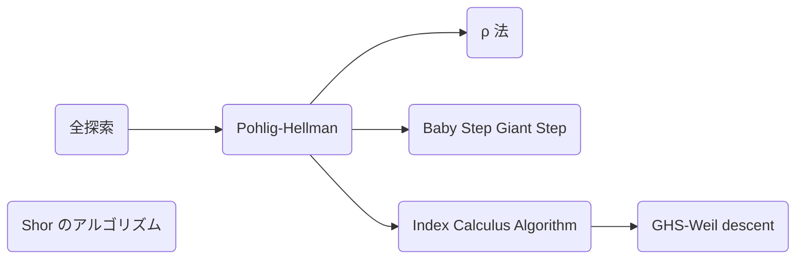

それで今回紹介するのは次のような内容です。

- 楕円曲線の構成とその性質
- 楕円曲線暗号の実装と攻撃
- 超楕円曲線暗号の紹介
- 超特異同種写像暗号の実装と攻撃

楕円曲線の理論は本来、群環体、ガロア理論、可換環論、ホモロジー代数、代数幾何学と理解した先で学習します。私も楕円曲線暗号がわからなくて輪読会を生やして、最初は群環体から勉強していって 1 年以上掛けて紆余曲折しながらやっとここまで理解できるようになりました。ただ同じ道を歩ませたいという気持ちはあまりなくて、雰囲気で楕円曲線をより理解を深めてほしいという気持ちで書いています。でも運がよければ楕円曲線を勉強したいと思う人が一人でも増えてくれたらと思います。といっても群論くらいは分かっていて欲しいです。

## 楕円曲線
高校のときに習ったと思いますが、グラフで半径 1 の円といえば次のような式で表されました。

$$
x^2 + y^2 = 1
$$


楕円曲線は言うなればこれの 3 次方程式バージョンです。(でも楕円の由来は楕円関数という別物からです)

> **Def. 楕円曲線**
> $K$ を体、 $f(x) \in K[x]$ を 3 次方程式としたときに関数 $y^2 = f(x)$ を楕円曲線 $E/K$ という。Weierstrass 方程式
>
> $$
  E: y^2 + a_1xy + a_3y = x^3 + a_2x^2 + a_4x + a_6
$$
>
> また $K$ の標数が $2, 3$ でないとき $x, y$ の線形変換によって 2 次項を消すことができ、$a, b\in K$ を用いて次のように書ける。
>
> $$
E: y^2 = x^3 + ax + b
$$

**Proof.**
$\ch(\overline{K}) \neq 2$ のとき Weierstrass 方程式を $(x, y)\mapsto(x, (y - a_1x - a_3)/2)$ と置換すると適切に $b_2, b_4, b_6$ をおくことで次のように簡約化できます。

$$
\begin{aligned}
  \left(\frac{1}{2}(y - a_1x - a_3)\right)&\left(\frac{1}{2}(y - a_1x - a_3) + a_1x + a_3\right) = x^3 + a_2x^2 + a_4x + a_6 \\
  y^2                                 & = 4x^3 + (a_1^2 + 4a_2)x^2 + 2(a_1a_3 + 2a_4)x + (a_3^2 + 4a_6)           \\
  y^2                                 & = 4x^3 + b_2x^2 + 2b_4x + b_6
\end{aligned}
$$

さらに $\ch(\overline{K}) \neq 2, 3$ のとき $(x, y)\mapsto((x - 3b_2)/36, y/108)$ と置換すると適切に $c_4, c_6$ をおくことで次のようにより簡約化できます。

$$
\begin{aligned}
  \left(\frac{y}{108}\right)^2 & = 4\left(\frac{x - 3b_2}{36}\right)^3 + b_2\left(\frac{x - 3b_2}{36}\right)^2 + 2b_4\left(\frac{x - 3b_2}{36}\right) + b_6 \\
  y^2                   & = (x - 3b_2)^3 + 9b_2(x - 3b_2)^2 + 648b_4(x - 3b_2) + 108^2b_6                                       \\
  y^2                   & = x^3 - 27(b_2^2 - 24b_4)x - 54(- b_2^3 + 36b_2b_4 - 216b_6)                                          \\
  y^2                   & = x^3 - 27c_4x - 54c_6
\end{aligned}
$$

こうして Weierstrass 方程式は標数が 2, 3 ではないとき次のように書き表されます。

$$
E: y^2 = x^3 + ax + b
$$
$\Box$

> 係数の番号の順番おかしいだろとかなんでこの形なんだとか色々疑問が湧いてくると思います。楕円曲線は本来 1 次元アーベル多様体と定義してその因子によるベクトル空間に対して Riemann-Roch の定理を適用することでこの流儀の定義の意味がわかってくるのですが、解説するにはちょっと余白が狭すぎるので省きます。すみません。

以下では特に断りがない限り標数は 2, 3 ではないとします。つまり長ったらしい式は考えずに $y^2 = x^3 + ax + b$ を考えればよいです。実際 $\mathbb{F}_{2^n}$ 上で楕円曲線暗号を組み立てることもあるのですが、基礎が分かっていればそこら辺はすぐ計算できるので省きます。

そして特に標数 0 である実数体 $\mathbb{R}$ 上の楕円曲線は次のようなグラフとなります。


どうしてこんな形になるかというと右辺 $x^3 + ax + b$ は $x$ の 3 次関数なので 2 回ぐにょんぐにょんします。この関数の $x$ 軸に鏡を置いたらちょうど楕円曲線みたいな形になりませんか？

これは $y^2 = f(x)$ を解くと $y = \pm\sqrt{f(x)}$ となるので 3 次関数の正の部分をプラスマイナスに置くのと同じだからです。


そしてここから本題に入るのですが、この楕円曲線上にある点同士で足し算ができます。といっても普通にベクトルとして足したら楕円曲線上に乗らず、つまらない演算 (ベクトル空間自体は面白いですが) になるので絶対に乗るような方法で足し合わせます。

> **Def. 楕円曲線上の和**
> 楕円曲線 $E/K$ 上の点同士の演算 $+: E(K)\times E(K)\to E(K)$ の群 $(E, +)$ を次のように定義する。
> 1. 単位元を無限遠点 $\mathcal{O}$ とする。
> 2. 点 $P = (x, y)$ の逆元を $-P = (x, -y)$ とする。
> 3. $P(x_1, y_1), Q(x_2, y_2)$ に対して $R(x_3, y_3) = P + Q$ を次のように定義する。
>
> $$
\begin{aligned}
x_3 &= \lambda^2 - x_1 - x_2 \\
y_3 &= \lambda(x_1 - x_3) - y_1 \\
\lambda &=
\begin{dcases}
\frac{y_2 - y_1}{x_2 - x_1} \quad (P \neq Q) \\
\frac{3x_1^2 + a}{2y_1} \quad (P = Q)
\end{dcases}
\end{aligned}
$$

定義の式自体はぱっと見不自然と感じる人が多いと思うのですが幾何的に見ると自然となっていて、楕円曲線上の点 $P, Q$ の和 $P + Q$ を $\mathbb{R}$ 上のグラフで見ると、直線 $PQ$ と曲線との交点が $-(P + Q)$ となり、その $y$ 座標の符号を反転した点が $P + Q$ となります。


https://andrea.corbellini.name/ecc/interactive/reals-add.html

例えば次の楕円曲線 $E: y^2 = x^3 - 7x + 10$ において $P = (1, 2)$, $Q = (3, 4)$ の和 $R = P + Q$ について直線 $PQ$ の傾きは $\lambda = 1$ より

$$
\begin{aligned}
x_3 & = \lambda^2 - x_1 - x_2 = -3 \\
y_3 & = \lambda(x_1 - x_3) - y_1 = 2
\end{aligned}
$$

よって $R = (-3, 2)$ となります。

そしてこの和は演算として良い性質を持つ、つまり可換群となります。

> **Prop.**
> 楕円曲線の和は可換群である。
> また交換法則が成り立つので $nP := \overbrace{P + \cdots + P}^n$ と定義する。

**Proof.**

ここからは特に有限体、つまり $q$ を素数 $p$ の冪として $\mathbb{F}_q\cong \mathbb{F}_p[x]/(f(x))$ のときについて考えます。標数 0 の体 (有理数体 $\mathbb{Q}$ や実数体 $\mathbb{R}$ など) とはおさらばです。

CTF において楕円曲線の問題が出されたときに位数は解法を決定する要素としてバチクソ重要です。位数というのは何倍したら単位元 $\mathcal{O}$ に戻るのかという数です。その位数に関して最も重要な定理があります。

> **Thm. Hasse の定理**
> 楕円曲線 $E/\mathbb{F}_q$ の位数 $\#E(\mathbb{F}_q)$ について次の条件で押さえられる。
>
> $$
|\#E(\mathbb{F}_q) - (q+1)|\leq 2\sqrt{q}
$$

ここでは標数が 2, 3 ではないときの証明の筋書きだけ記します。詳しくは [Hasse's Theorem on Elliptic Curves](https://fse.studenttheses.ub.rug.nl/10999/1/opzet.pdf) をご覧ください。
**Sketch.**
まずベースとなる楕円曲線 $E/\mathbb{F}_q$ を次のように定義する。

$$
E/\mathbb{F}_q: y^2 = x^3 + ax + b
$$

次に $s^2 = f(t) = t^3 + at + b$ とおき、有理関数体上の楕円曲線 $E^{tw}/\mathbb{F}_q(t)$ を定義する。

$$
E^{tw}/\mathbb{F}_q(t): f(t)y^2 = x^3 + ax + b
$$

これらは同型写像 $\phi: E/\mathbb{F}_q\ni (x, y)\mapsto (x, y/s) \in E^{tw}/\mathbb{F}_q(t)$ が存在するので同型 $E/\mathbb{F}_q \cong E^{tw}/\mathbb{F}_q(t)$ となる。ここで体を拡大した楕円曲線 $E/\mathbb{F}_q(t, s)$ における点 $(t, s)$ とそのフロベニウス写像の像 $(t^q, s^q)$ を同型写像 $\phi$ で移した点を $Q, P_0\in E^{tw}/\mathbb{F}_q(t)$ とおく。

$$
\begin{aligned}
Q & = (t, 1) \\
P_0 & = (t^q, s^{q-1}) = (t^q, (t^3 + at + b)^{(q-1)/2})
\end{aligned}
$$

これらを用いて点 $(x_n, y_n) = P_n = P_0 + nQ$ を生成する。このとき $x_n = f_n/g_n \in \mathbb{F}_q(t)$ と書けて $d_n$ を次のように定義する。

$$
d_n = \begin{cases}
0 & \mathrm{if}\ P_n = \mathcal{O} \\
\deg(f_n) & \mathrm{otherwise}
\end{cases}
$$

例えば $d_0 = \deg(f_0) = \deg(t^q) = q$ となる。このとき色々計算すると次の式が成り立つことが分かる。

$$
\begin{aligned}
d_{n-1} + d_{n+1} & = 2d_n + 2 \\
d_{-1} & = \#E(\mathbb{F}_q) \\
\end{aligned}
$$

この $d_n$ に関する 3 つの式から $d_n$ が求まる。

$$
d_n = n^2 - (\#E(\mathbb{F}_q) - (q + 1))n + q
$$

$d_n$ は $n$ に関する二次方程式となり、その判別式 $D$ は次のようになる。

$$
D = (\#E(\mathbb{F}_q) - (q + 1))^2 - 4q
$$

$D > 0$ とすると 2 次方程式は 2 つの解 $\alpha$, $\beta$ を持つが、整数 $n$ に対して $d_n \geq 0$ であるから 2 つの解の差は多くとも 1 である。また $D$ は整数であるから $D = (\beta - \alpha)^2 = 1$ となる。これより 2 つの解は $k$, $k+1$ と書けて $d_n = n^2 - (2k + 1)n + k(k+1)$ より方程式を比較して $q = k(k+1)$ となる。ただ $q$ は奇数に対し、 $k(k + 1)$ は偶数であるから不適である。
よって $D \leq 0$、つまり標数 5 以上の Hasse の定理が示された。

$$
|\#E(\mathbb{F}_q) - (q+1)|\leq 2\sqrt{q}
$$
$\Box$

実際に楕円曲線の位数をプロットしてみると $2\sqrt{q}$ で抑えられていることが分かります。


[tsujimotterのノートブック - 楕円曲線のハッセの定理](https://tsujimotter.hatenablog.com/entry/hasses-theorem) より

有限体上の楕円曲線について位数の範囲がわかって群として少しわかってきたんじゃないでしょうか。ただこれ、範囲は比較的簡単にわかるのですが、楕円曲線のパラメータを用いた一般的な位数の表式については **大変難しい未解決問題** となっています。これを解決できたら僕にこっそり教えてください。

> **Def. ねじれ群**
> 楕円曲線 $E$ の点 $P$ について $n$ 倍したら単位元 $\mathcal{O}$ となるとき $P$ を $n$-等分点といい、$n$-等分点の集合を $n$-ねじれ群 $E[n]$ という。
>
> $$
E[n] = \lbrace P\in E(\overline{\mathbb{F}_q}) \mid nP = \mathcal{O}\rbrace
$$

位数の範囲が分かったので次は楕円曲線が与えられたときに実際に位数を計算する方法を考えます。ところで有限体の重要な性質の 1 つにフロベニウス写像という重要な準同型写像の存在があります。これは楕円曲線にもあって、その性質の一つであるフロベニウス写像の特性多項式は位数を求めるときに重宝します。

> **Def. 楕円曲線におけるフロベニウス写像**
> 楕円曲線 $E/\mathbb{F}_q$ におけるフロベニウス写像 $\phi$ を次のように定義する。
>
> $$
\phi: (x, y)\mapsto (x^q, y^q)
$$
>
> 楕円曲線 $E/\mathbb{F}_q$ のフロベニウス写像を $\phi$ として $t = \#E(\mathbb{F}_q) - (q+1)$ とおくと次の式が成り立つ。これをフロベニウス写像の特性多項式という。
>
> $$
\phi^2 - t\phi + q = 0
$$

**Proof.**

この多項式に楕円曲線の点 $P = (x, y)$ を適用させると次のようになります。

$$
t(x^q, y^q) = (x^{q^2}, y^{q^2}) + q(x, y)
$$

Hasse の定理より $t\approx 2\sqrt{q}$ とかなり大きいので全探索で $t$ を求めるのは間に合わなさそうです。Schoof のアルゴリズムは中国剰余定理を使ってこの問題を高速に求めます。

> **Schoof のアルゴリズム**
> 楕円曲線 $E/\mathbb{F}_q$ の位数 $\#E(\mathbb{F}_q)$ を $O(\log^8q)$ で求められる。

**Proof.**
これに小さな素数 $l$ を用いて $l$ ねじれ群 $E[l] = \lbrace P\in E(\mathbb{F}_q)\mid lP = \mathcal{O} \rbrace$ の元 $P = (x, y)\in E[l]$ をフロベニウス写像の特性多項式に右から作用させて整理すると次のようになる。

$$
t(x^q, y^q) = (x^{q^2}, y^{q^2}) + q(x, y)
$$

右辺を計算し、左辺について $t\in [-(l-1)/2, (l-1)/2]$ の範囲で全探索を行って一致したときの値が $t \bmod l$ となる。よって様々な $l_i$ を用いて $t \bmod l_i$ が分かれば中国剰余定理から $t$ が求まる。
**この $l_i$ ってどうやって求めるんだ。**
$\Box$

これでこのように位数を意のままに知ることが出来るようになりました！今回はフロベニウス写像の特性多項式を使いましたが、モジュラー多項式を使うことで $O(\log^8q)$ から $O(\log^6q)$ へ高速化できます。

位数について大体分かったので楕円曲線暗号の説明について早速入っていきましょう。

:::message
**練習問題**
- $x$ 座標から $y$ 座標を求められる？
- 楕円曲線上の点をいくつ知っていれば楕円曲線のパラメータを決定できる？またその方法は？
- ある楕円曲線について位数を指定された点 (ねじれ群の元) を生成できる？
:::

```python
class ElipticCurveOverFp:
    """
    y^2 = x^3 + ax + b (mod p)
    """
    def __init__(self, a, b, p):
        self.Fp = GF(p)
        self.a = self.Fp(a)
        self.b = self.Fp(b)
        self.p = p


class Point:
    def __init__(self, curve: ElipticCurveOverFp, x, y, infty=False):
        self.x = curve.Fp(x)
        self.y = curve.Fp(y)
        self.curve = curve
        self.infty = infty
        if self.y**2 != self.x**3 + self.curve.a * self.x + self.curve.b and not self.infty:
            raise ValueError(f"Invalid point, x:{x}, y:{y} is not on the curve")

    @staticmethod
    def infinity(curve: ElipticCurveOverFp) -> "Point":
        return Point(curve, 0, 0, True)

    def is_infinity(self) -> bool:
        return self.infty

    def __add__(self, other) -> "Point":
        if self.is_infinity():
            return other
        if other.is_infinity():
            return self
        if self.x == other.x and self.y == -other.y:
            return Point.infinity(self.curve)

        if self.x == other.x and self.y == other.y:
            lambda = (3 * (self.x**2) + self.curve.a) / (2 * self.y)
        else:
            lambda = (other.y - self.y) / (other.x - self.x)
        x = lambda**2 - self.x - other.x
        y = lambda * (self.x - x) - self.y
        return Point(self.curve, x, y)

    def __rmul__(self, n: int) -> "Point":
        temp = self
        res = Point.infinity(self.curve)
        while n > 0:
            if n & 1 == 1:
                res += temp
            temp += temp
            n >>= 1
        return res
```
## 楕円曲線暗号

楕円曲線暗号 (ECC) はRSA暗号と同時期に開発された暗号で1985年頃に Victor S. Miller と Neal Koblitz が同時期かつ独立に発明しました(ちなみにMiller-Rabin素数判定法のMillerはGary L. Millerで別人です)。特徴としては RSA 暗号よりも純粋に強い暗号であることや鍵長が短いことなどが挙げられます。

さて、ここでこの楕円曲線上の加法を用いた次のような問題を作れます。

> **楕円曲線上の離散対数問題 (ECDLP : Elliptic Curve Discrete Logarithm Problem)**
> 楕円曲線上の点 $P, Q$ に $Q=dP$ という関係があるとき $d$ を求めよ。

つまり楕円曲線の世界で「割り算」をしなさいという問題です。

実はこの問題はとても難しく、これを解く効率的なアルゴリズムは現在見つかっていません。この ECDLP を利用して暗号の形にしたものが楕円曲線暗号です。

暗号標準を定める国際機関によって楕円曲線が

規格化された楕円曲線のパラメータの情報がすべてまとまっている資料があります。適当にパラパラめくるだけで面白いです。

https://neuromancer.sk/std/nist/P-256

また、より高速化させる為に様々な楕円曲線が考案されています。ただ 1 回の和に必要な演算が数回変わるだけでオーダーレベルでは変わらないので詳細は省きます。

| モデル | 式 | 座標 |
|:-:|:-:|:-:|
| ワイエルシュトラス | $y^2 = x^3 + ax + b$ | $(x, y)$ |
| モンゴメリー | $y^2 = x^3 + Ax^2 + x$ | $x$ |
| エドワード | $x^2 + y^2 = 1 + dx^2y^2$ | $w = dx^2y^2$ |
| ねじれエドワード | $ax^2 + y^2 = 1 + dx^2y^2$ | $(x, y)$ |
| ハフ | $cx(y^2 - 1) = y(x^2 - 1)$ | $w = \frac{1}{xy}$ |
| ヤコビ交差 | $ax^2 + y^2 = 1, bx^2 + z^2 = 1$ | $\omega = \sqrt{ab}x^2$ |

### 楕円曲線暗号による鍵共有

暗号通信をする為に使われる暗号プロトコルです。

Alice と Bob は AES などの共通鍵暗号を用いて暗号通信しようとしていますが、始めに2人だけの秘密である共有鍵が必要です。しかしそれを直接共有してしまうと、第三者から鍵を盗聴されて通信を覗き見られてしまいます。そこで公開鍵暗号を用いることで鍵を直接共有することなく共有鍵を構築することができます。この手法をディフィーヘルマン鍵共有と呼び、ECDLP (正確には ECDHH) を安全性根拠とするものを楕円曲線ディフィーヘルマン鍵共有 (ECDH; Elliptic Curve Diffie–Hellman key exchange) と呼びます。

> **楕円曲線ディフィーヘルマン鍵共有 (ECDH)**
> 1. セットアップ
>   楕円曲線 $E/\mathbb{F}_p$ とベースポイント $P\in E/\mathbb{F}_p$ を共有する
> 2. 鍵生成
>   Alice と Bob はそれぞれ疑似乱数 $d_A, d_B$ を生成し、$d_A, d_B$ を秘密鍵、$Q_A = d_AP, Q_B = d_BP$ を公開鍵として公開する
> 3. 鍵交換
>   Alice と Bob は自分の秘密鍵と相手の公開鍵を掛けると $S = d_Ad_BP = d_AQ_B = d_BQ_A$ となり、$S$ の $x$ 座標をハッシュ化したものが Alice と Bob のみが知る共通鍵となる

このように攻撃者は $(P, d_AP, d_BP)$ が分かっていたとしても ECDLP (ECDHH) が解けないので $d_Ad_BP$ が分からず、安全に共通鍵を共有することができます。

## ECDLP を解く

計算機代数の章で紹介する DLP を解く方法を楕円曲線に適用すればよいだけです。ここでは Baby-step Giant-step と $\rho$ 法、Pohlig-Hellman、Index Calculus Algorithm とその派生を紹介します。数体ふるい法は ECDLP 上では有効ではないらしいです(多分)。量子アルゴリズムとしても ECDLP は位数発見問題なので Shor のアルゴリズムが使えます。


### Baby-step Giant-step

楕円曲線 $E$ について $m = \lceil \sqrt{\#P} \rceil$ として $d$ を $m$ で割ると $d = qm + r$ となるから集合 $B, G$ を作り、両方の元が一致したときに $d = qm + r$ とすることで DLP の解が求まります。

$$
\begin{aligned}
Q &= dP = (qm + r)P \\
Q - rP &= q(mP) \\
B &= \{ Q - rP \mid 0 \leq r < m \} \\
G &= \{ qmP \mid 0 \leq q < m \}
\end{aligned}
$$

これより計算量は位数 $n$ を用いて $O(\sqrt{n}\log n)$ メモリ空間は $O(\sqrt{n})$ だけ必要となります。

### Pollard's rho 法

$\rho$ 法は文字 $\rho$ の形が由来となっていて、まず、ある点を決めます。そして疑似ランダム関数 $f$ にその点を入れると次の点が出ます。今まで出た点と衝突したら DLP が解けるという仕組みです。

各点の係数を $a_i\in\mathbb{Z}/N\mathbb{Z}[d]$ とすると初期値 $a_0 = 1$ から計算して $a_iP = a_jP$ ならば $a_i = a_j$ であるから $d$ が求まります。

$$
\begin{aligned}
f(a_iP) &=
\begin{cases}
Q + a_iP = (a_i + d)P & (a_iP \in G_1) \\
2(a_iP) = 2a_iP & (a_iP \in G_2)\\
P + a_iP = (a_i + 1)P & (a_iP \in G_3)
\end{cases}
\end{aligned}
$$

これは誕生日のパラドックスによって $O(\sqrt{N})$ で求まる。

### Pohlig-Hellman

中国剰余定理を用いて大きな群を複数の小さな群の直積に分けます。楕円曲線暗号の楕円曲線の位数は細かく素因数分解できることが多いので RSA とかと違って実用的な手法になります。

> **Pohlig-Hellman**
> 楕円曲線の位数が $\#E = p_1^{e_1}p_2^{e_2}\ldots p_k^{e_k}$ と素因数分解できるとき $\mathcal{O}\left(e_i\sqrt{p_i}\right)$ で ECDLP が解ける。

$Q = dP$ に対して次のように $d_i$ を定義する。

$$
d = d_0+d_1p_i+d_2p_i^2+\ldots+d_{e_i−1}p_i^{e_i−1} \quad \pmod{p_i^{e_i}} \\
$$

これより次の関係式が成り立つ。

$$
\frac{\#E}{p_i}Q = d_0\left(\frac{\#E}{p_i}P\right)
$$

この $d_0$ は ECDLP の他の方法を用いて $\mathcal{O}(\sqrt{p_i})$ で求まります。次に $d_0,\ldots,d_{j-1}$ を知っているときに $d_j$ を計算します。点 $P, Q$ に $\#E/p_i^{j+1}$ を掛けた点について次の関係式が成り立ちます。

$$
\begin{aligned}
\frac{\#E}{p_i^{j+1}}Q & = (d_0+\cdots+d_{j}p_i^{j})\left(\frac{\#E}{p_i^{j+1}}P\right) \\
\frac{\#E}{p_i^{j+1}}Q & - (d_0+\cdots+d_{j−1}p_i^{j−1})\left(\frac{\#E}{p_i^{j+1}}P\right) = d_{j}\left(\frac{\#E}{p_i}P\right)
\end{aligned}
$$

これより ECDLP を解くことで $d_j$ が求まります。

```python
def pohlig_hellman(G):
    fact = factor(G.order())
    order = int(G.order())
    dlogs = []
    primes = []
    for p, e in fact:
        t = order // p ^ e
        dlog = discrete_log(t * Q, t * G, operation="+")
        dlogs.append(dlog)
        primes.append(p ^ e)
    return crt(dlogs, primes)
```

### 指数計算法 (Index Calculus Algorithm)
楕円曲線上の DLP を Index Calculus Algorithm で解く試みは歴史が長く、以下のようなことがありました。

| 手法 | 著者 | 説明 |
| --- | --- | --- |
| Index Calculus | 1991: Adleman-DeMarrais-Huang<br>1997: Gaudry | 超楕円曲線上の DLP を Index Calculus Algorithm で解く |
| Weil descent | 1998: Frey | $\mathbb{F}_{p^n}$ 上の楕円曲線の DLP を $\mathbb{F}_p$ 上の超楕円曲線の DLP に置き換えて Index Calculus を用いる |
| Generalized Weil descent | 2004: Gaudry<br>2007: Nagao | $\mathbb{F}_{p^n}$ 上の楕円曲線の DLP に直接 Index Calculus Algorithm を適用する |

ここでは Gaudry の Generalized Weil descent を紹介しようと思います。
$E/\mathbb{F}_{p^3}$ の $y^2 = x^3 + ax + b$ $a\in\mathbb{F}_p, b\in\mathbb{F}_{p^3}$ を解くことを考える。

> **Gaudry's algorithm**
> 巡回群 $G\subseteq \langle P\rangle\subseteq E$
> 1. 因子基底 $B$
> 次数 $s$ 以下の多項式の因子基底をいくつか用意して Mumford 表現に現れる多項式 $U$ が因子基底の要素に分解される場合に対して
>
> $$
B = \lbrace P_j\in C(\mathbb{F}_p)\setminus P_\infty\mid X(P_j)\neq X(P_i), i \neq j\rbrace
$$

種数が大きい超楕円曲線上の ECDLP では Index Calculus Algorithm を応用することができます。超楕円曲線は後で解説しますが、楕円曲線の $x$ に関する式が 3 次方程式だったのに対し、一般の奇数次数の方程式となるものです。

$$
\begin{aligned}
r_i\mathcal{D}_b & = \sum_{j=1}^n e_{ij}P_j^{e_{ij}} - mP_\infty \\
\begin{pmatrix}
r_i\mathcal{D}_b \\
\vdots \\
r_i\mathcal{D}_b
\end{pmatrix}
& = \begin{pmatrix}
e_{11} & \cdots & e_{m1} \\
\vdots & \ddots & \vdots \\
e_{1n} & \cdots & e_{mn}
\end{pmatrix}
\begin{pmatrix}
\log_{\mathcal{D}_b} P_i \\
\vdots \\
\log_{\mathcal{D}_b} P_i
\end{pmatrix} \\
\mathcal{D}_a + r\mathcal{D}_b & = \prod_{j=1}^n s_jP_j - mP_\infty \\
x = \log_{\mathcal{D}_b}\mathcal{D}_a & = \sum_{j=1}^ns_j\log_{\mathcal{D}_b}P_j - r \bmod N
\end{aligned}
$$

と計算できます。

この計算量は $\mathcal{O}(g!g^3p(\log p)^3 + g^3p^2(\log p)^2)$ と知られています。

1998 年に Frey が Weil descent

2004 年に Gaudry のアルゴリズム、2007 年に Nagao のアルゴリズム

楕円曲線の $\mathbb{F}_{p^k}$ 有理点群 $E(\mathbb{F}_{p^k})$ を種数 $g\geq k$ の代数曲線 $C$ の Jacobian の有理点群 $\mathcal{J}_C(\mathbb{F}_p)$ に埋め込み、 $\mathcal{J}_C(\mathbb{F}_p)$ 上で Gaudry アルゴリズムで解く

GHS (Gaudry Hess Smart)

## 攻撃手法

この ECDLP を解くことができれば ECDH を含め、様々な楕円曲線暗号を解くことができます。さて主に攻撃対象となる楕円曲線暗号は以下のようなものがあります。

| アンチケース | 攻撃名   | 方法 |
| ---- | --- | ---- |
| なし | ECDLP | 単純に ECDLP を解く |
| 位数が Smooth number $\#E/\mathbb{F}_p = p_1^{e_1}p_2^{e_2}\ldots p_k^{e_k}$ | Pohlig Hellman Attack | 位数 $p_i$ の小さな ECDLP に分解できる |
| Anomalous な曲線 $\#E/\mathbb{F}_p = p$ | SSSA Attack | $\mathbb{F}_p^+$ 上の DLP に帰着できる |
| Supersingular な曲線 $\#E/\mathbb{F}_p = p+1$ | MOV / FR Reduction | 埋め込み次数 $k$ を用いて $\mathbb{F}_{p^k}^\times$ 上の DLP に帰着できる |
| Singular な曲線 $\Delta(E/\mathbb{F}_p) = 0$ | Singular Curve Point Decompression Attack | $\mathbb{F}_p^+$ や $\mathbb{F}_p^\times, \mathbb{F}_{p^2}^\times$ 上の DLP に帰着できる |
| 楕円曲線上に存在しない点や位数の少ない点を指定できる | Invalid Curve Attack / Small-Subgroup Attack | さまざまな少ない位数の点を収集して中国剰余定理 |

### 楕円曲線上に存在しない点や位数の少ない点を指定できてはいけない (Invalid Curve Attack / Small-Subgroup Attack)
楕円曲線に乗らない点を乗っているように演算すると位数の小さい点となる。

> **Prop.**
> $b$ は点で与えられる情報で
$b$ がずれた状態で計算しているのと同じ

TODO: 図

**Proof.**

$$
y^2 = x^3 + ax + b_1 \pmod{p}
$$

$\Box$

これを用いて中国剰余定理で ECDLP が解ける。

https://zenn.dev/kurenaif/articles/9cf509d9a15815

:::message
**練習問題**
- tiramisu (Google CTF)
:::

### Singularな曲線を用いてはいけない (Singular Curve Point Decompression Attack)

Singular な楕円曲線のとき、特異点という特殊な点ができます。

> **Def. 特異点**
> ある関数 $f(x, y) = 0$ の特異点とは次を満たす $(X, Y)$ である。
>
> $$
\left.\frac{\partial f}{\partial x}\right|_{(X, Y)} = \left.\frac{\partial f}{\partial y}\right|_{(X, Y)} = 0
$$

> **Prop. 楕円曲線の特異点**
> 楕円曲線において特異点がある条件はかつあったときに $(X, Y) = (\pm\sqrt{-a/3}, 0)$ にある。

**Proof.**
$3x^2 + a = 2y = 0$

このように微分値が不定となる点、グラフ上では関数の曲線が交差している点です。

楕円曲線の曲線は高々 1 回交わることになるので 2 つのタイプに分けられます。1 つは普通に交わるノード、もう 1 つは自分自身と接しながら交わるカスプです。

#### カスプ

どんな尖っている楕円曲線も平行移動や線形変換により $y^2 = x^3$ の形になります。

このとき $y = \lambda x$ との交点は $(\lambda^2, \lambda^3)$ 、接線は $y = 0$ となります。
これより $f: E/\mathbb{F}_p \to \mathbb{F}_p^+$ を次のように定義する。

$$
f(x,y) = \frac{x}{y} \\
f(\infty) = 0
$$

これは $\mathbb{F}_p^+$ の DLP となる。

#### ノード

$y = 0$ 上の特異点が原点 $O(0, 0)$ となるように平行移動させると $y^2 = x^3 + kx^2$ となる。

$$
\left(\frac{\partial F}{\partial x}, \frac{\partial F}{\partial y}\right) = ((3x + 2k)x, 2y)
$$

より特異点が原点しかないことがわかります。このとき $y = \lambda x$ との交点を考えます。$P = (\lambda^2 - k, \lambda(\lambda^2 - k))$ これより $f: E/\mathbb{F}_p \to \mathbb{F}_p^\times$ を次のように定義する。

$$
\begin{aligned}
f(x,y) & = \frac{y + \sqrt{k}x}{y - \sqrt{k}x} \\
f(\infty) & = 1
\end{aligned}
$$

これは $\mathbb{F}_p^\times$ の DLP となる。

```python
def SingularCusp(a, b, p):
    x = GF(p)["x"].gen()
    PR.<x> = PolynomialRing(GF(p))
    E = x^3 + a*x + b
    roots = E.roots()
    dx = next(filter(lambda x: x[1] == 3, roots))[0]
    dy = 0

    def f(P):
        if P == 0:
            return 0
        x, y = P[0], P[1]
        return x / y

    g = f((gx - dx, gy - dy))
    p = f((px - dx, py - dy))
    return p / g

def SingularNode(a, b, p):
    PR.<x> = PolynomialRing(GF(p))
    E = x^3 + a*x + b
    roots = E.roots()
    dx = next(filter(lambda x: x[1] == 2, roots))[0]
    dy = 0

    E_ = E.subs(x = x + dx)
    roots = E_.roots()
    k = next(filter(lambda x: x[1] == 1, roots))[0]
    k = (-k).square_root()

    def f(P):
        if P == 0:
            return 1
        x, y = P[0], P[1]
        return (y + k * x) / (y - k * x)

    g = f((gx - dx, gy - dy))
    p = f((px - dx, py - dy))
    return p.log(g)
```

### Anomalous な曲線を用いてはいけない (SSSA Attack)
SSSA (Semaev-Smart-Satoh-Araki) Attack

$\pi: \mathbb{P}^2(\mathbb{Q}_p)\to\mathbb{P}^2(\mathbb{F}_p)$ を還元写像 (reduction map) は $E(\mathbb{Q}_p)\to E(\mathbb{F}_p)$ の群準同型写像となる。 $E$ の形式群 $\mathcal{E}$ として $\log_{\mathcal{E}}$ を形式対数

$$
\begin{aligned}
\pi &: \mathbb{P}^2(\mathbb{Q}_p)\to\mathbb{P}^2(\mathbb{F}_p) \\
u &: E(\mathbb{F}_p)\to E(\mathbb{Q}_p) \\
\psi &: (x:y:z) \mapsto \frac{x}{y} \\
\log_{\mathcal{E}} &: t\mapsto t - \frac{a_1}{2}t^2 + \frac{a_1^2 + a_2}{3}t^3 - \frac{a_1^3 + 2a_1a_2 + a_3}{4}t^4 + \cdots
\end{aligned}
$$

$$
\lambda_E: E(\mathbb{F}_p)\xrightarrow{u}E(\mathbb{Q}_p)\xrightarrow{\times p}\ker\pi\xrightarrow{\log_{\mathcal{E}}}p\mathbb{Z}_p\xrightarrow{\bmod{p^2}} p\mathbb{Z}_p/p^2\mathbb{Z}_p\cong \mathbb{F}_p
$$

> **Prop.**
> $\alpha\in E(\mathbb{F}_p)\setminus\mathcal{O}$ として $\pi(A) = \alpha$ を満たす点 $A\in E(\mathbb{Z}_p)$ とする。 $nA \neq \mathcal{O}$ となる $n\in\mathbb{N}$ に対して $nA = (x_n, y_n)$ とする。
> 1. $1\leq n<p \implies nA\in E(\mathbb{Z}_p)\setminus\mathcal{O}$
> 2. $1\leq n<m<p$ かつ $n + m \neq p\implies x_n \neq x_m \pmod{p}$
> 3. $\lambda_E$ が零写像でなければ
>
> $$
y_{p-1} - y_1, \frac{x_{p-1} - x_1}{p}\in\mathbb{Z}_p^\times \\
\lambda_E(\alpha) = - \frac{x_{p-1} - x_1}{p(y_{p-1} - y_1)} \pmod{p}
$$

1. 楕円曲線 $E(\mathbb{F}_p)$ が anomalous であるから $nA \neq \mathcal{O}$ である。次に $nA\in E(\mathbb{Z}_p)$ を数学的帰納法で示す。
$n = 1$ のとき仮定の一部である。
$n = 2$ のとき $y_1 \neq 0 \pmod{p}$ より $y_1\in\mathbb{Z}_p^\times$ であるから $2A\in E(\mathbb{Z}_p)$ である。

$$
\begin{aligned}
  2A & = (x_2, y_2) = (c_2^2 - 2x_1, -c_2x_2 - d_2) \\
  c_2 & = \frac{3x_1^2 + a_4}{2y_1}, d_2 = \frac{-x_1^3 + a_4x_1 + 2a_6}{2y_1}
\end{aligned}
$$

$2<n<p$ のとき $x_{n-1} = x_1 \pmod{p}$ を仮定すると

$$
\begin{aligned}
& \pi(A) = \pm\pi((n-1)A) \\
\iff & (n - 1 \pm 1)\alpha = \mathcal{O} \\
\implies & \alpha = \mathcal{O}
\end{aligned}
$$

より矛盾する。$x_{n-1} \neq x_1 \pmod{p}$ より $x_{n-1} - x_1 \in\mathbb{Z}_p^\times$ であるから $nA\in E(\mathbb{Z}_p)$ である。

$$
\begin{aligned}
  nA & = (x_n, y_n) = (c_n^2 - x_1 - x_{n-1}, -c_n^3 + c_n(x_1 + x_{n-1}) - d_n) \\
  c_n & = \frac{y_{n-1} - y_1}{x_{n-1} - x_1}, d_n = y_1 - x_1c_n
\end{aligned}
$$
$\Box$

2. $x_n = x_m \pmod{p}$ と仮定すると 1 より $nA, mA\in E(\mathbb{Z}_p)\setminus\mathcal{O}$ であるから

$$
\begin{aligned}
& \pi(nA) = \pm\pi(mA) \\
\iff & (m\pm n)\alpha = \mathcal{O} \\
\implies & \alpha = \mathcal{O}
\end{aligned}
$$

より矛盾。

3.
もし $pA = \mathcal{O}$ であれば

$$
\lambda_E(\alpha) = (\bmod{p^2})\circ\log_{\mathcal{E}}\circ\psi(\mathcal{O}) = 0
$$

より $\lambda_E$ が零写像でないことに矛盾するので $pA \neq \mathcal{O}$ である。
$\pi(pA) = \mathcal{O}$

$A\in E(\mathbb{Z}/p^2\mathbb{Z})$ 写像 $\pi(A) = P$ となる
$X_{p-1} \neq X_1$ なら

$$
\lambda_E(P) = \frac{X_{p-1} - X_1}{p(Y_{p-1} - Y_1)}\pmod p
$$

```python
def hensel_lift(P):
    x, y = map(ZZ, P.xy())
    t = GF(p)((x ^ 3 + a * x + b - y ^ 2) // p) / (2 * y)
    return (x, y + p * lift(t))


def SSSA_attack(G, P):
    E = G.curve()
    gf = E.base_ring()
    p = gf.order()
    assert E.trace_of_frobenius() == 1, f"Curve should have trace of Frobenius = 1."
    E = EllipticCurve(Qp(p), [int(a) + p * ZZ.random_element(1, p) for a in E.a_invariants()])

    x1, y1 = hensel_lift(E, P)
    x2, y2 = hensel_lift(E, Q)
    A = Zmod(p^2)((y2^2 - y1^2) - (x2^3 - x1^3)) / (x2 - x1)
    B = Zmod(p^2)(y1^2 - x1^3 - a * x1)
    E = EllipticCurve(Zmod(p^2), A, B)
    P = E(x1, y1)
    Q = E(x2, y2)
    U = (p - 1) * P
    V = (p - 1) * Q
    dx1 = Zmod(p^2)((U.x - x1) // p)
    dy1 = Zmod(p^2)(U.y - y1)
    dx2 = Zmod(p^2)((V.x - x2) // p)
    dy2 = Zmod(p^2)(V.y - y2)
    return (dy1 / dx1) / (dy2 / dx2)


    E = EllipticCurve(Qp(p), [int(a) + p * ZZ.random_element(1, p) for a in E.a_invariants()])
    G = p * _lift(E, G, gf)
    P = p * _lift(E, P, gf)
    Gx, Gy = G.xy()
    Px, Py = P.xy()
    return int(gf((Px / Py) / (Gx / Gy)))
```

### Supersingular な曲線を用いてはならない (MOV/FR Reduction)
Supersingular な楕円曲線のとき、ペアリングを用いて有限体上の DLP に帰着できるという方法です。

まず Supersingular (超特異) な楕円曲線というのは位数が $q + 1$ となるような楕円曲線です。

$$
y^2 = x^3 + (1 - b)x + b
$$

ペアリングというのは双線形写像のことです。

> **Def. 双線形写像 (Bilinear map)**
> 群 $G_1, G_2$ について写像 $f: G_1\times G_1\to G_2$ が次を満たすとき、$f$ を双線形写像あるいはペアリングという。
>
> $$
\begin{aligned}
f(x_1x_2, y) = f(x_1, y)f(x_2, y) \\
f(x, y_1y_2) = f(x, y_1)f(x, y_2)
\end{aligned}
$$

楕円曲線暗号では Weil pairing や Tate pairing などのペアリングを使いますが、これらのペアリングは因子 (divisor) と呼ばれる概念を通じて理解します。

> **Def. 因子 (divisor)**
> $\mathcal{D} \in\mathrm{Div}(C)$ 自由アーベル群

この因子を求めるアルゴリズムを Miller's algorithm といいます。

> **Miller's algorithm**
>
> $$
N = \epsilon_0 + \epsilon_1\cdot 2 + \cdots + \epsilon_t\cdot 2^t
$$
>
> $\mu_m$ $\mu_m\subseteq\mathbb{F}_{q^d}^\times$
>
> $$
h_{P, Q}(x, y) = \begin{dcases}
\frac{y - y_P - \lambda(x - x_P)}{x + x_P + x_Q - \lambda^2 - a_1\lambda + a_2} & (\lambda\neq\infty) \\
x - x_P & (\lambda = \infty)
\end{dcases}
$$

```python
def h(P, Q, R):
    if (P == Q and P.y == 0) or (P != Q and P.x == Q.x):
      return R.x - P.x
    L = P.line_coeff(Q)
    p = R.y - P.y - L * (R.x - P.x)
    q = R.x + P.x + Q.x - L * L
    return p / q

def miller(E, P, Q, m):
    if P == Q:
        return 1
    f = 1
    T = P
    for i in reversed(m.bits()):
        f = f * f * h(T, T, Q)
        T = T + T
        if i == 1:
            f = f * h(T, P, Q)
            T = T + P
    return f
```

> **Weil pairing**
> Miller's algorithm で得た因子 $f_P, f_Q$ から得られる $e_m: E[m]\times E[m] \to \mu_m$ を Weil pairing という。
>
> $$
e_m(P, Q) = \frac{f_P(Q + S)}{f_P(S)}\bigg/\frac{f_Q(P - S)}{f_Q(-S)}
$$

> **Prop.**
> Weil pairing は次の条件を満たす。
> 1. 双線形 (bilinear)
> $e_n$ が双線形写像である。
> 2. 同一性 (idenntity)
> $e_n(P, P) = 1$
> 3. 非退化 (non-degenerate)
> 任意の $Q\in E[n]$ に対して $e_n(P, Q) = 1$ ならば $P = \mathcal{O}$ である。

$$
f_P(Q + S) = 103
$$

Weil pairing の計算は比較的遅くて、この上位互換として Tate-Lichtenbaum Pairing というペアリングがあります。

> **Def. Tate-Lichtenbaum Pairing**
> 楕円曲線 $E/K$ に対し 整数 $m$
> $P\in E(K)$ と $T\in E(K)[m]$ $Q\in E(\overline{K})$ $mQ = P$
>
> $$
G_{\overline{K}/K}\to \mu_m \\
\sigma\mapsto e_m(Q^\sigma - Q, T)
$$
>
> $$
\begin{aligned}
& \tau: \frac{E(K)}{mE(K)}\times E(K)[m] \to \frac{K^\times}{(K^\times)^m} \\
& \tau(P, T) = f(P)\bmod (K^\times)^m
\end{aligned}
$$
>
> $$
K^\times/(K^\times)^m\to H^1(G_{\overline{K}/K}, \mu_m)
$$

> **Prop.**
> Tate-Lichtenbaum Pairing はペアリングである

**Proof.**
$\xi(\sigma) = e_m(Q^\sigma - Q, T)$ は $\xi: G_{\overline{K}/K}\to\mu_m$

$$
\begin{aligned}
\xi(\sigma\tau)
\end{aligned}
$$

$$
e_n(Q^\sigma - Q, T) = \frac{\sqrt[n]{\alpha}^\sigma}{\sqrt[n]{\alpha}} \qquad \forall \sigma\in G_{\overline{K}/K} \\
\tau(P, T) = \alpha \bmod (K^\times)^n
$$

```python
def weil_pairing(E, P, Q, m, S=None):
    if S is None:
        S = E.random_point()
    fpqs = miller(E, P, Q + S, m)
    fps = miller(E, P, S, m)
    fqps = miller(E, Q, P - S, m)
    fqs = miller(E, Q, -S, m)
    return (fpqs / fps) / (fqps / fqs)


def tate_pairing(E, P, Q, m, k=2):
    f = miller(E, P, Q, m)
    return f ^ ((p ^ k - 1) // m)
```

> **埋め込み次数**
> 必要となる最小の拡大次数 $d$ を埋め込み次数という。
> $E(\mathbb{F}_{p^k}^\times)\cong\mathbb{Z}_{c_1n_1}\oplus\mathbb{Z}_{c_2n_1}$

$\mu_m$ の埋め込み次数が小さい楕円曲線ならば ECDLP より FFDLP の方が素早く計算できそうです。そのような楕円曲線というのが Supersingular な楕円曲線です。
任意の楕円曲線も FFDLP に落とし込めますが、埋め込み次数が高いと ECDLP を解いた方が早いともなります。

> **Prop.**
> Supersingular な楕円曲線の埋め込み次数は $6$ 以下である。

**Proof.**
$q = p^2$ において Hasse の定理から次のようになる。

$$
|\#E(\mathbb{F}_{p^2}) - (p^2 + 1)| \leq 2p
$$

| $-t$ | $\#E(\mathbb{F}_{q^2})$ | $\#\mathbb{F}_{q^d}^\times$ | $d$ |
|:-:|:--|:--|:-:|
| $0$ | $(p^2 + 1)$ | $p^4 - 1 = (p^2 + 1)(p^2 - 1)$ | $4$ |
| $p$ | $(p^2 + 1) + p$ | $p^3 - 1 = (p - 1)(p^2 + p + 1)$ | $3$ |
| $-p$ | $(p^2 + 1) - p$ | $p^6 - 1 = (p^3 - 1)(p + 1)(p^2 - p + 1)$ | $6$ |
| $2p$ | $(p^2 + 1) + 2p = (p + 1)^2$ | $p^2 - 1 = (p + 1)(p - 1)$ | $2$ |
| $-2p$ | $(p^2 + 1) - 2p = (p - 1)^2$ | $p - 1$ | $1$ |

$\Box$

そうしてできたペアリングについて

> **MOV/FR Reduction**
> ペアリング $f$ について
> $e_m(P, Q)$
> Weil pairing $e_n: E[n]\times E[n]\to \mu_n\subseteq \mathbb{F}_{p^k}^*$
> 1. $E[n]\subseteq E(\mathbb{F}_{p^k})$ となる最小の $k$ を持ってくる
> 2. 位数 $n$ の $\alpha=e_n(P, Q)$ となるように $Q \in E[n]$ を取ってくる
> 3. $\beta = e_n(dP, Q)$
> 4. $\mathbb{F}_{p^k}^*$ 上のDLPを $\alpha, \beta$ を用いて解く
>
> - Weil pairing を用いるものを MOV (Menezes-Okamoto-Vanstone) Reduction という。
> - Tate pairing を用いるものを FR (Frey-Rück) Reduction という。

```python
def MOV_reduction():
    E = P.curve()
    q = E.base_ring().order()
    n = P.order()
    assert gcd(n, q) == 1, "GCD of base point order and curve base ring order should be 1."

    logging.info("Calculating embedding degree...")
    k = get_embedding_degree(q, n, max_k)
    if k is None:
        return None

    logging.info(f"Found embedding degree {k}")
    Ek = E.base_extend(GF(q ** k))
    Pk = Ek(P)
    Rk = Ek(R)
    for i in range(max_tries):
        Q_ = Ek.random_point()
        m = Q_.order()
        d = gcd(m, n)
        Q = (m // d) * Q_
        if Q.order() != n:
            continue

        if (alpha := Pk.weil_pairing(Q, n)) == 1:
            continue

        beta = Rk.weil_pairing(Q, n)
        logging.info(f"Computing {beta}.log({alpha})...")
        l = beta.log(alpha)
        return int(l)

    return None

def FR_reduction(P, R, max_k=6, max_tries=10):
    E = P.curve()
    q = E.base_ring().order()
    n = P.order()
    assert gcd(n, q) == 1, "GCD of base point order and curve base ring order should be 1."

    logging.info("Calculating embedding degree...")
    k = get_embedding_degree(q, n, max_k)
    if k is None:
        return None

    logging.info(f"Found embedding degree {k}")
    Ek = E.base_extend(GF(q ** k))
    Pk = Ek(P)
    Rk = Ek(R)
    for _ in range(max_tries):
        S = Ek.random_point()
        T = Ek.random_point()
        if (gamma := Pk.tate_pairing(S, n, k) / Pk.tate_pairing(T, n, k)) == 1:
            continue

        delta = Rk.tate_pairing(S, n, k) / Rk.tate_pairing(T, n, k)
        logging.info(f"Computing {delta}.log({gamma})...")
        l = delta.log(gamma)
        return int(l)

    return None
```


`tate_pairing(E, P, Q.distortion_map(), m)`

## 同種写像暗号

> **同種写像の計算困難性**
> 楕円曲線 $E$ と同種写像 $\phi$ を生成し、公開情報 $(E, \phi(E))$ から秘密情報 $(E, \phi)$ を求めるのが計算量的に困難であるという仮定

ねじれ点のとりやすさから同種写像暗号では超特異曲線を利用します。
通常曲線を使った方式もあるがどれも非効率
モントゴメリーモデル

データサイズが小さい
$\mathbb{F}_{p^2}$ 上の超特異楕円曲線 $E$
$\#E_0(\mathbb{F}_{p^2}) = (p + 1)^2$

### 同種写像

> **Def. 同種写像**
> 楕円曲線 $E_1, E_2$ に対して有理多項式で表せる群準同型写像 $f: E_1 → E_2$ を同種写像とよぶ。
> 有理多項式の次数が $l$ のとき $l$-同種写像という。
> また有理多項式 $\hat{f}: E_2\to E_1$ 双対同種写像という。

同種写像の変換に対して位数が不変なのと同様に $j$-不変量も不変となります。

> **Thm. Tate の定理**
> 楕円曲線 $E_1, E_2$ に対して同種と $\#E_1 = \#E_2$ は同値

> **Def. $j$-不変量**
>
> $$
j_E = 1728\frac{4a^3}{4a^3 + 27b^2}
$$

楕円曲線同士の同型写像を具体的に計算する方法

https://eprint.iacr.org/2011/430.pdf

> **Thm. Vélu の公式**
> 楕円曲線 $E$, $E'$ に分離的な同型写像 $\phi: E\to E'$ が張られているとき、準同型定理より $E' = E/\ker\phi$ となります。$\phi$ の核 $F = \ker\phi$ の分割を $F = \lbrace\mathcal{O}\rbrace\cup F^+ \cup F^-$ とすると
>
> $$
E/F: y^2 = x^3 + (a - 5v)x + (b - 7w)
$$
>
> $$
\phi(x, y) = \left(x + \sum_{P\in F^+}\frac{v_P}{x - x_P} - \frac{u_P}{(x - x_P)^2}, y - \sum_{P\in F^+}\frac{2u_Py}{(x - x_P)^3} - v_P\frac{y - y_P - g_P^xg_P^y}{(x - x_P)^2}\right)
$$

**Proof.**
Laurent 展開
$\Box$

モントゴメリーモデルでは Costello-Hisil の公式

### 同種写像暗号

超特異同種写像 Diffie-Hellman 鍵共有
SIDH (Supersingular Isogeny Diffie-Hellman key exchange)
$p = l_A^{e_A}l_B^{e_B} - 1$
CSIDH (Commutative Supersingular Isogeny Diffie-Hellman)
$p = l_1l_2\cdots l_n - 1$
$n$-同種写像の計算量は $\mathcal{O}(n)$ 掛かります。次数 $2^{256}$ 程度の同種写像計算をする
この楕円曲線を生成するのに 1700 CPU時間使ったらしいです。

SIKE (Supersingular Isogeny Key Encapsulation)

$$
y^2 = x^3 + x \qquad y^2 = x^3 + 6x^2 + x
$$

```python
# SIKEp377
p = 2^191 * 3^117 - 1
# SIKEp546
p = 2^273 * 3^172 - 1
# SIKEp697
p = 2^356 * 3^215 - 1

Fp2<I> = GF(p, 2)
assert I^2 == -1
R<x> = PolynomialRing(Fp2)
E = EllipticCurve(x^3 + x)
E = EllipticCurve(x^3 + 6*x^2 + x)
```

> **Thm. Kani's theorem**

https://eprint.iacr.org/2022/975

[Kani for begginers](https://www.math.auckland.ac.nz/~sgal018/kani.pdf)

https://ellipticnews.wordpress.com/2022/08/12/attacks-on-sidh-sike/
https://github.com/GiacomoPope/Castryck-Decru-SageMath

## 超楕円曲線
ヤコビ多様体
Mumford 表現

$$
y^2 + h(x)y = f(x)
$$

> **Def. 超楕円曲線とその群**
> $K$ を体、$f(x)\in K[x]$ を $\deg f = 2g + 1$ の重根を持たないモニック多項式としたときに $C: y^2 = f(x)$ を種数 $g$ の超楕円曲線という。
>
> $$
C: y^2 = x^{2g+1} + a_{2g}x^{2g} + \cdots + a_1x + a_0
$$
>
> これを満足する $P = (x, y)$ と唯一の無限遠点 $P_\infty$ を合わせて $C$ 上の点といい $P\in C$ とかく。

> **加算アルゴリズム**
> まず $d = \gcd(u_1, u_2, v_1 + v_2 + h) = s_1u_1 + s_2u_2 + s_3(v_1 + v_2 + h)$ を計算し、次のように加算を行う。
>
> $$
\begin{aligned}
u & = \frac{u_1u_2}{d^2} \\
v & = \frac{s_1u_1v_2 + s_2u_2v_1 + s_3(v_1v_2 + f)}{d} & \pmod u
\end{aligned}
$$

> **還元アルゴリズム**
> $\deg u > g$ なら次のように計算して $u$ をモニックとする。
>
> $$
\begin{aligned}
u' & = \frac{f - vh - v^2}{u} \\
v' & = - h - v & \pmod{u'}
\end{aligned}
$$

楕円曲線の場合と同様に超楕円曲線の位数について次のような定理が知られています。

> **Thm. 超楕円曲線の位数の範囲**
>
> $$
(\sqrt{p}-1)^{2g} \leq \#\mathcal{J}_C(\mathbb{F}_p) \leq (\sqrt{p}+1)^{2g}
$$

$\#\mathcal{J}_C(\mathbb{F}_p) \approx p^g$

同様に超楕円曲線にもその位数に関係するフロベニウス写像の特性多項式があり、$l$ 等分多項式を用いて $l$ 等分点を生成して Schoof のアルゴリズムを適用すれば位数が求まります。


被約因子

$$
\mathcal{D} = \sum_im_iP_i - \left(\sum_im_i\right)P_\infty
$$

$$
\mathcal{D} = \begin{cases}
0 \\
P_1 - P_\infty \\
2P_1 - 2P_\infty \\
P_1 + P_2 - 2P_\infty
\end{cases}
$$

## まとめ

## 参考文献
- [Imaginary hyperelliptic curve - Wikipedia](https://en.wikipedia.org/wiki/Imaginary_hyperelliptic_curve)
- https://blog.z.cash/new-snark-curve/ : BLS12-381: New zk-SNARK Elliptic Curve Construction
- Python での高速な実装 fastecdsa
- https://www.iisec.ac.jp/proc/vol0002/iisec_proc_002_p043.pdf
- http://www.ipc.tohoku-gakuin.ac.jp/atsushi/article/velu.pdf
- https://eprint.iacr.org/2011/430.pdf
- [Mathematics of Isogeny Based Cryptography](https://arxiv.org/pdf/1711.04062.pdf)
- [Isogenies of Elliptic Curves](https://www.math.auckland.ac.nz/~sgal018/crypto-book/ch25.pdf)
- [楕円曲線上の離散対数問題に関する指数計算法](https://www.cryptrec.go.jp/exreport/cryptrec-ex-2602-2016.pdf)
- [Fermat Quotient と Anomalous 楕円曲線の離散対数の多項式時間解法アルゴリズムについて(代数的整数論とその周辺)](https://repository.kulib.kyoto-u.ac.jp/dspace/bitstream/2433/61761/1/1026-15.pdf)
- [ECFFT1.pdf (toronto.edu)](https://www.math.toronto.edu/swastik/ECFFT1.pdf)

## 楕円関数と楕円曲線と楕円積分の関係

楕円曲線上の点全体に加えてその曲線上に存在すると考えたいきわめて重要な無限遠点と呼ばれるものがあります。これは複素関数論において、複素平面に無限遠点を添加してリーマン球面を形成することと同じようなものです。

このことを正確に扱う為には体 $k$ 上の 3 次元アフィン空間 $\mathbb{A}_k^3$ の同値類として定義される射影平面 $\mathbb{P}_k^2$ の元 $(x:y:z)$ を座標と定義しますが、本質的ではないので詳細は省きます。 $(x/z, y/z) := (x:y:z)$ と対応すると考えればよいです。ここで無限遠点 $\mathcal{O}$ を $(1:0:0)$ と定義します。

**Proof.**
まず楕円関数を定義する。

> **Def. 楕円関数**
> 複素平面上の格子 $L$ を周期とする関数を楕円関数という。
>
> $$
\forall z\in\mathbb{C}, \forall \omega\in L, f(z + \omega) = f(z)
$$

ところで Weierstrass の $\wp$ 関数というものがある。

ある線形独立な複素数 $\omega_1, \omega_2\in \mathbb{C}$ に対し、格子 $L = \mathbb{Z}\omega_1 + \mathbb{Z}\omega_2$ を構成する。このとき Weierstrass の $\wp$ 関数を次のように定義する。

$$
\wp(z) = \wp(z, L) = \frac{1}{z^2} + \sum_{\substack{\omega\in L \\ \omega \neq 0}}\left(\frac{1}{(z - \omega)^2} - \frac{1}{\omega^2}\right)
$$

また $z$ に関して微分すると次のようになる。

$$
\begin{aligned}
\wp'(z) & = - 2\sum_{\omega\in L}\frac{1}{(z - \omega)^3} \\
\end{aligned}
$$

このとき $\wp(z), \wp'(z)$ が収束することを示す。総和の中身は $\omega \gg z$ において次のように近似できる。

$$
\begin{aligned}
\left|\frac{1}{(z - \omega)^2} - \frac{1}{\omega^2}\right| & = \left|\frac{z^2 - 2\omega z}{(z - \omega)^2\omega^2} \right| \approx \frac{1}{|\omega|^3} \\
\left|\frac{1}{(z - \omega)^3}\right| & \approx \frac{1}{|\omega|^3}
\end{aligned}
$$

これより総和を取っても $1/|\omega|$ 程度であるから $\wp(z), \wp'(z)$ は絶対収束することが分かる。また $\wp(z), \wp'(z)$ は総和を取っているので楕円関数である。
ここで色々計算すると次のような関係式が成り立つ。

$$
(\wp'(z))^2 = 4\wp^3 - 60\bigg(\sum_{\substack{\omega\in L \\ \omega \neq 0}}\frac{1}{\omega^4}\bigg)\wp - 140\bigg(\sum_{\substack{\omega\in L \\ \omega \neq 0}}\frac{1}{\omega^6}\bigg)
$$

これらの係数が収束することは明らかなので $g_2, g_3$ とおく。ここで $(\wp(z), \wp'(z))$ を平面上の点と見立てた曲線は (非特異な) 楕円曲線となる。

$$
y^2 = 4x^3 - g_2x - g_3
$$

