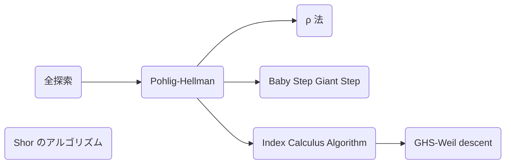

この記事は暗号を理解して解読できるようになろうというシリーズの一部です。シリーズの一覧は次のようになっています。

- [Crypto 入門](https://zenn.dev/anko/articles/ctf-crypto-begginer)
- [共通鍵暗号への攻撃](https://zenn.dev/anko/articles/ctf-crypto-commonkey)
- [なぜ公開鍵暗号は安全なのか](https://zenn.dev/anko/articles/ctf-crypto-publickey)
- [RSA 暗号への攻撃](https://zenn.dev/anko/articles/ctf-crypto-rsa)
- [楕円曲線暗号への攻撃](https://zenn.dev/anko/articles/ctf-crypto-ellipticcurve)
- [乱数とハッシュへの攻撃](https://zenn.dev/anko/articles/ctf-crypto-random)
- [格子暗号への攻撃](https://zenn.dev/anko/articles/ctf-crypto-lattice)
- [Crypto に使うツール](https://zenn.dev/anko/articles/ctf-crypto-tools)

今回紹介するのは楕円曲線暗号です。

楕円曲線の理論は本来、群環体、ガロア理論、可換環論、ホモロジー代数、代数幾何学と理解した先で学習しますが、記事で書くには重すぎるので、高校数学だけで出来る限り紹介します。ただどうしようもないときにはちゃんと定義せずに代数幾何の言葉を使うと思うのでそこはすみません。

## 楕円曲線
高校のときに習ったと思いますが、グラフで半径 1 の円といえば次のような式で表されました。

$$
x^2 + y^2 = 1
$$


楕円曲線は言うなればこの 3 次方程式バージョンです。

$$
y^2 = x^3 + ax + b
$$


グラフがどうしてこんな形になるかというと、まず楕円曲線を $y = \pm\sqrt{x^3 + ax + b}$ と変形します。この平方根の中の 3 次関数は 2 回曲がるような曲線です。その $\pm$ のルートなので 3 次関数の正の部分を上下に伸ばすと丁度楕円曲線の形になるでしょう。そしてパラメータ $a, b$ を動かすことでさまざまな楕円曲線を生成しています。


この章では楕円曲線の点同士で行われる摩訶不思議な"足し算"を紹介します。

### 一般の楕円曲線の定義
まずは楕円曲線の定義をちゃんと行います。読み飛ばしても構いません。

> **Def.**
> 体 $K$ に対して次の方程式 (Weierstrass 方程式) の解の集合を楕円曲線といい、記号としては $E/K$ や $E(K)$ と書く。
>
> $$
y^2 + a_1xy + a_3y = x^3 + a_2x^2 + a_4x + a_6
$$

体とは四則演算ができる代数構造です。実数 $\mathbb{R}$ や有理数 $\mathbb{Q}$ などは体ですし、素体と言われる $\mathbb{F}_p$ は素数 $p$ で割った余りでこれも体となります。他にも拡大体 $\mathbb{F}_{p^n}$ という素体の多項式 $\mathbb{F}_p[x]$ を $n$ 次方程式 $f(x)$ で割った $\mathbb{F}_p[x]/(f(x))$ などもあります。この素体と拡大体を合わせて有限体と言います。

> **Prop.**
> 体 $K$ の標数が $2, 3$ でないとき $x, y$ の線形変換によって 2 次項を消すことができ、$a, b\in K$ を用いて次のように書ける。
>
> $$
y^2 = x^3 + ax + b
$$

体の標数とは $1$ を何回足したら $0$ になるのかという数です。これよりどんな数も標数倍すると必ず 0 となり、ゼロ除算はできないので標数で割ることは出来ません。例えば素体 $\mathbb{F}_p$ は標数 $p$、有理数体 $\mathbb{Q}$ や実数体 $\mathbb{R}$ は標数 $0$ です。

**Proof.**
$\ch(\overline{K}) \neq 2$ のとき Weierstrass 方程式を $(x, y)\mapsto(x, (y - a_1x - a_3)/2)$ と置換すると適切に $b_2, b_4, b_6$ をおくことで次のように簡約化できます。

$$
\begin{aligned}
  \left(\frac{1}{2}(y - a_1x - a_3)\right)&\left(\frac{1}{2}(y - a_1x - a_3) + a_1x + a_3\right) = x^3 + a_2x^2 + a_4x + a_6 \\
  y^2                                 & = 4x^3 + (a_1^2 + 4a_2)x^2 + 2(a_1a_3 + 2a_4)x + (a_3^2 + 4a_6)           \\
  y^2                                 & = 4x^3 + b_2x^2 + 2b_4x + b_6
\end{aligned}
$$

さらに $\ch(\overline{K}) \neq 2, 3$ のとき $(x, y)\mapsto((x - 3b_2)/36, y/108)$ と置換すると適切に $c_4, c_6$ をおくことで次のようにより簡約化できます。

$$
\begin{aligned}
  \left(\frac{y}{108}\right)^2 & = 4\left(\frac{x - 3b_2}{36}\right)^3 + b_2\left(\frac{x - 3b_2}{36}\right)^2 + 2b_4\left(\frac{x - 3b_2}{36}\right) + b_6 \\
  y^2                   & = (x - 3b_2)^3 + 9b_2(x - 3b_2)^2 + 648b_4(x - 3b_2) + 108^2b_6                                       \\
  y^2                   & = x^3 - 27(b_2^2 - 24b_4)x - 54(- b_2^3 + 36b_2b_4 - 216b_6)                                          \\
  y^2                   & = x^3 - 27c_4x - 54c_6
\end{aligned}
$$

こうして Weierstrass 方程式は標数が 2, 3 ではないとき $y^2 = x^3 + ax + b$ と書けます。$\Box$

以下では特に断りがない限り標数が 2, 3 ではない有限体上の楕円曲線を扱います。

### 楕円曲線の和
そしてここから本題に入るのですが、この楕円曲線上にある点同士で足し算ができます。

> **Def. 楕円曲線上の和**
> 楕円曲線 $E$ 上の点同士の和の群 $(E, +)$ を次のように定義する。
> 1. 単位元を無限遠点 $\mathcal{O}$ とする。
> 2. 点 $P = (x, y)$ の逆元を $-P = (x, -y)$ とする。
> 3. $P(x_1, y_1), Q(x_2, y_2)$ に対して $R(x_3, y_3) = P + Q$ を次のように定義する。
>
> $$
\begin{aligned}
x_3 &= \lambda^2 - x_1 - x_2 \\
y_3 &= \lambda(x_1 - x_3) - y_1 \\
\lambda &=
\begin{dcases}
\frac{y_2 - y_1}{x_2 - x_1} \quad (P \neq Q) \\
\frac{3x_1^2 + a}{2y_1} \quad (P = Q)
\end{dcases}
\end{aligned}
$$

定義の式自体はぱっと見不自然と感じる人が多いと思うのですが幾何的に見ると自然となっていて、楕円曲線上の点 $P, Q$ について直線 $PQ$ ($P = Q$ のとき接線) と曲線との交点が $-(P + Q)$ となり、その $y$ 座標の符号を反転した点が $P + Q$ となります。これは見るからに可換法則が成り立ちます。


例えば次の楕円曲線 $E: y^2 = x^3 - 7x + 10$ において $P = (1, 2)$, $Q = (3, 4)$ の和 $R = P + Q$ について直線 $PQ$ の傾きは $\lambda = 1$ より

$$
\begin{aligned}
x_3 & = \lambda^2 - x_1 - x_2 = -3 \\
y_3 & = \lambda(x_1 - x_3) - y_1 = 2
\end{aligned}
$$

よって $R = (-3, 2)$ となります。

このような具体例は次のサイトが分かりやすいと思います。

https://andrea.corbellini.name/ecc/interactive/reals-add.html

### 楕円曲線の位数
位数は楕円曲線の性質を解き明かす上で **とてもとても重要** です。

> **Def. 楕円曲線の位数と楕円曲線上の点の位数**
> 楕円曲線の位数とは楕円曲線上の点の個数、楕円曲線上の点 $P$ の位数とは $nP = \mathcal{O}$ となる最小の自然数 $n$ です。

> **Def. ねじれ群**
> 楕円曲線 $E$ の点 $P$ について $n$ 倍したら単位元 $\mathcal{O}$ となるとき $P$ を $n$-等分点といい、$n$-等分点の集合を $n$-ねじれ群 $E[n]$ という。
>
> $$
E[n] = \lbrace P\in E(\mathbb{F}_q) \mid nP = \mathcal{O}\rbrace
$$

その楕円曲線の位数に関して最も重要な定理があります。

> **Thm. Hasse の定理**
> 楕円曲線 $E/\mathbb{F}_q$ の位数 $\#E(\mathbb{F}_q)$ について次の条件で押さえられる。
>
> $$
|\#E(\mathbb{F}_q) - (q+1)|\leq 2\sqrt{q}
$$

**Sketch.**
ここでは標数が 2, 3 ではないときの証明の筋書きだけ記します。詳しくは [Hasse's Theorem on Elliptic Curves](https://fse.studenttheses.ub.rug.nl/10999/1/opzet.pdf) をご覧ください。

まずベースとなる楕円曲線 $E/\mathbb{F}_q$ を次のように定義する。

$$
E/\mathbb{F}_q: y^2 = x^3 + ax + b
$$

次に $s^2 = f(t) = t^3 + at + b$ とおき、有理関数体上の楕円曲線 $E^{tw}/\mathbb{F}_q(t)$ を定義する。

$$
E^{tw}/\mathbb{F}_q(t): f(t)y^2 = x^3 + ax + b
$$

これらは同型写像 $\phi: E/\mathbb{F}_q\ni (x, y)\mapsto (x, y/s) \in E^{tw}/\mathbb{F}_q(t)$ が存在するので同型 $E/\mathbb{F}_q \cong E^{tw}/\mathbb{F}_q(t)$ となる。ここで体を拡大した楕円曲線 $E/\mathbb{F}_q(t, s)$ における点 $(t, s)$ とそのフロベニウス写像の像 $(t^q, s^q)$ を同型写像 $\phi$ で移した点を $Q, P_0\in E^{tw}/\mathbb{F}_q(t)$ とおく。

$$
\begin{aligned}
Q & = (t, 1) \\
P_0 & = (t^q, s^{q-1}) = (t^q, (t^3 + at + b)^{(q-1)/2})
\end{aligned}
$$

これらを用いて点 $(x_n, y_n) = P_n = P_0 + nQ$ を生成する。このとき $x_n = f_n/g_n \in \mathbb{F}_q(t)$ と書けて $d_n$ を次のように定義する。

$$
d_n = \begin{cases}
0 & \mathrm{if}\ P_n = \mathcal{O} \\
\deg(f_n) & \mathrm{otherwise}
\end{cases}
$$

例えば $d_0 = \deg(f_0) = \deg(t^q) = q$ となる。このとき色々計算すると次の式が成り立つことが分かる。

$$
\begin{aligned}
d_{n-1} + d_{n+1} & = 2d_n + 2 \\
d_{-1} & = \#E(\mathbb{F}_q) \\
\end{aligned}
$$

この $d_n$ に関する 3 つの式から $d_n$ が求まる。

$$
d_n = n^2 - (\#E(\mathbb{F}_q) - (q + 1))n + q
$$

$d_n$ は $n$ に関する二次方程式となり、その判別式 $D$ は次のようになる。

$$
D = (\#E(\mathbb{F}_q) - (q + 1))^2 - 4q
$$

$D > 0$ とすると 2 次方程式は 2 つの解 $\alpha$, $\beta$ を持つが、整数 $n$ に対して $d_n \geq 0$ であるから 2 つの解の差は多くとも 1 である。また $D$ は整数であるから $D = (\beta - \alpha)^2 = 1$ となる。これより 2 つの解は $k$, $k+1$ と書けて $d_n = n^2 - (2k + 1)n + k(k+1)$ より方程式を比較して $q = k(k+1)$ となる。ただ $q$ は奇数に対し、 $k(k + 1)$ は偶数であるから不適である。
よって $D \leq 0$、つまり標数 2, 3 以外の Hasse の定理が示された。$\Box$

実際に楕円曲線の位数をプロットしてみると $2\sqrt{q}$ で抑えられていることが分かります。


[tsujimotterのノートブック - 楕円曲線のハッセの定理](https://tsujimotter.hatenablog.com/entry/hasses-theorem) より

有限体上の楕円曲線について位数の範囲がわかって群として少しわかってきたんじゃないでしょうか。ただこれ、範囲は比較的簡単にわかるのですが、楕円曲線のパラメータを用いた一般的な位数の表式については **未解決問題** となっています。

位数の範囲が分かったので次は楕円曲線が与えられたときに実際に位数を計算する方法を考えます。ところで有限体の重要な性質の 1 つにフロベニウス写像という重要な準同型写像の存在があります。これは楕円曲線にもあって、その性質の一つであるフロベニウス写像の特性多項式は位数を求めるときに重宝します。

> **Def. 楕円曲線におけるフロベニウス写像**
> 楕円曲線 $E/\mathbb{F}_q$ におけるフロベニウス写像 $\phi$ を次のように定義する。
>
> $$
\phi: (x, y)\mapsto (x^q, y^q)
$$
>
> 楕円曲線 $E/\mathbb{F}_q$ のフロベニウス写像を $\phi$ として $t = \#E(\mathbb{F}_q) - (q+1)$ とおくと次の式が成り立つ。これをフロベニウス写像の特性多項式という。
>
> $$
\phi^2 - t\phi + q = 0
$$

この多項式に楕円曲線の点 $P = (x, y)$ を適用させると次のようになります。

$$
t(x^q, y^q) = (x^{q^2}, y^{q^2}) + q(x, y)
$$

Hasse の定理より $t\approx 2\sqrt{q}$ とかなり大きいので全探索で $t$ を求めるのは間に合わなさそうです。Schoof のアルゴリズムは中国剰余定理を使ってこの問題を高速に求めます。

> **Schoof のアルゴリズム**
> 楕円曲線 $E/\mathbb{F}_q$ の位数 $\#E(\mathbb{F}_q)$ を $O(\log^8q)$ で求められる。

**Proof.**
これに小さな素数 $l$ を用いて $l$ ねじれ群 $E[l] = \lbrace P\in E(\mathbb{F}_q)\mid lP = \mathcal{O} \rbrace$ の元 $P = (x, y)\in E[l]$ をフロベニウス写像の特性多項式に右から作用させて整理すると次のようになる。

$$
t(x^q, y^q) = (x^{q^2}, y^{q^2}) + q(x, y)
$$

右辺を計算し、左辺について $t\in [-(l-1)/2, (l-1)/2]$ の範囲で全探索を行って一致したときの値が $t \bmod l$ となる。よって様々な $l_i$ を用いて $t \bmod l_i$ が分かれば中国剰余定理から $t$ が求まる。 $\Box$

今回はフロベニウス写像の特性多項式を使いましたが、モジュラー多項式を使うことで $O(\log^8q)$ から $O(\log^6q)$ へ高速化できます。

これで位数を求めることができるようになりました！それでは楕円曲線暗号の説明について早速入っていきましょう。

:::message
**練習問題**
- $x$ 座標から $y$ 座標を求められる？
- 楕円曲線上の点をいくつ知っていれば楕円曲線のパラメータを決定できる？またその方法は？
- ある楕円曲線について位数を指定された点 (ねじれ群の元) を生成できる？
:::

```python
class ElipticCurveOverFp:
    """
    y^2 = x^3 + ax + b (mod p)
    """
    def __init__(self, a, b, p):
        self.Fp = GF(p)
        self.a = self.Fp(a)
        self.b = self.Fp(b)
        self.p = p


class Point:
    def __init__(self, curve: ElipticCurveOverFp, x, y, infty=False):
        self.x = curve.Fp(x)
        self.y = curve.Fp(y)
        self.curve = curve
        self.infty = infty
        if self.y**2 != self.x**3 + self.curve.a * self.x + self.curve.b and not self.infty:
            raise ValueError(f"Invalid point, x:{x}, y:{y} is not on the curve")

    @staticmethod
    def infinity(curve: ElipticCurveOverFp) -> "Point":
        return Point(curve, 0, 0, True)

    def is_infinity(self) -> bool:
        return self.infty

    def __add__(self, other) -> "Point":
        if self.is_infinity():
            return other
        if other.is_infinity():
            return self
        if self.x == other.x and self.y == -other.y:
            return Point.infinity(self.curve)

        if self.x == other.x and self.y == other.y:
            lambda = (3 * (self.x**2) + self.curve.a) / (2 * self.y)
        else:
            lambda = (other.y - self.y) / (other.x - self.x)
        x = lambda**2 - self.x - other.x
        y = lambda * (self.x - x) - self.y
        return Point(self.curve, x, y)

    def __rmul__(self, n: int) -> "Point":
        temp = self
        res = Point.infinity(self.curve)
        while n > 0:
            if n & 1 == 1:
                res += temp
            temp += temp
            n >>= 1
        return res
```
## 楕円曲線暗号

楕円曲線暗号 (ECC) は RSA 暗号と同時期に開発された暗号で 1985 年頃に Victor S. Miller と Neal Koblitz が同時期かつ独立に発明しました(ちなみに Miller-Rabin 素数判定法の Miller は Gary L. Miller で別人です)。特徴としては RSA 暗号よりも純粋に強い暗号であることや鍵長が短いことなどが挙げられます。

さて、ここでこの楕円曲線上の加法を用いた次のような問題を作れます。

> **楕円曲線上の離散対数問題 (ECDLP : Elliptic Curve Discrete Logarithm Problem)**
> 楕円曲線上の点 $P, Q$ に $Q = dP$ という関係があるとき $d$ を求めよ。

つまり楕円曲線の世界で「割り算」をしなさいという問題です。

実はこの問題はとても難しく、これを解く効率的なアルゴリズムは現在見つかっていません。この ECDLP を利用して暗号の形にしたものが楕円曲線暗号です。楕円曲線暗号の例としては ECDH があります。

### 楕円曲線暗号による鍵共有
公開鍵暗号を用いて鍵を直接共有することなく共有鍵を構築する方法の一つにディフィーヘルマン鍵共有があります。その中で ECDLP (正確には ECDHH) を安全性根拠とするものを楕円曲線ディフィーヘルマン鍵共有 (ECDH; Elliptic Curve Diffie–Hellman key exchange) と呼びます。

> **楕円曲線ディフィーヘルマン鍵共有 (ECDH)**
> 1. セットアップ
>   楕円曲線 $E/\mathbb{F}_p$ とベースポイント $P\in E/\mathbb{F}_p$ を共有する
> 2. 鍵生成
>   Alice と Bob はそれぞれ疑似乱数 $d_A, d_B$ を生成し、$d_A, d_B$ を秘密鍵、$Q_A = d_AP, Q_B = d_BP$ を公開鍵として公開する
> 3. 鍵交換
>   Alice と Bob は自分の秘密鍵と相手の公開鍵を掛けると $S = d_Ad_BP = d_AQ_B = d_BQ_A$ となり、$S$ の $x$ 座標をハッシュ化したものが Alice と Bob のみが知る共通鍵となる

このように攻撃者は $(P, d_AP, d_BP)$ が分かっていたとしても ECDLP (ECDHH) が解けないので $d_Ad_BP$ が分からず、安全に共通鍵を共有することができます。

### 楕円曲線暗号による電子署名
ECDLP を安全性根拠とする電子署名もあります。

> **ECDSA**
> 1. セットアップ
>   楕円曲線 $E/\mathbb{F}_p$ とベースポイント $P\in E/\mathbb{F}_p$ を共有する
> 2. 署名
>   秘密鍵 $d$ と公開鍵 $Q = dP, k$ を生成し、平文のハッシュ値 $m$ に対して $r = (kP)_x, s = (m + rd)k^{-1}$ と計算し $(r, s)$ を署名とする
> 3. 検証
>   $(x, y) = ms^{-1}G + rs^{-1}Q$ について $x = r$ となることを検査する

### 楕円曲線暗号のパラメータ
暗号標準を定める国際機関によって楕円曲線のパラメータが決まっています。規格化された楕円曲線のパラメータの情報がすべてまとまっている資料があります。これは適当にパラパラめくるだけで面白いです。

https://neuromancer.sk/std/nist/P-256

また、より高速化させる為に様々な楕円曲線が考案されています。ただ 1 回の和に必要な演算が数回変わるだけでオーダーレベルでは変わらないので詳細は省きます。

| モデル | 式 | 座標 |
|:-:|:-:|:-:|
| ワイエルシュトラス | $y^2 = x^3 + ax + b$ | $(x, y)$ |
| モンゴメリー | $y^2 = x^3 + Ax^2 + x$ | $x$ |
| エドワード | $x^2 + y^2 = 1 + dx^2y^2$ | $w = dx^2y^2$ |
| ねじれエドワード | $ax^2 + y^2 = 1 + dx^2y^2$ | $(x, y)$ |
| ハフ | $cx(y^2 - 1) = y(x^2 - 1)$ | $w = \frac{1}{xy}$ |
| ヤコビ交差 | $ax^2 + y^2 = 1, bx^2 + z^2 = 1$ | $\omega = \sqrt{ab}x^2$ |

## ECDLP を解く

計算機代数の章で紹介する DLP を解く方法を楕円曲線に適用すればよいだけです。ここでは Baby-step Giant-step と $\rho$ 法、Pohlig-Hellman、Index Calculus Algorithm とその派生を紹介します。数体ふるい法は ECDLP 上では有効ではないらしいです(多分)。量子アルゴリズムとしても ECDLP は位数発見問題なので Shor のアルゴリズムが使えます。


### Baby-step Giant-step

楕円曲線 $E$ について $N = \#P, m = \lceil \sqrt{N} \rceil$ として $d$ を $m$ で割ると $d = qm + r$ となるから集合 $B, G$ を作り、両方の元が一致したときに $d = qm + r$ とすることで DLP の解が求まります。

$$
\begin{aligned}
Q &= dP = (qm + r)P \\
Q - rP &= q(mP) \\
B &= \{ Q - rP \mid 0 \leq r < m \} \\
G &= \{ qmP \mid 0 \leq q < m \}
\end{aligned}
$$

これより計算量は $O(\sqrt{N}\log N)$ メモリ空間は $O(\sqrt{N})$ だけ必要となります。

### Pollard's rho 法

$\rho$ 法は文字 $\rho$ の形が由来となっていて、ある点から疑似ランダム関数 $f$ によって数列を生成し、今まで出た点と衝突したら DLP が解けるという仕組みです。

各点の係数を $a_i\in\mathbb{Z}/N\mathbb{Z}[d]$ とすると初期値 $a_0 = 1$ から計算して $a_iP = a_jP$ ならば $a_i = a_j$ であるから $d$ が求まります。

$$
\begin{aligned}
a_{i+1}P &=
\begin{cases}
a_iP + Q & (a_iP \in G_1) \\
a_iP + a_iP & (a_iP \in G_2)\\
a_iP + P & (a_iP \in G_3)
\end{cases} \\
 &=
\begin{cases}
(a_i + d)P & (a_iP \in G_1) \\
2a_iP & (a_iP \in G_2)\\
(a_i + 1)P & (a_iP \in G_3)
\end{cases}
\end{aligned}
$$

これは誕生日のパラドックスによって $O(\sqrt{N})$ で求まります。

### Pohlig-Hellman

中国剰余定理を用いて大きな群を複数の小さな群の直積に分けます。楕円曲線暗号の楕円曲線の位数は細かく素因数分解できることが多いので RSA とかと違って実用的な手法になります。

> **Pohlig-Hellman**
> 楕円曲線の位数が $\#E = p_1^{e_1}p_2^{e_2}\ldots p_k^{e_k}$ と素因数分解できるとき $\mathcal{O}\left(e_i\sqrt{p_i}\right)$ で ECDLP が解ける。

$Q = dP$ に対して次のように $d_i$ を定義する。

$$
d = d_0+d_1p_i+d_2p_i^2+\ldots+d_{e_i−1}p_i^{e_i−1} \quad \pmod{p_i^{e_i}} \\
$$

これより次の関係式が成り立つ。

$$
\frac{\#E}{p_i}Q = d_0\left(\frac{\#E}{p_i}P\right)
$$

この $d_0$ は ECDLP の他の方法を用いて $\mathcal{O}(\sqrt{p_i})$ で求まります。次に $d_0,\ldots,d_{j-1}$ を知っているときに $d_j$ を計算します。点 $P, Q$ に $\#E/p_i^{j+1}$ を掛けた点について次の関係式が成り立ちます。

$$
\begin{aligned}
\frac{\#E}{p_i^{j+1}}Q & = (d_0+\cdots+d_{j}p_i^{j})\left(\frac{\#E}{p_i^{j+1}}P\right) \\
\frac{\#E}{p_i^{j+1}}Q & - (d_0+\cdots+d_{j−1}p_i^{j−1})\left(\frac{\#E}{p_i^{j+1}}P\right) = d_{j}\left(\frac{\#E}{p_i}P\right)
\end{aligned}
$$

これより ECDLP を解くことで $d_j$ が求まります。

```python
def pohlig_hellman(G):
    fact = factor(G.order())
    order = int(G.order())
    dlogs = []
    primes = []
    for p, e in fact:
        t = order // p ^ e
        dlog = discrete_log(t * Q, t * G, operation="+")
        dlogs.append(dlog)
        primes.append(p ^ e)
    return crt(dlogs, primes)
```

### Index Calculus Algorithm
楕円曲線上の DLP を Index Calculus Algorithm で解く試みは歴史が長く、以下のようなことがありました。

| 手法 | 著者 | 説明 |
| --- | --- | --- |
| Index Calculus | 1991: Adleman-DeMarrais-Huang<br>1997: Gaudry | 種数の大きい超楕円曲線上の DLP を Index Calculus Algorithm で解く |
| Weil descent | 1998: Frey | $\mathbb{F}_{p^n}$ 上の楕円曲線の DLP を $\mathbb{F}_p$ 上の超楕円曲線の DLP に置き換えて Index Calculus を用いる |
| Generalized Weil descent | 2004: Gaudry-Hess-Smart<br>2007: Nagao | $\mathbb{F}_{p^n}$ 上の楕円曲線の DLP に直接 Index Calculus Algorithm を適用する |

ここでは Generalized Weil descent を紹介しようと思います。

> **Index Calculus Algorithm**
> 1. 因子基底 $B = \lbrace P\in E(\mathbb{F}_{p^k})\mid P_x\in\mathbb{F}_p\rbrace = \lbrace B_1,\ldots,B_n\rbrace$ を作る。
> 2. 次の関係式を与える。
>
> $$
r_iP = \sum_{j=1}^n e_{ij}B_j
$$
> 3. 行列で書くと次のようになるので $\log_P B_j$ を求める。
>
> $$
\begin{pmatrix}
r_1 \\
\vdots \\
r_n
\end{pmatrix}
= \begin{pmatrix}
e_{11} & \cdots & e_{1n} \\
\vdots & \ddots & \vdots \\
e_{n1} & \cdots & e_{nn}
\end{pmatrix}
\begin{pmatrix}
\log_P B_1 \\
\vdots \\
\log_P B_n
\end{pmatrix}
$$
>
> 4. 再び次の関係式を与えることで DLP が解ける。
>
> $$
\begin{aligned}
Q + rP &= \sum_{j=1}^n e_jB_j \\
Q &= \sum_{j=1}^n (e_j\log_P B_j)P - rP \\
\end{aligned}
$$

ここで関係式を見つける方法が最も重要です。Gaudry は Semaev の Summation polynomials を用いて関係式を見つけています。

> **Thm. Semaev の Summation polynomials**
> 楕円曲線 $E/k$ において $n$ 変数多項式 $S_n(x_1,\ldots,x_n)\in k[x_1,\ldots,x_n]$ が存在し、次の $P_i = (X_i, Y_i)\in E/k$ に対して次の式が成り立つ。
>
> $$
\exists s_i = \pm 1\quad s_1P_1 + \cdots + s_nP_n = 0
\iff
S_n(X_1,\ldots,X_n) = 0
$$
>
> $E:y^2 = 4x^3 + ax + b$ のとき $S_n(x_1,\ldots,x_n)$ は次の漸化式が成り立つ。
>
> $$
\begin{aligned}
S_2(x_1, x_2) & = x_1 - x_2 \\
S_3(x_1,x_2,x_3) & = (x_1 - x_2)^2x_3^2 - 2\left((x_1 + x_2)\left(\frac{a}{4} + x_1x_2\right) + \frac{b}{2}\right)x_3 \\
& + \left(x_1x_2 - \frac{a}{4}\right) - b(x_1 + x_2) \\
S_n(x_1,\ldots,x_n) & = \mathrm{Res}_x(S_j(x_1,\ldots,x_{j-1}, x), S_{n-j+2}(x_j,\ldots,x_n,x))
\end{aligned}
$$

> **Gaudry のアルゴリズム**
> $E/\mathbb{F}_{p^3}$ の $y^2 = x^3 + ax + b$ $(a\in\mathbb{F}_p, b\in\mathbb{F}_{p^3})$ を解くことを考える。$Q$ の因子を $B_i = (X_i, Y_i)$ として $\mathbb{F}_{p^3} = \mathbb{F}_p[t]/(f(t))$ とおくと
>
> $$
\begin{aligned}
& Q + B_1 + B_2 + B_3 = 0 \\
\iff & S_4(X_1, X_2, X_3, x) = \phi_0(X_1, X_2, X_3) + \phi_1(X_1, X_2, X_3)t + \phi_2(X_1, X_2, X_3)t^2 = 0 \\
\iff & \phi_0(X_1, X_2, X_3) = 0, \phi_1(X_1, X_2, X_3) = 0, \phi_2(X_1, X_2, X_3) = 0
\end{aligned}
$$
>
> より 3 つの代数方程式が得られるので Gröbner 基底を計算することで $X_1, X_2, X_3$ が求まる。

この計算量は $\mathcal{O}(g!g^3p(\log p)^3 + g^3p^2(\log p)^2)$ と知られています。

## 攻撃手法

この ECDLP を解くことができれば ECDH を含め、様々な楕円曲線暗号を解くことができます。さて主に攻撃対象となる楕円曲線暗号は以下のようなものがあります。

| アンチケース | 攻撃名   | 方法 |
| ---- | --- | ---- |
| なし | ECDLP | 単純に ECDLP を解く |
| 位数が Smooth number $\#E/\mathbb{F}_p = p_1^{e_1}p_2^{e_2}\ldots p_k^{e_k}$ | Pohlig Hellman Attack | 位数 $p_i$ の小さな ECDLP に分解できる |
| Anomalous な曲線 $\#E/\mathbb{F}_p = p$ | SSSA Attack | $\mathbb{F}_p^+$ 上の DLP に帰着できる |
| Supersingular な曲線 $\#E/\mathbb{F}_p = p+1$ | MOV / FR Reduction | 埋め込み次数 $k$ を用いて $\mathbb{F}_{p^k}^\times$ 上の DLP に帰着できる |
| Singular な曲線 $\Delta(E/\mathbb{F}_p) = 0$ | Singular Curve Point Decompression Attack | $\mathbb{F}_p^+$ や $\mathbb{F}_p^\times, \mathbb{F}_{p^2}^\times$ 上の DLP に帰着できる |
| 楕円曲線上に存在しない点や位数の少ない点を指定できる | Invalid Curve Attack / Small-Subgroup Attack | さまざまな少ない位数の点を収集して中国剰余定理 |

### 楕円曲線上に存在しない点や位数の少ない点を指定できてはいけない (Invalid Curve Attack / Small-Subgroup Attack)
楕円曲線に乗らない点を乗っているように演算すると位数の小さい点となります。これを理解する為にもう一度楕円曲線上の和について復習しましょう。

> **Def. 楕円曲線上の和**
> 楕円曲線 $E$ 上の点同士の和の群 $(E, +)$ を次のように定義する。
> 1. 単位元を無限遠点 $\mathcal{O}$ とする。
> 2. 点 $P = (x, y)$ の逆元を $-P = (x, -y)$ とする。
> 3. $P(x_1, y_1), Q(x_2, y_2)$ に対して $R(x_3, y_3) = P + Q$ を次のように定義する。
>
> $$
\begin{aligned}
x_3 &= \lambda^2 - x_1 - x_2 \\
y_3 &= \lambda(x_1 - x_3) - y_1 \\
\lambda &=
\begin{dcases}
\frac{y_2 - y_1}{x_2 - x_1} \quad (P \neq Q) \\
\frac{3x_1^2 + a}{2y_1} \quad (P = Q)
\end{dcases}
\end{aligned}
$$

この定義をよく見てみると $b$ という情報はどこにも入っていません。つまり楕円曲線上に乗っていない点を計算しようとすると $b$ がずれた状態で計算しているのと同じになります。そうすると $P$ の位数も変化し、大抵の場合かなり少ない数になります(未証明)。これを用いて様々な位数の点で計算することで中国剰余定理で ECDLP が解けます。

:::message
**練習問題**
- tiramisu (Google CTF)
:::

### Singular な曲線を用いてはいけない (Singular Curve Point Decompression Attack)
特異点を持つ楕円曲線は写像を通して FFDLP に落ちます。

> **Def. 特異点**
> ある関数 $f(x, y) = 0$ の特異点とは次を満たす点 $(X, Y)$ である。
>
> $$
\left.\frac{\partial f}{\partial x}\right|_{(X, Y)} = \left.\frac{\partial f}{\partial y}\right|_{(X, Y)} = 0
$$

このように微分値が不定となる点、グラフ上では関数の曲線が交差している点を特異点と言います。楕円曲線では次のように計算できます。

$$
\begin{aligned}
f(x, y) & = y^2 - (x^3 + ax + b) \\
\frac{\partial f}{\partial x} & = -3x^2 - a, \quad \frac{\partial f}{\partial y} = 2y
\end{aligned}
$$

これより楕円曲線の特異点が存在すれば $\left(\pm\sqrt{-\dfrac{a}{3}}, 0\right)$ にあります。

楕円曲線の曲線は高々 1 回交わることになるので 2 つのタイプに分けられます。1 つは十字に交わるノード、もう 1 つは接しながら交わるカスプです。

#### カスプの場合

どんな尖っている楕円曲線も平行移動や線形変換により $y^2 = x^3$ の形になります。このとき $y = \lambda x$ との交点は $(\lambda^2, \lambda^3)$ 、接線は $y = 0$ となります。これより $f: E/\mathbb{F}_p \to \mathbb{F}_p^+$ を次のように定義することで $\mathbb{F}_p^+$ の DLP に落ちます。

$$
f(x,y) = \frac{x}{y} \\
f(\infty) = 0
$$

#### ノードの場合

$y = 0$ 上の特異点が原点 $O(0, 0)$ となるように平行移動させると $y^2 = x^3 + kx^2$ となる。

$$
\left(\frac{\partial F}{\partial x}, \frac{\partial F}{\partial y}\right) = ((3x + 2k)x, 2y)
$$

より特異点が原点しかないことがわかります。このとき $y = \lambda x$ との交点を考えます。そうすると各点を $P = (\lambda^2 - k, \lambda(\lambda^2 - k))$ と表現できます。これより $f: E/\mathbb{F}_p \to \mathbb{F}_p^\times$ を次のように定義することで $\mathbb{F}_p^\times$ の DLP に落ちます。

$$
\begin{aligned}
f(x,y) & = \frac{y + \sqrt{k}x}{y - \sqrt{k}x} \\
f(\infty) & = 1
\end{aligned}
$$

```python
def SingularCusp(a, b, p):
    PR.<x> = GF(p)[]
    E = x^3 + a*x + b
    roots = E.roots()
    dx = next(filter(lambda x: x[1] == 3, roots))[0]
    dy = 0

    def f(P):
        if P == 0:
            return 0
        x, y = P[0], P[1]
        return x / y

    g = f((gx - dx, gy - dy))
    p = f((px - dx, py - dy))
    return p / g

def SingularNode(a, b, p):
    PR.<x> = GF(p)[]
    E = x^3 + a*x + b
    roots = E.roots()
    dx = next(filter(lambda x: x[1] == 2, roots))[0]
    dy = 0

    E_ = E.subs(x = x + dx)
    roots = E_.roots()
    k = next(filter(lambda x: x[1] == 1, roots))[0]
    k = (-k).square_root()

    def f(P):
        if P == 0:
            return 1
        x, y = P[0], P[1]
        return (y + k * x) / (y - k * x)

    g = f((gx - dx, gy - dy))
    p = f((px - dx, py - dy))
    return p.log(g)
```

### Anomalous な曲線を用いてはいけない (SSSA Attack)
位数が $p$ の楕円曲線を Anomalous な曲線と言います。これには SSSA (Semaev-Smart-Satoh-Araki) Attack という攻撃が通ります。

このとき次の関数 $\lambda_E: E\to\mathbb{F}_p$ をおきます。

$$
\begin{aligned}
\lambda_E &: E(\mathbb{F}_p)\xrightarrow{u}E(\mathbb{Q}_p)\xrightarrow{\times p}\ker\pi\xrightarrow{\log_{\mathcal{E}}}p\mathbb{Z}_p\xrightarrow{\bmod{p^2}} p\mathbb{Z}_p/p^2\mathbb{Z}_p\cong \mathbb{F}_p \\
\lambda_E(P) & = (\bmod{p^2})\circ\log_{\mathcal{E}}\circ\psi(pu(P)) \qquad \psi(x:y:z) = \frac{x}{y}
\end{aligned}
$$

ただし還元写像 $\pi:E(\mathbb{Q}_p)\to E(\mathbb{F}_p)$ と持ち上げ写像 $u: E(\mathbb{F}_p)\to E(\mathbb{Q}_p)$、形式群 $\mathcal{E}$ の形式対数を $\log_{\mathcal{E}}$ とおいた。

このとき次の定理が成り立ちます。

> **Thm.**
> $\lambda_E$ が零写像ではないとき点 $P\neq \mathcal{O}$ に対して次のようになる。
>
> $$
\lambda_E(P) = -\frac{x_{p-1} - x_1}{p(y_{p-1} - y_1)}\in\mathbb{Z}_p^\times
$$
>
> ただし $u(nP) = (x_n, y_n)\in E(\mathbb{Q}_p)$ とする。

**Proof.**
まず $\pi(A) = P$ となる $A\in E(\mathbb{Q}_p)$ を取る。$n\pm m \neq 0 \pmod{p}$ のとき

$$
x_n = x_m \iff \pi(nA) = \pm \pi(mA) \iff (n\pm m) P = \mathcal{O} \iff P = \mathcal{O}
$$

と矛盾するので $x_n\neq x_m$ である。

これより $n \neq 0 \pmod{p}$ ならば $nA \neq \mathcal{O}$ である。

$$
\begin{aligned}
  A & = (x_1, y_1) \in E(\mathbb{Z}_p) \\
  2A & = \left(c_2^2 - 2x_1, - c_2x_2 - d_2\right)\in E(\mathbb{Z}_p) & (\because y_1\in\mathbb{Z}_p^\times) \\
  c_2 & = \frac{3x_1^2 + a_4}{2y_1}\in\mathbb{Z}_p, \qquad d_2 = \frac{-x_1^3 + a_4x_1 + 2a_6}{2y_1}\in\mathbb{Z}_p \\
  nA & = (c_n^2 - x_1 - x_{n-1}, -c_n^3 + c_n(x_1 + x_{n-1}) - d_n) \\
  c_n & = \frac{y_{n-1} - y_1}{x_{n-1} - x_1}, \qquad d_n = y_1 - x_1c_n
\end{aligned}
$$

$2<n<p$ のとき $x_{n-1} \neq x_1$ より $x_{n-1} - x_1 \in\mathbb{Z}_p^\times$ であるから $nA\in E(\mathbb{Z}_p)$ である。そしてもし $pA = \mathcal{O}$ であれば $\lambda_E(P) = 0$ となるので零写像でないことに矛盾する。よって $pA \neq \mathcal{O}$ である。

ここで $c_p\in\mathbb{Z}_p$ とすると $d_p\in\mathbb{Z}_p, y_p\in\mathbb{Z}_p$ となるが $\pi((x_p:y_p:1)) = \mathcal{O}$ に矛盾する。これより $\mathrm{ord}_pc_p < 0$ となる。

$$
\begin{aligned}
\mathrm{ord}_px_p &= \mathrm{ord}_p(c_p^2 - x_1 - x_{p-1}) = 2\mathrm{ord}_pc_p \\
\mathrm{ord}_pd_p &\geq \min(\mathrm{ord}_py_1, \mathrm{ord}_px_1 + \mathrm{ord}_pc_p) \\
&\geq \mathrm{ord}_pc_p \\
\mathrm{ord}_py_p &= \mathrm{ord}_p(-c_p^3 + c_p(x_1 + x_{p-1}) - d_p) = 3\mathrm{ord}_pc_p \\
\mathrm{ord}_p\psi(pA) &= \mathrm{ord}_p\left(\frac{x_p}{y_p}\right) = - \mathrm{ord}_pc_p > 0 \\
\mathrm{ord}_p\log_{\mathcal{E}}(pA) &= -\mathrm{ord}_pc_p
\end{aligned}
$$

ここで $\lambda_E(A)\neq 0$ であるから $\mathrm{ord}_pc_p = -1$ であることが分かる。よって $\lambda_E(A)$ は次のように求まる。

$$
\begin{aligned}
\mathrm{ord}_px_p & = -2, \mathrm{ord}_py_p = -3 \\
p^2x_p & = p^2c_p^2 - p^2x_1 - p^2x_{p-1} = (pc_p)^2 \\
p^3y_p & = -p^3c_p^3 + p^3c_p(x_1 + x_{p-1}) - p^3d_p = - (pc_p)^3 \\
\lambda_E(P) & = \frac{x_p}{py_p} = \frac{p^2x_p}{p^3y_p} = -\frac{(pc_p)^2}{(pc_p)^3} = - \frac{x_{p-1} - x_1}{p(y_{p-1} - y_1)} \in \mathbb{Z}_p^\times
\end{aligned}
$$

この手法をまとめると次のように計算することで DLP は $\mathbb{F}_p$ 上の割り算に変換できる。

1. $A = \pi(P) \bmod p^2 = (x_1, y_1)\in E(\mathbb{Z}/p^2\mathbb{Z})$ を見つける。
2. $(p-1)A = (x_{p-1}, y_{p-1})\in E(\mathbb{Z}/p^2\mathbb{Z})$ を計算する。
3. $x_{p-1} \neq x_1$ のとき $\lambda_E(P) = 0$ または $\lambda_E(P) = \dfrac{x_{p-1} - x_1}{p(y_{p-1} - y_1)}$ になる。
4. そして $d = \dfrac{\lambda_E(Q)}{\lambda_E(P)}$ と計算すると DLP が解ける。

```python
def hensel_lift(E, P):
    p = E.base_ring().order()
    a, b = map(ZZ, [E.a4(), E.a6()])
    x, y = map(ZZ, P.xy())
    s = (x^3 + a*x + b - y^2) // p
    s = lift(GF(p)(s) / (2*y))
    return (x, y + p * s)

def lambda_E(E, P):
    p = E.base_ring().order()
    x1, y1 = P.xy()
    xp_1, yp_1 = ((p - 1) * P).xy()
    res = Zmod(p^2)(ZZ(xp_1 - x1) / p) / (yp_1 - y1)
    assert res != 0
    return res

def SSSA_attack(E, P, Q):
    p = E.base_ring().order()
    a, b = E.a4(), E.a6()
    assert E.cardinality() == p
    assert E.trace_of_frobenius() == 1

    Px, Py = P = hensel_lift(E, P)
    Qx, Qy = Q = hensel_lift(E, Q)
    A = ((Qy^2 - Py^2) - (Qx^3 - Px^3)) / (Qx - Px)
    B = Py^2 - Px^3 - int(a)*Px
    R = Zmod(p^2)
    lE = EllipticCurve(R, [A, B])
    P, Q = lE(P), lE(Q)

    return lambda_E(E, P) / lambda_E(E, Q)
```

### Supersingular な曲線を用いてはならない (MOV / FR Reduction)
位数が $q + 1$ となるような楕円曲線を Supersingular な楕円曲線といい、その DLP はペアリング (双線形写像) を用いて有限体上の DLP に帰着できるという方法です。

> **Def. 双線形写像 (Bilinear map)**
> 群 $G_1, G_2$ について写像 $f: G_1\times G_1\to G_2$ が次を満たすとき、$f$ を双線形写像あるいはペアリングという。
>
> $$
\begin{aligned}
f(x_1x_2, y) = f(x_1, y)f(x_2, y) \\
f(x, y_1y_2) = f(x, y_1)f(x, y_2)
\end{aligned}
$$

楕円曲線暗号では Weil pairing や Tate pairing などのペアリングを使いますが、これらのペアリングは因子 (divisor) と呼ばれる概念を通じて理解します。この因子を求めるアルゴリズムを Miller's algorithm といいます。

> **Miller's algorithm**
>
> $$
h_{P, Q}(x, y) = \begin{dcases}
\frac{y - y_P - \lambda(x - x_P)}{x + x_P + x_Q - \lambda^2 - a_1\lambda + a_2} & (\lambda\neq\infty) \\
x - x_P & (\lambda = \infty)
\end{dcases}
$$

```python
def h(P, Q, R):
    if (P == Q and P.y == 0) or (P != Q and P.x == Q.x):
      return R.x - P.x
    L = P.line_coeff(Q)
    p = R.y - P.y - L * (R.x - P.x)
    q = R.x + P.x + Q.x - L * L
    return p / q

def miller(P, Q, m):
    if P == Q:
        return 1
    f = 1
    T = P
    for i in reversed(m.bits()):
        f = f * f * h(T, T, Q)
        T = T + T
        if i == 1:
            f = f * h(T, P, Q)
            T = T + P
    return f
```

> **Weil pairing**
> Miller's algorithm で得た因子 $f_P, f_Q$ から得られる $e_m: E[m]\times E[m] \to \mu_m\subseteq\mathbb{F}_{p^k}^\times$ を Weil pairing という。
>
> $$
e_m(P, Q) = \frac{f_P(Q + S)}{f_P(S)}\bigg/\frac{f_Q(P - S)}{f_Q(-S)}
$$
>
> Weil pairing は次の条件を満たす。
> 1. 双線形 (bilinear)
> 双線形写像である。
> 2. 同一性 (idenntity)
> $e_n(P, P) = 1$
> 3. 非退化 (non-degenerate)
> 任意の $Q\in E[n]$ に対して $e_n(P, Q) = 1$ ならば $P = \mathcal{O}$ である。

```python
def weil_pairing(E, P, Q, m, S=None):
    if S is None:
        S = E.random_point()
    fpqs = miller(P, Q + S, m)
    fps = miller(P, S, m)
    fqps = miller(Q, P - S, m)
    fqs = miller(Q, -S, m)
    return (fpqs / fps) / (fqps / fqs)


def tate_pairing(E, P, Q, m, k=2):
    f = miller(P, Q, m)
    return f ^ ((p ^ k - 1) // m)
```

> **埋め込み次数**
> 必要となる最小の拡大次数 $d$ を埋め込み次数という。

$\mu_m$ の埋め込み次数が小さい楕円曲線ならば ECDLP より FFDLP の方が素早く計算できそうです。そのような楕円曲線というのが Supersingular な楕円曲線です。任意の楕円曲線を FFDLP に落とし込めますが、埋め込み次数が高いと ECDLP を解いた方が速くなるので、埋め込み次数を先に計算してから選択する必要があります。

特に超特異楕円曲線において埋め込み次数は小さくなります。

> **Prop.**
> Supersingular な楕円曲線の埋め込み次数は $6$ 以下である。

**Proof.**
$q = p^2$ において Hasse の定理から次のようになる。

$$
|\#E(\mathbb{F}_{p^2}) - (p^2 + 1)| \leq 2p
$$

| $-t$ | $\#E(\mathbb{F}_{q^2})$ | $\#\mathbb{F}_{q^d}^\times$ | $d$ |
|:-:|:--|:--|:-:|
| $0$ | $(p^2 + 1)$ | $p^4 - 1 = (p^2 + 1)(p^2 - 1)$ | $4$ |
| $p$ | $(p^2 + 1) + p$ | $p^3 - 1 = (p - 1)(p^2 + p + 1)$ | $3$ |
| $-p$ | $(p^2 + 1) - p$ | $p^6 - 1 = (p^3 - 1)(p + 1)(p^2 - p + 1)$ | $6$ |
| $2p$ | $(p^2 + 1) + 2p = (p + 1)^2$ | $p^2 - 1 = (p + 1)(p - 1)$ | $2$ |
| $-2p$ | $(p^2 + 1) - 2p = (p - 1)^2$ | $p - 1$ | $1$ |

$\Box$

これより Supersingular な楕円曲線上の ECDLP でペアリングを通すことで FFDLP に変換できる。

> **MOV / FR Reduction**
> ペアリング $e_n$ とおいて次のように計算する。
> 1. $E[n]\subseteq E(\mathbb{F}_{p^k})$ となる最小の $k$ を得る
> 2. 位数 $n$ の $\alpha = e_n(P, S), \beta = e_n(Q, S)$ となるような $S\in E[n]$ を取る
> 3. $\alpha, \beta$ に対して $\mathbb{F}_{p^k}^\times$ の FFDLP を解く
>
> これに関してペアリングの種類によって名前が異なる。
> - Weil pairing を用いるものを MOV (Menezes-Okamoto-Vanstone) Reduction という。
> - Tate pairing を用いるものを FR (Frey-Rück) Reduction という。


## まとめ
楕円曲線暗号の雰囲気を味わうことができたと思います。

ここでは天下り的な感じでしたが、代数幾何が分かると楕円曲線と同型な幾何的な構造や特異点の分解などなど色々理解できて楽しいので是非勉強してみてください！

## 参考文献
- [代数幾何学 1, 2, 3 - 丸善出版 ハーツホーン著](https://www.maruzen-publishing.co.jp/item/?book_no=294648)
- [超楕円曲線暗号と位数計算](https://www.iisec.ac.jp/proc/vol0002/iisec_proc_002_p043.pdf)
- [Velu の公式とその応用](http://www.ipc.tohoku-gakuin.ac.jp/atsushi/article/velu.pdf)
- [ANALOGUES OF VELU’S FORMULAS FOR ISOGENIES ON ALTERNATE MODELS OF ELLIPTIC CURVES](https://eprint.iacr.org/2011/430.pdf)
- [Mathematics of Isogeny Based Cryptography](https://arxiv.org/pdf/1711.04062.pdf)
- [Isogenies of Elliptic Curves](https://www.math.auckland.ac.nz/~sgal018/crypto-book/ch25.pdf)
- [楕円曲線上の離散対数問題に関する指数計算法](https://www.cryptrec.go.jp/exreport/cryptrec-ex-2602-2016.pdf)
- [Fermat Quotient と Anomalous 楕円曲線の離散対数の多項式時間解法アルゴリズムについて(代数的整数論とその周辺)](https://repository.kulib.kyoto-u.ac.jp/dspace/bitstream/2433/61761/1/1026-15.pdf)
