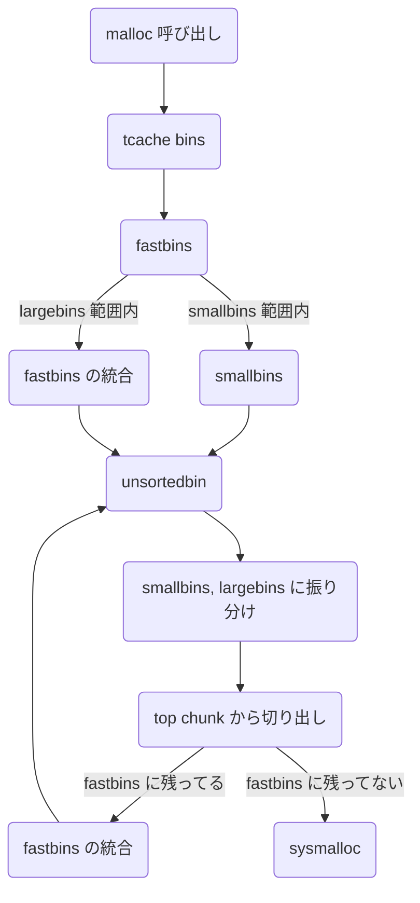
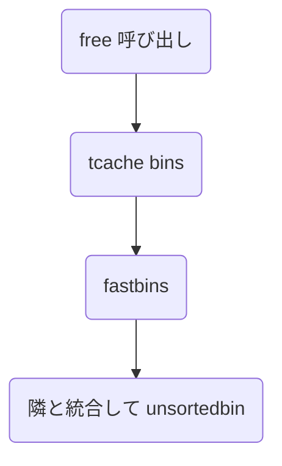

pwn というのはメモリの書き換えや読み取りなどの低レイヤーの脆弱性を用いて意図しない動作を引き起こさせる競技で最もハッキングっぽい分野です。

- [任意コード実行をして Stack Exploit を理解してみる](https://zenn.dev/anko/articles/ctf-pwn-stack-exploits)
- [ヒープ領域を弄って Heap Exploit を理解してみる](https://zenn.dev/anko/articles/ctf-heap-exploits)

今回はヒープ領域を攻撃してみたいと思います。ここでは 64bit システムを前提とします。

## malloc / free の仕組み

現代においてプログラム実行中に新しくメモリが必要になることは非常によくあります。そのシステムを実現するにはスタック領域では難しいので、ヒープ領域というメモリ領域を新たに用意してメモリの要求の度に「どこどこのメモリを使ってください」と割り当てるといった管理方法を取ります。そして glibc というライブラリにおけるヒープ領域のインターフェースというのが `malloc()` `free()` です。

```c
void *malloc(size_t size);
void free(void *ptr);
```

この `malloc()` `free()` の処理を理解するのが Heap Exploit の大事な大事な大きな一歩となります。

こういったメモリ割り当てのシステムを Allocator といって、今回は glibc の Allocator のみを解説しますが、他の Allocator (jemalloc, tcmalloc, mimalloc, libmalloc など) もほとんど同じ形なので Windows や MacOS などの攻撃にも通じます。

さて、この `malloc()` `free()` を見事に解説している伝説の動画があります。通称 malloc 動画といって pwner 誰しもが見ているので必ず見ましょう。見る前と見た後では解像度が段違いだと思います。

https://www.youtube.com/watch?v=0-vWT-t0UHg

あと glibc のソースコード malloc.c の読書もおすすめで、次の記事でまとめてみました。時間があったら是非 malloc.c を読書しましょう。

- [malloc.c を読む (malloc / free)](https://zenn.dev/anko/articles/malloc-malloc-free)
- [malloc.c を読む (bins)](https://zenn.dev/anko/articles/malloc-each-bins)
- [malloc.c を読む (arena)](https://zenn.dev/anko/articles/malloc-arena)

## おおざっぱな理解

ヒープ領域では **チャンク** (chunk) と呼ばれる構造体が大量にあり、それぞれ使われているチャンクだったり、解放されたチャンクだったりします。malloc すると解放されたチャンクの中から切り出され、そのデータ部分へのポインタが返されます。逆に free すると既に確保したチャンクに解放したことを書き込み、free list に繋げます。

具体的にはチャンクは次のような構造となっています。

- チャンクのサイズは 0x20 バイト以上で 0x10 の倍数となっている。
- 確保したデータの直前にチャンクサイズなどのメタデータが書き込まれており、データの末尾 8 バイトは次のチャンクと被っている。


| フィールド名 | 説明 |
| :-- | --- |
| `prev_size` | 一つ前のチャンクのサイズ。`PREV_INUSE` フラグが立っていないときに書き込まれている。 |
| `size` | このチャンクのサイズ。下位 3bit はフラグとして使われる。 |
| `NON_MAIN_ARENA` | チャンクを管理しているのが `main_arena` であるかどうか (ヒープ領域の管理部にアクセスする際に必要) |
| `IS_MMAPED` | メモリが mmap で確保されたか (free 時の munmap で解放するかの判断に必要) |
| `PREV_INUSE` | 前のチャンクが使用中か。使用中でなければ `prev_size` に前のチャンクサイズが書き込まれている。 |

free list とはチャンクを連結リストのことでこの free list を書き換えることで Heap Exploit します。次はこの構造と具体的な動作を解説していきましょう。

## チャンクの管理

free list の正体は bins と呼ばれるリスト群です。bins はいくつかの種類があってサイズによって管理の仕方を変えることで最適化しています。

データ構造は 2 つあり、単方向リスト (LIFO) と双方向リスト (FIFO) があります。リストの走査には forward pointer (fd) と back pointer (bk) を使い、これらの先頭ポインタと末尾ポインタは arena というヒープ領域の先頭部分に書き込まれています。それぞれの挿入 (link) や削除 (unlink) の処理は理解している前提で話を進めます。

bins の一覧は次のようになります。

| bins の種類 | サイズ | 説明 | データ構造 |
| --- | --- | --- | --- |
| tcache bins | ~0x410 | 最初に入れられる just-fit な bin | 単方向リスト |
| fastbins | ~0x80 | 頻繁に確保・解放が起こる小さなチャンクを管理する just-fit な bin | 単方向リスト |
| unsortedbin | 任意 | 最近アクセスしたチャンクを管理する bin | 双方向リスト |
| smallbins | ~0x3f0 | 小さなチャンクを管理する just-fit な bin | 双方向リスト |
| largebins | 0x400~ | 大きなチャンクを管理する bin | 双方向リスト + スキップリスト |

一般に単方向のほうが処理が高速なのでキャッシュ担当の tcache bins と fastbins は単方向リストですが双方向リストに比べて脆弱なので使用するべきところは最小限にしてあります。

そして malloc / free したときに次のような順で処理されます。


```mermaid
graph TD
    0(malloc 呼び出し) --> A
    A(tcache bins) --> B(fastbins)
    B --> |smallbins 範囲内| C(smallbins)
    B --> |largebins 範囲内| D(fastbins の統合)
    C --> E(unsortedbin)
    D --> E
    E --> F(smallbins, largebins に振り分け)
    F --> G(top chunk から切り出し)
    G --> |fastbins に残ってる| H(fastbins の統合)
    G --> |fastbins に残ってない| I(sysmalloc)
    H --> E
```


```mermaid
graph TD
    0(free 呼び出し) --> A
    A(tcache bins) --> B(fastbins)
    B --> C(隣と統合して unsortedbin)
```

最初はそこまで理解する必要はないですがどちらも最初に tcache bins を走査することは攻撃でとても頻出なので覚えておいてください。

### tcache bins

| | 説明 |
| --- | --- |
| 導入時期 | glibc v2.26 以降 |
| 構造 | 単方向リスト |
| bin の数 | チャンクサイズが 0x20 から 0x410 までの 64 種類の tcache bin |
| 役割 | 参照局所性を高める |
| 先頭 | ヒープ領域の先頭にある arena の後にある `tcache_perthread_struct` |

リストの長さは 7 個に制限されていて tcache が満杯になると他の bins に移されます。サイズごとに分けられているので just-fit で返せます。末尾の fd は NULL になります。


tcache bins の実体は `tcache_perthread_struct` 構造体です。 `entries` で各リストの HEAD のチャンクに繋げて、 `counts` でリストの長さを管理し、7 個になったら受け付けないようにします。チャンクが tcache bin に入るとデータ部分に `tcache_entry` 構造体が overlap されてリストに入ります。

```c
typedef struct tcache_entry
{
  struct tcache_entry *next;              // 次の tcache_entry へのポインタ
  struct tcache_perthread_struct *key;    // 乱数を用いて double free を検知
} tcache_entry;

typedef struct tcache_perthread_struct
{
  uint16_t counts[TCACHE_MAX_BINS];       // 各 bin の長さの一覧
  tcache_entry *entries[TCACHE_MAX_BINS]; // 各 bin の最初の tcache へのポインタの一覧
} tcache_perthread_struct;
```

### fastbins

| | 説明 |
| --- | --- |
| 導入時期 | glibc v2.3 以降 |
| 構造 | 単方向リスト |
| bin の数 | チャンクサイズが 0x20 から 0x80 まで 7 種類の fastbin |
| 役割 | 小さなチャンクのキャッシュ |
| 先頭 | `arena.fastbinsY` で管理 |

チャンクは小さいほど頻繁に確保・開放されます。そこで小さなものだけ先に処理することで高速化できます。


### unsortedbin / smallbins / largebins

これら 3 つの bins は比較的古いチャンクを取り扱います。ただキャッシュはそこまで多くないので通常のアプリにおける malloc / free ではこれらの bins を使うと考えてよいです。

|  | unsortedbin の説明 |
| --- | --- |
| 導入時期 | 古い |
| 構造 | 双方向リスト |
| bin の数 | 1 つ |
| 役割 | 参照局所性を高める |
| 先頭・末尾 | `arena.bin` で管理 |

unsortedbin は tcache や fastbins のおこぼれや fastbins を統合したチャンクを管理します。そして malloc で unsortedbin を走査したときにサイズが一致しなければ外され、小さいものは smallbins に、大きなものは largebins に繋がれます。


|  | smallbins の説明 |
| --- | --- |
| 導入時期 | 古い |
| 構造 | 双方向リスト |
| bin の数 | チャンクサイズが 0x400 未満の 62 種類の smallbin |
| 役割 | 小さなチャンクを管理する |
| 先頭・末尾 | `arena.bin` で管理 |


|  | largebins の説明 |
| --- | --- |
| 導入時期 | 古い |
| 構造 | 双方向リスト + スキップリスト |
| bin の数 | チャンクサイズが 0x400 以上の 63 種類の largebin |
| 役割 | 大きなチャンクを管理する |
| 先頭・末尾 | `arena.bin` で管理 |

大きなサイズのチャンクも 16 バイトごとに管理するのは現実的ではないので、チャンクサイズが大きくなるにつれて幅も指数的に大きくすることでリストの数を平均化し、最悪計算量を減らすことができます。

これは双方向リストのメンバに加えて fd_nextsize bk_nextsize があり、それぞれチャンクの幅の中で次に大きなチャンクと次に小さなチャンクへのポインタが格納されます。また largebins から確保されたメモリは last_remainder にはセットされません。


チャンクサイズと bins の関係などの情報について表にまとめると次のようになります。

| bins の種類 | 範囲 | 範囲 (バイト表示) | 間隔 | 個数 | `bin_at(n)` |
| --- | --- | --- | --- | :-: | --- |
| unsortedbin | 0x20 ~ | すべて | infinity | 1 | 1 |
| smallbins | 0x20 ~ 0x3F0 | 1KB 未満 | 0x10 | 62 | 2 ~ 63 |
| largebins | 0x400 ~ 0xC30 | 1KB 以上 3KB 未満 | 0x40 | 35 | 64 ~ 96 |
| largebins | 0xC40 ~ 0x29F0 | 3KB 以上 12KB 未満 | 0x200 | 15 | 97 ~ 111 |
| largebins | 0x3000 ~ 0xAFF0 | 12KB 以上 44KB 未満 | 0x1000 | 9 | 112 ~ 120 |
| largebins | 0xB000 ~ 0x27FF0 | 44KB 以上 160KB 未満 | 0x8000 | 3 | 121 ~ 123 |
| largebins | 0x28000 ~ 0xBFFF0 | 160KB 以上 768KB 未満 | 0x40000 | 2 | 124 ~ 125 |
| largebins | 0xC0000 ~  | 768KB 以上 | infinity | 1 | 126 |

### main arena

これらの bins はアリーナという機構によって管理されます。アリーナは単方向リストでスレッドごとに先頭を `main_arena` という変数に格納されています。

アリーナは `malloc_state` 構造体で定義されています。

```c
struct malloc_state
{
  __libc_lock_define (, mutex);     // arena へのアクセスを serialize する
  int flags;                        // ヒープメモリが連続であるか

  int have_fastchunks;              // fastbins が空ではないことを表す真偽値
  mfastbinptr fastbinsY[NFASTBINS]; // fastbins

  mchunkptr top;                    // ヒープ領域の最後にある未使用の大きなチャンク
  mchunkptr last_remainder;         // 分割して確保した際に余った領域の最新のチャンク

  mchunkptr bins[NBINS * 2 - 2];    // unsortedbin smallbins largebins の先頭・末尾
  unsigned int binmap[BINMAPSIZE];  // これらを素早く見つける為に使われるビットベクタ

  struct malloc_state *next;        // arena の単方向リスト
  struct malloc_state *next_free;   // 使われていない arena の単方向リスト
  INTERNAL_SIZE_T attached_threads; // arena にアクセスしているスレッドの数

  INTERNAL_SIZE_T system_mem;       // arena によって現在確保されているメモリの合計値
  INTERNAL_SIZE_T max_system_mem;   // system_mem の最大値
};
```

### malloc hooks

glibc にはいくつかの hook がありますが malloc 関連の hooks は Heap Exploit にて非常によく使われていました。

| 関数名 | 条件 |
| --- | --- |
| `__malloc_hook` | `malloc()` 呼び出し時 |
| `__free_hook` | `free()` 呼び出し時 |
| `__realloc_hook` | `realloc()` 呼び出し時 |
| `__after_morecore_hook` | `malloc()` 呼び出し時 |
| `__malloc_initialize_hook` | 初期 `malloc()` 時 |
| `__memalign_hook` | `aligned_alloc()` `memalign()` `posix_memalign()` `valloc()` 呼び出し時 |
| `_dl_open_hook` | 共有ライブラリファイルのロード時 |

しかしこれらの hooks は glibc v2.34 以降で削除されました。

## ヒープ領域での書き換え

ヒープ領域においては `fd` `bk` の書き換えが目標です。これができれば free list のリスト構造を壊すことができます。これによって malloc / free を繰り返すとそのアドレスへ書き換えが出来るようになります。

まずは単方向リストである tcache bins と fastbins において `free()` `malloc()` がシミュレーションできるようにしましょう。 LIFO なので次のようになります。

```
free A: head -> A -> tail
free B: head -> B -> A -> tail
free C: head -> C -> B -> A -> tail
free D: head -> D -> C -> B -> A -> tail
malloc: head -> C -> B -> A -> tail
malloc: head -> B -> A -> tail
malloc: head -> A -> tail
malloc: head -> tail
```

実際上 `tail` とは `NULL` のことです。

### arena の書き換え
malloc したアドレスからヒープ領域の先頭を計算できれば arena のアドレスがわかります。そこに

```
             head -> tail
write arena: head -> victim
malloc:      head
```

### Use After Free
free() が呼ばれた後でも読み書きが出来てしまう脆弱性。これが一番手っ取り早く `fd` `bk` の読み書きが出来ます。

解放されたメモリへのポインタを dangling pointer (ぶらさがったポインタ) と言います。

例えば tcache に入れたチャンクの next を書き換えて malloc することで AAW できる tcache poisoning がある。

```
free A:     head -> A -> tail
write next: head -> A -> victim
malloc:     head -> victim
malloc:     head
```

他にも unsortedbin に


tcache poisoning して `__free_hook` を書き換える。
同じ領域に悪意のあるデータ構造を確保して利用させる事で、関数ポインタを書き換える。

[SECCON Beginners CTF 2019 - Babyheap - HackMD](https://hackmd.io/@Xornet/H1hYUUR2I)

整合性チェック

| bins の種類 | バージョン | 説明 |
| --- | --- | --- |
| smallbins | | `victim.bk->fd == victim` |

`fd` `bk` を自分自身に向ける (2.27) ことでバイパス

### Heap based Buffer Overflow
Heap 上での BOF です。複数回 malloc すると参照居所性などの理由から連続に並ぶことが多いです。そうすると使われているチャンクから BOF して別のチャンクの書き換えができるようになり、変数の書き換えや `fd` `bk` の書き換えが出来ます。

### Double Free
2 回 free すると参照がループする。これにより fd に意図したアドレスを書き込めるようになる。

```
        head -> tail
free A: head -> A -> tail
free A: head -> A -> A -> A -> ...
```
```
        head -> tail
free A: head -> A -> tail
free B: head -> B -> A -> tail
free A: head -> A -> B -> A -> B -> ...
```

これに対して double-free 検知のセキュリティ機構がある。

| bins の種類 | バージョン | 説明 |
| --- | --- | --- |
| tcache bins | glibc 2.29 以降 | `key` `tcache_perthread_struct` 構造体 |
| fastbins | | 同じ領域を 2 回連続で free すると fasttop で落ちる |

tcache を攻撃するのは double-free 検知があるので少し難しい。

## ヒープ領域での攻撃方法
ヒープ領域では大量の攻撃手法が見つかっています。これらはそれぞれ独自性があるものの共通する部分が数多くあるので、その手法を細かく分ければパズルのように組み合わせることで多くの手法を理解することができます。

tcache 以外を攻撃するにはまず tcache を埋める必要があります。
tcache を埋める為には 7 個

```c
for (int i=0; i<8; i++) {
    ptrs[i] = malloc(8);
}
for (int i=0; i<7; i++) {
    free(ptrs[i]);
}
```

### Safe Linking
fastbins と tcache において `next` のポインタをマスクし、アラインメントチェックもするようにする。

```c
#define PROTECT_PTR(pos, ptr) \
  ((__typeof (ptr)) ((((size_t) pos) >> 12) ^ ((size_t) ptr)))
#define REVEAL_PTR(ptr)  PROTECT_PTR (&ptr, ptr)
```

| 条件 | 可能な処理 |
| --- | --- |
| 整合性を満たした `fd` `bk` の書き換え | `free()` で free list に偽チャンク挿入。2 回目以降は `free()` 失敗する |
| 偽チャンクの確保・書き込み | 任意アドレス書き込み |
| unsortedbin の `bk` の書き換え | unlink 時に `bk->fd = bk + 0x10` に `&main_arena.top` が書き込まれる (< 2.28) |
| unsortedbin の `fd` の読み取り | `&main_arena.bins` で libc leak |
| 次のチャンクの `PREV_INUSE` をクリア<br> `fd` `bk` `prev_size` を書き換え | `free()` の consolidation backward で unsortedbin に偽チャンク挿入 |
| `global_max_fast` の書き換え | `free()` で fastbins 以降にアドレスを書き込める |
| `main_arena` で `NON_MAIN_ARENA` を立てる | arena の位置をずらして書き込める |
| top chunk のサイズ以上の `malloc()` | top chunk が `free()` される |
| `arena_key` を書き換える (< 2.4) | |

### unsortedbin attack
unsortedbin の unlink 時に `bk->fd` に `main_arena.top` へのアドレスが書き込まれることを利用した攻撃。`bk` を `global_max_fast` に向けることで改ざんして fastbins の範囲を拡大できる。

- [Security Fest 2019 - Baby5 (Unsorted Bin) - HackMD](https://hackmd.io/@Xornet/rycqVwQpL)
- [n日1CTFチャレンジ - HackMD](https://hackmd.io/@Xornet/BkemeSAhU)

### House of XXX
House of XXX は 2001 年頃に "Vudo Malloc Tricks" や "Once Upon A free()" で紹介されたことから始まった glibc malloc への攻撃手法の総称です。

| 攻撃名 | glibc | アイデア |
| --- | --- | --- |
| [House of Prime](https://dl.packetstormsecurity.net/papers/attack/MallocMaleficarum.txt) | < 2.4 | 8 バイトチャンクを `free()` して `fastbinsY[-1] == max_fast` を書き換えて、 `fastbinsY[289] == arena_key` を書き換える |
| House of Corrosion | 2.26 < glibc < 2.30 | `global_max_fast` を書き換え<br> `stderr` を改ざんする |
| [House of Mind](https://dl.packetstormsecurity.net/papers/attack/MallocMaleficarum.txt) | < 2.11 | チャンクの `NON_MAIN_ARENA` |
| House of Orange | < 2.26 | top chunk のサイズを縮める `malloc()` を呼ぶと `sysmalloc()` で `_int_free()` が呼び出される  unsortedbin attack  `_IO_list_all` abort() すると _IO_flush_all_lockp() が呼び出される |
| [House of Einherjar](https://www.slideshare.net/codeblue_jp/cb16-matsukuma-ja-68459648) | | PREV_INUSE の書き換え unlink attack |
| House of Botcake | | チャンク A, B の back consolidation で unsortedbin (A+B) かつ tcachebins (A,B) に入っている状態を作れる |
| [House of Muney](https://maxwelldulin.com/BlogPost/House-of-Muney-Heap-Exploitation) | | |

## glibc のビルド
特定の glibc のバージョンでの攻撃を試したいときにそのバージョンの glibc とバイナリの紐付けが必要になります。

次の URL で必要なバージョンの glibc のソースをダウンロードし、ビルドすると動的ライブラリ (.so) が得られます。(こうするとデバッグ情報も付いてくるので嬉しい)

- http://ftp.gnu.org/gnu/glibc/

```shell
mkdir build; cd build
../glibc-version/congifure --prefix=/path/to/build
make
make install
```

`ldd` コマンドで実行ファイルに紐付いている動的ライブラリを教えてくれます。
`pwninit` コマンドで実行ファイルと動的ライブラリを同じ階層に入れておけば紐付けてくれます。

https://github.com/io12/pwninit

## まとめ
Heap Exploit をまとめました。

これが出来るようになれば pwn 中級者と言えそうです。

次は Linux Kernel と行きたいですがこれに関しては ptr-yudai 先生の記事を読むのがいいでしょう。

https://pawnyable.cafe/

## 参考資料
- [how2heap](https://github.com/shellphish/how2heap)
- [Overview of GLIBC heap exploitation techniques](https://0x434b.dev/overview-of-glibc-heap-exploitation-techniques/)
- [A painter and a black cat - CTF Pwn](https://raintrees.net/projects/a-painter-and-a-black-cat/wiki/CTF_Pwn)
- [ももいろテクノロジー - glibc malloc exploit techniques](https://inaz2.hatenablog.com/entry/2016/10/13/203019)
- [malloc(3)のメモリ管理構造](https://www.valinux.co.jp/technologylibrary/document/linux/malloc0001/)
- [malloc 動画の資料](https://speakerdeck.com/kosaki/mallocnolu-glibcbian)
- [heap-exploitation](https://heap-exploitation.dhavalkapil.com/)
- [Heap Exploitのこれまでと現状](https://www.ffri.jp/assets/files/monthly_research/MR201312_History%20and%20Current%20State%20of%20Heap%20Exploit_JPN.pdf)
