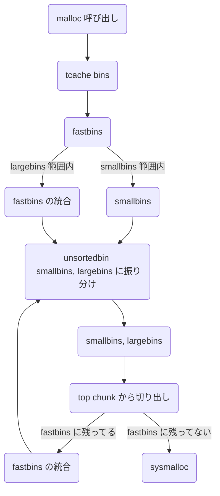

CTF において pwn とはメモリの脆弱性を用いて意図しない動作を起こすハッキングの根幹となる競技です。
今回は 64bit システムのヒープ領域を攻撃してみたいと思います。

- [任意コード実行をして Stack Exploit を理解してみる](https://zenn.dev/anko/articles/ctf-pwn-stack-exploits)
- [ヒープ領域を弄って Heap Exploit を理解してみる](https://zenn.dev/anko/articles/ctf-heap-exploits)

## malloc / free の仕組み

現代においてプログラム実行中に新しくメモリが必要になることは非常によくあります。そのシステムを実現するには予め確保するサイズを決めているスタック領域では難しいので、新たなメモリ領域を用意してメモリの要求の度に「どこどこのメモリを使ってください」と割り当てるといった管理方法を取ります。そして glibc というライブラリにおけるヒープ領域のインターフェースというのが `malloc()` `free()` です。

```c
void *malloc(size_t size);
void free(void *ptr);
```

この `malloc()` `free()` の処理を理解するのが Heap Exploit の大事な大事な大きな一歩となります。

こういったメモリ割り当てのシステムを Allocator といって、今回は glibc の Allocator のみを解説しますが、他の Allocator (jemalloc, tcmalloc, mimalloc, libmalloc など) もほとんど同じ形なので Windows や MacOS などの攻撃にも通じます。

さて、この `malloc()` `free()` を見事に解説している伝説の動画があります。通称 malloc 動画といって pwner 誰しもが見ているので必ず見ましょう。見る前と見た後では解像度が段違いだと思います。

https://www.youtube.com/watch?v=0-vWT-t0UHg

あと glibc のソースコード malloc.c の読書もおすすめで、次の記事でまとめてみました。時間があったら是非 malloc.c を読書しましょう。

- [malloc.c を読む (malloc / free)](https://zenn.dev/anko/articles/malloc-malloc-free)
- [malloc.c を読む (bins)](https://zenn.dev/anko/articles/malloc-each-bins)
- [malloc.c を読む (arena)](https://zenn.dev/anko/articles/malloc-arena)

## おおざっぱな理解

ヒープ領域では **チャンク** (chunk) と呼ばれる構造体が大量にあり、それぞれ使われているチャンクだったり、解放されたチャンクだったりします。malloc すると解放されたチャンクの中から切り出され、そのデータ部分へのポインタが返されます。逆に free すると既に確保したチャンクに解放したことを書き込み、free list に繋げます。

具体的にはチャンクは次のような構造となっています。

- チャンクのサイズは 0x20 バイト以上で 0x10 の倍数となっている。
- 確保したデータの直前にチャンクサイズなどのメタデータが書き込まれており、データの末尾 8 バイトは次のチャンクと被っている。


| フィールド名 | 説明 |
| :-- | --- |
| `prev_size` | 一つ前のチャンクのサイズ。`PREV_INUSE` フラグが立っていないときに書き込まれている。 |
| `size` | このチャンクのサイズ。下位 3bit はフラグとして使われる。 |
| `NON_MAIN_ARENA` | チャンクを管理しているのが `main_arena` であるかどうか (ヒープ領域の管理部にアクセスする際に必要) |
| `IS_MMAPED` | メモリが mmap で確保されたか (free 時の munmap で解放するかの判断に必要) |
| `PREV_INUSE` | 前のチャンクが使用中か。使用中でなければ `prev_size` に前のチャンクサイズが書き込まれている。 |

free list とはチャンクを連結リストのことでこの free list を書き換えることで Heap Exploit します。次はこの構造と具体的な動作を解説していきましょう。

## チャンクの管理

free list の正体は bins と呼ばれるリスト群です。bins はいくつかの種類があってサイズによって管理の仕方を変えることで最適化しています。

データ構造は 2 つあり、単方向リスト (LIFO) と双方向リスト (FIFO) があります。リストの走査には forward pointer (fd) と back pointer (bk) を使い、これらの先頭ポインタと末尾ポインタは arena というヒープ領域の先頭部分に書き込まれています。それぞれの挿入 (link) や削除 (unlink) の処理は理解している前提で話を進めます。

bins の一覧は次のようになります。

| bins の種類 | サイズ | 説明 | データ構造 |
| --- | --- | --- | --- |
| tcache bins | ~0x410 | 最初に入れられる just-fit な bin | 単方向リスト |
| fastbins | ~0x80 | 頻繁に確保・解放が起こる小さなチャンクを管理する just-fit な bin | 単方向リスト |
| unsortedbin | 任意 | 最近アクセスしたチャンクを管理する bin | 双方向リスト |
| smallbins | ~0x3f0 | 小さなチャンクを管理する just-fit な bin | 双方向リスト |
| largebins | 0x400~ | 大きなチャンクを管理する bin | 双方向リスト + スキップリスト |

一般に単方向のほうが処理が高速なのでキャッシュ担当の tcache bins と fastbins は単方向リストですが双方向リストに比べて脆弱なので使用するべきところは最小限にしてあります。

そして `malloc()` `free()` したときに次のような順で処理されます。




最初はそこまで理解する必要はないですがどちらも最初に tcache bins を走査することは攻撃でとても頻出なので覚えておいてください。

### tcache bins

| | 説明 |
| --- | --- |
| 導入時期 | glibc v2.26 以降 |
| 構造 | 単方向リスト |
| 管理場所 | ヒープ領域の先頭近くの `tcache_perthread_struct` |
| bin の数 | チャンクサイズが 0x20 から 0x410 までの 64 種類の tcache bin |
| 役割 | 参照局所性を高める |

リストの長さは 7 個に制限されていて tcache が満杯になると他の bins に挿入されます。サイズごとに分けられているので just-fit で返せます。


tcache bins の実体は `tcache_perthread_struct` 構造体です。 `entries` で各リストの HEAD のチャンクに繋げて、 `counts` でリストの長さを管理し、7 個になったら受け付けないようにします。チャンクが tcache bin に入るとデータ部分に `tcache_entry` 構造体が overlap されてリストに入ります。

```c
typedef struct tcache_entry
{
  struct tcache_entry *next;              // 次の tcache_entry へのポインタ
  struct tcache_perthread_struct *key;    // 乱数を用いて double free を検知
} tcache_entry;

typedef struct tcache_perthread_struct
{
  uint16_t counts[TCACHE_MAX_BINS];       // 各 bin の長さの一覧
  tcache_entry *entries[TCACHE_MAX_BINS]; // 各 bin の最初の tcache へのポインタの一覧
} tcache_perthread_struct;
```

ここでは `next` ではなく他に合わせて `bk` と呼ぶことにします。

### fastbins

| | 説明 |
| --- | --- |
| 導入時期 | glibc v2.3 以降 |
| 構造 | 単方向リスト |
| 管理場所 | `arena.fastbinsY` |
| bin の数 | チャンクサイズが 0x20 から 0x80 まで 7 種類の fastbin |
| 役割 | 小さなチャンクのキャッシュ |

チャンクは小さいほど頻繁に確保・開放されます。そこで小さなものだけ先に処理することで高速化できます。

fastbins が管理する最大チャンクサイズは `global_max_fast` 変数で決められている。
これを増やすことで `free()` して `arena` の他の領域まで書き込むことができるようになる。


### unsortedbin

|  | unsortedbin の説明 |
| --- | --- |
| 導入時期 | 古い |
| 構造 | 双方向リスト |
| 管理場所 | `arena.bin` |
| bin の数 | 1 つ |
| 役割 | 参照局所性を高める最後のキャッシュ |

キャッシュの要である tcache bins や fastbins の役目が終わり、最後のキャッシュ unsortedbin が管理します。ここにチャンクが入ってから `malloc()` が呼ばれて unsortedbin を走査しても見つけられなかったとき、unsortedbin から外されてサイズに応じて smallbins と largebins に振り分けられます。glibc v2.28 以前ではこのとき `bk->fd` に `&main_arena.top` が書き込まれます。これを用いて `bk` を書き換えて行う攻撃を unsortedbin attack といいます。


### smallbins

|  | smallbins の説明 |
| --- | --- |
| 導入時期 | 古い |
| 構造 | 双方向リスト |
| 管理場所 | `arena.bin` |
| bin の数 | チャンクサイズが 0x400 未満の 62 種類の smallbin |
| 役割 | 小さなチャンクを管理する |


### largebins

|  | largebins の説明 |
| --- | --- |
| 導入時期 | 古い |
| 構造 | 双方向リスト + スキップリスト |
| 管理場所 | `arena.bin` |
| bin の数 | チャンクサイズが 0x400 以上の 63 種類の largebin |
| 役割 | 大きなチャンクを管理する |

大きなサイズのチャンクも 16 バイトごとに管理するのは現実的ではないので、チャンクサイズが大きくなるにつれて幅も指数的に大きくすることでリストの数を平均化し、最悪計算量を減らすことができます。

これは双方向リストのメンバに加えて fd_nextsize bk_nextsize があり、それぞれチャンクの幅の中で次に大きなチャンクと次に小さなチャンクへのポインタが格納されます。また largebins から確保されたメモリは last_remainder にはセットされません。


チャンクサイズと bins の関係などの情報について表にまとめると次のようになります。

| bins の種類 | 範囲 | 範囲 (バイト表示) | 間隔 | 個数 | `bin_at(n)` |
| --- | --- | --- | --- | :-: | --- |
| unsortedbin | 0x20 ~ | すべて | infinity | 1 | 1 |
| smallbins | 0x20 ~ 0x3F0 | 1KB 未満 | 0x10 | 62 | 2 ~ 63 |
| largebins | 0x400 ~ 0xC30 | 1KB 以上 3KB 未満 | 0x40 | 35 | 64 ~ 96 |
| largebins | 0xC40 ~ 0x29F0 | 3KB 以上 12KB 未満 | 0x200 | 15 | 97 ~ 111 |
| largebins | 0x3000 ~ 0xAFF0 | 12KB 以上 44KB 未満 | 0x1000 | 9 | 112 ~ 120 |
| largebins | 0xB000 ~ 0x27FF0 | 44KB 以上 160KB 未満 | 0x8000 | 3 | 121 ~ 123 |
| largebins | 0x28000 ~ 0xBFFF0 | 160KB 以上 768KB 未満 | 0x40000 | 2 | 124 ~ 125 |
| largebins | 0xC0000 ~  | 768KB 以上 | infinity | 1 | 126 |

### アリーナ

これらの bins はアリーナ (arena) という機構によって管理されています。

アリーナはスレッドごとにあり単方向リストとなっています。通常はヒープ領域の先頭に割り当てられていますが、先頭だけは例外で glibc 中の `main_arena` 変数に格納されています。これより `main_arena` のアドレスがわかると libc leak できます。そしてここでチャンクにある `NON_MAIN_ARENA` の意味は管理領域のアクセスの方法を切り替えるフラグであることがわかります。これを用いて `main_arena` にあるチャンクの `NON_MAIN_ARENA` フラグを立てるとアリーナの位置をズラした場所に誤認させることもできます。

```c:arena
struct malloc_state
{
  __libc_lock_define (, mutex);     // arena へのアクセスを serialize する
  int flags;                        // ヒープメモリが連続であるか

  int have_fastchunks;              // fastbins が空ではないことを表す真偽値
  mfastbinptr fastbinsY[NFASTBINS]; // fastbins

  mchunkptr top;                    // ヒープ領域の最後にある未使用の大きなチャンク
  mchunkptr last_remainder;         // 分割して確保した際に余った領域の最新のチャンク

  mchunkptr bins[NBINS * 2 - 2];    // unsortedbin smallbins largebins の先頭・末尾
  unsigned int binmap[BINMAPSIZE];  // これらを素早く見つける為に使われるビットベクタ

  struct malloc_state *next;        // arena の単方向リスト
  struct malloc_state *next_free;   // 使われていない arena の単方向リスト
  INTERNAL_SIZE_T attached_threads; // arena にアクセスしているスレッドの数

  INTERNAL_SIZE_T system_mem;       // arena によって現在確保されているメモリの合計値
  INTERNAL_SIZE_T max_system_mem;   // system_mem の最大値
};
```

例えば unsortedbin, smallbins, largebins の最初のチャンクの `fd` には `&main_arena.bins` が書き込まれてあり、 libc leak できます。


### チャンクの埋め方

ここまでは管理方法についてまとめましたが具体的にどうすればいいかあまり分かっていません。チャンクをそれぞれの bins にどうやって入れるかについて今までの知識を活用して考えてみましょう。

まず tcache bins については `malloc()` `free()` どちらも始めに処理するものなのでチャンクサイズが範囲内であれば `free()` するだけでチャンクが tcache bins に入ります。
```c
size_t *tcache = malloc(0x80);
free(tcache); // tcache bins にチャンクが入る
```
次に fastbins について。 tcache bins を埋めなければ入ってくれません。なのでまず tcache bins の最大数 7 個を埋める必要があります。また fastbins では隣に解放されたチャンクがあると統合 (consolidate) してしまう。そこで隣と consolidate しないように `malloc()` したチャンクを周りにおいてから `free()` する。
```c
// まず tcache bins の 7 個を埋める。
size_t *ptrs[7];
for (int i = 0; i < 7; i++)
    ptrs[i] = malloc(8);
malloc(8);     // tcache bins のチャンクと consolidate しないようにクッションを挟む
size_t *fastbin = malloc(8);
malloc(8);     // top chunk と consolidate しないようにクッションを挟む
for (int i = 0; i < 7; i++)
    free(ptrs[i]);
free(fastbin); // fastbins にチャンクが入る
```
unsortedbin については 0x420 以上なら `free()` するだけ、それより小さいなら tcache bins を埋めてから `free()` すれば入ります。
```c
// 0x420 以上
size_t *unsortedbin = malloc(0x420);
free(unsortedbin);

// 0x420 未満
size_t *ptrs[7];
for (int i = 0; i < 7; i++)
    ptrs[i] = malloc(0x90);
size_t *unsortedbin = malloc(0x90);
for (int i = 0; i < 7; i++)
    free(ptrs[i]);
free(unsortedbin)
```
smallbins については unsortedbin に入れてから異なるサイズで `malloc()` して振り分けてもらう必要があります。つまり tcache bins を埋めてから `free()` して異なるサイズを `malloc()` すればよいです。
```c
// まず tcache bins を埋める
size_t *ptrs[7];
for (int i = 0; i < 7; i++)
    ptrs[i] = malloc(0x90);
size_t *smallbin = malloc(0x90);
for (int i = 0; i < 7; i++)
    free(ptrs[i]);
free(smallbin); // unsortedbin にチャンクが入る
malloc(0xa0);   // smallbins に振り分けられる
```
largebins については 0x420 以上を挿入して異なるサイズを `malloc()` する。
```c
size_t *largebin = malloc(0x418);
malloc(0x18);   // top chunk と consolidate しないようにクッションを挟む
free(largebin); // unsortedbin にチャンクが入る
malloc(0x428);  // largebins に振り分けられる
```

## ヒープ領域での書き換え

ヒープ領域においては `fd` `bk` の書き換えが目標です。これができれば free list のリスト構造を壊すことができます。これによって malloc / free を繰り返すとそのアドレスへ書き換えが出来るようになります。

また LIFO の単方向リストで `malloc()` `free()` して link / unlink の挙動を確認する。

```
free A: head -> A -> tail
free B: head -> B -> A -> tail
free C: head -> C -> B -> A -> tail
free D: head -> D -> C -> B -> A -> tail
malloc: head -> C -> B -> A -> tail
malloc: head -> B -> A -> tail
malloc: head -> A -> tail
malloc: head -> tail
```

末尾の `bk` である `tail` は `NULL` になります。

### 管理領域の直接的な書き換え
malloc したアドレスからヒープ領域の先頭を計算できれば arena などの管理領域のアドレスがわかります。そこを書き換えられるならば AAW ができます。

```
             head -> tail
write arena: head -> victim
malloc:      head
```

これによって AAW ができれば例えば `__free_hook` などの関数ポインタを書き換えて `free()` することで ACE ができます。さらに他の AAW の方法でも `__free_hook` を使えましたが、glibc v2.34 以降ではこれが使えなくなりました。

### Use After Free
Use After Free (UAF) とは `free()` が呼ばれた後に読み書きが出来る状態のこと。これが一番手っ取り早く `fd` `bk` の読み書きが出来ます。
解放されたメモリへのポインタをダングリングポインタ (dangling pointer) と言います。

例えば tcache に入れたチャンクの `bk` を書き換えて malloc することで AAW できます。これを tcache poisoning といいます。

```
free A:   head -> A -> tail
write bk: head -> A -> victim
malloc:   head -> victim
malloc:   head
```

整合性チェック

| bins の種類 | バージョン | 説明 |
| --- | --- | --- |
| tcache bins | | safe-linking により `bk` をマスクし、アラインメントチェックする |
| fastbins | | safe-linking により `bk` をマスクし、アラインメントチェックする |
| smallbins | | `free()` 時に `victim.bk->fd == victim` |
| largebins | glibc v2.30 | `free()` 時に `victim.bk->fd == victim` `victim->bk_nextsize->fd_nextsize == victim` |

```c
#define PROTECT_PTR(pos, ptr) \
  ((__typeof (ptr)) ((((size_t) pos) >> 12) ^ ((size_t) ptr)))
#define REVEAL_PTR(ptr)  PROTECT_PTR (&ptr, ptr)
```

`fd` `bk` を自分自身に向ける (2.27) ことでバイパス


### Heap based Buffer Overflow
Heap 上での BOF です。複数回 malloc すると参照居所性などの理由から連続に並ぶことが多いです。そうすると使われているチャンクから BOF して別のチャンクの書き換えができるようになり、変数の書き換えや `fd` `bk` の書き換えが出来ます。

### Double Free
実は同じチャンクを 2 回 free すると参照がループします。

```
        head -> tail
free A: head -> A -> tail
free A: head -> A -> A -> A -> ...
```
```
        head -> tail
free A: head -> A -> tail
free B: head -> B -> A -> tail
free A: head -> A -> B -> A -> B -> ...
```

これにより `bk` に意図したアドレスを書き込めるようになります。
これに対して double-free 検知のセキュリティ機構があります。

| bins の種類 | バージョン | 説明 |
| --- | --- | --- |
| tcache bins | glibc v2.29 以降 | `free()` 時に `key` がランダムな値かチェックして `key` へランダムな値が書き込む |
| fastbins | | 同じチャンクを 2 回連続で `free()` すると fasttop で落ちる |

### malloc hooks

glibc にはいくつかの hook がありますが malloc 関連の hooks は Heap Exploit にて非常によく使われていました。

| 関数名 | 条件 |
| --- | --- |
| `__malloc_hook` | `malloc()` 呼び出し時 |
| `__free_hook` | `free()` 呼び出し時 |
| `__realloc_hook` | `realloc()` 呼び出し時 |
| `__after_morecore_hook` | `malloc()` 呼び出し時 |
| `__malloc_initialize_hook` | 初期 `malloc()` 時 |
| `__memalign_hook` | `aligned_alloc()` `memalign()` `posix_memalign()` `valloc()` 呼び出し時 |
| `_dl_open_hook` | 共有ライブラリファイルのロード時 |

しかしこれらの hooks は glibc v2.34 以降で削除されました。


## ヒープ領域での攻撃方法
ヒープ領域では大量の攻撃手法が見つかっています。これらはそれぞれ独自性があるものの共通する部分が数多くあるので、その手法を細かく分ければパズルのように組み合わせることで多くの手法を理解することができます。

| 条件 | 可能な処理 |
| --- | --- |
| 整合性を満たした `fd` `bk` の書き換え | `free()` で free list に偽チャンク挿入。2 回目以降は `free()` 失敗する |
| 偽チャンクの確保・書き込み | 任意アドレス書き込み |
| 次のチャンクの `PREV_INUSE` をクリア<br> `fd` `bk` `prev_size` を書き換え | `free()` の consolidation backward で unsortedbin に偽チャンク挿入 |
| top chunk のサイズ以上の `malloc()` | top chunk が `free()` される |

House of XXX は 2001 年頃に "Vudo Malloc Tricks" や "Once Upon A free()" で紹介されたことから始まった glibc malloc への攻撃手法の総称です。

| 攻撃名 | glibc | アイデア |
| --- | --- | --- |
| [House of Prime](https://dl.packetstormsecurity.net/papers/attack/MallocMaleficarum.txt) | < 2.4 | 8 バイトチャンクを `free()` して `fastbinsY[-1] == max_fast` を書き換えて、 `fastbinsY[289] == arena_key` を書き換える |
| House of Corrosion | 2.26 < glibc < 2.30 | `global_max_fast` を書き換え<br> `stderr` を改ざんする |
| [House of Mind](https://dl.packetstormsecurity.net/papers/attack/MallocMaleficarum.txt) | < 2.11 | チャンクの `NON_MAIN_ARENA` |
| House of Orange | < 2.26 | top chunk のサイズを縮める `malloc()` を呼ぶと `sysmalloc()` で `_int_free()` が呼び出される  unsortedbin attack  `_IO_list_all` abort() すると _IO_flush_all_lockp() が呼び出される |
| [House of Einherjar](https://www.slideshare.net/codeblue_jp/cb16-matsukuma-ja-68459648) | | PREV_INUSE の書き換え unlink attack |
| House of Botcake | | チャンク A, B の back consolidation で unsortedbin (A+B) かつ tcachebins (A,B) に入っている状態を作れる |
| [House of Muney](https://maxwelldulin.com/BlogPost/House-of-Muney-Heap-Exploitation) | | |


## glibc のビルド
特定の glibc のバージョンでの攻撃を試したいときにそのバージョンの glibc とバイナリの紐付けが必要になります。

次の URL で必要なバージョンの glibc のソースをダウンロードし、ビルドすると動的ライブラリ (.so) が得られます。(こうするとデバッグ情報も付いてくるので嬉しい)

- http://ftp.gnu.org/gnu/glibc/

```shell
mkdir build; cd build
../glibc-version/congifure --prefix=/path/to/build
make
make install
```

`ldd` コマンドで実行ファイルに紐付いている動的ライブラリを教えてくれます。
`pwninit` コマンドで実行ファイルと動的ライブラリを同じ階層に入れておけば紐付けてくれます。

https://github.com/io12/pwninit

## まとめ
Heap Exploit をまとめました。

これが出来るようになれば pwn 中級者と言えそうです。

次は Linux Kernel と行きたいですがこれに関しては ptr-yudai 先生の記事を読むのがいいでしょう。

https://pawnyable.cafe/

## 参考資料
- [how2heap](https://github.com/shellphish/how2heap)
- [Overview of GLIBC heap exploitation techniques](https://0x434b.dev/overview-of-glibc-heap-exploitation-techniques/)
- [A painter and a black cat - CTF Pwn](https://raintrees.net/projects/a-painter-and-a-black-cat/wiki/CTF_Pwn)
- [ももいろテクノロジー - glibc malloc exploit techniques](https://inaz2.hatenablog.com/entry/2016/10/13/203019)
- [malloc(3)のメモリ管理構造](https://www.valinux.co.jp/technologylibrary/document/linux/malloc0001/)
- [malloc 動画の資料](https://speakerdeck.com/kosaki/mallocnolu-glibcbian)
- [heap-exploitation](https://heap-exploitation.dhavalkapil.com/)
- [Heap Exploitのこれまでと現状](https://www.ffri.jp/assets/files/monthly_research/MR201312_History%20and%20Current%20State%20of%20Heap%20Exploit_JPN.pdf)
- [n日1CTFチャレンジ - HackMD](https://hackmd.io/@Xornet/BkemeSAhU)
