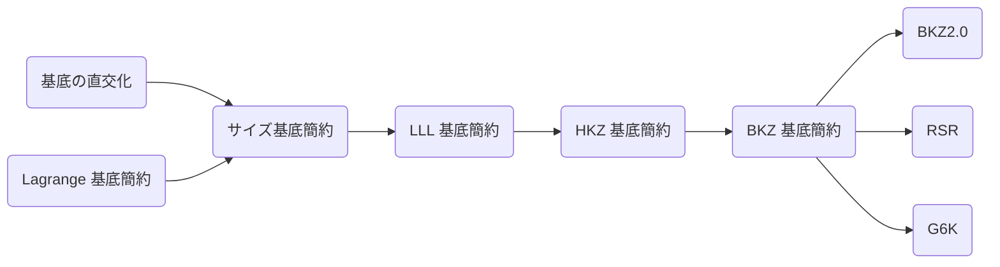

## 格子とは
格子というのは基底を足し引きすることで現れる空間上に等間隔で並ぶ点の集合です。


図では点をすべて集めたものを格子、同じ色の矢印が基底です。

例えば緑色の基底に注目してみましょう。

これを 2 倍、3 倍 ... また負の方向にも -1 倍、-2 倍と進めるとこのようになります。


この十字は基底の一方を足し引きすることで作られました。そしてこの縦と横の矢印を足し合わせることですべての点を表現することができます。

試してみるとこれは赤い基底では同じ格子が作られますが、青い基底では 1 つ飛ばしの格子が作られます。

なぜでしょうか。

これは基底を変換することでわかります。このときのルールは毎回片方だけしか変更しないことです。

それでは青色の基底を変換してみましょう。

まず基底 1 に基底 2 を足すと矢印 3 になります。これを新たな基底 1 とします。
次に基底 2 を -1 倍すると矢印 4 になります。これを新たな基底 2 とします。


これで作られた新しい基底とさっきの緑色の基底とを比べてみてください。一方の基底が 2 倍の長さになっているので 1 つ飛ばしの格子になります。

赤い基底の方も変換してみましょう。

1 から 2 を引いて 3 になります。
2 から 3 の 4 倍を引いて 4 になります。
3 に 4 を足して 5 になります。

すると緑色の基底と同じ格子を貼ることがわかります。


このように分かりにくかった基底を分かりやすい基底に変換する操作のことを基底簡約と言います。

基底簡約することである点から最も近い距離の点を見つけ出すことが出来そうです。

とここまで矢印遊びをしてきましたが本質はもう語り尽くしました。これが格子の全てです。

### 格子の問題

これを数学的に表現すると次のように書けます。
> **Def. 格子**
>  $n$ 個の線形独立なベクトル $\bm{b}_1,\ldots,\bm{b}_n\in\mathbb{R}^m$ について整数係数の線形結合によって生成されるベクトルの集合を格子 $\mathcal{L}$ と定義します。
>
> $$
\mathcal{L}(\bm{b}_1,\ldots, \bm{b}_n) := \left\lbrace\sum_{i=1}^{n} a_i\bm{b}_i\in\mathbb{R}^m\ \middle|\ a_i \in \mathbb{Z} \right\rbrace
$$

先程の格子の基底の変換を基本変形と言います。

> **Prop.**
> 格子基底の基本変形に対し、格子は不変である。

ここで原点から最短のベクトルを見つける問題を考えます。

> **SVP; Shortest Vector Problem**
> 格子上の非零なベクトルの中で最もノルムが小さなベクトルを見つけ出す問題を SVP という。そのベクトルを $\bm{v}$ とおくと次のように表せられる。
>
> $$
\bm{v} = v_1\bm{b}_1 + \cdots + v_n\bm{b}_n \qquad (v_1, \ldots , v_n \in \mathbb{Z}) \\
$$

素朴に考えると最短ベクトルを見つける為には色んな係数を試して探索すれば良さそうです。しかしこの方法だとベクトルの数に対して指数的に探索空間が広がるので計算時間も指数時間掛かります。そしてこの問題は NP 困難と知られていて、これをオーダーレベルで改善する方法は今のところ見つかっていません。

この SVP が暗号で使われる全ての格子問題の基礎となります。

ただ探索する順番を効率化したり、最短ではないが最短に近いベクトルを見つける問題 (μSVP) を解くことはできます。それを担うのが基底簡約アルゴリズムです。一応断っておきますが基底簡約アルゴリズムでは SVP は解けません (解けたら NP 困難ではない)。

## 基底簡約アルゴリズム

先程のように基底簡約するアルゴリズムはどのように組めば良いのでしょうか。

まず基底簡約で目指す基底を次のように定義します。

- それぞれの基底ベクトルが直交に近い状態
- 基底ベクトルの長さが短い

これを実現するアルゴリズムとして以下のようなものがあります。



今回は LLL 基底簡約アルゴリズムまでを扱います。それ以降のアルゴリズムは紹介しませんが、SageMath で使いはするので理解したければ参考文献を参考にしてください。

### 1 次元の格子 (ユークリッドの互除法)

2 つの整数を足し引きして最小となる値を求める。これは最大公約数を計算するのと同じで中学校でやったようにユークリッドの互除法を使うことで求められます。

例えば 390 と 273 についてユークリッドの互除法を考えると

$$
\begin{aligned}
  390 & = 273 \times 1 + 117 \\
  273 & = 117 \times 2 + 39 \\
  117 & = 39 \times 3
\end{aligned}
$$

ということから並べると 39 ずつ飛んだ点列となります。

### 2 次元の格子 (Lagrange 基底簡約)

ユークリッドの互除法を 2 次元格子に対して行ってみましょう。

> **Lagrange 基底簡約 (Gaussian Reduction)**
> $\|\bm{v}_1\| < \|\bm{v}_2\|$ となるように交換して
>
> $$
  \bm{v}_2 \to \bm{v}_2 - \left\lfloor\frac{\bm{v}_1\cdot \bm{v}_2}{\|\bm{v}_1\|^2}\right\rceil\bm{v}_1
$$
>
> を繰り返し $m = 0$ となるとき $\bm{v}_1$, $\bm{v}_2$ は最も簡約された基底となる。

> **Theorem**
> Lagrange 簡約された基底は最も短い基底である。

**Proof.**
任意の非零ベクトル $\mathbf{v} = x _ 1\mathbf{b} _ 1 + x _ 2\mathbf{b} _ 2 \in L$ について $x _ 2 = 0$ のとき $\|\mathbf{v}\| = |x _ 1|\|\mathbf{b} _ 1\| \geq \|\mathbf{b} _ 1\|$, $x _ 2 \neq 0$ のとき $\|\mathbf{v}\| \geq \|\mathbf{b} _ 2\| \geq \|\mathbf{b} _ 1\|$ を示す.

$$
\begin{aligned}
\|\mathbf{v}\| &= \|x _ 1\mathbf{b} _ 1 + x _ 2\mathbf{b} _ 2\| \\
&= \|r\mathbf{b} _ 1 + x _ 2(\mathbf{b} _ 2 + q\mathbf{b} _ 1)\| \\
&\geq x _ 2\|\mathbf{b} _ 2 + q\mathbf{b} _ 1\| - r\|\mathbf{b} _ 1\| \\
&= (x _ 2 - r)\|\mathbf{b} _ 2 + q\mathbf{b} _ 1\| + r(\|\mathbf{b} _ 2 + q\mathbf{b} _ 1\| - \|\mathbf{b} _ 1\|) \\
&\geq \|\mathbf{b} _ 2 + q\mathbf{b} _ 1\| \\
&\geq \|\mathbf{b} _ 2\| \geq \|\mathbf{b} _ 1\|
\end{aligned}
$$

これより 2 次元の格子も基底簡約が完了します。しかし 3 次元以上の格子では同様の方法で簡約しても最も短い基底とはならずに NP 困難な問題となります。この問題に立ち向かう為にはまず基底の直交性を高めることが必要です。

```python
def gaussian_reduction(v1, v2):
    while True:
        if v2.norm() < v1.norm():
            v1, v2 = v2, v1
        m = floor(v1.dot_product(v2) / v1.dot_product(v1))
        if m == 0:
            break
        v2 = v2 - m*v1
    return v1, v2


v1 = vector([846835985, 9834798552])
v2 = vector([87502093, 123094980])
```

### グラム・シュミット直交化

グラム・シュミット直交化 (GSO; Gram-Schmidt Orthonormalization) とはユークリッド空間で基底を直交基底に変換する方法です。図形的には $\bm{b}_n$ の直交化は $\bm{b}_{1}$ から $\bm{b}_{n-1}$ までのベクトルすべてと直交するように元の高さのまま移動させます。 GSO の Wikipedia の gif がわかりやすいです。

$$
\bm{B} = \begin{pmatrix}
  \bm{b}_1 \\
  \vdots \\
  \bm{b}_n \\
\end{pmatrix} = \begin{pmatrix}
  b_{11} & \cdots & b_{1m} \\
  \vdots & \ddots & \vdots \\
  b_{n1} & \cdots & b_{nm} \\
\end{pmatrix}
$$

> **Def. GSO ベクトル**
> $n$ 次元格子 $L\subseteq \mathbb{R}^m$ の順序付き基底 $\{\bm{b}_{1},\ldots, \bm{b}_{n}\}$ に対する GSO ベクトル $\bm{b}_{1}^* ,\ldots, \bm{b}_{n}^ *\in\mathbb{R}^m$ を GSO 係数 $\mu_{i,j}$ を用いて次のように定義する。
>
> $$
\begin{aligned}
&\begin{dcases}
\bm{b}_1^* := \bm{b}_1 \\
\bm{b}_i^* := \bm{b}_i - \sum_{j=1}^{i-1} \mu_{ij} \bm{b}_j^* & (2\leq i\leq n) \\
\end{dcases} \\
&\quad \mu_{ij} := \frac{\langle \bm{b}_i, \bm{b}_j^* \rangle}{\| \bm{b}_j^*\|^2} \qquad (1\leq j<i\leq n)
\end{aligned}
$$

行列で書くと次のようになる。

$$
\begin{aligned}
\begin{pmatrix}
\bm{b}_1 \\
\vdots \\
\bm{b}_n \\
\end{pmatrix}
& =
\begin{pmatrix}
1 & 0 & 0 & & 0 \\
\mu_{21} & 1 & 0 & \cdots & 0 \\
\mu_{31} & \mu_{32} & 1 & & 0 \\
& \vdots & & \ddots & \vdots \\
\mu_{n1} & \mu_{n2} & \mu_{n3} & \cdots & 1 \\
\end{pmatrix}
\begin{pmatrix}
\bm{b}_1^ * \\
\vdots \\
\bm{b}_n^ * \\
\end{pmatrix} \\
\\
\bm{B} & = \bm{U}\bm{B}^*
\end{aligned}
$$

この $\bm{B}$、$\bm{B}^*$、$\bm{U}$ をそれぞれ **基底行列**、**GSO ベクトル行列**、**GSO 係数行列** と呼ぶことにします。

> **Prop. GSO ベクトルの基本性質**
> 1. 任意の $1\leq i<j\leq n$ に対して $\langle\bm{b}_i^*, \bm{b}_j^*\rangle = 0$ が成り立つ。
> 2. 任意の $1\leq i\leq n$ に対して $\|\bm{b}_i^*\|\leq\|\bm{b}_i\|$ が成り立つ。
> 3. 任意の $1\leq i\leq n$ に対して $\langle\bm{b}_1^* ,\ldots,\bm{b}_i^*\rangle_{\mathbb{R}} = \langle\bm{b}_1,\ldots,\bm{b}_i\rangle_{\mathbb{R}}$ が成り立つ。
> 4. $\mathrm{vol}(L) = \prod_{i=1}^n\|\bm{b}_i^*\|$ が成り立つ。

**Proof.**
まず 1 について $j = 1$ のとき証明せずとも成り立つ。$1\leq j\leq k$ のとき $\langle\bm{b}_i^*, \bm{b}_j^*\rangle = 0$ が成り立つと仮定して、$j = k+1$ のとき

$$
\begin{aligned}
  \langle\bm{b}_i^*,\bm{b}_{k+1}^*\rangle &
  = \left\langle\bm{b}_i^*,\bm{b}_{k+1} - \sum_{n=1}^k\mu_{k+1 n}\bm{b}_{n}^*\right\rangle \\
  & = \langle\bm{b}_i^*,\bm{b}_{k+1}\rangle-\mu_{
  k+1 i}\|\bm{b}_i^*\|^2\\
  & = 0
\end{aligned}
$$

が成り立つ。よって数学的帰納法より成り立つ。
2 に関しては定義式にノルムを取ることで分かる。

$$
\begin{aligned}
  \|\bm{b} _ 1^*\|^2 & = \|\bm{b}_1\|^2 \\
  \|\bm{b}_ i\|^2 & = \|\bm{b} _ i^ * \|^2 + \sum_{j=1}^{i-1}\mu _ {i,j}^2\|\bm{b}_j^ * \|^2\geq\|\bm{b} _ i^ * \|^2
\end{aligned}
$$

3 についてはまず $\langle\bm{b}_1,\ldots,\bm{b}_i\rangle_{\mathbb{R}}\subseteq\langle\bm{b}_1^*,\ldots,\bm{b}_i^*\rangle_{\mathbb{R}}$ について $i = 1$ は成り立ち、$1\leq i\leq k$ について成り立つとして以下より数学的帰納法から成り立つ。

$$
\bm{b}_k = \bm{b}_k^* + \sum_{j=1}^{k-1} \mu_{kj}\bm{b}_j^* \in\langle\bm{b}_1^*,\ldots,\bm{b}_i^*\rangle_{\mathbb{R}}
$$

同様に $\langle\bm{b}_1,\ldots,\bm{b}_i\rangle_{\mathbb{R}}\supseteq\langle\bm{b}_1^*,\ldots,\bm{b}_i^*\rangle_{\mathbb{R}}$ も数学的帰納法より成り立つ。

$$
\bm{b}_k^* = \bm{b}_k - \sum_{j=1}^{k-1} \mu_{kj}\bm{b}_j^* \in\langle\bm{b}_1,\ldots,\bm{b}_i\rangle_{\mathbb{R}}
$$

よって $\langle\bm{b}_1^*,\ldots,\bm{b}_i^*\rangle_{\mathbb{R}}=\langle\bm{b}_1,\ldots,\bm{b}_i\rangle_{\mathbb{R}}$ となる。

4 については $\bm{B}=\bm{U}\bm{B}^*$ と $\det(\bm{U}) = 1$、GSO ベクトルの直交性より

$$
\begin{aligned}
\mathrm{vol}(\mathcal{L})^2 &= \det(\bm{B}\bm{B}^\top) \\
& = \det(\bm{U}\bm{B}^*(\bm{B}^*)^\top \bm{U}^\top) \\
& = \det(\bm{B}^*(\bm{B}^*)^\top) \\
& = \prod_{i=1}^n\|\bm{b}_i^*\|^2
\end{aligned}
$$

$\Box$

> **Def. 射影格子**
> $n$ 次元格子 $L\subseteq\mathbb{R}^m$ の基底 $\lbrace\bm{b}_1,\ldots, \bm{b}_n\rbrace$ に対し, 各 $1\leq l\leq n$ に対して $\langle\bm{b}_1,\ldots, \bm{b}_{l-1}\rangle_\mathbb{R}$ の直交補空間への直交射影を $\pi_l:\mathbb{R}^m\to\langle\bm{b}_1,\ldots, \bm{b}_{l-1}\rangle_\mathbb{R}^\bot$ とする。 定理 2 の 1,3 より
>
> $$
\begin{aligned}
\langle\bm{b}_1, \ldots, \bm{b}_{l-1}\rangle_\mathbb{R}^\bot &= \langle\bm{b}_1^*, \ldots, \bm{b}_{l-1}^* \rangle_\mathbb{R}^\bot = \langle\bm{b}_l^*, \ldots, \bm{b}_n^* \rangle_\mathbb{R} \\
\pi_l(\bm{b}_i) &= \sum_{j=l}^i \mu_{i,j}\bm{b}_j^* \\
\end{aligned}
$$
>
> となる。 すると集合 $\pi_l(L)$ は $\lbrace\pi_l(\bm{b}_l), \ldots, \pi_l(\bm{b}_n)\rbrace$ を基底に持つ $n-l+1$ 次元の格子であり, $\pi_l(L)$ を射影格子 (projected lattice) と呼ぶ。

### サイズ基底簡約

> **サイズ基底簡約**
> $n$ 次元格子 $L$ の基底 $\\{\bm{b_1},\ldots,\bm{b_n}\\}$ を GSO 係数 $\mu_{i,j}$ が
>
> $$
|\mu_{i,j}| \leq \frac{1}{2} \quad (1 \leq \forall j < \forall i \leq n)
$$
>
> を満たすとき、基底 $\\{\bm{b_1},\ldots,\bm{b_n}\\}$ はサイズ簡約されているという。
> GSO ベクトルを簡約 -> 基底ベクトルを簡約
> 1. $q = \lfloor\mu_{ij}\rceil$ として $\bm{b}_i\leftarrow\bm{b}_i - q\bm{b}_j$ と更新する。
> 2. GSO 係数について $\mu_{il}\leftarrow \mu_{il} - q\mu_{jl}$ と更新する。

```python
def size_reduction(B):
    n = B.nrows()
    _, mu = B.gram_schmidt()
    for i in range(n):
        for j in range(i - 1, -1, -1):
            if mu[i][j].abs() > 1 / 2:
                q = mu[i][j].round()
                B[i] -= q * B[j]
                mu[i] -= q * mu[j]
    return B

B = matrix([[5, -3, -7], [2, -7, -7], [3, -10, 0]])
print(size_reduction(B))
```

$$
\begin{pmatrix}
5 & -3 & -7 \\
2 & -7 & -7 \\
3 & -10 & 0
\end{pmatrix}\to
\begin{pmatrix}
 5 & -3 & -7 \\
-3 & -4 & 0 \\
 1 & -3 & 7
\end{pmatrix}
$$

### LLL 基底簡約

$n$ 次元格子 $L$ の基底 $\lbrace\mathbf{b_1},\ldots,\mathbf{b_n}\rbrace$ について以下の条件を満たすとき、その基底は LLL 簡約されている (Lenstra-Lenstra-Lovasz(LLL)-reduced)と呼ぶ。

1. 基底 $\lbrace\mathbf{b_1},\ldots,\mathbf{b_n}\rbrace$ がサイズ簡約されている。
2. Lovasz条件: 任意の $2 \leq k \leq n$ に対して $\delta\|\mathbf{b}_{k-1}^*\| \leq \|\pi_{k-1}(\mathbf{b}_{k-1})\|$ を満たす。ただし、各 $1 \leq l \leq n$ に対して、$\pi_l$ は $\mathbb{R}$-ベクトル空間 $\langle\mathbf{b} _1,\ldots,\mathbf{b} _{l-1}\rangle _\mathbb{R}$ の直交補空間への直交射影とする。

これに対し、LLL 基底簡約アルゴリズムは次のように行う。

1. サイズ簡約する。
2. Lovasz条件を満たすように隣り合う基底ベクトルを交換する。

基底ベクトルを交換した際に GSO ベクトルも更新しなければならない。高速化出来る。

さらに LLL について精度を上げたり、機能を拡張することができ、DeepLLLやMLLLなどの手法がある。

- LLL は隣り合う基底ベクトルのみを比較するが、DeepLLL は全ての基底ベクトルを比較する。
- MLLL は一次従属なベクトルでも適用できる。

> **LLL (Lenstra-Lenstra-Lovasz) 基底簡約**
> Lovasz 条件を $1/4 < \delta < 1$ としたときに任意の $2\leq k\leq n$ に対して次を満たすこととする。
>
> $$
\delta \|\bm{b}_{k-1}^*\|^2 \leq \|\pi_{k-1}(\bm{b}_k)\|^2
$$
>
> このとき次の 2 ステップを行えるまで繰り返す。
> 1. サイズ基底簡約
> 2. Lovasz 条件に合うように基底ベクトルの交換

Nguyen and Stehle' の研究などにより簡約された基底の長さの上限はこれくらいと見積もられるらしいです。

$$
\|\bm{b}_i\|\leq\sqrt{i}(1.02)^n\det(L)^{1/n}
$$


```python
def LLL(B, delta=0.99):
    assert 1 / 4 < delta < 1
    n = B.nrows()
    b = [0 for _ in range(n)]
    BB, mu = B.gram_schmidt()

    i = 1
    while i < n:
        # size reduction
        for j in range(i - 1, -1, -1):
            if mu[i][j].abs() > 1 / 2:
                q = mu[i][j].round()
                B[i] -= q * B[j]
                mu[i] -= q * mu[j]

        b[i - 1] = BB[i - 1].dot_product(BB[i - 1])
        b[i] = BB[i].dot_product(BB[i])

        # Lovasz condition
        if b[i] >= (delta - mu[i][i - 1] * mu[i][i - 1]) * b[i - 1]:
            i += 1
        else:
            B.swap_rows(i - 1, i)
            BB, mu = B.gram_schmidt()
            i = max(i - 1, 1)
    return B

def LLL(B, delta):
    n = len(B)
    assert 1 / 4 < delta < 1
    B = matrix(B)
    i = 1
    G, mu = B.gram_schmidt()
    while i < n:
        for j in range(i - 1, -1, -1):
            print(i, j)
            if mu[i][j].abs() > 1 / 2:
                q = mu[i][j].round()
                B[i] -= q * B[j]
                mu[i] -= q * mu[j]
        if B[i].norm() >= (delta - mu[i][i - 1] ^ 2) * B[i - 1].norm():
            i += 1
        else:
            B[i - 1], B[i] = B[i], B[i - 1]
            mu = GSOUpdate(B, mu, i)
            i = max(i - 1, 1)
    return B


def GSOUpdate(B, mu, i):
    n = B.nrows()
    nu = mu[i][i - 1]
    b = B[i] + nu ^ 2 * B[i - 1]
    print(nu, B[i - 1], b)
    mu[i][i - 1] = nu * B[i - 1] / b
    B[i] = B[i] * B[i - 1] / b
    B[i - 1] = b
    for j in range(i - 1):
        mu[i - 1][j], mu[i][j] = mu[i][j], mu[i - 1][j]
    for k in range(i + 1, n):
        t = mu[k][i]
        mu[k][i] = mu[k][i - 1] - nu * t
        mu[k][i - 1] = t + mu[i][i - 1] * mu[k][i]
    return mu

B = [vector([5, -3, -7]), vector([2, -7, -7]), vector([3, -10, 0])]
print(LLL(B, 0.8))
```

### より強い基底簡約アルゴリズム
CTF では LLL で十分簡約化できますが CVP を解く際に強いと取れるときがあるので知識として BKZ を知っておきましょう。

> **HKZ (Hermite-Korkine-Zolotareff) 基底簡約**
> 1. サイズ基底簡約
> 2. すべての $1\leq i\leq n$ に対して $\|\bm{b}_i^*\| = \lambda_1(\pi_i(L))$ を満たすように基底ベクトルの交換

> **BKZ (Block Korkine-Zolotareff) 基底簡約**
> 1. サイズ基底簡約
> 2. すべての $1\leq k\leq n-\beta+1$ に対して $\beta$ 次元の格子 $L_{[k,k+\beta-1]} = \lbrace\pi_k(\bm{b}_k), \pi_k(\bm{b}_{k+1}), \ldots, \pi_k(\bm{b}_{k+\beta-1})\rbrace$ の基底を HKZ 基底簡約

## 基底簡約アルゴリズムの応用

### 多変数不定一次方程式の解
多変数不定一次方程式と言われてもパッと分からないと思いますが、こんな感じの方程式のことです。

$$
a_1x_1 + a_2x_2 + \cdots + a_nx_n + b = 0
$$

例えば 2 変数のとき方程式は $a_1x + a_2y = b$ となります。これは高校で一次不定方程式として習ったと思います。そこではユークリッドの互助法を用いて代表解 $(x, y) = (x_0, y_0)$ を見つけることで一般解は $(x, y) = (a_2m + x_0, -a_1m + y_0)$ ($m$ は整数) と解けました。

しかし 3 変数以上だとユークリッドの互除法を応用するのが難しく代表解は求まりません。さてここで基底簡約の出番です。基底簡約アルゴリズムとはベクトルの足し引きをすることで小さなベクトルを見つけるアルゴリズムでした。これを方程式の足し引きに応用して格子問題に帰着させて解きます。

まず方程式 $a_1x_1 + \cdots + a_nx_n = 0$ は次の格子

$$
\begin{pmatrix}
  1 &&& a_1 \\
  & \ddots && \vdots \\
  && 1 & a_n \\
\end{pmatrix}
$$

を用意して基底簡約したときに最後がゼロとなる行

$$
\begin{pmatrix}
x_1 & \cdots & x_n & 0
\end{pmatrix}
$$

を見つけたら代表解が求まります！これは各行を足し引きして係数の列を最小化させるので仕組みとしては出来そうです。マジックみたいですがこれで本当に解けてしまいます。

更に定数項を加えた方程式 $a_1x_1 + \cdots + a_nx_n + b = 0$ については $B = x_1\cdots x_n$ とおいて格子

$$
\begin{pmatrix}
  O(B/x_1) &&&& a_1 \\
  & \ddots &&& \vdots \\
  && O(B/x_n) && a_n \\
  &&& O(B) & b \\
\end{pmatrix}
$$

を基底簡約して最後がゼロとなる行が見つかれば代表解が分かります！

$$
\begin{pmatrix}
x_1O(B/x_1) & \cdots & x_nO(B/x_n) & O(B) & 0
\end{pmatrix}
$$

ただし $O(\cdot)$ は中の値の大体の推定値を入れるとします。CTF ではビット数が分かっていることが多いので 2 の累乗を適切に代入します。こうすることで定数部分が 1 以外の値を取らないように行を最小化してくれます。

また剰余の方程式 $a_1x_1 + \cdots + a_nx_n + b = 0 \pmod N$ については

$$
\begin{pmatrix}
  O(B/x_1) &&&& a_1 \\
  & \ddots &&& \vdots \\
  && O(B/x_n) && a_n \\
  &&& O(B) & b \\
  &&&& N \\
\end{pmatrix}
$$

を基底簡約して最後がゼロとなる行を見つければいいです。

$$
\begin{pmatrix}
x_1O(B/x_1) & \cdots & x_nO(B/x_n) & O(B) & 0
\end{pmatrix}
$$

コストなしで何度でも $N$ を引いて最小化するので剰余と同じ意味となります。

このように基底簡約アルゴリズムで多変数不定一次方程式を解くことができます。これらは CTF で頻出な技術です。次の良記事で練習するといいでしょう。

https://qiita.com/kusano_k/items/5509bff6e426e5043591

### ナップサック暗号 (Markle-Hellman Knapsack encryption)
一般の数列 $b_i$ に対して $c = \sum_i m_ib_i$ となる $c$ から $m_i$ を求めるのは難しいが $b_i$ が超増加列という性質を持つとき簡単になることを利用した暗号です。

> **Def. 超増加列**
> 次の性質を満たす数列 $\lbrace w_i\rbrace$ を超増加列と呼ぶ。
>
> $$
\sum_{i=1}^n w_i < w_{n+1}
$$

> **ナップサック暗号 (Markle-Hellman Knapsack encryption)**
> - 鍵生成
>   1. 超増加列 $\lbrace w_i\rbrace$ を生成する。
>   2. 整数 $q, r$ について $q > \sum_i w_i$, $\gcd(r, q) = 1$ なるように生成する。
>   3. $b_i = rw_i \pmod q$ を計算し、$\lbrace b_i\rbrace, q$ を公開鍵、$\lbrace w_i\rbrace, r$ を秘密鍵とする。
> - 暗号化
>   平文 $m_i\in\lbrace 0, 1\rbrace$ を用いて次のように暗号文 $c$ を得る。
>
>   $$
c = \sum_i m_ib_i \pmod q
$$
> - 復号
>   1. 暗号文 $c$ に対して秘密鍵 $r$ を用いて $c' = cr^{-1} \bmod q = \sum_i m_iw_i$ を計算する。
>   2. $i$ を降順に次のアルゴリズムを実行する。
>
>   $$
\begin{aligned}
m_i & \leftarrow \begin{cases}
0 & (c' \leq w_i) \\
1 & (c' > w_i)
\end{cases} \\
c' & \leftarrow c' - w_i
\end{aligned}
$$

これが低密度のとき LLL を用いて攻撃する方法があります。LO 法 (Lagarias-Odlyzko Algorithm) と CLOS 法 (Coster LaMacchia Odlyzko Schnorr) と呼ばれています。

LO 法は次の行列を LLL 簡約して左端が $0$, それ以外が $0, 1$ のみである行があれば、それは復号結果の候補となります。

$$
\begin{pmatrix}
\bm{b} & I \\
-c & \bm{0}
\end{pmatrix} =
\begin{pmatrix}
b_1 & 1 &&& \\
b_2 && 1 && \\
\vdots &&& \ddots & \\
b_n &&&& 1 \\
-c &&&& \\
\end{pmatrix}
$$

CLOS 法は基底行列をちょっと変更して精度を向上させた方法です。まず $0, 1$ はノルムに非対称性があるので $-1, 1$ に変更し、左端を優先的に $0$ にするよう伝える為適当な大きな定数 $K$ を掛けます。

$$
\begin{pmatrix}
K\bm{b} & 2I \\
-Kc & -\bm{1}
\end{pmatrix} =
\begin{pmatrix}
Kb_1 & 2 &&& \\
Kb_2 && 2 && \\
\vdots &&& \ddots & \\
Kb_n &&&& 2 \\
-Kc & -1 & -1 & \cdots & -1 \\
\end{pmatrix}
$$

### Approximate Common Divisor Problem

数列に対して誤差を含む大枠の公約数を求めることも出来ます。
数列 $\lbrace x_i\rbrace$ が $x_i = q_ip + r_i$ かつ $p \gg r_i$ という関係があるとき次のような格子を組むことで $q_0$ がわかります。

$$
\begin{pmatrix}
K & x_1 & x_2 & \cdots & x_n \\
& -x_0 &&& \\
&& -x_0 && \\
&&& \ddots & \\
&&&& -x_0  \\
\end{pmatrix}
$$
$$
\begin{aligned}
\bm{v} & = \begin{pmatrix}
q_0K & q_0x_1 - q_1x_0 & \cdots & q_0x_n - q_nx_0
\end{pmatrix} \\
& = \begin{pmatrix}
q_0K & q_0r_1 - q_1r_0 & \cdots & q_0r_n - q_nr_0
\end{pmatrix} \\
\end{aligned}
$$

この $q_0$ を用いて $r_0 = x_0 \pmod{q_0}$ で $r_0$ を求め、$p = (x_0 - r_0) / q_0$ とすることで公約数を発見できる。

[Algorithms for the Approximate Common Divisor Problem](https://eprint.iacr.org/2016/215.pdf)

### Coppersmith's Method
先ほど多変数不定一次方程式を考えましたが次に剰余上の $n$ 次方程式の解を格子問題に帰着する方法を考えます。

$$
a_nx^n + \cdots + a_1x + a_0 = 0 \pmod N
$$

まず考えるのはそれぞれの次数について $x_i = x^i$ とそれぞれ変数で置いて考えて基底簡約する方法です。精度は落ちますが $n = 2, 3$ 程度までは有効です。

$$
\begin{pmatrix}
  O(x^n) &&&& a_0 \\
  & \ddots &&& \vdots \\
  && O(x) && a_{n-1} \\
  &&& O(1) & a_n \\
  &&&& N \\
\end{pmatrix}
$$

これを改良する方法を考えます。まず剰余の方程式は係数がある程度小さければそのまま整数係数方程式となるよという主張をする Howgrave-Graham の補題を示します。

> **Lemma. Howgrave-Graham の補題**
> 整数係数多項式 $g(x) = g_0 + g_1x + g_2x^2 + \cdots + g_{d-1} x^{d-1}$ について $N$ を法としたとき $|x_0| \leq X$ を満たす解 $g(x_0) = 0 \pmod{N}$ が整数係数多項式の解 $g(x_0) = 0$ となる十分条件は次のようになる。
>
> $$
\|g(xX)\| = \sqrt{g_0^2 + (g_1X)^2 + (g_2X^2)^2 + \cdots + (g_{d-1}X^{d-1})^2} < \frac{N}{\sqrt{d}}
$$


**Proof.**

$$
\begin{aligned}
|g(x_0)| &= \left|\sum_{i=0}^{d-1}g_ix_0^i\right| \\
&\leq \sum_{i=0}^{d-1}|g_ix_0^i| \\
&\leq \sum_{i=0}^{d-1}|g_i|X^i \\
&\leq \sqrt{\sum_{i=0}^{d-1}1} \sqrt{\sum_{i=0}^{d-1}(|g_i|X^i)^2} && \left(\because \text{Cauchy–Schwarz の不等式}\right) \\
&= \sqrt{d}\|g(xX)\| < N && \left(\because \|g(xX)\| < \frac{N}{\sqrt{d}}\right)
\end{aligned}
$$

$g(x_0) = 0 \pmod N$ より $g(x_0) = 0$ となる。
$\Box$

剰余の方程式を基底簡約して係数を小さくすれば整数方程式に変換できて解けるのでは...！？と気付くでしょう。ただ基底簡約する為には同じ解を持つ複数の方程式が必要ですが今は 1 つしかありません。これに対しては剰余を $\bmod{N^m}$ に持ち上げることで複数の同じ解の方程式を作ることが出来ます。

> **Lemma. Hensel の持ち上げ**
> 多項式 $f(x)$ の解 $f(x_0) = 0 \pmod N$ に対して多項式 $g_{i,j}(x)$ が $g_{i,j}(x_0) = 0 \pmod{N^m}$ を満たすには次のようにおけばよい。
>
> $$
g_{i,j}(x) := N^{m−i}x^j f^i(x) \qquad (0 \leq i \leq m, 0 \leq j\leq l)
$$
>
> ただし $m, l$ は整数とする。

**Proof.**
$f(x_0) = 0 \pmod N$ なので $f(x_0) = kN$ とおける。

$$
\begin{aligned}
g_{i,j}(x_0) &= N^{m−i}x_0^j f^i(x_0) \\
&= N^{m−i}x_0^j (kN)^i \\
&= k^ix_0^j N^m
\end{aligned}
$$

より $g_{i,j}(x_0) = 0 \pmod{N^m}$ となる。
$\Box$

小さくしたい方程式は $g_{i,j}(xX)$ であることに注意して次の格子を基底簡約します。

$$
\begin{pmatrix}
g_{0,0}^{(0)} & g_{0,0}^{(1)}X & g_{0,0}^{(2)}X^2 & \cdots & g_{0,0}^{(n)}X^n \\
&& \vdots \\
g_{0,l}^{(0)} & g_{0,l}^{(1)}X & g_{0,l}^{(2)}X^2 & \cdots & g_{0,l}^{(n)}X^n \\ \\
g_{1,0}^{(0)} & g_{1,0}^{(1)}X & g_{1,0}^{(2)}X^2 & \cdots & g_{1,0}^{(n)}X^n \\
&& \vdots \\
g_{1,l}^{(0)} & g_{1,l}^{(1)}X & g_{1,l}^{(2)}X^2 & \cdots & g_{1,l}^{(n)}X^n \\ \\
&& \vdots \\
g_{m,l}^{(0)} & g_{m,l}^{(1)}X & g_{m,l}^{(2)}X^2 & \cdots & g_{m,l}^{(n)}X^n \\
\end{pmatrix}
$$

ただし $g_{i,j}(x)$ の $k$ 次の係数のことを $g_{i,j}^{(k)}$ と表しました。

これを基底簡約して出てきた方程式が Howgrave-Graham の補題の条件を満たしていれば整数係数方程式となって Berlekamp-Zassenhause 法などを用いて解けます。これらをまとめて Coppersmith Method と呼びます。

> **Thm. Coppersmith's Theorem**
> $f(x)$ を $N$ を法とするモニックな $d$ 次多項式について次の条件を満たすとき解 $x_0$ ($|x_0| < X$) を効率よく求めることができる。
>
> $$
\|f(xX)\| < \frac{N}{\sqrt{d}}
$$

条件式が覚えにくいので大体 $x_0 < \sqrt[d]{N}$ の解を探索してくれると思えばいいです。

さらに Coppersmith Method には拡張できることが 2 つあります。

- 未知の法について解ける
  - 既知の法の約数を法とする式の解を求められます。約数の法が小さいほど方程式に対する制約がゆるくなります。
- 多変数の方程式も解ける
  - 変数の数が多いほど方程式に対する制約がキツくなります。

これらは Howgrave-Graham の補題 などを見直すことで簡単に拡張できます。詳細は参考文献とかにあると思います。

理論としてはざっとこんな感じですが SageMath を使えば何も分からなくとも雰囲気で使えます。

https://doc.sagemath.org/html/en/reference/polynomial_rings/sage/rings/polynomial/polynomial_modn_dense_ntl.html#sage.rings.polynomial.polynomial_modn_dense_ntl.small_roots

## 格子暗号

耐量子暗号の中では格子暗号が最も有力です。ただ耐量子性を示すのは難しいらしく、それを示せるような暗号が選考で通りがちらしいです。また格子の計算困難な問題にはさまざまな種類があり、それに応じてさまざまな格子暗号がありますが、今回は耐量子暗号や完全準同型暗号でよく使われる LWE 問題を紹介します。


### 最近ベクトル問題 (CVP)
LWE 問題を解く為にはまず CVP が解ける必要があります。SVP は原点に最も近い格子点を求める問題でしたが CVP はある点に最も近い格子点を求める問題です。

> **CVP; Closest Vector Problem**
> CVP とは目標ベクトル $\bm{w}$ (格子点である必要はない) に対して格子上の最近ベクトル $\bm{v}$ を求める問題である。

厳密解を求めるのは難しいので近似解を求めます。この近似解を解く代表的な方法に Babai’s nearest plane algorithm と Kannan's embedding method があります。

> **Babai’s nearest plane algorithm**
> $n$ 次元の格子について目標ベクトルに対して最も近い $n-1$ 次元超平面を $1$ つ選ぶことを帰納的に繰り返すことで CVP を解く。

説明通りプログラムを書くとこんな感じです。

```python
def babai_cvp(B, w):
    n = B.nrows()
    BB, _ = B.gram_schmidt()
    e = w
    for i in range(n)[::-1]:
        c = (e.dot_product(BB[i]) / BB[i].dot_product(BB[i])).round()
        e -= c * B[i]
    return w - e


B = matrix([[1, 2, 3], [3, 0, -3], [3, -7, 3]])
w = vector([10, 6, 5])
v = babai_cvp(B, w)
print(v)
```

> **Kannan’s embedding method**
> CVP の目標ベクトル $w$ と解ベクトル $v$ の差 $e = w - v$ のノルムについて $\|e\| < \lambda_1/2$ が成り立つとき SVP を解くことで求まる。

これは格子

$$
\begin{pmatrix}
  \bm{B} & \bm{0}^\top \\
  \bm{w} & M
\end{pmatrix}
=
\begin{pmatrix}
b_{11} & \cdots & b_{1m} & 0 \\
\vdots & \ddots & \vdots & \vdots \\
b_{n1} & \cdots & b_{nm} & 0 \\
w_1 & \cdots & w_m & M
\end{pmatrix}
$$

を基底簡約して最も短いベクトルの行が解となります。

$$
\begin{pmatrix}
e_1 & \cdots & e_m & M
\end{pmatrix}
$$

これは SVP より半分以上短い CVP の解があるから求まります。

```python
def kannan_cvp(B, w):
    n = B.nrows()
    M = 1
    BB = block_matrix([[B, matrix(ZZ, n, 1)], [w, M]])
    BB = BB.LLL()
    e = matrix(BB[0][0:n])
    return w - e


B = matrix([[1, 2, 3], [3, 0, -3], [3, -7, 3]])
w = matrix([10, 6, 5])
v = kannan_cvp(B, w)
print(v)
```

### Learning With Error
LWE 問題は機械学習理論から派生した求解困難な問題らしいです。LWE (Learning With Error) 問題を用いた暗号を LWE 格子暗号といいます。

> **LWE 問題**
> $K$ を体とする。$\bm{A}\in K^{m\times n}, \bm{s}\in K^m$ を掛けて誤差ベクトル $\bm{e}\in K^n$ を与えた $\bm{b}\in K^n$ に対し $(\bm{A}, \bm{b})$ が与えられたときに $\bm{s}$ を求める問題を一般に LWE (Learning With Error) 問題と呼ぶ。
>
> $$
\bm{A}\bm{s} + \bm{e} = \bm{b}
$$
>
> 特に $q$ を素数として $K = \mathbb{F}_q$ のとき LWE 問題、 $K = \mathbb{F}_q[x]/(x^n + 1)$ かつ $m = 1$ のとき Ring-LWE 問題、 $K = \mathbb{F}_q[x]/(x^n + 1)$ のとき Module-LWE 問題といいます。

この誤差がなければ逆行列を掛ければすぐに求まるのですが、誤差があることで途端に問題が難しくなります。また $\bm{s}$ や $\bm{e}$ はゼロから離れ過ぎると他の解と混ざってしまうので次のような形となる二項分布やその極限である正規分布などの分布の乱数が用いられ、$B \geq 2\sqrt{n}$ のとき計算困難な問題であることが知られています。

近似解は基底簡約して CVP として解く感じです。

```python
def solve_LWE(A, b):
    m = A.nrows()
    n = A.ncols()
    q = A.base_ring().order()
    BB = block_matrix([[A.change_ring(ZZ).transpose()], [q * matrix.identity(m)]])
    BB = BB.LLL()[n:]
    v = babai_cvp(BB, b.change_ring(ZZ))
    s = v[:n] * A[:n].transpose() ^ -1
    return s


q = 29
A = matrix(
    GF(q),
    [
        [1, 5, 21, 3, 14],
        [17, 0, 12, 12, 13],
        [12, 21, 15, 6, 6],
        [4, 13, 24, 7, 16],
        [20, 9, 22, 27, 8],
        [19, 8, 19, 3, 1],
        [18, 22, 4, 8, 18],
        [6, 28, 9, 5, 18],
        [10, 11, 19, 18, 21],
        [28, 18, 24, 27, 20],
    ],
)
b = vector(GF(q), [28, 2, 24, 16, 11, 14, 7, 28, 27, 13])
s = solve_LWE(A, b)
print(s)
```

### CRYSTALS-KYBER
CRYSTALS-KYBER とは NIST が選考している耐量子暗号の一種で Module-LWE を用いた暗号です。

Module-LWE は多項式 $\mathbb{F}_q[x]/(x^n + 1)$ 上の演算でした。注意として $x^n + 1$ は $\mathbb{F}_q[x]$ において既約多項式であるから $\mathbb{F}_q[x]/(x^n + 1)$ は体となります。簡単の為、$R_q = \mathbb{F}_q[x]/(x^n+1)$, $R = \mathbb{Z}[x]/(x^n+1)$ と書くことにします。多項式同士の積は数論変換 (NTT; Number Theoretic Transform) を用いて高速に計算できます。

> **Def. 多項式の圧縮**
> また $R_q$ であれば各要素に対して圧縮を行う。
> シード値 $\rho$ から多項式を生成する関数 $Sam(\rho)$ を用いる。
>
> $$
\begin{aligned}
\mathrm{Compress}_q(x, d) & = \lceil(2^d/q)x\rfloor \bmod q \\
\mathrm{Decompress}_q(x, d) & = \lceil(q/2^d)x\rfloor
\end{aligned}
$$

> **Prop. 圧縮解凍をしても誤差が小さい**
> $d < \lceil\log_2(q)\rceil$ として $\mathbb{F}_q\to\lbrace 0,\ldots,2^d-1\rbrace$ と圧縮し、次のような性質を満たす。
>
> $$
\begin{aligned}
& x' = \mathrm{Decompress}_q(\mathrm{Compress}_q(x, d), d) \\
& |x' - x\bmod q|\leq\lceil q/2^{d+1}\rfloor
\end{aligned}
$$

これより圧縮解凍の誤差を LWE の誤差に乗せることができます。

> **CRYSTALS-KYBER**
> - 鍵生成
>   1. 一様分布で $\bm{A}\in R_q^{k\times k}$ と二項分布で $\bm{s}, \bm{e}\in R^{k}$ を生成し、$\bm{b} = \bm{A}\bm{s} + \bm{e}$ を計算する。
>   2. $(\bm{b}, \bm{A})$ を圧縮したものを公開鍵、$\bm{s}$ を秘密鍵とする。
> - 暗号化
>   1. 二項分布で $\bm{r}, \bm{e}_1\in R^k, e_2\in R$ を生成する。
>   2. $\bm{b}$ を解凍して平文 $m$ を用いて $(\bm{u}, v) = (\bm{A}^T\bm{r} + \bm{e}_1, \bm{b}^T\bm{r} + e_2 + \lceil\frac{q}{2}\rfloor \cdot m)$ を圧縮したものを暗号文として返す。
> - 復号
>   暗号文 $(\bm{u}, v)$ を解凍して $\mathrm{Compress}_q(v - \bm{s}^T\bm{u}, 1)$、つまり $q / 2$ に近い値は $1$ 、$0$ に近い値は $0$ として返す。

```python
from Crypto.Util.number import bytes_to_long
from Crypto.Random.random import randint, getrandbits

def num2bins(x):
    y = []
    while x != 0:
        y.append(x & 1)
        x >>= 1
    return y

def bins2num(x):
    y = 0
    for i in range(len(x)):
        y += x[i] * (1 << i)
    return y

class CrystalsKyber:
    def binomial_poly(self):
        res = []
        for i in range(self.N):
            tmp = 0
            for i in range(self.eta):
                a = getrandbits(1)
                b = getrandbits(1)
                tmp += a - b
            res.append(tmp)
        return self.Rq(res)

    def random_poly(self):
        return self.Rq([randint(int(0), int(self.q)) for _ in range(self.N)])

    def __init__(self, q, k, eta, N):
        K = GF(q)
        PR.<X> = PolynomialRing(GF(q))
        Rq.<x> = PR.quotient(X^N + 1)
        self.Rq = Rq
        self.q = q
        self.k = k
        self.eta = eta
        self.N = N

        A = matrix([[self.random_poly() for _ in range(k)] for _ in range(k)])
        s = vector([self.binomial_poly() for _ in range(k)])
        e = vector([self.binomial_poly() for _ in range(k)])
        b = A * s + e

        self.pub = (b, A)
        self.priv = s

    def encrypt(self, m):
        Rq.<x> = self.Rq
        (b, A) = self.pub

        m = Rq(num2bins(m))
        r = vector([self.binomial_poly() for _ in range(self.k)])
        e1 = vector([self.binomial_poly() for _ in range(self.k)])
        e2 = self.binomial_poly()

        u = A.transpose() * r + e1
        v = b * r + e2 + (q / 2).round() * m
        return (u, v)

    def decrypt(self, c):
        s = self.priv

        u, v = c
        m = v - s * u
        ms = []
        # 1 if the coeff is close to q / 2
        for coeff in m.lift().coefficients(sparse=False):
            coeff = QQ(coeff) * 2 / q
            coeff = coeff.round() % 2
            ms.append(coeff)
        return bins2num(ms)

q, k, eta, N = 7681, 3, 4, 256
enc = CrystalsKyber(q, k, eta, N)
m = 11
assert m < 2^N
c = enc.encrypt(m)
_m = enc.decrypt(c)
assert m == _m
```

TODO: どのくらいの情報があれば破れるのかを具体的に話したい
https://eprint.iacr.org/2023/777.pdf

## まとめ
格子の基底簡約アルゴリズムは格子暗号だけではなく様々な暗号の攻撃に応用でき、CTF では非常に重要なツールとなります。これが出来るようになれば Crypto 上級者の仲間入りなんじゃないでしょうか。

## 参考文献
- https://www.cryptrec.go.jp/exreport/cryptrec-ex-2404-2014.pdf
- https://joint.imi.kyushu-u.ac.jp/wp-content/uploads/2022/08/220801_03hiromasa.pdf
- [元論文](https://static.aminer.org/pdf/PDF/000/192/854/finding_a_small_root_of_a_univariate_modular_equation.pdf)
- [katagaitai workshop 2018 winter](http://elliptic-shiho.github.io/slide/katagaitai_winter_2018.pdf)