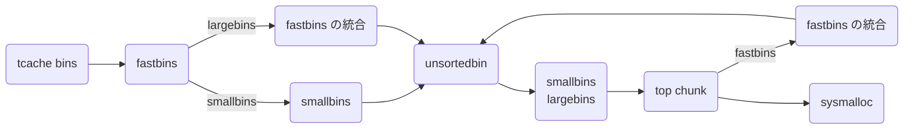

`malloc()` でヒープ領域にあるメモリを確保してそのポインタを返し、`free()` はそのポインタのメモリを開放してくれます。

```c
void *malloc(size_t size);
void free(void *ptr);
```

このシリーズではこれらの関数が内部でどのように処理されるのかを調べていきます。

- [malloc.c を読む (malloc / free)](https://zenn.dev/anko/articles/malloc-malloc-free)

前回全体像を把握しましたが今回は各 bins の処理を中心に調べていきます。

ここで扱う glibc のバージョンは v2.38 です。また glibc のソースコードはブラウザ上で読むことができます。

- https://elixir.bootlin.com/glibc/latest/source/malloc/malloc.c
- https://codebrowser.dev/glibc/glibc/malloc/malloc.c.html

## bins とは

free list の正体は bins と呼ばれるリスト群です。bins はいくつかの種類があってサイズによって管理の仕方を変えることで最適化しています。

| bins の種類 | チャンクサイズ (default) | 説明 | データ構造 |
| --- | --- | --- | --- |
| tcache bins | 0x20 ~ 0x410 | 最初に入れられる just-fit な bin | 単方向リスト |
| fastbins | 0x20 ~ 0x80 | tcache が満杯になったら入れられる just-fit な bin | 単方向リスト |
| unsortedbin | 0x20 ~ | 最近アクセスしたチャンクが入れられる bin | 双方向リスト |
| smallbins | 0x20 ~ 0x3f0 | unsortedbin から来る小さなチャンクを管理する just-fit な bin | 双方向リスト |
| largebins | 0x400 ~ | unsortedbin から来る大きなチャンクを管理する bin | 双方向リスト + スキップリスト |

glibc version
glibc v2.3 からある小さなチャンクを管理する bin。fastbins はチャンクサイズが 0x20 から 0x80 まで 7 種類の fastbin を持ち、小さなチャンクは頻繁に確保・開放が起きやすいのでそれぞれ単方向リストとなっています。

tcache や fastbins のおこぼれや fastbins の consolidation されたチャンクを unsortedbin が管理します。unsortedbin は 1 つの双方向リストとなっています。unsortedbin でソートが起こると smallbins か largebins に繋がれます。

malloc



## 各 bins の管理

tcache bins は tcache
fastbins は `arena.fastbinsY[NFASTBINS]` 配列に先頭が格納されています。
unsortedbin, smallbins, largebins は `arena.bins[NBINS * 2 - 2]` 配列に先頭・末尾が格納されています。

データ構造は 2 つあり、それぞれの挿入 (link) や削除 (unlink) の処理は理解している前提で話を進めます。

- 単方向リストは単方向にしか移動できない繋ぎ変えが簡単な高速なリストです。LIFO で先頭は arena で管理されています。チャンクのデータ部分の先頭 8 バイトは forward pointer (fd) として使われ、次のチャンクのポインターが格納されています。末尾の fd は NULL になります。
- 双方向リストは双方向移動できる円形のリストです。FIFO で先頭と末尾は arena で管理されていて、チャンクのデータ部分の先頭 16 バイトは forward pointer (fd), back pointer (bk) として使われます。

### fastbinsY

### bins
bins は双方向の free list の先頭・末尾を格納する配列です。

全部で 128 個の bins があって、あるサイズ範囲ごとに保持されています。実際上、小さいほど頻繁に、大きいほど稀に malloc されることが知られている為、サイズが大きくなるに連れて指数的に間隔を大きくすることで効率的に管理することができます。

largebins はサイズ順に保持され、smallbins はすべて同じサイズのチャンクなので順序付けしなくても最適に割り当てられます。

また bins において連結してから挿入される為、チャンクリスト内のチャンク同士は物理的に接しないという性質を持っています。

同じサイズのチャンクは、最近解放されたものを先頭にリンクされ、割り当ては後ろから行われます。 この結果、LRU (FIFO) 割り当て順となり、各チャンクに隣接する解放されたチャンクと連結される機会が均等に与えられる傾向があるため、空きチャンクが大きくなり、断片化が少なくなります。

ここにも 1 つトリックがあり、各 bin のスライスを `malloc_chunk` の `fd` `bk` として扱うことで簡単に使用できます。

```c
typedef struct malloc_chunk *mbinptr;

/* addressing -- note that bin_at(0) does not exist */
#define bin_at(m, i) \
  (mbinptr) (((char *) &((m)->bins[((i) - 1) * 2]))			      \
             - offsetof (struct malloc_chunk, fd))

/* analog of ++bin */
#define next_bin(b)  ((mbinptr) ((char *) (b) + (sizeof (mchunkptr) << 1)))

/* Reminders about list directionality within bins */
#define first(b)     ((b)->fd)
#define last(b)      ((b)->bk)

/*
   Indexing

    Bins for sizes < 512 bytes contain chunks of all the same size, spaced
    8 bytes apart. Larger bins are approximately logarithmically spaced:

    64 bins of size       8
    32 bins of size      64
    16 bins of size     512
     8 bins of size    4096
     4 bins of size   32768
     2 bins of size  262144
     1 bin  of size what's left

    There is actually a little bit of slop in the numbers in bin_index
    for the sake of speed. This makes no difference elsewhere.

    The bins top out around 1MB because we expect to service large
    requests via mmap.

    Bin 0 does not exist.  Bin 1 is the unordered list; if that would be
    a valid chunk size the small bins are bumped up one.
 */

#define NBINS             128
#define NSMALLBINS         64
#define SMALLBIN_WIDTH    MALLOC_ALIGNMENT
#define SMALLBIN_CORRECTION (MALLOC_ALIGNMENT > CHUNK_HDR_SZ)
#define MIN_LARGE_SIZE    ((NSMALLBINS - SMALLBIN_CORRECTION) * SMALLBIN_WIDTH)

#define in_smallbin_range(sz)  \
  ((unsigned long) (sz) < (unsigned long) MIN_LARGE_SIZE)

#define smallbin_index(sz) \
  ((SMALLBIN_WIDTH == 16 ? (((unsigned) (sz)) >> 4) : (((unsigned) (sz)) >> 3))\
   + SMALLBIN_CORRECTION)

#define largebin_index_32(sz)                                                \
  (((((unsigned long) (sz)) >> 6) <= 38) ?  56 + (((unsigned long) (sz)) >> 6) :\
   ((((unsigned long) (sz)) >> 9) <= 20) ?  91 + (((unsigned long) (sz)) >> 9) :\
   ((((unsigned long) (sz)) >> 12) <= 10) ? 110 + (((unsigned long) (sz)) >> 12) :\
   ((((unsigned long) (sz)) >> 15) <= 4) ? 119 + (((unsigned long) (sz)) >> 15) :\
   ((((unsigned long) (sz)) >> 18) <= 2) ? 124 + (((unsigned long) (sz)) >> 18) :\
   126)

#define largebin_index_32_big(sz)                                            \
  (((((unsigned long) (sz)) >> 6) <= 45) ?  49 + (((unsigned long) (sz)) >> 6) :\
   ((((unsigned long) (sz)) >> 9) <= 20) ?  91 + (((unsigned long) (sz)) >> 9) :\
   ((((unsigned long) (sz)) >> 12) <= 10) ? 110 + (((unsigned long) (sz)) >> 12) :\
   ((((unsigned long) (sz)) >> 15) <= 4) ? 119 + (((unsigned long) (sz)) >> 15) :\
   ((((unsigned long) (sz)) >> 18) <= 2) ? 124 + (((unsigned long) (sz)) >> 18) :\
   126)

// XXX It remains to be seen whether it is good to keep the widths of
// XXX the buckets the same or whether it should be scaled by a factor
// XXX of two as well.
#define largebin_index_64(sz)                                                \
  (((((unsigned long) (sz)) >> 6) <= 48) ?  48 + (((unsigned long) (sz)) >> 6) :\
   ((((unsigned long) (sz)) >> 9) <= 20) ?  91 + (((unsigned long) (sz)) >> 9) :\
   ((((unsigned long) (sz)) >> 12) <= 10) ? 110 + (((unsigned long) (sz)) >> 12) :\
   ((((unsigned long) (sz)) >> 15) <= 4) ? 119 + (((unsigned long) (sz)) >> 15) :\
   ((((unsigned long) (sz)) >> 18) <= 2) ? 124 + (((unsigned long) (sz)) >> 18) :\
   126)

#define largebin_index(sz) \
  (SIZE_SZ == 8 ? largebin_index_64 (sz)                                     \
   : MALLOC_ALIGNMENT == 16 ? largebin_index_32_big (sz)                     \
   : largebin_index_32 (sz))

#define bin_index(sz) \
  ((in_smallbin_range (sz)) ? smallbin_index (sz) : largebin_index (sz))

/* The otherwise unindexable 1-bin is used to hold unsorted chunks. */
#define unsorted_chunks(M)          (bin_at (M, 1))
```

これを読むと 64bits 環境 において unsortedbin / smallbins / largebins は次のように管理されている。

| bins の種類 | 範囲 | 範囲 (バイト表示) | 間隔 | 個数 | `bin_at(n)` |
| --- | --- | --- | --- | :-: | --- |
| unsortedbin | 0x20 ~ | すべて | infinity | 1 | 1 |
| smallbins | 0x20 ~ 0x3F0 | 1KB 未満 | 0x10 | 62 | 2 ~ 63 |
| largebins | 0x400 ~ 0xC30 | 1KB 以上 3KB 未満 | 0x40 | 35 | 64 ~ 96 |
| largebins | 0xC40 ~ 0x29F0 | 3KB 以上 12KB 未満 | 0x200 | 15 | 97 ~ 111 |
| largebins | 0x3000 ~ 0xAFF0 | 12KB 以上 44KB 未満 | 0x1000 | 9 | 112 ~ 120 |
| largebins | 0xB000 ~ 0x27FF0 | 44KB 以上 160KB 未満 | 0x8000 | 3 | 121 ~ 123 |
| largebins | 0x28000 ~ 0xBFFF0 | 160KB 以上 768KB 未満 | 0x40000 | 2 | 124 ~ 125 |
| largebins | 0xC0000 ~  | 768KB 以上 | infinity | 1 | 126 |

ちなみにパフォーマンスを上げる為に指数的に間隔が上昇せず、境界は綺麗に分けられてません。

### Binmap

malloc において大量の bin の検索を補う為に各瓶が空であるかどうかを記録されているビットベクタです。

このビットはビンが空になるとすぐにクリアされるのではなく、mallocでの探索中にビンが空であることに気付いた時にクリアされます。

```c
/* Conservatively use 32 bits per map word, even if on 64bit system */
#define BINMAPSHIFT      5
#define BITSPERMAP       (1U << BINMAPSHIFT)
#define BINMAPSIZE       (NBINS / BITSPERMAP)

#define idx2block(i)     ((i) >> BINMAPSHIFT)
#define idx2bit(i)       ((1U << ((i) & ((1U << BINMAPSHIFT) - 1))))

#define mark_bin(m, i)    ((m)->binmap[idx2block (i)] |= idx2bit (i))
#define unmark_bin(m, i)  ((m)->binmap[idx2block (i)] &= ~(idx2bit (i)))
#define get_binmap(m, i)  ((m)->binmap[idx2block (i)] & idx2bit (i))
```

これを読むと 32 bit のフラグを 4 block 用意してすべての bin のフラグを表現していて、

## 各 bins の特徴
### tcache bins

glibc v2.26 以降に追加された bin。参照局所性を高める為に `malloc / free` で一番最初に処理されるのが tcache bins です。tcache bins はチャンクサイズが 0x20 から 0x410 までの 64 種類の tcache bin を持ち、それぞれ単方向リストとなっています。リストの長さは 7 個に制限されていて tcache が満杯になると他の bins に移されます。サイズごとに分けられているので just-fit で返せます。

tcache bins の実体は `tcache_perthread_struct` 構造体です。 `entries` で各リストの HEAD のチャンクに繋げて、 `counts` でリストの長さを管理し、7 個になったら受け付けないようにします。チャンクが tcache bin に入るとデータ部分に `tcache_entry` 構造体が overlap されてリストに入ります。

```c
typedef struct tcache_entry
{
    // 次の tcache_entry へのポインタ
    struct tcache_entry *next;
    // 親の tcache_perthread_struct を指し double free を検知
    struct tcache_perthread_struct *key;
} tcache_entry;

typedef struct tcache_perthread_struct
{
    // 各 tcache bin の長さの一覧
    uint16_t counts[TCACHE_MAX_BINS];
    // 各 tcache bin の最初の tcache へのポインタの一覧
    tcache_entry *entries[TCACHE_MAX_BINS];
} tcache_perthread_struct;
```


### fastbins
つまり要求されたサイズに just-fit した fastbin の先頭から取ってきています。
さらに tcache を使っていたときにこのような処理が行われます。
get_max_fast 以下
malloc_consolidate()
最近解放された小さなチャンクを保持している配列です。
単方向リスト
consolidate 統合された状態が保たれるようにする
MORECORE sbrk

| パラメータ | 説明 |
| --- | --- |
| `FASTBIN_CONSOLIDATION_THRESHOLD` | `FASTBIN_CONSOLIDATION_THRESHOLD` のチャンクが free されたときに自動的に周辺にある可能性のある fastbins の consolidation を行う。It is defined at half the default trim threshold as a compromise heuristic to only attempt consolidation if it is likely to lead to trimming. However, it is not dynamically tunable, since consolidation reduces fragmentation surrounding large chunks even if trimming is not used. |
| `NONCONTIGUOS_BIT` | NONCONTIGUOUS_BIT indicates that MORECORE does not return contiguous regions.  Otherwise, contiguity is exploited in merging together, when possible, results from consecutive MORECORE calls. The initial value comes from MORECORE_CONTIGUOUS, but is changed dynamically if mmap is ever used as an sbrk substitute. |
| `TRIM_FASTBINS` | 小さなチャンクも trim メモリ少なくなる代わりに処理が遅くなる TRIM_FASTBINS controls whether free() of a very small chunk can immediately lead to trimming. Setting to true (1) can reduce memory footprint, but will almost always slow down programs that use a lot of small chunks. Define this only if you are willing to give up some speed to more aggressively reduce system-level memory footprint when releasing memory in programs that use many small chunks.  You can get essentially the same effect by setting MXFAST to 0, but this can lead to even greater slowdowns in programs using many small chunks. TRIM_FASTBINS is an in-between compile-time option, that disables only those chunks bordering topmost memory from being placed in fastbins. |

malloc_consolidate

```c
// MAX_FAST_SIZE
static uint8_t global_max_fast;
```

`global_max_fast` 0x80
`MAX_FAST_SIZE` 0xa0

```
An array of lists holding recently freed small chunks.  Fastbins are not doubly linked.  It is faster to single-link them, and since chunks are never removed from the middles of these lists, double linking is not necessary. Also, unlike regular bins, they are not even processed in FIFO order (they use faster LIFO) since ordering doesn't much matter in the transient contexts in which fastbins are normally used.

Chunks in fastbins keep their inuse bit set, so they cannot be consolidated with other free chunks. malloc_consolidate releases all chunks in fastbins and consolidates them with other free chunks.
```


```c
typedef struct malloc_chunk *mfastbinptr;
#define fastbin(ar_ptr, idx) ((ar_ptr)->fastbinsY[idx])

/* offset 2 to use otherwise unindexable first 2 bins */
#define fastbin_index(sz) \
  ((((unsigned int) (sz)) >> (SIZE_SZ == 8 ? 4 : 3)) - 2)


/* The maximum fastbin request size we support */
#define MAX_FAST_SIZE     (80 * SIZE_SZ / 4)

#define NFASTBINS  (fastbin_index (request2size (MAX_FAST_SIZE)) + 1)

#define FASTBIN_CONSOLIDATION_THRESHOLD  (65536UL)

#define NONCONTIGUOUS_BIT     (2U)

#define contiguous(M)          (((M)->flags & NONCONTIGUOUS_BIT) == 0)
#define noncontiguous(M)       (((M)->flags & NONCONTIGUOUS_BIT) != 0)
#define set_noncontiguous(M)   ((M)->flags |= NONCONTIGUOUS_BIT)
#define set_contiguous(M)      ((M)->flags &= ~NONCONTIGUOUS_BIT)
```


   Set value of max_fast.
   Use impossibly small value if 0.
   Precondition: there are no existing fastbin chunks in the main arena.
   Since do_check_malloc_state () checks this, we call malloc_consolidate ()
   before changing max_fast.  Note other arenas will leak their fast bin
   entries if max_fast is reduced.

#define set_max_fast(s) \
  global_max_fast = (((size_t) (s) <= MALLOC_ALIGN_MASK - SIZE_SZ)	\
                     ? MIN_CHUNK_SIZE / 2 : ((s + SIZE_SZ) & ~MALLOC_ALIGN_MASK))

static inline INTERNAL_SIZE_T
get_max_fast (void)
{
  /* Tell the GCC optimizers that global_max_fast is never larger
     than MAX_FAST_SIZE.  This avoids out-of-bounds array accesses in
     _int_malloc after constant propagation of the size parameter.
     (The code never executes because malloc preserves the
     global_max_fast invariant, but the optimizers may not recognize
     this.)  */
  if (global_max_fast > MAX_FAST_SIZE)
    __builtin_unreachable ();
  return global_max_fast;
}

`have_fastchunks` は fastbins に最近挿入された free chunk があるかどうかの bool 値
`malloc_consolidate()` を呼び出す。

`fastbinsY[]`


### unsortedbin
unsortedbin の先頭・末尾は `bin_at(1)` つまり `arena` の `bins[0]` と `bins[1]` に格納され、
unsortedbin の末尾チャンクの `fd` は `main_arena.top` を指します。

### smallbins
unsortedbin に入れたチャンクで小さいチャンクは smallbins に繋がれます。smallbins はチャンクサイズが 0x20 から 0x3f0 まで 62 種類の smallbin を持ち、それぞれ双方向リストとなっています。

smallbins の先頭・末尾は `bin_at(2)` から `bin_at(63)` までに格納されています。


### largebins

大きなサイズのチャンクも 16 バイトごとに管理するのは現実的ではありません。チャンクサイズが大きくなるにつれて幅も指数的に大きくすることでリストの数を平均化し、最悪計算量を減らすことができます。それぞれサイズに応じて順序立てた双方向リストとなっています。これは双方向リストのメンバに加えて `fd_nextsize` `bk_nextsize` があり、それぞれチャンクの幅の中で次に大きなチャンクと次に小さなチャンクへのポインタが格納されます。

| 範囲 | 範囲 (バイト表示) | 間隔 | 個数 | `bin_at(n)` |
| --- | --- | --- | :-: | --- |
| 0x400 ~ 0xC30 | 1KB 以上 3KB 未満 | 0x40 | 35 | 64 ~ 96 |
| 0xC40 ~ 0x29F0 | 3KB 以上 12KB 未満 | 0x200 | 15 | 97 ~ 111 |
| 0x3000 ~ 0xAFF0 | 12KB 以上 44KB 未満 | 0x1000 | 9 | 112 ~ 120 |
| 0xB000 ~ 0x27FF0 | 44KB 以上 160KB 未満 | 0x8000 | 3 | 121 ~ 123 |
| 0x28000 ~ 0xBFFF0 | 160KB 以上 768KB 未満 | 0x40000 | 2 | 124 ~ 125 |
| 0xC0000 ~  | 768KB 以上 | infinity | 1 | 126 |

largebins の先頭・末尾は `bin_at(64)` から `bin_at(126)` までに格納されます。
largebins から確保されたメモリは `last_remainder` はセットされません。


    if (largebins のサイズ) {
      if (largebins の末尾から取得) {
        unlink
        if (nb + MINSIZE 未満) {
          exhaust
        } else {
          split
          unsortedbin に挿入
        }
        返す
      }
    }

    idx++;

    for (;;) {
      binmap から
      if (何もついてない) {
        binmap に書き込む
      } else {
        unlink
        Exhaust
        Split
      }
    }

      smallbins, largebins に振り分け
      binmap に書き込む

    smallbins, largebins から確保
    binmap から検索、なければ clear


```shell
pwndbg> vmmap
pwndbg> heap
pwndbg> arena
pwndbg> bins
pwndbg> fastbins
pwndbg> tcachebins
pwndbg> unsortedbin
pwndbg> smallbins
pwndbg> largebins
pwndbg> tcache
pwndbg> top_chunk
pwndbg> try_free <address>
pwndbg> malloc_chunk <address>
```