`malloc()` でヒープ領域にあるメモリを確保してそのポインタを返し、`free()` はそのポインタのメモリを開放してくれます。

```c
void *malloc(size_t size);
void free(void *ptr);
```

このシリーズではこれらの関数が内部でどのように処理されるのかを調べていきます。

- [malloc.c を読む (malloc / free)](https://zenn.dev/anko/articles/malloc-malloc-free)

前回全体像を把握しましたが今回は各 bins の処理を中心に調べていきます。

ここで扱う glibc のバージョンは v2.38 です。また glibc のソースコードはブラウザ上で読むことができます。

- https://elixir.bootlin.com/glibc/latest/source/malloc/malloc.c
- https://codebrowser.dev/glibc/glibc/malloc/malloc.c.html

## bins とは

free list の正体は bins と呼ばれるリスト群です。bins はいくつかの種類があってサイズによって管理の仕方を変えることで最適化しています。

| bins の種類 | チャンクサイズ (default) | 説明 | データ構造 |
| --- | --- | --- | --- |
| tcache bins | 0x20 ~ 0x410 | 最近アクセスしたチャンクが入れられる bins | 単方向リスト |
| fastbins | 0x20 ~ 0x80 | 頻繁に確保・解放されるような小さなチャンクを管理する bins | 単方向リスト |
| unsortedbin | 0x20 ~ | tcache bins や fastbins では扱えないものを入れ、smallbins や largebins に渡す中間の bin | 双方向リスト |
| smallbins | 0x20 ~ 0x3f0 | 小さなチャンクを管理する bins | 双方向リスト |
| largebins | 0x400 ~ | 大きなチャンクを管理する bins | 双方向リスト + スキップリスト |



```mermaid
graph LR
    A(tcache bins) --> B(fastbins)
    B --> |smallbins| C(smallbins)
    B --> |largebins| D(fastbins の統合)
    C --> E(unsortedbin)
    D --> E
    E --> F(smallbins\nlargebins)
    F --> G(top chunk)
    G --> |fastbins| H(fastbins の統合)
    G --> I(sysmalloc)
    H --> E
```

## 各 bins の管理
入り口から free list を理解した方が分かりやすそうなので、まだチャンクには触らずに各 bins の管理方法を紹介します。

bins によって管理されている場所はそれぞれ異なり、次のようにまとめられます。

| bins の種類 | 管理先 |
| --- | --- |
| tcache bins | `tcache` |
| fastbins | `arena->fastbinsY` `arena->have_fastchunks` |
| unsortedbin, smallbins, largebins | `arena->bins` `arena->binmap` |

これらがどう管理しているかを最新の glibc ソースコードに倣いながら紐解いていきます。

前提知識として各 bin のデータ構造は単方向リストと双方向リストの 2 つがあります。それぞれの挿入 (link) や削除 (unlink) の処理は理解している前提で話を進めます。

- 単方向リストは単方向にしか移動できない繋ぎ変えが簡単な高速なリストです。LIFO で先頭は arena で管理されています。チャンクのデータ部分の先頭 8 バイトは forward pointer (fd) として使われ、次のチャンクのポインターが格納されています。末尾の fd は NULL になります。
- 双方向リストは双方向移動できる円形のリストです。FIFO で先頭と末尾は arena で管理されていて、チャンクのデータ部分の先頭 16 バイトは forward pointer (fd), back pointer (bk) として使われます。

### tcache

tcache bins の実体である `tcache_perthread_struct` 構造体 (0x280 bytes) の `tcache` は各スレッドにおいて `_int_malloc()` でヒープ上に確保されます。ヒープを利用したバイナリを起動すると始めから `size` が 0x291 のチャンクがあるのはこの為です。

```c
/* We want 64 entries.  This is an arbitrary limit, which tunables can reduce.  */
# define TCACHE_MAX_BINS 64
# define MAX_TCACHE_SIZE tidx2usize (TCACHE_MAX_BINS-1)
/* Only used to pre-fill the tunables.  */
# define tidx2usize(idx) (((size_t) idx) * MALLOC_ALIGNMENT + MINSIZE - SIZE_SZ)
/* When "x" is from chunksize().  */
# define csize2tidx(x) (((x) - MINSIZE + MALLOC_ALIGNMENT - 1) / MALLOC_ALIGNMENT)
/* When "x" is a user-provided size.  */
# define usize2tidx(x) csize2tidx (request2size (x))
/* With rounding and alignment, the bins are...
   idx 0   bytes 0..24 (64-bit) or 0..12 (32-bit)
   idx 1   bytes 25..40 or 13..20
   idx 2   bytes 41..56 or 21..28
   etc.  */
/* This is another arbitrary limit, which tunables can change.  Each
   tcache bin will hold at most this number of chunks.  */
# define TCACHE_FILL_COUNT 7
/* Maximum chunks in tcache bins for tunables.  This value must fit the range
   of tcache->counts[] entries, else they may overflow.  */
# define MAX_TCACHE_COUNT UINT16_MAX

typedef struct tcache_entry
{
  struct tcache_entry *next;              // 次の tcache_entry へのポインタ
  struct tcache_perthread_struct *key;    // 乱数を用いて double free を検知
} tcache_entry;

typedef struct tcache_perthread_struct
{
  uint16_t counts[TCACHE_MAX_BINS];       // 各 bin の長さの一覧
  tcache_entry *entries[TCACHE_MAX_BINS]; // 各 bin の最初の tcache へのポインタの一覧
} tcache_perthread_struct;

static __thread bool tcache_shutting_down = false;
static __thread tcache_perthread_struct *tcache = NULL;
static uintptr_t tcache_key;
```

これを読むとチャンクサイズがそれぞれ 0x20 ~ 0x410 の `TCACHE_MAX_BINS == 64` 種類の tcache bin が作られていることが分かります。`tcache_perthread_struct` の `entries` では各 tcache bin の HEAD のチャンクに繋げており、ここからチャンクを link / unlink します。そして `counts` でリストの長さを管理し、7 個になったら受け付けないようにして局所参照性を高めています。そして tcache bin に入っているチャンクは `tcache_entry` 構造体が overlap されていて `next` によって単方向リストとなり、`key` にプログラム内共通の乱数 `tcache_key` を一時的に書き込むことで double free を検知しています。

具体的には次のように実装されています。

```c
/* The value of tcache_key does not really have to be a cryptographically
   secure random number.  It only needs to be arbitrary enough so that it does
   not collide with values present in applications.  If a collision does happen
   consistently enough, it could cause a degradation in performance since the
   entire list is checked to check if the block indeed has been freed the
   second time.  The odds of this happening are exceedingly low though, about 1
   in 2^wordsize.  There is probably a higher chance of the performance
   degradation being due to a double free where the first free happened in a
   different thread; that's a case this check does not cover.  */
static void
tcache_key_initialize (void)
{
  if (__getrandom (&tcache_key, sizeof(tcache_key), GRND_NONBLOCK)
      != sizeof (tcache_key))
    {
      tcache_key = random_bits ();
#if __WORDSIZE == 64
      tcache_key = (tcache_key << 32) | random_bits ();
#endif
    }
}

/* Caller must ensure that we know tc_idx is valid and there's room
   for more chunks.  */
static __always_inline void
tcache_put (mchunkptr chunk, size_t tc_idx)
{
  tcache_entry *e = (tcache_entry *) chunk2mem (chunk);
  /* Mark this chunk as "in the tcache" so the test in _int_free will
     detect a double free.  */
  e->key = tcache_key;
  e->next = PROTECT_PTR (&e->next, tcache->entries[tc_idx]);
  tcache->entries[tc_idx] = e;
  ++(tcache->counts[tc_idx]);
}
/* Caller must ensure that we know tc_idx is valid and there's
   available chunks to remove.  */
static __always_inline void *
tcache_get (size_t tc_idx)
{
  tcache_entry *e = tcache->entries[tc_idx];
  if (__glibc_unlikely (!aligned_OK (e)))
    malloc_printerr ("malloc(): unaligned tcache chunk detected");
  tcache->entries[tc_idx] = REVEAL_PTR (e->next);
  --(tcache->counts[tc_idx]);
  e->key = 0;
  return (void *) e;
}
static void
tcache_thread_shutdown (void)
{
  int i;
  tcache_perthread_struct *tcache_tmp = tcache;
  tcache_shutting_down = true;
  if (!tcache)
    return;
  /* Disable the tcache and prevent it from being reinitialized.  */
  tcache = NULL;
  /* Free all of the entries and the tcache itself back to the arena
     heap for coalescing.  */
  for (i = 0; i < TCACHE_MAX_BINS; ++i)
    {
      while (tcache_tmp->entries[i])
	{
	  tcache_entry *e = tcache_tmp->entries[i];
	  if (__glibc_unlikely (!aligned_OK (e)))
	    malloc_printerr ("tcache_thread_shutdown(): "
			     "unaligned tcache chunk detected");
	  tcache_tmp->entries[i] = REVEAL_PTR (e->next);
	  __libc_free (e);
	}
    }
  __libc_free (tcache_tmp);
}

static void
tcache_init(void)
{
  mstate ar_ptr;
  void *victim = 0;
  const size_t bytes = sizeof (tcache_perthread_struct);
  if (tcache_shutting_down)
    return;
  arena_get (ar_ptr, bytes);
  victim = _int_malloc (ar_ptr, bytes);
  if (!victim && ar_ptr != NULL)
    {
      ar_ptr = arena_get_retry (ar_ptr, bytes);
      victim = _int_malloc (ar_ptr, bytes);
    }
  if (ar_ptr != NULL)
    __libc_lock_unlock (ar_ptr->mutex);
  /* In a low memory situation, we may not be able to allocate memory
     - in which case, we just keep trying later.  However, we
     typically do this very early, so either there is sufficient
     memory, or there isn't enough memory to do non-trivial
     allocations anyway.  */
  if (victim)
    {
      tcache = (tcache_perthread_struct *) victim;
      memset (tcache, 0, sizeof (tcache_perthread_struct));
    }
}
```

### fastbinsY
`arena` にある `fastbinsY` では各チャンクサイズに対応する fastbin のリストの先頭が格納されています。チャンクサイズは次のソースを読むと `MAX_FAST_SIZE == 0xa0` より 0x20 ~ 0xa0 の 9 種類の fastbin が用意されてあるのですが、実際には `global_max_fast == DEFAULT_MXFAST == 0x80` より 0x20 ~ 0x80 の 7 種類を使います。さらに `malloc_consolidation()` をするかどうかの判断材料として `have_fastchunks` で fastbins 内に直近で入れられたかどうかの bool 値が書き込まれています。

```c
#define DEFAULT_MXFAST     (64 * SIZE_SZ / 4)

typedef struct malloc_chunk *mfastbinptr;
#define fastbin(ar_ptr, idx) ((ar_ptr)->fastbinsY[idx])

/* offset 2 to use otherwise unindexable first 2 bins */
#define fastbin_index(sz) \
  ((((unsigned int) (sz)) >> (SIZE_SZ == 8 ? 4 : 3)) - 2)

/* The maximum fastbin request size we support */
#define MAX_FAST_SIZE     (80 * SIZE_SZ / 4)

#define NFASTBINS  (fastbin_index (request2size (MAX_FAST_SIZE)) + 1)

#define FASTBIN_CONSOLIDATION_THRESHOLD  (65536UL)

static uint8_t global_max_fast;
#define set_max_fast(s) \
  global_max_fast = (((size_t) (s) <= MALLOC_ALIGN_MASK - SIZE_SZ)	\
                     ? MIN_CHUNK_SIZE / 2 : ((s + SIZE_SZ) & ~MALLOC_ALIGN_MASK))

struct malloc_state
{
  ...
  int have_fastchunks;              // fastbins が空ではないことを表す真偽値
  mfastbinptr fastbinsY[NFASTBINS]; // fastbins の先頭が格納されている
  ...
};

static void
malloc_init_state (mstate av)
{
  int i;
  mbinptr bin;
  /* Establish circular links for normal bins */
  for (i = 1; i < NBINS; ++i)
    {
      bin = bin_at (av, i);
      bin->fd = bin->bk = bin;
    }
#if MORECORE_CONTIGUOUS
  if (av != &main_arena)
#endif
  set_noncontiguous (av);
  if (av == &main_arena)
    set_max_fast (DEFAULT_MXFAST);
  atomic_store_relaxed (&av->have_fastchunks, false);
  av->top = initial_top (av);
}
```

ちなみに fastbins が `max_fast` を変更するときには先に `malloc_consolidate()` を呼んで `main_arena` の fastbins を空にしておくことが前提条件となっているようです。

### bins
bins は free list の中で双方向リスト (unsortedbin / smallbins / largebins) を扱う bin の先頭・末尾を格納する配列です。

全部で 128 個の bins があって、あるサイズ範囲ごとに保持されています。実際上、小さいほど頻繁に、大きいほど稀に malloc されることが知られている為、サイズが大きくなるに連れて指数的に間隔を大きくすることで効率的に管理することができます。

largebins はサイズ順に保持され、smallbins はすべて同じサイズのチャンクなので順序付けしなくても最適に割り当てられます。

また bins において連結してから挿入される為、チャンクリスト内のチャンク同士は物理的に接しないという性質を持っています。

同じサイズのチャンクは、最近解放されたものを先頭にリンクされ、割り当ては後ろから行われます。 この結果、LRU (FIFO) 割り当て順となり、各チャンクに隣接する解放されたチャンクと連結される機会が均等に与えられる傾向があるため、空きチャンクが大きくなり、断片化が少なくなります。

ここにも 1 つトリックがあり、各 bin の先頭・末尾のスライスを `malloc_chunk` として捉えることで `fd` `bk` として扱えてリンクのアクセスがより簡単にできます。

```c
typedef struct malloc_chunk *mbinptr;

/* addressing -- note that bin_at(0) does not exist */
#define bin_at(m, i) \
  (mbinptr) (((char *) &((m)->bins[((i) - 1) * 2]))			      \
             - offsetof (struct malloc_chunk, fd))

/* analog of ++bin */
#define next_bin(b)  ((mbinptr) ((char *) (b) + (sizeof (mchunkptr) << 1)))

/* Reminders about list directionality within bins */
#define first(b)     ((b)->fd)
#define last(b)      ((b)->bk)

/*
   Indexing

    Bins for sizes < 512 bytes contain chunks of all the same size, spaced
    8 bytes apart. Larger bins are approximately logarithmically spaced:

    64 bins of size       8
    32 bins of size      64
    16 bins of size     512
     8 bins of size    4096
     4 bins of size   32768
     2 bins of size  262144
     1 bin  of size what's left

    There is actually a little bit of slop in the numbers in bin_index
    for the sake of speed. This makes no difference elsewhere.

    The bins top out around 1MB because we expect to service large
    requests via mmap.

    Bin 0 does not exist.  Bin 1 is the unordered list; if that would be
    a valid chunk size the small bins are bumped up one.
 */

#define NBINS             128
#define NSMALLBINS         64
#define SMALLBIN_WIDTH    MALLOC_ALIGNMENT
#define SMALLBIN_CORRECTION (MALLOC_ALIGNMENT > CHUNK_HDR_SZ)
#define MIN_LARGE_SIZE    ((NSMALLBINS - SMALLBIN_CORRECTION) * SMALLBIN_WIDTH)

#define in_smallbin_range(sz)  \
  ((unsigned long) (sz) < (unsigned long) MIN_LARGE_SIZE)

#define smallbin_index(sz) \
  ((SMALLBIN_WIDTH == 16 ? (((unsigned) (sz)) >> 4) : (((unsigned) (sz)) >> 3))\
   + SMALLBIN_CORRECTION)

#define largebin_index_32(sz)                                                \
  (((((unsigned long) (sz)) >> 6) <= 38) ?  56 + (((unsigned long) (sz)) >> 6) :\
   ((((unsigned long) (sz)) >> 9) <= 20) ?  91 + (((unsigned long) (sz)) >> 9) :\
   ((((unsigned long) (sz)) >> 12) <= 10) ? 110 + (((unsigned long) (sz)) >> 12) :\
   ((((unsigned long) (sz)) >> 15) <= 4) ? 119 + (((unsigned long) (sz)) >> 15) :\
   ((((unsigned long) (sz)) >> 18) <= 2) ? 124 + (((unsigned long) (sz)) >> 18) :\
   126)

#define largebin_index_32_big(sz)                                            \
  (((((unsigned long) (sz)) >> 6) <= 45) ?  49 + (((unsigned long) (sz)) >> 6) :\
   ((((unsigned long) (sz)) >> 9) <= 20) ?  91 + (((unsigned long) (sz)) >> 9) :\
   ((((unsigned long) (sz)) >> 12) <= 10) ? 110 + (((unsigned long) (sz)) >> 12) :\
   ((((unsigned long) (sz)) >> 15) <= 4) ? 119 + (((unsigned long) (sz)) >> 15) :\
   ((((unsigned long) (sz)) >> 18) <= 2) ? 124 + (((unsigned long) (sz)) >> 18) :\
   126)

// XXX It remains to be seen whether it is good to keep the widths of
// XXX the buckets the same or whether it should be scaled by a factor
// XXX of two as well.
#define largebin_index_64(sz)                                                \
  (((((unsigned long) (sz)) >> 6) <= 48) ?  48 + (((unsigned long) (sz)) >> 6) :\
   ((((unsigned long) (sz)) >> 9) <= 20) ?  91 + (((unsigned long) (sz)) >> 9) :\
   ((((unsigned long) (sz)) >> 12) <= 10) ? 110 + (((unsigned long) (sz)) >> 12) :\
   ((((unsigned long) (sz)) >> 15) <= 4) ? 119 + (((unsigned long) (sz)) >> 15) :\
   ((((unsigned long) (sz)) >> 18) <= 2) ? 124 + (((unsigned long) (sz)) >> 18) :\
   126)

#define largebin_index(sz) \
  (SIZE_SZ == 8 ? largebin_index_64 (sz)                                     \
   : MALLOC_ALIGNMENT == 16 ? largebin_index_32_big (sz)                     \
   : largebin_index_32 (sz))

#define bin_index(sz) \
  ((in_smallbin_range (sz)) ? smallbin_index (sz) : largebin_index (sz))

/* The otherwise unindexable 1-bin is used to hold unsorted chunks. */
#define unsorted_chunks(M)          (bin_at (M, 1))
```

これを読むと 64bits 環境 において unsortedbin / smallbins / largebins は次のように管理されている。

| bins の種類 | 範囲 | 範囲 (バイト表示) | 間隔 | 個数 | `bin_at(n)` |
| --- | --- | --- | --- | :-: | --- |
| unsortedbin | 0x20 ~ | すべて | infinity | 1 | 1 |
| smallbins | 0x20 ~ 0x3F0 | 1KB 未満 | 0x10 | 62 | 2 ~ 63 |
| largebins | 0x400 ~ 0xC30 | 1KB 以上 3KB 未満 | 0x40 | 35 | 64 ~ 96 |
| largebins | 0xC40 ~ 0x29F0 | 3KB 以上 12KB 未満 | 0x200 | 15 | 97 ~ 111 |
| largebins | 0x3000 ~ 0xAFF0 | 12KB 以上 44KB 未満 | 0x1000 | 9 | 112 ~ 120 |
| largebins | 0xB000 ~ 0x27FF0 | 44KB 以上 160KB 未満 | 0x8000 | 3 | 121 ~ 123 |
| largebins | 0x28000 ~ 0xBFFF0 | 160KB 以上 768KB 未満 | 0x40000 | 2 | 124 ~ 125 |
| largebins | 0xC0000 ~  | 768KB 以上 | infinity | 1 | 126 |

ちなみにパフォーマンスを上げる為に指数的に間隔が上昇せず、境界は綺麗に分けられてません。

### binmap

`malloc()` において `arena->bins` にある大量の bin の検索を補う為に各 bin が空であるかどうかを記録されているビットベクタです。binmap 中の 1 ビットが 1 bin を指し、その bin にチャンクがあればフラグが立ち、空になるとクリアされます。注意としてこのビットはビンが空になってすぐクリアされるのではなく、`malloc` での探索中にビンが空であることに気付いた時にクリアされます。

```c
/* Conservatively use 32 bits per map word, even if on 64bit system */
#define BINMAPSHIFT      5
#define BITSPERMAP       (1U << BINMAPSHIFT)
#define BINMAPSIZE       (NBINS / BITSPERMAP)

#define idx2block(i)     ((i) >> BINMAPSHIFT)
#define idx2bit(i)       ((1U << ((i) & ((1U << BINMAPSHIFT) - 1))))

#define mark_bin(m, i)    ((m)->binmap[idx2block (i)] |= idx2bit (i))
#define unmark_bin(m, i)  ((m)->binmap[idx2block (i)] &= ~(idx2bit (i)))
#define get_binmap(m, i)  ((m)->binmap[idx2block (i)] & idx2bit (i))
```

これを読むと 32 bit のフラグを 4 block 用意してフラグを表現していることが分かります。

## 各 bins の特徴
### tcache bins

glibc v2.26 以降に追加された bin です。参照局所性を高める為に `malloc()` `free()` で一番最初に処理されるのが tcache bins です。tcache bins はチャンクサイズが 0x20 から 0x410 までの 64 種類の tcache bin を持ち、それぞれ単方向リストとなっています。リストの長さは 7 個に制限されていて tcache が満杯になると他の bins に移されます。サイズごとに分けられているので just-fit で返せます。

整合性チェックとしては


### fastbins
glibc v2.3 からある小さなチャンクを管理する bin です。fastbins はチャンクサイズが 0x20 から 0x80 まで 7 種類の fastbin を持ち、小さなチャンクは頻繁に確保・開放が起きやすいのでそれぞれ単方向リストとなっています。また LIFO なので最近使われたチャンクではなく古いチャンクを返しますが、全体的に見て比較的最近のものしか入っていない為、あまり影響しません。そして末尾の `fd` は NULL となります。


また fastbins では consolidation と trim を頻繁に行い、unsortedbin で PREV_INUSE が必ず立っているようにすることで最適化が回ります。そして次のようなチューニングできるパラメータがあります。

| パラメータ | 説明 |
| --- | --- |
| `FASTBIN_CONSOLIDATION_THRESHOLD` | `FASTBIN_CONSOLIDATION_THRESHOLD` のチャンクが free されたときに自動的に周辺にある可能性のある fastbins の consolidation を行い、フラグメンテーションを防ぐ。これはデフォルトの trim 閾値の半分と定義され、trim が起きそうなときに consolidation するというヒューリスティックとなっている。 |
| `TRIM_FASTBINS` | 小さな `free()` でも毎回 trim するかどうかのフラグ。メモリフットプリントを削減する代わりにパフォーマンスが落ちる。 |

`malloc_consolidate()` は具体的には次のように実装されています。

```c
/*
  ------------------------- malloc_consolidate -------------------------

  malloc_consolidate is a specialized version of free() that tears
  down chunks held in fastbins.  Free itself cannot be used for this
  purpose since, among other things, it might place chunks back onto
  fastbins.  So, instead, we need to use a minor variant of the same
  code.
*/

static void malloc_consolidate(mstate av)
{
  mfastbinptr*    fb;                 /* current fastbin being consolidated */
  mfastbinptr*    maxfb;              /* last fastbin (for loop control) */
  mchunkptr       p;                  /* current chunk being consolidated */
  mchunkptr       nextp;              /* next chunk to consolidate */
  mchunkptr       unsorted_bin;       /* bin header */
  mchunkptr       first_unsorted;     /* chunk to link to */

  /* These have same use as in free() */
  mchunkptr       nextchunk;
  INTERNAL_SIZE_T size;
  INTERNAL_SIZE_T nextsize;
  INTERNAL_SIZE_T prevsize;
  int             nextinuse;

  atomic_store_relaxed (&av->have_fastchunks, false);

  unsorted_bin = unsorted_chunks(av);

  /*
    Remove each chunk from fast bin and consolidate it, placing it
    then in unsorted bin. Among other reasons for doing this,
    placing in unsorted bin avoids needing to calculate actual bins
    until malloc is sure that chunks aren't immediately going to be
    reused anyway.
  */

  maxfb = &fastbin (av, NFASTBINS - 1);
  fb = &fastbin (av, 0);
  do {
    p = atomic_exchange_acquire (fb, NULL);
    if (p != 0) {
      do {
        {
          if (__glibc_unlikely (misaligned_chunk (p)))
            malloc_printerr ("malloc_consolidate(): "
                "unaligned fastbin chunk detected");

          unsigned int idx = fastbin_index (chunksize (p));
          if ((&fastbin (av, idx)) != fb)
            malloc_printerr ("malloc_consolidate(): invalid chunk size");
        }

        check_inuse_chunk(av, p);
        nextp = REVEAL_PTR (p->fd);

        /* Slightly streamlined version of consolidation code in free() */
        size = chunksize (p);
        nextchunk = chunk_at_offset(p, size);
        nextsize = chunksize(nextchunk);

        if (!prev_inuse(p)) {
          prevsize = prev_size (p);
          size += prevsize;
          p = chunk_at_offset(p, -((long) prevsize));
          if (__glibc_unlikely (chunksize(p) != prevsize))
            malloc_printerr ("corrupted size vs. prev_size in fastbins");
          unlink_chunk (av, p);
        }

        if (nextchunk != av->top) {
          nextinuse = inuse_bit_at_offset(nextchunk, nextsize);

          if (!nextinuse) {
            size += nextsize;
            unlink_chunk (av, nextchunk);
          } else
            clear_inuse_bit_at_offset(nextchunk, 0);

          first_unsorted = unsorted_bin->fd;
          unsorted_bin->fd = p;
          first_unsorted->bk = p;

          if (!in_smallbin_range (size)) {
            p->fd_nextsize = NULL;
            p->bk_nextsize = NULL;
          }

          set_head(p, size | PREV_INUSE);
          p->bk = unsorted_bin;
          p->fd = first_unsorted;
          set_foot(p, size);
        }

        else {
          size += nextsize;
          set_head(p, size | PREV_INUSE);
          av->top = p;
        }
      } while ( (p = nextp) != 0);
    }
  } while (fb++ != maxfb);
}
```

### unsortedbin
tcache や fastbins のおこぼれや fastbins の consolidation されたチャンクを unsortedbin が管理します。unsortedbin は 1 つの双方向リストとなっています。unsortedbin でソートが起こると smallbins か largebins に繋がれます。重要なのは unsortedbin の末尾チャンクの `fd` は `main_arena.top` を指すということです。

glibc-2.28 以降では `fd->bk` `bk->fd` がチャンク自身を指すという整合性がチェックされています。


### smallbins
unsortedbin に入れたチャンクで小さいチャンクは smallbins に繋がれます。smallbins はチャンクサイズが 0x20 から 0x3f0 まで 62 種類の smallbin を持ち、それぞれ双方向リストとなっています。それぞれの smallbin の先頭・末尾は `bin_at(2)` から `bin_at(63)` に格納されています。

glibc-2.11 以降では `fd->bk` `bk->fd` がチャンク自身を指すという整合性がチェックされています。


### largebins

大きなサイズのチャンクも 16 バイトごとに管理するのは現実的ではありません。チャンクサイズが大きくなるにつれて幅も指数的に大きくすることでリストの数を平均化し、最悪計算量を減らすことができます。それぞれサイズに応じて順序立てた双方向リストとなっています。これは双方向リストのメンバに加えて `fd_nextsize` `bk_nextsize` があり、それぞれチャンクの幅の中で次に大きなチャンクと次に小さなチャンクへのポインタが格納されます。ちなみに largebins で split したチャンクは `last_remainder` にセットされません。

| 範囲 | 範囲 (バイト表示) | 間隔 | 個数 | `bin_at(n)` |
| --- | --- | --- | :-: | --- |
| 0x400 ~ 0xC30 | 1KB 以上 3KB 未満 | 0x40 | 35 | 64 ~ 96 |
| 0xC40 ~ 0x29F0 | 3KB 以上 12KB 未満 | 0x200 | 15 | 97 ~ 111 |
| 0x3000 ~ 0xAFF0 | 12KB 以上 44KB 未満 | 0x1000 | 9 | 112 ~ 120 |
| 0xB000 ~ 0x27FF0 | 44KB 以上 160KB 未満 | 0x8000 | 3 | 121 ~ 123 |
| 0x28000 ~ 0xBFFF0 | 160KB 以上 768KB 未満 | 0x40000 | 2 | 124 ~ 125 |
| 0xC0000 ~  | 768KB 以上 | infinity | 1 | 126 |

glibc-2.3.4 以降では `fd->bk` `bk->fd` がチャンク自身を指すという整合性がチェックされています。
また `nextsize` の仕組みは glibc-2.6 で導入されていて `fd_nextsize->bk_nextsize` `bk_nextsize->fd_nextsize` がチャンク自身を指すという整合性がチェックされています。


## pwndbg
最後に pwndbg でのコマンド一覧を残しておきます。とても便利なのでいつも使っています。

```shell
pwndbg> vmmap
pwndbg> heap
pwndbg> arena
pwndbg> bins
pwndbg> fastbins
pwndbg> tcachebins
pwndbg> unsortedbin
pwndbg> smallbins
pwndbg> largebins
pwndbg> tcache
pwndbg> top_chunk
pwndbg> try_free <address>
pwndbg> malloc_chunk <address>
```

## まとめ
このように各 bins は役割を担い、セキュリティ機構を備えているということが分かったと思います。

次はもっと大きな単位である arena に関してまとめようと思います。
