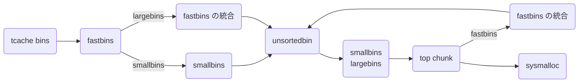

`malloc()` でヒープ領域にあるメモリを確保してそのポインタを返し、`free()` はそのポインタのメモリを開放してくれます。

```c
void *malloc(size_t size);
void free(void *ptr);
```

このシリーズではこれらの関数が内部でどのように処理されるのかを調べていきます。

今回は `malloc()` `free()` の全体像を紹介します。

注意としてここでの目的は全体を俯瞰して、詳細を詰めずとも各 bins の役割を理解し、攻撃手法を理解できるようにすることです。それに合わないマルチスレッドや最適化などにおける緻密なトリックやコーナーケースなどは暗黙的に実装されていると仮定します。その詳細についてはソースコードや他の資料を参考にしていただきたいです。

ここで扱う glibc のバージョンは v2.38 です。また glibc のソースコードはブラウザ上で読むことができます。

- https://elixir.bootlin.com/glibc/latest/source/malloc/malloc.c
- https://codebrowser.dev/glibc/glibc/malloc/arena.c.html

## malloc / free 全体像
まずはざっくりと！

読むべき関数は malloc.c 内の次の関数です。

| 関数名 | 説明 |
| --- | --- |
| `__libc_malloc()` | `malloc()` のエイリアス。主に tcache の処理を行う。 |
| `__libc_free()` | `free()` のエイリアス。 |
| `_int_malloc()` | malloc のほぼ全てが書かれてある。最も重要！ |
| `_int_free()` | free のほぼ全てが書かれてある。重要 of 重要！ |
| `sysmalloc()` | OS からメモリを貰う。mmap や MORECORE (sbrk) でヒープ領域を確保や拡張する。 |
| `systrim()` | OS にメモリを返す。top chunk から切り出して返す。 |
| `malloc_consolidate()` | fastbins の統合を行う。 |

実際の malloc.c は約 6000 行と結構長く、高速化の為にあまり抽象化されてないのでまずは擬似コードを読むことにしましょう。

また用語がよく出てくるのでここでまとめておきます。

| 用語 | 説明 |
| --- | --- |
| Remaindering | 要求のあったサイズと合致するチャンクが見つからない場合、既存のチャンクを要求サイズで分割する場合があります。残りの領域は新たなチャンクとして登録され、その内最新のものはアリーナの `last_remainder` に格納される。 |
| Exhausting | 要求のあったサイズ `N` と合致するチャンクが見つからず、サイズ `N + 0x10` のチャンクがある場合、分割せずにそのまま使うこと。 |
| Consolidation | 解放されたチャンクが隣り合っていたときに 2 つのチャンクを統合すること。これによってフラグメンテーションを防ぐ。 |
| フラグメンテーション | `malloc()` `free()` を繰り返すことで未使用のチャンクがバラバラになってしまうこと。 |

### malloc() の擬似コード
擬似コードを読んで各 bins や処理などの役割をよくよく考えてみましょう。

```c:malloc()
void *__libc_malloc (size_t bytes) {
    if (malloc の初期化をしてない)
        ptmalloc_init()
    if (tcache を初期化してない)
        tcache_init()

    if (tcache のサイズ)
        tcache から確保
    if (シングルスレッド)
        main_arena で _int_malloc()
    アリーナをロックして取得し _int_malloc()
    失敗したら 1 回だけリトライする
}


static void *_int_malloc(mstate arena, size_t bytes) {
    if (arena がない)
        sysmalloc()
    if (global_max_fast 以下) {
        fastbins から確保
        他にアクセスしたチャンクを tcache に挿入する
        確保成功したらそれを返す
    }
    if (smallbins のサイズ) {
        smallbins から確保
        他にアクセスしたチャンクを tcache に挿入する
        確保成功したらそれを返す
    } else {
        malloc_consolidate()
    }

    for (;;) {
        iter = 0
        while (unsortedbin の末尾から取得) {
            if (smallbins のサイズ
             && unsortedbin に last_remainder の 1 つしかない
             && last_remainder 以下のサイズ)
                last_remainder から切り出す

            unsortedbin から unlink
            if (同じサイズ) {
                if (tcahce が埋まってない)
                    unsortedbin から tcache に挿入して continue
                else
                    unsortedbin から確保
            }
            unsortedbin を smallbins, largebins に振り分け

            if (++tcache_unsorted_count > tcache_unsorted_limit)
                tcache から確保
            if (++iters >= 10000)
                break
        }
        tcache に挿入していたらそこから確保

        smallbins / largebins から best-fit で確保

        if (top chunk が要求サイズ以上)
            top chunk から切り出す
        else if (have_fastchunks)
            malloc_consolidate()
        else
            sysmalloc()
    }
}
```

これらを読むとよりマクロに考えれば次のような処理となります。



こうして見ると大枠として smallbins / largebins から best-fit で割り当てて、足りなくなったら top chunk の切り出したり `sysmalloc()` で拡張します。それに加え、小さなチャンクを扱う fastbins では頻繁に確保・解放が行われ、 tcache bins や unsortedbin は局所参照性を高めるキャッシュ機構として機能します。

次に `sysmalloc()` を読んでいきましょう。

```c:sysmalloc()
static void *sysmalloc (INTERNAL_SIZE_T nb, mstate av) {
    if (アリーナがない || mmap_threshold (0x20000) 以上で n_mmaps_max 回未満)
        sysmalloc_mmap()

    assert (初期状態 ||
            top chunk の前が使用中
         && top chunk サイズが MINSIZE 以上 nb + MINSIZE 以下
         && top chunk の末尾がページ境界)

    if (main_arena ではない) {
        if (mmap でヒープ拡張) {
            top chunk の拡張
        } else if (新しいヒープ領域を mmap で作成) {
            新しい top chunk を確保したヒープ領域にする
            古い top chunk の末尾に 1 つ fencepost を作って PREV_INUSE をマーク
            古い top chunk を _int_free()
        }
    } else {
        sbrk でヒープ拡張または mmap でヒープ領域を確保
        if (確保成功) {
            if (top chunk に隣接している)
                top chunk の拡張
            else {
                if (アリーナが連続な領域しか扱わない) {
                    MALLOC_ALIGNMENT (0x10) の alignment 調整
                    出来たら sbrk でページ境界まで伸ばす
                } else {
                    MALLOC_ALIGNMENT (0x10) の alignment 調整
                }
                新しい top chunk を確保したヒープにする
                古い top chunk の末尾に 2 つ fencepost を作って PREV_INUSE をマーク
                古い top chunk を _int_free()
            }
        }
    }
    top chunk から切り出す
}
```

このように mmap / sbrk を駆使してヒープ領域を獲得しています。House of Corrosion では top chunk の末尾がページ境界にあることを注意しないといけません。

```c
/*
  ------------------------- malloc_consolidate -------------------------

  malloc_consolidate is a specialized version of free() that tears
  down chunks held in fastbins.  Free itself cannot be used for this
  purpose since, among other things, it might place chunks back onto
  fastbins.  So, instead, we need to use a minor variant of the same
  code.
*/

static void malloc_consolidate(mstate av)
{
  mfastbinptr*    fb;                 /* current fastbin being consolidated */
  mfastbinptr*    maxfb;              /* last fastbin (for loop control) */
  mchunkptr       p;                  /* current chunk being consolidated */
  mchunkptr       nextp;              /* next chunk to consolidate */
  mchunkptr       unsorted_bin;       /* bin header */
  mchunkptr       first_unsorted;     /* chunk to link to */

  /* These have same use as in free() */
  mchunkptr       nextchunk;
  INTERNAL_SIZE_T size;
  INTERNAL_SIZE_T nextsize;
  INTERNAL_SIZE_T prevsize;
  int             nextinuse;

  atomic_store_relaxed (&av->have_fastchunks, false);

  unsorted_bin = unsorted_chunks(av);

  /*
    Remove each chunk from fast bin and consolidate it, placing it
    then in unsorted bin. Among other reasons for doing this,
    placing in unsorted bin avoids needing to calculate actual bins
    until malloc is sure that chunks aren't immediately going to be
    reused anyway.
  */

  maxfb = &fastbin (av, NFASTBINS - 1);
  fb = &fastbin (av, 0);
  do {
    p = atomic_exchange_acquire (fb, NULL);
    if (p != 0) {
      do {
        {
          if (__glibc_unlikely (misaligned_chunk (p)))
            malloc_printerr ("malloc_consolidate(): "
                "unaligned fastbin chunk detected");

          unsigned int idx = fastbin_index (chunksize (p));
          if ((&fastbin (av, idx)) != fb)
            malloc_printerr ("malloc_consolidate(): invalid chunk size");
        }

        check_inuse_chunk(av, p);
        nextp = REVEAL_PTR (p->fd);

        /* Slightly streamlined version of consolidation code in free() */
        size = chunksize (p);
        nextchunk = chunk_at_offset(p, size);
        nextsize = chunksize(nextchunk);

        if (!prev_inuse(p)) {
          prevsize = prev_size (p);
          size += prevsize;
          p = chunk_at_offset(p, -((long) prevsize));
          if (__glibc_unlikely (chunksize(p) != prevsize))
            malloc_printerr ("corrupted size vs. prev_size in fastbins");
          unlink_chunk (av, p);
        }

        if (nextchunk != av->top) {
          nextinuse = inuse_bit_at_offset(nextchunk, nextsize);

          if (!nextinuse) {
            size += nextsize;
            unlink_chunk (av, nextchunk);
          } else
            clear_inuse_bit_at_offset(nextchunk, 0);

          first_unsorted = unsorted_bin->fd;
          unsorted_bin->fd = p;
          first_unsorted->bk = p;

          if (!in_smallbin_range (size)) {
            p->fd_nextsize = NULL;
            p->bk_nextsize = NULL;
          }

          set_head(p, size | PREV_INUSE);
          p->bk = unsorted_bin;
          p->fd = first_unsorted;
          set_foot(p, size);
        }

        else {
          size += nextsize;
          set_head(p, size | PREV_INUSE);
          av->top = p;
        }
      } while ( (p = nextp) != 0);
    }
  } while (fb++ != maxfb);
}
```


### free() の擬似コード

`free()` についても思いを馳せてみましょう。

```c:free()
void __libc_free(void *mem) {
    if (mmap されたチャンク)
        munmap
    else
        _int_free()
}


static void _int_free (mstate av, mchunkptr p, int have_lock) {
    if (tcache bins の範囲内 && まだ埋まっていない)
        tcache bins に挿入
    if (global_max_fast 以下)
        fastbins に挿入

    if (!IS_MMAPED) {
        if (前のチャンクが free chunk)
            前のチャンクと統合して unlink
        if (次のチャンクが top chunk ではない) {
            if (次のチャンクが free chunk)
                次のチャンクと統合して unlink
            else
                次のチャンクの PREV_INUSE をクリアする

            unsortedbin に挿入
        } else {
            top chunk に統合する
        }

        if (統合後 FASTBIN_CONSOLIDATION_THRESHOLD (0x10000) 以上) {
            if (have_fastchunks)
                malloc_consolidate()
            if (top chunk が閾値 (0x20000) より大きい)
                systrim() または heap_trim()
        }
    } else {
        munmap
    }
}
```

`free()` では的確に統合して tcache bins, fastbins, unsortedbin に挿入します。よく見ると smallbins や largebins は関与してません。またある程度ヒープ領域が拡張されて top chunk が肥大化すると `free()` で無駄と判断して `systrim()` でヒープ領域を削減します。

## まとめ
`malloc()` `free()` の大枠は理解できたかと思います。これらの関数のより詳細については記事より直接ソースコードを読んで自分でまとめた方が絶対に良い理解と読解力が得られると思います。そしてソースコードを読み込んだ方はより良い記事を書いてほしいです！
