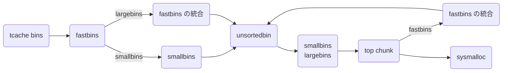

`malloc` 関数でヒープ領域にあるメモリを確保してそのポインタを返す。 `free` 関数はそのポインタのメモリを開放してくれる。

```c
void *malloc(size_t size);
void free(void *ptr);
```

これらの関数が内部でどのように処理されるのかを調べていきます。

[**最新の malloc.c のソースコード**](https://elixir.bootlin.com/glibc/latest/source/malloc/malloc.c) を用意しましょう。ここで扱う glibc のバージョンは v2.38 です。

今回は `malloc()` `free()` の全体像を紹介します。

注意としてここでの目的は全体を俯瞰して、詳細を詰めずとも各 bins の役割を理解し、攻撃手法を理解できるようにすることです。それに合わないマルチスレッドや最適化などにおける緻密なトリックやコーナーケースなどは暗黙的に実装されていると仮定します。その詳細についてはソースコードや他の資料を参考にしていただきたいです。

## malloc / free 全体像
まずはざっくりと！

読むべき関数は malloc.c 内の次の関数です。

| 関数名 | 説明 |
| --- | --- |
| `__libc_malloc()` | `malloc()` のエイリアス。主に tcache の処理を行う。 |
| `__libc_free()` | `free()` のエイリアス。 |
| `_int_malloc()` | malloc のほぼ全てが書かれてある。最も重要！ |
| `_int_free()` | free のほぼ全てが書かれてある。重要 of 重要！ |
| `sysmalloc()` | システムからメモリを貰う。mmap や MORECORE (sbrk) でヒープ領域を確保や拡張する。 |
| `systrim()` | システムにメモリを返す。top chunk から切り出して返す。 |
| `malloc_consolidate()` | fastbins の統合を行う。 |

実際の malloc.c は約 6000 行と結構長く、高速化の為にあまり抽象化されてないのでまずは擬似コードを読むことにしましょう。

### malloc() の擬似コード
擬似コードを読んでそれぞれの役割をよく考えてみましょう。

```c
void *__libc_malloc (size_t bytes) {
    if (malloc の初期化をしてない)
        ptmalloc_init()
    if (tcache を初期化してない)
        tcache_init()

    if (tcache のサイズ)
        tcache から確保
    if (シングルスレッド)
        main_arena で _int_malloc() を返す
    アリーナを mutex ロックして取得し _int_malloc() を返す
    失敗したら 1 回だけリトライする
}


static void *_int_malloc(mstate arena, size_t bytes) {
    if (arena がない)
        sysmalloc()
    if (global_max_fast 以下) {
        fastbins から確保
        他にアクセスしたチャンクを tcache に挿入する
        確保成功したらそれを返す
    }
    if (smallbins のサイズ) {
        smallbins から確保
        他にアクセスしたチャンクを tcache に挿入する
        確保成功したらそれを返す
    } else {
        malloc_consolidate()
    }

    for (;;) {
        iter = 0
        while (unsortedbin の末尾から取得) {
            if (smallbins のサイズ
             && unsortedbin に last_remainder の 1 つしかない
             && last_remainder 以下のサイズ)
                last_remainder から切り出す

            unsortedbin から unlink
            if (同じサイズ) {
                if (tcahce が埋まってない)
                    unsortedbin から tcache に挿入して continue
                else
                    unsortedbin から確保
            }
            unsortedbin を smallbins, largebins に振り分け

            if (++tcache_unsorted_count > tcache_unsorted_limit)
                tcache から確保
            if (++iters >= 10000)
                break
        }
        tcache に挿入していたらそこから確保

        smallbins / largebins から best-fit で確保

        if (top chunk が要求サイズ以上)
            top chunk から切り出す
        else if (have_fastchunks)
            malloc_consolidate()
        else
            sysmalloc()
    }
}


static void *sysmalloc (INTERNAL_SIZE_T nb, mstate av) {
    if (アリーナがない || mmap_threshold (0x20000) 以上で n_mmaps_max 回未満)
        sysmalloc_mmap() を返す

    assert (初期状態 ||
            top chunk の前が使用中
         && top chunk サイズが MINSIZE 以上 nb + MINSIZE 以下
         && top chunk の末尾がページの末尾)

    if (main_arena ではない) {
        if (mmap でヒープ拡張) {
            top chunk の拡張
        } else if (新しいヒープ領域を mmap で作成) {
            新しい top chunk を確保したヒープ領域にする
            古い top chunk の末尾に 1 つ fencepost を作って PREV_INUSE をマーク
            古い top chunk を _int_free()
        }
    } else {
        sbrk でヒープ拡張
        if (拡張が失敗)
            mmap で確保
        if (確保成功) {
            if (top chunk に隣接している)
                top chunk の拡張
            else {
                if (アリーナが連続な領域しか扱わない) {
                    MALLOC_ALIGNMENT (0x10) の alignment 調整
                    sbrk でページ境界まで伸びるように出来るだけ調整
                } else {
                    MALLOC_ALIGNMENT (0x10) の alignment 調整
                }
                新しい top chunk を確保したヒープにする
                古い top chunk の末尾に 2 つ fencepost を作って PREV_INUSE をマーク
                古い top chunk を _int_free()
            }
        }
    }
    top chunk から切り出す
}
```

これらを読むとよりマクロに考えれば次のような処理となる。



こうして見ると大枠として smallbins / largebins から best-fit で割り当てて、足りなくなったら top chunk の切り出しや `sysmalloc()` で拡張します。それに加え、小さなチャンクを扱う fastbins では頻繁に確保・解放が行われ、局所参照性を高めるキャッシュ機構として tcache bins や unsortedbin があります。

このように

### free() の擬似コード

長い関数は inline 化して高速化したいのかと思います。
`free()` の方も全体像を把握して考えましょう。
思いを馳せましょう

```c
void __libc_free(void *mem) {
    if (mmap されたチャンク)
        munmap
    else
        _int_free()
}


static void _int_free (mstate av, mchunkptr p, int have_lock) {
    if (tcache bins の範囲内 && まだ埋まっていない)
        tcache bins に挿入
    if (global_max_fast 以下)
        fastbins に挿入

    if (!IS_MMAPED) {
        if (前のチャンクが free chunk)
            前のチャンクと統合して unlink
        if (次のチャンクが top chunk ではない) {
            if (次のチャンクが free chunk)
                次のチャンクと統合して unlink
            else
                次のチャンクの PREV_INUSE をクリアする
            unsortedbin に挿入
        } else {
            top chunk に統合する
        }

        if (FASTBIN_CONSOLIDATION_THRESHOLD (0x10000) 以上のチャンク) {
            if (have_fastchunks)
                malloc_consolidate()
            if (main_arena) {
                if (top chunk が閾値 (0x20000) より大きい)
                    systrim()
            } else {
                heap_trim()
            }
        }
        unlock
    } else {
        munmap する
    }
}
```

大量にメモリを持っていても無駄として systrim heap 削減

## まとめ
`malloc()` `free()` の大枠は理解できたと思います。これらの関数のより詳細については記事より直接ソースコードを読んで自分でまとめた方が絶対に良い理解と読解力が得られると思います。そしてソースコードを読み込んだ方はこの記事より良い記事を書いてほしいです。
