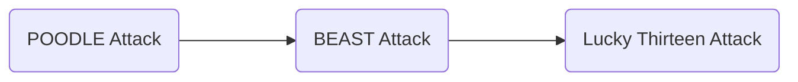

> **共通鍵暗号**
> 暗号化と復号で **同じ鍵** を使い、暗号化で使う鍵を **秘密** にする方式
> ex.) AES, DES, ChaCha20 など

## 共通鍵暗号
共通鍵暗号は純粋に公開鍵暗号を包含する暗号であるからより簡単、より高速な構成ができます。ただ鍵の受け渡しは不可能なので公開鍵暗号を用いた鍵共有

1. 共通鍵を用いて暗号化/復号する
2. 復号可能 $\iff$ 暗号化する関数が単射である
3. 暗号文から平文に関する情報を得ることが困難である
4. 暗号文を改変しても

ここではビット列をめちゃくちゃ使うので短くする為に記号やらを導入します。人間が作った規格を定義に落とし込むと分かりにくくなるのでちょっと曖昧に定義します。

> **Def. ビット列**
> ビット列とはコンピュータ上で扱われる 0, 1 の羅列である。ビット列と文字列や整数、多項式環は一般に扱われるように相互変換でき、同一視することにする。これに対して関数を定義する。
> - ビット列 $D_1, D_2$ に対して単純な結合を $D_1\|D_2$、XOR 演算を $D_1\oplus D_2$ と書く。
> - ビット列 $D$ に対してビット長を $\mathrm{len}(D)$ と書く。
> - ビット列 $D$ に対して $n$-bit ブロックとして前置, 後置ゼロパディングする関数をそれぞれ $Z_{f, n}(D), Z_{b, n}(D)$ と書く。

## AES
AES (Advanced Encryption Standard) は 2000 年に NIST が公募し選定した暗号標準で、 2001 年 11 月に [FIPS PUB 197](https://nvlpubs.nist.gov/nistpubs/fips/nist.fips.197.pdf) として公表されました。

AES の選定では次のような条件を課しました。

- ブロック暗号でブロック長が 128 ビットであること
- 暗号強度が高く処理が高速に行えること
- 鍵長は 128, 192, 256 の 3 種類をサポートすること
- 仕様と設計基準が完全に公開されていること
- ライセンスフリーで使用できること

AES はあるラウンド関数を繰り返す SPN 構造 (Substitution Permutation Network Structure) で基本的に次の 4 つの操作を 1 ラウンドとして 10 ラウンド繰り返します。

1. AddRoundKey
秘密鍵からラウンド数に応じたラウンド鍵を生成し XOR を取る。
2. SubBytes
1 バイトの置換表 S-box を用いてバイトごとに変換します。具体的には下のような表を用います。単純ですがほとんどの置換表は非線形変換となり、差分解析法などの攻撃に対してかなり強く、AES の安全性の要となっています。
3. ShiftRows
$16$ バイトを $4\times 4$ に分け、行ごとにサイクリックシフトする。
4. MixColumn
$16$ バイトを $4\times 4$ に分け、列ごとに $\mathbb{F}_{2^8} \cong \mathbb{F}_2[x]/(x^8 + x^4 + x^3 + x + 1)$ 上でビット演算する。

SPN 構造の名前の由来である置換 (Substitution) と並べ替え (Permutation) はそれぞれ SubBytes と ShiftRows, MixColumn に対応します。

```c
const uint8_t sbox[] = {
  0x63, 0x7c, 0x77, 0x7b, 0xf2, 0x6b, 0x6f, 0xc5, 0x30, 0x01, 0x67, 0x2b, 0xfe, 0xd7, 0xab, 0x76,
  0xca, 0x82, 0xc9, 0x7d, 0xfa, 0x59, 0x47, 0xf0, 0xad, 0xd4, 0xa2, 0xaf, 0x9c, 0xa4, 0x72, 0xc0,
  0xb7, 0xfd, 0x93, 0x26, 0x36, 0x3f, 0xf7, 0xcc, 0x34, 0xa5, 0xe5, 0xf1, 0x71, 0xd8, 0x31, 0x15,
  0x04, 0xc7, 0x23, 0xc3, 0x18, 0x96, 0x05, 0x9a, 0x07, 0x12, 0x80, 0xe2, 0xeb, 0x27, 0xb2, 0x75,
  0x09, 0x83, 0x2c, 0x1a, 0x1b, 0x6e, 0x5a, 0xa0, 0x52, 0x3b, 0xd6, 0xb3, 0x29, 0xe3, 0x2f, 0x84,
  0x53, 0xd1, 0x00, 0xed, 0x20, 0xfc, 0xb1, 0x5b, 0x6a, 0xcb, 0xbe, 0x39, 0x4a, 0x4c, 0x58, 0xcf,
  0xd0, 0xef, 0xaa, 0xfb, 0x43, 0x4d, 0x33, 0x85, 0x45, 0xf9, 0x02, 0x7f, 0x50, 0x3c, 0x9f, 0xa8,
  0x51, 0xa3, 0x40, 0x8f, 0x92, 0x9d, 0x38, 0xf5, 0xbc, 0xb6, 0xda, 0x21, 0x10, 0xff, 0xf3, 0xd2,
  0xcd, 0x0c, 0x13, 0xec, 0x5f, 0x97, 0x44, 0x17, 0xc4, 0xa7, 0x7e, 0x3d, 0x64, 0x5d, 0x19, 0x73,
  0x60, 0x81, 0x4f, 0xdc, 0x22, 0x2a, 0x90, 0x88, 0x46, 0xee, 0xb8, 0x14, 0xde, 0x5e, 0x0b, 0xdb,
  0xe0, 0x32, 0x3a, 0x0a, 0x49, 0x06, 0x24, 0x5c, 0xc2, 0xd3, 0xac, 0x62, 0x91, 0x95, 0xe4, 0x79,
  0xe7, 0xc8, 0x37, 0x6d, 0x8d, 0xd5, 0x4e, 0xa9, 0x6c, 0x56, 0xf4, 0xea, 0x65, 0x7a, 0xae, 0x08,
  0xba, 0x78, 0x25, 0x2e, 0x1c, 0xa6, 0xb4, 0xc6, 0xe8, 0xdd, 0x74, 0x1f, 0x4b, 0xbd, 0x8b, 0x8a,
  0x70, 0x3e, 0xb5, 0x66, 0x48, 0x03, 0xf6, 0x0e, 0x61, 0x35, 0x57, 0xb9, 0x86, 0xc1, 0x1d, 0x9e,
  0xe1, 0xf8, 0x98, 0x11, 0x69, 0xd9, 0x8e, 0x94, 0x9b, 0x1e, 0x87, 0xe9, 0xce, 0x55, 0x28, 0xdf,
  0x8c, 0xa1, 0x89, 0x0d, 0xbf, 0xe6, 0x42, 0x68, 0x41, 0x99, 0x2d, 0x0f, 0xb0, 0x54, 0xbb, 0x16,
};
```

細かい実装は練習問題に回すとして AES の応用について考えます。

AES-NI: CPU 命令を追加することで高速化

他の共通鍵暗号としてはワンタイムパッドや DES, ChaCha20-Poly1305 があります。

> **バーナム暗号 (ワンタイムパッド)**
> 疑似乱数によって生成された数列を共通鍵として共有し、平文に対して繰り返し鍵で XOR を掛ける暗号です。
>
> 具体的には $i = 0,\ldots, m$ としてバイトごとに分けた平文 $P_i$ と $n$ バイトの鍵 $K_i$ として暗号文 $C_i = P_i \oplus K_{i \bmod n}$ と計算する。

TODO: 脆弱性

```python
def onetime_pad(m: bytes, key: bytes) -> bytes:
    n = len(key)
    c = b""
    for block in range(0, len(m), n):
        for i in range(n):
            if block + i >= len(m):
                break
            c += (m[block + i] ^ key[i]).to_bytes(1, "big")
    return c

c = onetime_pad(b"I'm your father", b"\x0a\x6c\x3e\x78")
print(c)
```

AES 以前に使われていた共通鍵暗号
DES は内部で Feistel 構造を取っていて

> **Feistel 構造**
> DES で使われた暗号化の為の内部構造です。
>
> 暗号化: $R_{r+1} = L_r \oplus F(R_r, k_r)$, $L_{r+1} = R_r$
> 復号: $L_r = R_{r+1} \oplus F(L_{r+1}, k_r)$, $R_r = L_{r+1}$

撹拌性はよくないことが知られています。
TODO: 撹拌性の検証コードを実装する


ストリーム暗号 ChaCha20-Poly1305
TLS 1.3 で使われているもう一つの暗号です。

:::message
**練習問題**
- Medium: AES を作ってみましょう。[CryptoHack](https://cryptohack.org/challenges/aes/) を見るとよさそう。
- Easy: AES では暗号化関数だけで復号が出来ます。なぜでしょうか。
- Hard: AES のラウンド回数が 2 回など少ない場合、解読出来てしまいます。どうすれば解読できるでしょうか。(Pwn2Win CTF 2021 A2S)
:::

### パディング
AES はブロック暗号なので **16 バイトごとでしか** 暗号化できません。平文の始めから 16 バイトずつ切り出して暗号化していくと最後に余るデータがあります。当然それも暗号化して送りたいので 16 バイトになるように適当なデータをくっつけて暗号化します。この操作をパディングと呼び、AES では PKCS #7 パディングという規格でパディングを行います。

PKCS #7 Padding は次のように余った数をそのままバイトに変換して余った数だけ繋げるようにします。

パディングした平文を $P$ として $P = P_1\|\cdots\|P_n$ と複数のブロックに分割し、それぞれのブロックで暗号化します。

```python
from Crypto.Util.Padding import pad, unpad

texts = [
    b"",
    b"a",
    b"Cryptography",
    b"GettingOverIt",
    b"Lycoris Recoil",
    b"No Game No Life",
    b"Sound! Euphonium",
]

for text in texts:
    assert text == unpad(pad(text, 16), 16)
    assert len(pad(text, 16)) % 16 == 0
    print(pad(text, 16))

# stdout
b'\x10\x10\x10\x10\x10\x10\x10\x10\x10\x10\x10\x10\x10\x10\x10\x10'
b'a\x0f\x0f\x0f\x0f\x0f\x0f\x0f\x0f\x0f\x0f\x0f\x0f\x0f\x0f\x0f'
b'Cryptography\x04\x04\x04\x04'
b'GettingOverIt\x03\x03\x03'
b'Lycoris Recoil\x02\x02'
b'No Game No Life\x01'
b'Sound! Euphonium\x10\x10\x10\x10\x10\x10\x10\x10\x10\x10\x10\x10\x10\x10\x10\x10'
```

## 暗号利用モード
通常の暗号化関数のみで実装するとストリーム暗号が使えなかったり、セキュリティ的に脆弱な危険性があります。これを改善する為に作られたのが暗号利用モードです。

AES の暗号化関数自体の解読不可能性をバイパスして暗号利用モードやプロトコルの脆弱性により攻撃できる場合があります。特に CTF では ECB, CBC, GCM モードが使われるのでこれについて紹介します。その他の暗号利用モードは Wikipedia を参照すると良いです。

https://ja.wikipedia.org/wiki/%E6%9A%97%E5%8F%B7%E5%88%A9%E7%94%A8%E3%83%A2%E3%83%BC%E3%83%89

### AES-ECB (Electronic CodeBlock)
平文を 16 バイトブロックごとに暗号化して暗号文を作り、復号もブロックごとに復号するという最も単純な暗号利用モードです。

$$
\begin{aligned}
C_i & = E_K(P_i) \\
P_i & = E_K(C_i)
\end{aligned}
$$


### リプレイ攻撃
一見ﾖｼｯって言いたくなりますが各ブロックでリプレイ攻撃が可能です。

ブロックごとに平文と暗号文が対応するので平文と暗号文の対応を知っていればどのブロックもそれに改ざんできます。

それぞれのブロックに細工を仕込んで意図したリプレイ攻撃が出来ないようにしたいです。そのようにして考えられたのが次で紹介する CBC モードです。

:::message
**練習問題**
ECB モードでは他にも次のような攻撃ができます。
- Medium: ユーザーが任意の文字列 `m` を与えるとサーバーから ECB モードで暗号化された `Enc(m | flag)` が送られてくるときユーザーは `flag` を獲得できる。どうやって？
- Medium: AES-ECB で平文を暗号化するサーバー上で json などある形式において特定の意味を持つ平文を禁止してもバイパスされる危険性がある。なぜか。
:::

### AES-CBC (Cipher Block Chaining)
CBC モードはプロトコルによっては脆弱となりうるので TLS 1.3 で廃止されました。

CBC モードでは鍵以外に初期ベクトル IV (Initialization Vector) を追加します。これを初期状態として前の暗号文と平文と掛け合わせて暗号化することを繰り返して暗号化します。これによって各ブロックでのリプレイ攻撃を防ぐことができます。

$$
\begin{aligned}
C_i & = \begin{cases}
  IV & (i = 0) \\
  E_K(P_i\oplus C_{i-1}) & (i > 0)
\end{cases} \\
P_i & = E_K(C_i)\oplus C_{i-1}
\end{aligned}
$$

しかしよく考えてみると依然として全体のリプレイ攻撃は出来てしまいます。それを解決させるには初回で話したメッセージ改ざん検知: MAC を用いることで検証を行い、リプレイ攻撃されたかどうかを検知します。


### Padding Oracle Attack
ただしエラーかどうかという情報を攻撃者に返してしまうとたちまち脆弱となります。それが次に話す Padding Oracle Attack の根幹です。
CBC モード自体は安全なのですが、プロトコルの作り方や組み合わせ方によっては安全ではなくなります。Oracle は企業の Oracle ではなくて神託と呼ばれる神様が発した言葉のことです。パディング

CTF での典型的な解き方としては Padding Oracle Attack を使って暗号/復号化関数 $E_k$ を作れれば、鍵を考えなくても復号することができ、逆変換を辿るだけで解けます。



POODLE Attack (Padding Oracle On Downgraded Legacy Encryption)

さらにこれを応用して BEAST Attack (Browser Exploit Against SSL/TLS) は TLS の脆弱性を用いた攻撃ができ、Cookie のセッション情報を狙うことができるなど実用的な攻撃が通った。Same Origin Policy があることで防止された。

Lucky Thirteen Attack では Oracle がわからずともパディング処理の微妙な遅れを検知して同様の攻撃をします。(元論文によると時間差 80ns を繰り返して)

### AES-GCM (Galois/Counter Mode)
AES 利用モードの中で TLS 1.3 で使われている唯一のモードです。ガロア体 (有限体) 上で Counter (CTR) モードを実行するのでこんな名前になってます。

CBC モードで可能だった Padding Oracle Attack は GCM モードで構造を複雑にすることで防いでいます。更にメッセージ改ざん検知を暗号化と一緒に行うようにすることでリプレイ攻撃にも耐性が付いています。

これを理解するにはまず GHASH と GCTR という操作を定義します。

> **Def. GHASH**
> 128-bit ブロックの入力を $X = X_1\|\cdots\|X_n$、 $H = E_k(Z_{f, 128}(0))$ とおきます。このとき次のように $\lbrace Y_i\rbrace$ を生成したとき GHASH 関数を $\mathrm{GHASH}_H(X) = Y_n$ と定義します。
>
> $$
\begin{aligned}
Y_0 & = 0 \\
Y_i & = (X_i + Y_{i-1})\cdot H \\
\end{aligned}
$$
>
> ただし、$\lbrace Y_i\rbrace$ は有限体 $\mathbb{F}_{2^{128}} \cong \mathbb{F}_2[x]/(x^{128} + x^7 + x^2 + x + 1)$ 上で計算されます。

> **Def. GCTR**
> 128-bit ブロックの入力を $X = X_1\|\cdots\|X_n$、鍵を $K$ として生成した $\lbrace Y_i\rbrace$ に対して $Y = Y_1\|\cdots\|Y_n$ とすると GCTR 関数を $\mathrm{GCTR}_K(ICB, X) = Y$ と定義します。
>
> $$
Y_i = E_K(ICB + (i-1)) \oplus X_i \qquad (i = 1,\ldots,n)
$$

このモードの本質は GCTR です。$E_K$ で作られた予測困難な値と平文とを XOR することで暗号文を作り出します。このとき $ICB$ が予測可能なら解読されてしまいますが、 $IV$ と $K$ を用いて構成するのでそれらを知られない限り予測できません。

それでは実際にこれらを用いて実装します。まず暗号文を計算します。

$$
\begin{aligned}
J_0 & = \begin{cases}
Z_{b, 128}(IV) + 1 & (\mathrm{len}(IV) = 96) \\
\mathrm{GHASH}_H(Z_{b, 128}(IV)\|Z_{f, 128}(\mathrm{len}(IV))) & (\mathrm{len}(IV) \neq 96)
\end{cases} \\
C & = \mathrm{GCTR}_K(J_0 + 1, P)
\end{aligned}
$$

また暗号文とは別に認証タグを生成します。これは復号するときにこのタグと一緒に入力することで暗号文が改ざんされたかどうかを検知することができる代物です。暗号文 $C$ とオプショナルの認証データ (AAD; Additional Authenticated Data) $A$ を用意して投げると出てきます。

$$
T = \mathrm{GCTR}_K(J_0, \mathrm{GHASH}_H(Z_{b, 128}(A)\|Z_{b, 128}(C)\|Z_{f, 64}(\mathrm{len}(A))\|Z_{f, 64}(\mathrm{len}(C))))
$$

このように計算して出てきた $T$ を上から平文の長さだけ取ってきたものが認証タグとなります。

復号は認証タグを同様に計算して送られてきたタグと一致しなかったら失敗、一致してたら次のように平文を計算して返します。

$$
P = \mathrm{GCTR}_K(J_0 + 1, C)
$$

暗号化と認証タグの GCTR の初期ベクトルが 1 だけ違うのを見ると認証タグから鍵導出のヒントをもらうのを防いでいそうな感じがします。

このように暗号化と同時に完全性や認証性も実現するための暗号方式が考案され、それらを総称して AEAD (Authenticated Encryption with Asocciated Data) と呼ばれます。暗号スイートの MAC の部分に AEAD という表記があるものは、暗号モードとして認証付き暗号の GCM が利用されています。

### Nonce の使いまわし
Nonce とは初期ベクトル $IV$ と鍵 $K$ のこと。Nonce がランダムではないとすると、ある平文と暗号文のペアが分かれば任意の暗号の解読が出来てしまいます。

これは GCTR における予測困難な値がペアを XOR することで得られてしまうからです。

さらに認証タグについても差分解読法を用いて解読できます。

### その他の攻撃
耐量子性
最近だと耐量子性も考える必要が出てきました。量子アルゴリズムの1つ Grover's algorithm によって全探索の計算量が $2^{K}\to 2^{K/2}$ と減少した為、鍵長を倍の長さにしないと同じ安全性を担保できません。

サイドチャネル攻撃

他にも共通鍵暗号への攻撃には Integral Cryptanalysis がありますがそれらは「ハッシュと SMT」で紹介します。

## まとめ
共通鍵暗号の仕組みと AES の構築/攻撃を学びました。

## 参考文献
- [NIST Special Publication 800-38D Recommendation for Block Cipher Modes of Operation: Galois/Counter Mode (GCM) and GMAC](https://nvlpubs.nist.gov/nistpubs/legacy/sp/nistspecialpublication800-38d.pdf)
- [暗号利用モード - Wikipedia](https://ja.wikipedia.org/wiki/%E6%9A%97%E5%8F%B7%E5%88%A9%E7%94%A8%E3%83%A2%E3%83%BC%E3%83%89)
- https://www.scutum.jp/information/waf_tech_blog/2011/10/waf-blog-008.html
- https://gist.github.com/theoremoon/8bcb9b87dcb1289cf13c9db4431db324
- Al Fardan, N.J. and K.G. Paterson, "Lucky Thirteen: Breaking the TLS and DTLS record protocols", n.d., <https://ieeexplore.ieee.org/iel7/6547086/6547088/06547131.pdf>.

tweakable block cipher

この資料は CC0 ライセンスです。