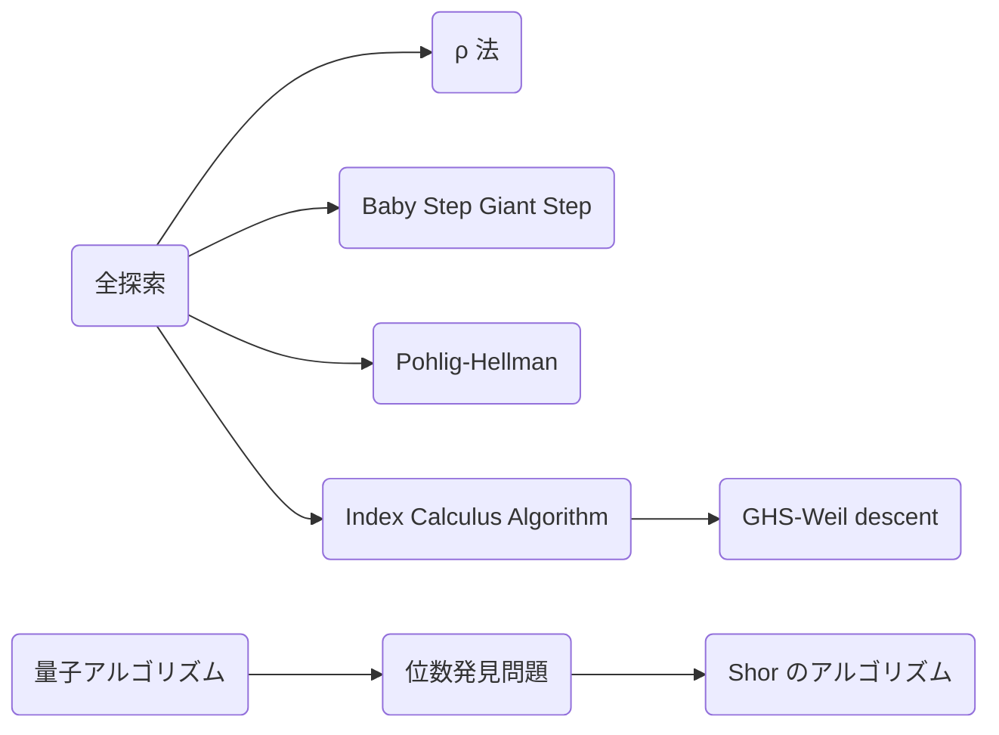

楕円曲線の理論は群環体、ガロア理論、可換環論、代数幾何学と理解した先になるので付け焼き刃程度しか書けないです。網羅的かつ短くまとめるのが難しいので削れるところは曖昧に書きます、許してください。

## 楕円曲線

> **Def. 楕円曲線**
> $K$ を体、 $f(x) \in K[x]$ を 3 次方程式としたときに関数 $y^2 = f(x)$ を楕円曲線 $E/K$ という。また $K$ の標数が $2, 3$ でないとき $x, y$ の線形変換によって 2 次項を消すことができ、$a, b\in K$ を用いて次のように書ける。
>
> $$
E/K: y^2 = x^3 + ax + b
$$

ここにグラフ

> **Def. 楕円曲線上の和**
> 楕円曲線 $E$ 上の点同士の演算 $+: E\times E \to E$ の群 $(E, +)$ を定義する。まず単位元を無限遠点 $\mathcal{O}$、点 $P(x, y)$ の逆元を $-P = (x, -y)$ とする。このとき $P(x_1, y_1), Q(x_2, y_2)$ に対して $R(x_3, y_3) = P + Q$ を次のように定義する。
>
> $$
\begin{aligned}
x_3 &= \lambda^2 - x_1 - x_2 \\
y_3 &= \lambda(x_1 - x_3) - y_1 \\
\lambda &=
\begin{dcases}
\frac{y_2 - y_1}{x_2 - x_1} \quad (P \neq Q) \\
\frac{3x_1^2 + a}{2y_1} \quad (P = Q)
\end{dcases}
\end{aligned}
$$
>
> これは交換法則、可換則を満たし、可換群となる。

ここに図

特に実数体 $\mathbb{R}$ 上の楕円曲線のグラフ上で見ると、点 $P, Q$ に対して直線 $PQ$ ($P = Q$ のとき点 $P$ での接線) と曲線との交点について $y$ 座標を符号反転した点が $P + Q$ となります。

https://andrea.corbellini.name/ecc/interactive/reals-add.html

交換法則が成り立つので $nP := \overbrace{P + \cdots + P}^n$ と定義します。

ここに具体例

ここに実装

ここでは特に有理数体 $\mathbb{Q}$ または有限体 $\mathbb{F}_q$ のときについて考える。

CTF において楕円曲線の問題が出されたときに位数は解法を決定する要素としてバチクソ重要です。その位数に関して最も重要な定理があります。

> **Thm. Hasse の定理**
> 楕円曲線 $E/\mathbb{F}_q$ の位数 $\#E(\mathbb{F}_q)$ について次の条件で押さえられる。
>
> $$
|\#E(\mathbb{F}_q) - (q+1)|\leq 2\sqrt{q}
$$

詳しい証明は [Hasse's Theorem on Elliptic Curves](https://fse.studenttheses.ub.rug.nl/10999/1/opzet.pdf) に書いてあります。ここでは標数が 5 以上についての証明の筋書きだけ記します。

**Proof.**
まずベースとなる楕円曲線 $E/\mathbb{F}_q$ を次のように定義する。

$$
E/\mathbb{F}_q: y^2 = x^3 + ax + b
$$

次に $s^2 = f(t) = t^3 + at + b$ とおき、有理関数体上の楕円曲線 $E^{tw}/\mathbb{F}_q(t)$ を定義する。

$$
E^{tw}/\mathbb{F}_q(t): f(t)y^2 = x^3 + ax + b
$$

これらは同型写像 $\phi: E/\mathbb{F}_q\ni (x, y)\mapsto (x, y/s) \in E^{tw}/\mathbb{F}_q(t)$ が存在するので同型 $E/\mathbb{F}_q \cong E^{tw}/\mathbb{F}_q(t)$ となる。ここで体を拡大した楕円曲線 $E/\mathbb{F}_q(t, s)$ における点 $(t, s)$ とそのフロベニウス写像の像 $(t^q, s^q)$ を同型写像 $\phi$ で移した点を $Q, P_0\in E^{tw}/\mathbb{F}_q(t)$ とおく。

$$
\begin{aligned}
Q & = (t, 1) \\
P_0 & = (t^q, s^{q-1}) = (t^q, (t^3 + at + b)^{(q-1)/2})
\end{aligned}
$$

これらを用いて点 $(x_n, y_n) = P_n = P_0 + nQ$ を生成する。このとき $x_n = f_n/g_n \in \mathbb{F}_q(t)$ と書けて $d_n$ を次のように定義する。

$$
d_n = \begin{cases}
0 & \mathrm{if}\ P_n = \mathcal{O} \\
\deg(f_n) & \mathrm{otherwise}
\end{cases}
$$

例えば $d_0 = \deg(f_0) = \deg(t^q) = q$ となる。このとき色々計算すると次の漸化式が成り立つことが分かる。

$$
d_{n-1} + d_{n+1} = 2d_n + 2
$$

また色々計算すると $d_{-1} = \#E(\mathbb{F}_q)$ と分かる。この $d_n$ に関する 3 つの式から $d_n$ が求まる。

$$
d_n = n^2 - (\#E(\mathbb{F}_q) - (q + 1))n + q
$$

$d_n$ は $n$ に関する二次方程式となり、その判別式 $D$ は次のようになる。

$$
D = (\#E(\mathbb{F}_q) - (q + 1))^2 - 4q
$$

$D > 0$ とすると 2 つの解 $\alpha$, $\beta$ が存在するが、整数 $n$ に対して $d_n \geq 0$ であるから 2 つの解の差は多くとも 1 である。また $D$ は整数であるから $D = (\beta - \alpha)^2 = 1$ となる。これより 2 つの解は $k$, $k+1$ と書けて $d_n = n^2 - (2k + 1)n + k(k+1)$ より方程式を比較して $q = k(k+1)$ となる。ただ $q$ は奇数に対し、 $k(k + 1)$ は偶数であるから不適である。
よって $D \leq 0$、つまり標数 5 以上の Hasse の定理が示された。

$$
|\#E(\mathbb{F}_q) - (q+1)|\leq 2\sqrt{q}
$$
$\Box$

例えば

次に実際に位数を計算する為にはフロベニウス写像を知らないと難しいです。

> **フロベニウス写像の特性多項式**
> 楕円曲線 $E/\mathbb{F}_q$ におけるフロベニウス写像を次のように定義する。
>
> $$
\phi: (x, y)\mapsto (x^q, y^q)
$$
>
> ここで $t = \#E(\mathbb{F}_q) - (q+1)$ とおくと次の式が成り立つ。
>
> $$
\phi^2 - t\phi + q = 0
$$

**Proof.**
微分

Hasse の定理より $t\approx 2\sqrt{q}$ とかなり大きいので全探索では間に合わなさそうです。中国剰余定理によって $t$ を求めるというのが Schoof のアルゴリズムです。

> **Schoof のアルゴリズム**
> 楕円曲線 $E/\mathbb{F}_q$ の位数 $\#E(\mathbb{F}_q)$ を $O(\log^8q)$ で求められる。

**Proof.**
フロベニウス写像 $\phi$ の特性多項式を用いて $t$ を求める。

$$
\phi^2 - t\phi + q = 0
$$

これに小さな素数 $l$ を用いて $l$ ねじれ群 $E[l] = \lbrace P\in E(\mathbb{F}_q)\mid lP = \mathcal{O} \rbrace$ の元 $P = (x, y)\in E[l]$ を特性多項式に入れる。

$$
t(x^q, y^q) = (x^{q^2}, y^{q^2}) + q(x, y)
$$

右辺を計算し、左辺について $t\in [-(l-1)/2, (l-1)/2]$ の範囲で全探索を行って一致したときの値が $t \bmod l$ となる。よって様々な $l_i$ を用いて $t \bmod l_i$ が分かれば中国剰余定理から $t$ が求まる。$\Box$

この $l_i$ ってどうやって求めるんだ。

今回はフロベニウス写像の特性多項式を使いましたが、モジュラー多項式を使うことで $O(\log^8q)$ から $O(\log^6q)$ へ高速化できます。

このように位数を意のままに

上で示した楕円曲線は限定的な定義でこれより一般の楕円曲線や特殊な曲線として Weierstrass, Montgomery, twisted Edwards, Hessian などなどさまざまな曲線がありますが、あまり重要ではないので詳しくは CM の後で！

## 楕円曲線暗号

楕円曲線暗号 (ECC) はRSA暗号と同時期に開発された暗号で1985年頃に Victor S. Miller と Neal Koblitz が同時期かつ独立に発明しました(ちなみにMiller-Rabin素数判定法のMillerはGary L. Millerで別人です)。特徴としては RSA 暗号よりも純粋に強い暗号であることや鍵長が短いことなどが挙げられます。

さて、ここでこの楕円曲線上の加法を用いた次のような問題を作れます。

> **楕円曲線上の離散対数問題 (ECDLP : Elliptic Curve Discrete Logarithm Problem)**
> 楕円曲線上の点 $P, Q$ に $Q=dP$ という関係があるとき $d$ を求めよ。

つまり楕円曲線の世界で「割り算」をしなさいという問題です。

実はこの問題はとても難しく、これを解く効率的なアルゴリズムは現在見つかっていません。この ECDLP を利用して暗号の形にしたものが楕円曲線暗号です。

### ECDH (Elliptic Curve Diffie–Hellman key exchange)

暗号通信をする為に使われる暗号プロトコルです。

Alice と Bob は AES などの共通鍵暗号を用いて暗号通信しようとしていますが、始めに2人だけの秘密である共有鍵が必要です。しかしそれを直接共有してしまうと、第三者から鍵を盗聴されて通信を覗き見られてしまいます。そこで暗号を用いることで鍵を直接共有することなく共有鍵を構築することができます。この手法をディフィーヘルマン鍵共有 (DH) と呼び、DH の中でも ECDLP を安全性根拠とする DH を楕円曲線ディフィーヘルマン鍵共有 (ECDH) と呼びます。

具体的には次のような方法で ECDH を実現します。

ここに図

> **楕円曲線ディフィーヘルマン鍵共有 (ECDH)**
> 1. セットアップ: 楕円曲線 $E/\mathbb{F}_p$ とベースポイント $P\in E/\mathbb{F}_p$ を共有する
> 2. 鍵生成: Alice と Bob はそれぞれ疑似乱数 $d_A, d_B$ を生成し、$d_A, d_B$ を秘密鍵、$Q_A = d_AP, Q_B = d_BP$ を公開鍵として公開する
> 3. 鍵交換: Alice と Bob は自分の秘密鍵と相手の公開鍵を掛けると $S = d_Ad_BP = d_AQ_B = d_BQ_A$ となり、$S$ の $x$ 座標をハッシュ化したものが Alice と Bob のみが知る共通鍵となる

このように攻撃者は $(G, dG)$ が分かっても ECDLP が解けない為に $d$ が分からず、安全に共通鍵を共有することができます。

ここに実装

暗号標準を定める国際機関によって楕円曲線が
https://neuromancer.sk/std/

## ECDLP

DLP で書いた手法を用いることで解くことができます。Pollard-rho 法や GSBS 法は計算機代数の章を見ながら実装すればいいです。あと数体ふるい法は ECDLP 上では有効ではないらしいので Pohlig-Hellman と Index Calculus Algorithm とその派生を紹介します。詳しい方ここらへん教えてください。



### Pohlig-Hellman

中国剰余定理を用いて大きな群を複数の小さな群の直積に分けます。楕円曲線暗号の楕円曲線の位数は細かく素因数分解できることが多いので RSA とかと違って有効な手法になります。

楕円曲線の位数 $\#E = p_1^{e_1}p_2^{e_2}\ldots p_k^{e_k}$ と素因数分解して $Q = dP$ となるとき次のように $d_i$ を定義する。

$$
d = d_0+d_1p_i+d_2p_i^2+\ldots+d_{e_i−1}p_i^{e_i−1} \quad \pmod{p_i^{e_i}} \\
$$

これより次の関係式が成り立つ。

$$
\frac{\#E}{p_i}Q = d_0\left(\frac{\#E}{p_i}P\right)
$$

この $d_0$ は ECDLP を用いて $\mathcal{O}(\sqrt{p_i})$ で求まります。次に $d_0,\ldots,d_{j-1}$ を知っているときに $d_j$ を計算する為に次のように変形します。

$$
\begin{aligned}
\frac{\#E}{p_i^{j+1}}Q & = (d_0+\cdots+d_{j}p_i^{j})\left(\frac{\#E}{p_i^{j+1}}P\right) \\
\frac{\#E}{p_i^{j+1}}Q & - (d_0+\cdots+d_{j−1}p_i^{j−1})\left(\frac{\#E}{p_i^{j+1}}P\right) = d_{j}\left(\frac{\#E}{p_i}P\right)
\end{aligned}
$$

これより ECDLP を解くことで $d_j$ が求まります。

```python
fact = factor(G.order())
ord = int(G.order())
dlogs = []
for p, e in fact:
    t = ord // p ^ e
    dlog = discrete_log(t * Q, t * G, operation="+")
    dlogs += [dlog]

print(crt(dlogs, primes))
```

### Index Calculus Algorithm
種数が大きい超楕円曲線上の ECDLP では Index Calculus Algorithm を応用することができます。次の Gaudry アルゴリズム

$B$ 以下の素数に代えて、次数 $s$ 以下の多項式の因子基底を用意して Mumford 表現に現れる多項式 $U$ が因子基底の要素に分解される場合に対して $B = \lbrace P_j\in C(\mathbb{F}_p)\setminus P_\infty\mid X(P_j)\neq X(P_i) for i \neq j\rbrace$

$$
\begin{aligned}
r_i\mathcal{D}_b & = \sum_{j=1}^n e_{ij}P_j^{e_{ij}} - mP_\infty \\
\begin{pmatrix}
r_i\mathcal{D}_b \\
\vdots \\
r_i\mathcal{D}_b
\end{pmatrix}
& = \begin{pmatrix}
e_{11} & \cdots & e_{m1} \\
\vdots & \ddots & \vdots \\
e_{1n} & \cdots & e_{mn}
\end{pmatrix}
\begin{pmatrix}
\log_{\mathcal{D}_b} P_i \\
\vdots \\
\log_{\mathcal{D}_b} P_i
\end{pmatrix} \\
\mathcal{D}_a + r\mathcal{D}_b & = \prod_{j=1}^n s_jP_j - mP_\infty \\
x = \log_{\mathcal{D}_b}\mathcal{D}_a & = \sum_{j=1}^ns_j\log_{\mathcal{D}_b}P_j - r \bmod N
\end{aligned}
$$

$\mathcal{O}(g!g^3p(\log p)^3 + g^3p^2(\log p)^2)$

### GHS-Weil descent 攻撃
楕円曲線の $\mathbb{F}_{p^k}$ 有理点群 $E(\mathbb{F}_{p^k})$ を種数 $g\geq k$ の代数曲線 $C$ の Jacobian の有理点群 $\mathcal{J}_C(\mathbb{F}_p)$ に埋め込み、 $\mathcal{J}_C(\mathbb{F}_p)$ 上で Gaudry アルゴリズムで解く

## 攻撃手法

この ECDLP を解くことができれば ECDH を含め、様々な楕円曲線暗号を解くことができます。さて主に攻撃対象となる楕円曲線暗号は以下のようなものがあります。

| アンチケース | 攻撃名   | 方法 |
| ---- | --- | ---- |
| なし | ECDLP | 単純に ECDLP を解く |
| 位数が Smooth number $\#E/\mathbb{F}_p = p_1^{e_1}p_2^{e_2}\ldots p_k^{e_k}$ | Pohlig Hellman Attack | 位数 $p_i$ の小さな ECDLP に分解できる |
| Anomalous な曲線 $\#E/\mathbb{F}_p = p$ | SSSA Attack | $\mathbb{F}_p^+$ 上の DLP に帰着できる |
| Supersingular な曲線 $\#E/\mathbb{F}_p = p+1$ | MOV / FR Reduction | 埋め込み次数 $k$ を用いて $\mathbb{F}_{p^k}^\times$ 上の DLP に帰着できる |
| Singular な曲線 $\Delta(E/\mathbb{F}_p) = 0$ | Singular Curve Point Decompression Attack | $\mathbb{F}_p^+$ や $\mathbb{F}_p^\times, \mathbb{F}_{p^2}^\times$ 上の DLP に帰着できる |
| 楕円曲線上に存在しない点や位数の少ない点を指定できる | Invalid Curve Attack / Small-Subgroup Attack | さまざまな少ない位数の点を収集して中国剰余定理 |

### Supersingular な曲線を用いてはならない (MOV/FR Reduction)
Supersingular な楕円曲線のとき、ペアリングを用いて有限体上の DLP に帰着できるという方法です。

まず Supersingular (超特異) な楕円曲線というのは位数が $q + 1$ となるような楕円曲線です。

$$
y^2 = x^3 + (1 - b)x + b
$$

ペアリングというのは双線形写像のことです。

> **Def. 双線形写像 (Bilinear map)**
> 群 $G_1, G_2$ について写像 $f: G_1\times G_1\to G_2$ が次を満たすとき、$f$ を双線形写像あるいはペアリングという。
>
> $$
\begin{aligned}
f(x_1x_2, y) = f(x_1, y)f(x_2, y) \\
f(x, y_1y_2) = f(x, y_1)f(x, y_2)
\end{aligned}
$$

楕円曲線暗号では Weil pairing や Tate pairing などのペアリングを使いますが、これらのペアリングは因子 (divisor) と呼ばれる概念を通じて理解します。

> **Def. 因子 (divisor)**
> $\mathcal{D} \in\mathrm{Div}(C)$ 自由アーベル群

この因子を求めるアルゴリズムを Miller's algorithm といいます。

> **Miller's algorithm**
>
> $$
N = \epsilon_0 + \epsilon_1\cdot 2 + \cdots + \epsilon_t\cdot 2^t
$$
>
> $\mu_m$ $\mu_m\subseteq\mathbb{F}_{q^d}^\times$
>
> $$
h_{P, Q} = \begin{dcases}
\frac{y - y_P - \lambda(x - x_P)}{x + x_P + x_Q - \lambda^2 - a_1\lambda + a_2} & (\lambda\neq\infty) \\
x - x_P & (\lambda = \infty)
\end{dcases}
$$

```python
def h(P, Q, R):
    if (P == Q and P.y == 0) or (P != Q and P.x == Q.x):
      return R.x - P.x
    L = P.line_coeff(Q)
    p = R.y - P.y - L * (R.x - P.x)
    q = R.x + P.x + Q.x - L * L
    return p / q

def miller(E, P, Q, m):
    if P == Q:
        return 1
    f = 1
    T = P
    for i in reversed(m.bits()):
        f = f * f * h(T, T, Q)
        T = T + T
        if i == 1:
            f = f * h(T, P, Q)
            T = T + P
    return f
```

> **Weil pairing**
> $e_m: E[m]\times E[m] \to \mu_m$ となる
>
> $$
e_m(P, Q) = \frac{f_P(Q + S)}{f_P(S)}\bigg/\frac{f_Q(P - S)}{f_Q(-S)}
$$

> **Prop.**
> Weil pairing は次の条件を満たす。
> 1. 双線形 (bilinear)
> $e_n$ が双線形写像である。
> 2. 同一性 (idenntity)
> $e_n(P, P) = 1$
> 3. 非退化 (non-degenerate)
> 任意の $Q\in E[n]$ に対して $e_n(P, Q) = 1$ ならば $P = \mathcal{O}$ である。

$$
f_P(Q + S) = 103
$$

```python
def weil_pairing(E, P, Q, m, S=None):
    if S is None:
        S = E.random_point()
    fpqs = miller(E, P, Q + S, m)
    fps = miller(E, P, S, m)
    fqps = miller(E, Q, P - S, m)
    fqs = miller(E, Q, -S, m)
    return (fpqs / fps) / (fqps / fqs)
```

Weil pairing の代替として Tate-Lichtenbaum Pairing というペアリングも使います。

> **Def. Tate-Lichtenbaum Pairing**
> 楕円曲線 $E/K$ に対し 整数 $m$
> $P\in E(K)$ と $T\in E(K)[m]$ $Q\in E(\overline{K})$ $mQ = P$
>
> $$
G_{\overline{K}/K}\to \mu_m \\
\sigma\mapsto e_m(Q^\sigma - Q, T)
$$
>
> $$
\begin{aligned}
& \tau: \frac{E(K)}{mE(K)}\times E(K)[m] \to \frac{K^\times}{(K^\times)^m} \\
& \tau(P, T) = f(P)\bmod (K^\times)^m
\end{aligned}
$$

$$
K^\times/(K^\times)^m\to H^1(G_{\overline{K}/K}, \mu_m)
$$

> **Prop.**
> Tate-Lichtenbaum Pairing はペアリングである

**Proof.**
$\xi(\sigma) = e_m(Q^\sigma - Q, T)$ は $\xi: G_{\overline{K}/K}\to\mu_m$

$$
\begin{aligned}
\xi(\sigma\tau)
\end{aligned}
$$

$$
e_n(Q^\sigma - Q, T) = \frac{\sqrt[n]{\alpha}^\sigma}{\sqrt[n]{\alpha}} \qquad \forall \sigma\in G_{\overline{K}/K} \\
\tau(P, T) = \alpha \bmod (K^\times)^n
$$

```python
def tate_pairing(E, P, Q, m, k=2):
    f = miller(E, P, Q, m)
    return f ^ ((p ^ k - 1) // m)
```

$E(\mathbb{F}_{p^k}^\times)\cong\mathbb{Z}_{c_1n_1}\oplus\mathbb{Z}_{c_2n_1}$
必要となる最小の拡大次数 $d$ を埋め込み次数という。

> **Prop.**
> Supersingular な楕円曲線の埋め込み次数は $6$ 以下である。

**Proof.**
$q = p^2$ において Hasse の定理から次のようになる。

$$
|\#E(\mathbb{F}_{p^2}) - (p^2 + 1)| \leq 2p
$$

| $-t$ | $\#E(\mathbb{F}_{q^2})$ | $\#\mathbb{F}_{q^d}^\times$ | $d$ |
|:-:|:--|:--|:-:|
| $0$ | $(p^2 + 1)$ | $p^4 - 1 = (p^2 + 1)(p^2 - 1)$ | $4$ |
| $p$ | $(p^2 + 1) + p$ | $p^3 - 1 = (p - 1)(p^2 + p + 1)$ | $3$ |
| $-p$ | $(p^2 + 1) - p$ | $p^6 - 1 = (p^3 - 1)(p + 1)(p^2 - p + 1)$ | $6$ |
| $2p$ | $(p^2 + 1) + 2p = (p + 1)^2$ | $p^2 - 1 = (p + 1)(p - 1)$ | $2$ |
| $-2p$ | $(p^2 + 1) - 2p = (p - 1)^2$ | $p - 1$ | $1$ |

$\Box$

そうしてできたペアリングについて

> **MOV/FR Reduction**
> ペアリング $f$ について
> $e_m(P, Q)$
>

- Weil pairing を用いて MOV Reduction; Menezes-Okamoto-Vanstone Reduction という。
- Tate pairing を用いて Miller's algorithm を回すのを FR Reduction; Frey-Rück Reduction という。

FFDLP に落とし込めるが埋め込み次数が高いと ECDLP の方が計算量が小さくなってしまうので

`tate_pairing(E, P, Q.distortion_map(), m)`

### Anomalous な曲線を用いてはいけない
Anomalous の楕円曲線では SSSA (Semaev-Smart-Satoh-Araki) Attack が有効です。

$$
\lambda_E: E(\mathbb{F}_p)\xrightarrow{u}E(\mathbb{Q}_p)\xrightarrow{\times p}\ker\pi\xrightarrow{Formal \log}p\mathbb{Z}_p\xrightarrow{\bmod{p^2}} p\mathbb{Z}_p/p^2\mathbb{Z}_p\cong \mathbb{F}_p
$$

$\psi(x:y:z) := x/y$

$$
\log_E(t) := t - \frac{a_1}{2}t^2 + \frac{a_1^2 + a_2}{3}t^3 - \frac{a_1^3 + 2a_1a_2 + a_3}{4}t^4 + \cdots
$$

$A := (X_1, Y_1)\in E(\mathbb{Z}/p^2\mathbb{Z})$ 写像 $\pi(A) = P$ となる
$(X_{p-1}, Y_{p-1}) := (p-1)A$

$X_{p-1} \neq X_1$ なら

$$
\lambda_E(P) = \left(\frac{X_{p-1} - X_1}{p}\bmod p\right)(Y_{p-1} - Y_1\bmod p)^{-1}
$$

```python
def hensel_lift(P):
    x, y = lift(P.x), lift(P.y)
    t = GF(p)((x ^ 3 + a * x + b - y ^ 2) // p) / (2 * y)
    return (x, y + p * lift(t))


def SSSA_Attack(F, E, P, Q):
    x1, y1 = hensel_lift(E, P)
    x2, y2 = hensel_lift(E, Q)
    A = Zmod(p^2)((y2^2 - y1^2) - (x2^3 - x1^3)) / (x2 - x1)
    B = Zmod(p^2)(y1^2 - x1^3 - a * x1)
    E = EllipticCurve(Zmod(p^2), A, B)
    P = E(x1, y1)
    Q = E(x2, y2)
    U = (p - 1) * P
    V = (p - 1) * Q
    dx1 = Zmod(p^2)((U.x - x1) // p)
    dy1 = Zmod(p^2)(U.y - y1)
    dx2 = Zmod(p^2)((V.x - x2) // p)
    dy2 = Zmod(p^2)(V.y - y2)
    return (dy1 / dx1) / (dy2 / dx2)
```

### Singular な曲線を用いてはいけない

Singular な楕円曲線のとき、特異点という特殊な点ができます。その点を軸に ECDLP は FFDLP へ変わってしまうやんね。

> **Def. 特異点**
> ある関数 $f(x, y) = 0$ の特異点とは次を満たす $(X, Y)$ である。
>
> $$
\left.\frac{\partial f}{\partial x}\right|_{(X, Y)} = \left.\frac{\partial f}{\partial y}\right|_{(X, Y)} = 0
$$

このように微分値が不定となる点、グラフ上では関数の曲線が交差している点です。

楕円曲線の曲線は高々 1 回交わることになるので 2 つのタイプに分けられます。1 つは普通に交わるノード、もう 1 つは自分自身と接しながら交わるカスプです。

#### カスプ

どんな尖っている楕円曲線も平行移動や線形変換により $y^2 = x^3$ の形になります。

このとき $y = \lambda x$ との交点は $(\lambda^2, \lambda^3)$ 、接線は $y = 0$ となります。
これより $f: E/\mathbb{F}_p \to \mathbb{F}_p^+$ を次のように定義する。

$$
f(x,y) = \frac{x}{y} \\
f(\infty) = 0
$$

これは $\mathbb{F}_p^+$ の DLP となる。

```python
def SingularCusp(a, b, p):
    PR.<x> = PolynomialRing(GF(p))
    E = x^3 + a*x + b
    roots = E.roots()
    dx = next(filter(lambda x: x[1] == 3, roots))[0]
    dy = 0

    def f(P):
        if P == 0:
            return 0
        x, y = P[0], P[1]
        return x / y

    g = f((gx - dx, gy - dy))
    p = f((px - dx, py - dy))
    return p / g
```

#### ノード

$y = 0$ 上の特異点が原点 $O(0, 0)$ となるように平行移動させると $y^2 = x^3 + kx^2$ となる。

$$
\left(\frac{\partial F}{\partial x}, \frac{\partial F}{\partial y}\right) = ((3x + 2k)x, 2y)
$$

より特異点が原点しかないことがわかります。このとき $y = \lambda x$ との交点を考えます。$P = (\lambda^2 - k, \lambda(\lambda^2 - k))$ これより $f: E/\mathbb{F}_p \to \mathbb{F}_p^\times$ を次のように定義する。

$$
\begin{aligned}
f(x,y) & = \frac{y + \sqrt{k}x}{y - \sqrt{k}x} \\
f(\infty) & = 1
\end{aligned}
$$

これは $\mathbb{F}_p^\times$ の DLP となる。

```python
def SingularNode(a, b, p):
    PR.<x> = PolynomialRing(GF(p))
    E = x^3 + a*x + b
    roots = E.roots()
    dx = next(filter(lambda x: x[1] == 2, roots))[0]
    dy = 0

    E_ = E.subs(x = x + dx)
    roots = E_.roots()
    k = next(filter(lambda x: x[1] == 1, roots))[0]
    k = (-k).square_root()

    def f(P):
        if P == 0:
            return 1
        x, y = P[0], P[1]
        return (y + k * x) / (y - k * x)

    g = f((gx - dx, gy - dy))
    p = f((px - dx, py - dy))
    return p.log(g)
```

### Invalid Curve Attack
楕円曲線に乗らない点を乗っているように演算すると位数の小さい点となる。

> **Prop.**
> 位数が小さくなりがち

**Proof.**

$\Box$

これを用いて中国剰余定理で ECDLP が解ける。

:::message
**練習問題**
- tiramisu (Google CTF)
:::

## 超楕円曲線
ヤコビ多様体
Mumford 表現

$$
y^2 + h(x)y = f(x)
$$

> **Def. 超楕円曲線**
> 体 $K$
> $\deg f = 2g + 1$ と書けるなら虚超楕円曲線と呼び、$g$ を種数
>
> $$
C/K: y^2 = x^{2g+1} + a_{2g}x^{2g} + \cdots + a_1x + a_0
$$


> **加算アルゴリズム**
> まず $d = \gcd(u_1, u_2, v_1 + v_2 + h) = s_1u_1 + s_2u_2 + s_3(v_1 + v_2 + h)$ を計算し、次のように加算を行う。
>
> $$
\begin{aligned}
u & = \frac{u_1u_2}{d^2} \\
v & = \frac{s_1u_1v_2 + s_2u_2v_1 + s_3(v_1v_2 + f)}{d} & \pmod u
\end{aligned}
$$

> **還元アルゴリズム**
> $\deg u > g$ なら次のように計算して $u$ をモニックとする。
>
> $$
\begin{aligned}
u' & = \frac{f - vh - v^2}{u} \\
v' & = - h - v & \pmod{u'}
\end{aligned}
$$

位数

$$
(\sqrt{p}-1)^{2g} \leq \#\mathcal{J}_C(\mathbb{F}_p) \leq (\sqrt{p}+1)^{2g}
$$

$\#\mathcal{J}_C(\mathbb{F}_p) \approx p^g$


## 参考文献
- [Imaginary hyperelliptic curve - Wikipedia](https://en.wikipedia.org/wiki/Imaginary_hyperelliptic_curve)
- https://blog.z.cash/new-snark-curve/ : BLS12-381: New zk-SNARK Elliptic Curve Construction
- Python での高速な実装 fastecdsa

この資料は CC0 ライセンスです。

ゴミ

楕円曲線上の点全体に加えてその曲線上に存在すると考えたいきわめて重要な無限遠点と呼ばれるものがあります。これは複素関数論において、複素平面に無限遠点を添加してリーマン球面を形成することと同じようなものです。

このことを正確に扱う為には体 $k$ 上の 3 次元アフィン空間 $\mathbb{A}_k^3$ の同値類として定義される射影平面 $\mathbb{P}_k^2$ の元 $(x:y:z)$ を座標と定義しますが、本質的ではないので詳細は省きます。 $(x/z, y/z) := (x:y:z)$ と対応すると考えればよいです。ここで無限遠点 $\mathcal{O}$ を $(1:0:0)$ と定義します。

**Proof.**
まず楕円関数を定義する。

> **Def. 楕円関数**
> 複素平面上の格子 $L$ を周期とする関数を楕円関数という。
>
> $$
\forall z\in\mathbb{C}, \forall \omega\in L, f(z + \omega) = f(z)
$$

ところで Weierstrass の $\wp$ 関数というものがある。

ある線形独立な複素数 $\omega_1, \omega_2\in \mathbb{C}$ に対し、格子 $L = \mathbb{Z}\omega_1 + \mathbb{Z}\omega_2$ を構成する。このとき Weierstrass の $\wp$ 関数を次のように定義する。

$$
\wp(z) = \wp(z, L) = \frac{1}{z^2} + \sum_{\substack{\omega\in L \\ \omega \neq 0}}\left(\frac{1}{(z - \omega)^2} - \frac{1}{\omega^2}\right)
$$

また $z$ に関して微分すると次のようになる。

$$
\begin{aligned}
\wp'(z) & = - 2\sum_{\omega\in L}\frac{1}{(z - \omega)^3} \\
\end{aligned}
$$

このとき $\wp(z), \wp'(z)$ が収束することを示す。総和の中身は $\omega \gg z$ において次のように近似できる。

$$
\begin{aligned}
\left|\frac{1}{(z - \omega)^2} - \frac{1}{\omega^2}\right| & = \left|\frac{z^2 - 2\omega z}{(z - \omega)^2\omega^2} \right| \approx \frac{1}{|\omega|^3} \\
\left|\frac{1}{(z - \omega)^3}\right| & \approx \frac{1}{|\omega|^3}
\end{aligned}
$$

これより総和を取っても $1/|\omega|$ 程度であるから $\wp(z), \wp'(z)$ は絶対収束することが分かる。また $\wp(z), \wp'(z)$ は総和を取っているので楕円関数である。
ここで色々計算すると次のような関係式が成り立つ。

$$
(\wp'(z))^2 = 4\wp^3 - 60\bigg(\sum_{\substack{\omega\in L \\ \omega \neq 0}}\frac{1}{\omega^4}\bigg)\wp - 140\bigg(\sum_{\substack{\omega\in L \\ \omega \neq 0}}\frac{1}{\omega^6}\bigg)
$$

これらの係数が収束することは明らかなので $g_2, g_3$ とおく。ここで $(\wp(z), \wp'(z))$ を平面上の点と見立てた曲線は (非特異な) 楕円曲線となる。

$$
y^2 = 4x^3 - g_2x - g_3
$$

