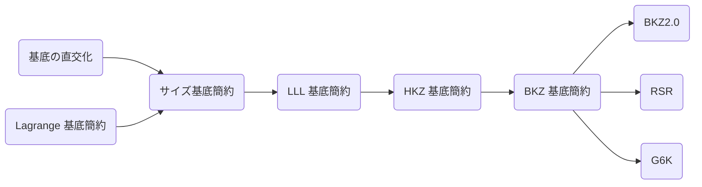

## 格子


> **Def. 格子**
>  $n$ 個の線形独立なベクトル $\bm{b}_1,\ldots,\bm{b}_n\in\mathbb{R}^m$ について整数係数の線形結合によって生成されるベクトルの集合を格子 $\mathcal{L}$ と定義します。
>
> $$
\mathcal{L}(\bm{b}_1,\ldots, \bm{b}_n) := \left\lbrace\sum_{i=1}^{n} a_i\bm{b}_i\in\mathbb{R}^m\ \middle|\ a_i \in \mathbb{Z} \right\rbrace
$$

図でイメージ掴むのが速いので図がほしい！

### 格子の問題
暗号で使われる格子の NP 困難な問題はたくさんありますが、次の SVP と呼ばれる問題が全ての問題の基礎となります。

> **SVP; Shortest Vector Problem**
> 一般の次元の格子上の非零なベクトルの中で最もノルムが小さなベクトルを見つけ出す問題である。そのベクトルを $\bm{v}$ とおくと次のように表せられる。
>
> $$
\bm{v} = v_1\bm{b}_1 + \ldots + v_n\bm{b}_n \qquad (v_1, \ldots , v_n \in \mathbb{Z}) \\
$$

素朴に考えると最短ベクトルを見つける為には色んな係数を試して探索すれば良さそうです。この方法だとベクトルの数に対して指数的に探索空間が広がるので自然と指数時間掛かります。そしてこの問題は NP 困難と知られていて、オーダーレベルで改善する方法は今のところ見つかっていません。

ただ探索する順番を効率化したり、最短ではないが最短に近いベクトルを見つける問題 (μSVP) を解くことはできます。それを担うのが基底簡約アルゴリズムです。

格子の基底は変形できます。

> **Prop.**
> 格子基底の基本変形に対し、格子は不変である。

**Proof.**

基底簡約アルゴリズムとは基底を簡約するものです
- それぞれの基底ベクトルが直交に近い状態
- 基底ベクトルの長さが短い



今回は LLL 基底簡約アルゴリズムまでを扱います。それ以降は参考文献であるなど。。。

LWE 問題の基礎である CVP を解く為にはより強い基底簡約が必要です。まずはそれらを紹介し CVP の解き方、LWE 格子暗号とその派生について学びます。

> **Def. 逐次最小**
> $n$ 次元格子 $L$ に対して、一次独立な格子ベクトル $\bm{b}_1,\ldots,\bm{b}_i\in L$ を用いて各 $1\leq i\leq n$ における逐次最小を次のように定義する。
>
> $$
\lambda_i(L) := \min_{\bm{b}_1,\ldots,\bm{b}_i\in L}\max\lbrace\|\bm{b}_1\|,\ldots,\|\bm{b}_i\|\rbrace
$$
>
> 特に任意の $1\leq i\leq n$ について $\|\bm{b}_i\| = \lambda_i(L)$ を満たすとき逐次最小ベクトルと呼び、それらが基底となっているとき逐次最小基底と呼ぶ。

## LLL 基底簡約アルゴリズム
### Gram-Schmidt の直交化

Gram-Schmidt 直交化 (GSO; Gram-Schmidt Orthonormalization) とはベクトル空間 $\mathbb{R}^m$ の基底を直交基底に変換する方法です。 $\bm{b}_n$ の直交化は $\bm{b}_{1},\ldots, \bm{b}_{n-1}$ すべてと直交するように元の高さのまま移動させます。 GSO の Wikipedia の gif がわかりやすいです。

$$
\bm{B} = \begin{pmatrix}
  \bm{b}_1 \\
  \vdots \\
  \bm{b}_n \\
\end{pmatrix} = \begin{pmatrix}
  b_{11} & \cdots & b_{1m} \\
  \vdots & \ddots & \vdots \\
  b_{n1} & \cdots & b_{nm} \\
\end{pmatrix}
$$

> **Def. GSO ベクトル**
> $n$ 次元格子 $L\subseteq \mathbb{R}^m$ の順序付き基底 $\{\bm{b}_{1},\ldots, \bm{b}_{n}\}$ に対する GSO ベクトル $\bm{b}_{1}^* ,\ldots, \bm{b}_{n}^ *\in\mathbb{R}^m$ を GSO 係数 $\mu_{i,j}$ を用いて次のように定義する。
>
> $$
\begin{aligned}
&\begin{dcases}
\bm{b}_1^* := \bm{b}_1 \\
\bm{b}_i^* := \bm{b}_i - \sum_{j=1}^{i-1} \mu_{ij} \bm{b}_j^* & (2\leq i\leq n) \\
\end{dcases} \\
&\quad \mu_{ij} := \frac{\langle \bm{b}_i, \bm{b}_j^* \rangle}{\| \bm{b}_j^*\|^2} \qquad (1\leq j<i\leq n)
\end{aligned}
$$

行列で書くと次のようになる。

$$
\begin{aligned}
\begin{pmatrix}
\bm{b}_1 \\
\vdots \\
\bm{b}_n \\
\end{pmatrix}
& =
\begin{pmatrix}
1 & 0 & 0 & & 0 \\
\mu_{21} & 1 & 0 & \cdots & 0 \\
\mu_{31} & \mu_{32} & 1 & & 0 \\
& \vdots & & \ddots & \vdots \\
\mu_{n1} & \mu_{n2} & \mu_{n3} & \cdots & 1 \\
\end{pmatrix}
\begin{pmatrix}
\bm{b}_1^ * \\
\vdots \\
\bm{b}_n^ * \\
\end{pmatrix} \\
\\
\bm{B} & = \bm{U}\bm{B}^*
\end{aligned}
$$

この $\bm{B}$、$\bm{B}^*$、$\bm{U}$ をそれぞれ **基底行列**、**GSO ベクトル行列**、**GSO 係数行列** と呼ぶことにします。また GSO 係数について

$$
\mu_{ij} = \begin{dcases}
  0 & (1\leq i<j\leq n)\\
  1 & (1\leq i=j\leq n) \\
  \frac{\langle \bm{b} _ i, \bm{b}_j^ * \rangle}{\| \bm{b}_j^*\|^2} & (1\leq j<i\leq n)
\end{dcases}
$$

と定義を拡大して $\bm{U} = (\mu_{ij})$

> **Prop. GSO ベクトルの基本性質**
> 1. 任意の $1\leq i<j\leq n$ に対して $\langle\bm{b}_i^*, \bm{b}_j^*\rangle = 0$ が成り立つ。
> 2. 任意の $1\leq i\leq n$ に対して $\|\bm{b}_i^*\|\leq\|\bm{b}_i\|$ が成り立つ。
> 3. 任意の $1\leq i\leq n$ に対して $\langle\bm{b}_1^* ,\ldots,\bm{b}_i^*\rangle_{\mathbb{R}} = \langle\bm{b}_1,\ldots,\bm{b}_i\rangle_{\mathbb{R}}$ が成り立つ。
> 4. $\mathrm{vol}(L) = \prod_{i=1}^n\|\bm{b}_i^*\|$ が成り立つ。

**Proof.**
まず 1 について $j = 1$ のとき証明せずとも成り立つ。$1\leq j\leq k$ のとき $\langle\bm{b}_i^*, \bm{b}_j^*\rangle = 0$ が成り立つと仮定して、$j = k+1$ のとき

$$
\begin{aligned}
  \langle\bm{b}_i^*,\bm{b}_{k+1}^*\rangle &
  = \left\langle\bm{b}_i^*,\bm{b}_{k+1} - \sum_{n=1}^k\mu_{k+1 n}\bm{b}_{n}^*\right\rangle \\
  & = \langle\bm{b}_i^*,\bm{b}_{k+1}\rangle-\mu_{
  k+1 i}\|\bm{b}_i^*\|^2\\
  & = 0
\end{aligned}
$$

が成り立つ。よって数学的帰納法より成り立つ。
2 に関しては定義式にノルムを取ることで分かる。

$$
\begin{aligned}
  \|\bm{b} _ 1^*\|^2 & = \|\bm{b}_1\|^2 \\
  \|\bm{b}_ i\|^2 & = \|\bm{b} _ i^ * \|^2 + \sum_{j=1}^{i-1}\mu _ {i,j}^2\|\bm{b}_j^ * \|^2\geq\|\bm{b} _ i^ * \|^2
\end{aligned}
$$

3 についてはまず $\langle\bm{b}_1,\ldots,\bm{b}_i\rangle_{\mathbb{R}}\subseteq\langle\bm{b}_1^*,\ldots,\bm{b}_i^*\rangle_{\mathbb{R}}$ について $i = 1$ は成り立ち、$1\leq i\leq k$ について成り立つとして以下より数学的帰納法から成り立つ。

$$
\bm{b}_k = \bm{b}_k^* + \sum_{j=1}^{k-1} \mu_{kj}\bm{b}_j^* \in\langle\bm{b}_1^*,\ldots,\bm{b}_i^*\rangle_{\mathbb{R}}
$$

同様に $\langle\bm{b}_1,\ldots,\bm{b}_i\rangle_{\mathbb{R}}\supseteq\langle\bm{b}_1^*,\ldots,\bm{b}_i^*\rangle_{\mathbb{R}}$ も数学的帰納法より成り立つ。

$$
\bm{b}_k^* = \bm{b}_k - \sum_{j=1}^{k-1} \mu_{kj}\bm{b}_j^* \in\langle\bm{b}_1,\ldots,\bm{b}_i\rangle_{\mathbb{R}}
$$

よって $\langle\bm{b}_1^*,\ldots,\bm{b}_i^*\rangle_{\mathbb{R}}=\langle\bm{b}_1,\ldots,\bm{b}_i\rangle_{\mathbb{R}}$ となる。

4 については $\bm{B}=\bm{U}\bm{B}^*$ と $\det(\bm{U}) = 1$、GSO ベクトルの直交性より

$$
\begin{aligned}
\mathrm{vol}(\mathcal{L})^2 &= \det(\bm{B}\bm{B}^\top) \\
& = \det(\bm{U}\bm{B}^*(\bm{B}^*)^\top \bm{U}^\top) \\
& = \det(\bm{B}^*(\bm{B}^*)^\top) \\
& = \prod_{i=1}^n\|\bm{b}_i^*\|^2
\end{aligned}
$$

$\Box$

GSO ベクトルの基本性質 2, 4 より次のことが分かる。
> **Thm. Hadamardの不等式**
>
> $$
\mathrm{vol}(L)\leq\prod_{i=1}^n\|\bm{b}_i\|
$$
>
> 特に $\{\bm{b}_{1},\ldots, \bm{b}_{n}\}$ が直交基底$\iff\mathrm{vol}(L)=\prod_{i=1}^n\|\bm{b}_i\|$ である。

> **Def. 射影格子**
> $n$ 次元格子 $L\subseteq\mathbb{R}^m$ の基底 $\lbrace\bm{b}_1,\ldots, \bm{b}_n\rbrace$ に対し, 各 $1\leq l\leq n$ に対して $\langle\bm{b}_1,\ldots, \bm{b}_{l-1}\rangle_\mathbb{R}$ の直交補空間への直交射影を $\pi_l:\mathbb{R}^m\to\langle\bm{b}_1,\ldots, \bm{b}_{l-1}\rangle_\mathbb{R}^\bot$ とする。 定理 2 の 1,3 より
>
> $$
\begin{aligned}
\langle\bm{b}_1, \ldots, \bm{b}_{l-1}\rangle_\mathbb{R}^\bot &= \langle\bm{b}_1^*, \ldots, \bm{b}_{l-1}^* \rangle_\mathbb{R}^\bot = \langle\bm{b}_l^*, \ldots, \bm{b}_n^* \rangle_\mathbb{R} \\
\pi_l(\bm{b}_i) &= \sum_{j=l}^i \mu_{i,j}\bm{b}_j^* \\
\end{aligned}
$$
>
> となる。 すると集合 $\pi_l(L)$ は $\lbrace\pi_l(\bm{b}_l), \ldots, \pi_l(\bm{b}_n)\rbrace$ を基底に持つ $n-l+1$ 次元の格子であり, $\pi_l(L)$ を射影格子 (projected lattice) と呼ぶ。

> **Lagrange 基底簡約 (Gaussian Reduction)**
> 2 次元格子の厳密解については古くから知られている。ユークリッドの互除法を用いることで最も簡約された基底を得られる。
> $\|\bm{v}_1\| < \|\bm{v}_2\|$ となるように交換して
>
> $$
\begin{aligned}
  m & = \left\lfloor\frac{\bm{v}_1\cdot \bm{v}_2}{\|\bm{v}_1\|^2}\right\rceil \\
  \bm{v}_2 & \leftarrow \bm{v}_2 - m\bm{v}_1
\end{aligned}
$$
>
> を繰り返し $m = 0$ となるとき $\bm{v}_1$, $\bm{v}_2$ は最も簡約された基底となる。

最も簡約化されているかを証明する。

```python
def gaussian_reduction(v1, v2):
    while True:
        if v2.norm() < v1.norm():
            v1, v2 = v2, v1
        m = floor(v1.dot_product(v2) / v1.dot_product(v1))
        if m == 0:
            break
        v2 = v2 - m*v1
    return v1, v2


v1 = vector([846835985, 9834798552])
v2 = vector([87502093, 123094980])
```

> **サイズ基底簡約**
> $n$ 次元格子 $L$ の基底 $\\{\bm{b_1},\ldots,\bm{b_n}\\}$ を GSO 係数 $\mu_{i,j}$ が
>
> $$
|\mu_{i,j}| \leq \frac{1}{2} \quad (1 \leq \forall j < \forall i \leq n)
$$
>
> を満たすとき、基底 $\\{\bm{b_1},\ldots,\bm{b_n}\\}$ はサイズ簡約されているという。
> GSO ベクトルを簡約 -> 基底ベクトルを簡約
> 1. $q = \lfloor\mu_{ij}\rceil$ として $\bm{b}_i\leftarrow\bm{b}_i - q\bm{b}_j$ と更新する。
> 2. GSO 係数について $\mu_{il}\leftarrow \mu_{il} - q\mu_{jl}$ と更新する。

```python
def size_reduction(B):
    n = B.nrows()
    _, mu = B.gram_schmidt()
    for i in range(n):
        for j in range(i - 1, -1, -1):
            if mu[i][j].abs() > 1 / 2:
                q = mu[i][j].round()
                B[i] -= q * B[j]
                mu[i] -= q * mu[j]
    return B

B = matrix([[5, -3, -7], [2, -7, -7], [3, -10, 0]])
print(size_reduction(B))
```

$$
\begin{pmatrix}
5 & -3 & -7 \\
2 & -7 & -7 \\
3 & -10 & 0
\end{pmatrix}\to
\begin{pmatrix}
 5 & -3 & -7 \\
-3 & -4 & 0 \\
 1 & -3 & 7
\end{pmatrix}
$$

> **LLL (Lenstra-Lenstra-Lovasz) 基底簡約**
> Lovasz 条件を $1/4 < \delta < 1$ としたときに任意の $2\leq k\leq n$ に対して次を満たすこととする。
>
> $$
\delta \|\bm{b}_{k-1}^*\|^2 \leq \|\pi_{k-1}(\bm{b}_k)\|^2
$$
>
> このとき次の 2 ステップを行えるまで繰り返す。
> 1. サイズ基底簡約
> 2. Lovasz 条件に合うように基底ベクトルの交換

```python
def LLL(B, delta=0.99):
    assert 1 / 4 < delta < 1
    n = B.nrows()
    b = [0 for _ in range(n)]
    BB, mu = B.gram_schmidt()

    i = 1
    while i < n:
        # size reduction
        for j in range(i - 1, -1, -1):
            if mu[i][j].abs() > 1 / 2:
                q = mu[i][j].round()
                B[i] -= q * B[j]
                mu[i] -= q * mu[j]

        b[i - 1] = BB[i - 1].dot_product(BB[i - 1])
        b[i] = BB[i].dot_product(BB[i])

        # Lovasz condition
        if b[i] >= (delta - mu[i][i - 1] * mu[i][i - 1]) * b[i - 1]:
            i += 1
        else:
            B.swap_rows(i - 1, i)
            BB, mu = B.gram_schmidt()
            i = max(i - 1, 1)
    return B
```

実際は LLL 簡約されていることを定義して、簡約されたときの上限などを示し、LLL 簡約された基底を返すアルゴリズムの well-defined 性や高速化を考えますが、前提知識などが不足していたり長くなるのでアルゴリズムとその特徴を天下り的に書いて終わらせます。

> **HKZ (Hermite-Korkine-Zolotareff) 基底簡約**
> 1. サイズ基底簡約
> 2. すべての $1\leq i\leq n$ に対して $\|\bm{b}_i^*\| = \lambda_1(\pi_i(L))$ を満たすように基底ベクトルの交換

> **BKZ (Block Korkine-Zolotareff) 基底簡約**
> 1. サイズ基底簡約
> 2. すべての $1\leq k\leq n-\beta+1$ に対して $\beta$ 次元の格子 $L_{[k,k+\beta-1]} = \lbrace\pi_k(\bm{b}_k), \pi_k(\bm{b}_{k+1}), \ldots, \pi_k(\bm{b}_{k+\beta-1})\rbrace$ の基底が HKZ 基底簡約

## 応用

### 多変数不定一次方程式の解
多変数不定一次方程式と言われてもパッと分からないと思いますが、こんな感じの方程式のことです。

$$
a_1x_1 + a_2x_2 + \cdots + a_nx_n + b = 0
$$

例えば 2 変数のとき方程式は $a_1x + a_2y = b$ となります。これは高校で一次不定方程式として習ったと思います。そこではユークリッドの互助法を用いて代表解 $(x, y) = (x_0, y_0)$ を見つけることで一般解は $(x, y) = (a_2m + x_0, -a_1m + y_0)$ ($m$ は整数) と解けました。

しかし 3 変数以上だとユークリッドの互除法を応用するのが難しく代表解は求まりません。さてここで基底簡約の出番です。基底簡約アルゴリズムとはベクトルの足し引きをすることで小さなベクトルを見つけるアルゴリズムでした。これを方程式の足し引きに応用して格子問題に帰着させて解きます。

まず方程式 $a_1x_1 + \cdots + a_nx_n = 0$ は次の格子

$$
\begin{pmatrix}
  1 &&& a_1 \\
  & \ddots && \vdots \\
  && 1 & a_n \\
\end{pmatrix}
$$

を用意して基底簡約したときに最後がゼロとなる行

$$
\begin{pmatrix}
x_1 & \cdots & x_n & 0
\end{pmatrix}
$$

を見つけたら代表解が求まります！これは各行を足し引きして係数の列を最小化させるので仕組みとしては出来そうです。マジックみたいですがこれで本当に解けてしまいます。

更に定数項を加えた方程式 $a_1x_1 + \cdots + a_nx_n + b = 0$ については $B = x_1\cdots x_n$ とおいて格子

$$
\begin{pmatrix}
  O(B/x_1) &&&& a_1 \\
  & \ddots &&& \vdots \\
  && O(B/x_n) && a_n \\
  &&& O(B) & b \\
\end{pmatrix}
$$

を基底簡約して最後がゼロとなる行が見つかれば代表解が分かります！

$$
\begin{pmatrix}
x_1O(B/x_1) & \cdots & x_nO(B/x_n) & O(B) & 0
\end{pmatrix}
$$

ただし $O(\cdot)$ は中の値の大体の推定値を入れるとします。CTF ではビット数が分かっていることが多いので 2 の累乗を適切に代入します。こうすることで定数部分が 1 以外の値を取らないように行を最小化してくれます。

また剰余の方程式 $a_1x_1 + a_2x_2 + \ldots + a_nx_n + b = 0 \pmod N$ については

$$
\begin{pmatrix}
  O(B/x_1) &&&& a_1 \\
  & \ddots &&& \vdots \\
  && O(B/x_n) && a_n \\
  &&& O(B) & b \\
  &&&& N \\
\end{pmatrix}
$$

を基底簡約して最後がゼロとなる行を見つければいいです。

$$
\begin{pmatrix}
x_1O(B/x_1) & \cdots & x_nO(B/x_n) & O(B) & 0
\end{pmatrix}
$$

コストなしで何度でも $N$ を引いて最小化するので剰余と同じ意味となります。

このように基底簡約アルゴリズムで多変数不定一次方程式を解くことができます。これらは CTF で頻出な技術です。次の良記事で練習するといいでしょう。

https://qiita.com/kusano_k/items/5509bff6e426e5043591

### ナップサック暗号 (Markle-Hellman Knapsack encryption)
一般の数列 $b_i$ に対して $c = \sum_i m_ib_i$ となる $c$ から $m_i$ を求めるのは難しいが $b_i$ が超増加列という性質を持つとき簡単になることを利用した暗号。

> **Def. 超増加列**
> 次の性質を満たす数列 $\lbrace w_i\rbrace$ を超増加列と呼ぶ。
>
> $$
\sum_{i=1}^n w_i < w_{n+1}
$$

> **ナップサック暗号 (Markle-Hellman Knapsack encryption)**
> - 鍵生成
>   1. 超増加列 $\lbrace w_i\rbrace$ を生成する。
>   2. 整数 $q, r$ について $q > \sum_i w_i$, $\gcd(r, q) = 1$ なるように生成する。
>   3. $b_i = rw_i \pmod q$ を計算し、$\lbrace b_i\rbrace, q$ を公開鍵、$\lbrace w_i\rbrace, r$ を秘密鍵とする。
> - 暗号化
>   平文 $m_i\in\lbrace 0, 1\rbrace$ を用いて次のように暗号文 $c$ を得る。
>
>   $$
c = \sum_i m_ib_i \pmod q
$$
> - 復号
>   1. 暗号文 $c$ に対して秘密鍵 $r$ を用いて $c' = cr^{-1} \bmod q = \sum_i m_iw_i$ を計算する。
>   2. $i$ を降順に次のアルゴリズムを実行する。
>
>   $$
\begin{aligned}
m_i & \leftarrow \begin{cases}
0 & (c' \leq w_i) \\
1 & (c' > w_i)
\end{cases} \\
c' & \leftarrow c' - w_i
\end{aligned}
$$

これが低密度のとき LLL を用いて攻撃する方法があります。LO 法 (Lagarias-Odlyzko Algorithm) と CLOS 法 (Coster LaMacchia Odlyzko Schnorr) と呼ばれています。

LO 法は次の行列を LLL 簡約して左端が $0$, それ以外が $0, 1$ のみである行があれば、それは復号結果の候補となる。

$$
\begin{pmatrix}
\bm{b} & I \\
-c & \bm{0}
\end{pmatrix} =
\begin{pmatrix}
b_1 & 1 &&& \\
b_2 && 1 && \\
\vdots &&& \ddots & \\
b_n &&&& 1 \\
-c &&&& \\
\end{pmatrix}
$$

CLOS 法は基底行列をちょっと変更して精度を向上させた方法です。まず $0, 1$ はノルムに非対称性があるので $-1, 1$ に変更し、左端を優先的に $0$ にするよう伝える為適当な大きな定数 $K$ を掛ける。

$$
\begin{pmatrix}
K\bm{b} & 2I \\
-Kc & -\bm{1}
\end{pmatrix} =
\begin{pmatrix}
Kb_1 & 2 &&& \\
Kb_2 && 2 && \\
\vdots &&& \ddots & \\
Kb_n &&&& 2 \\
-Kc & -1 & -1 & \cdots & -1 \\
\end{pmatrix}
$$

### Approximate GCD Problem
$r_i \approx 2^\lambda$, $p \approx 2^{\lambda + \log\lambda}$, $q \approx 2^{\lambda\log\lambda}$

$$
x_i = q_ip + r_i
$$

$$
\begin{pmatrix}
2^{\rho+1} & x_1 & x_2 & x_3 & x_4 \\
& -x_0 &&& \\
&& -x_0 && \\
&&& -x_0 & \\
&&&& -x_0  \\
\end{pmatrix}
$$

:::message
**練習問題**
$|x|, |y|\leq\sqrt{n}$

$$
ax = b \pmod n
$$
:::


## Coppersmith's Method
ここでは剰余上の $n$ 次方程式の解を格子問題に帰着する方法を考えます。

$$
a_nx^n + \ldots + a_1x + a_0 = 0 \pmod N
$$

まず考えるのはそれぞれの次数について $x_i = x^i$ とそれぞれ変数で置いて LLL に通す方法です。精度は落ちますが次数が 2, 3 程度までは有効です。

$$
\begin{pmatrix}
\end{pmatrix}
$$


これを改良する方法を考えます。まず剰余の方程式は係数がある程度小さければそのまま整数方程式となるという主張をしています。

> **Thm. Howgrave-Graham の補題**
> $N$ を法、 $g(x) \in \mathbb{Z}[x]$ を整数多項式とし、含まれる単項式の数を $\omega$ とする。$g(x)$ に対してある $X$ が存在し、$g(x_0) = 0 \pmod{N}$ なる $x_0 \in \mathbb{Z}$ について $|x_0| \leq X$ であると仮定する。このとき
>
> $$
\|g(xX)\| < \frac{N}{\sqrt{\omega}}
$$
>
> が成立するならば $g(x_0) = 0$ が整数方程式として成立する。ただし
>
> $$
\|g(x)\| = \left\|\sum_{i=0}^{\deg g(x)}g_i\right\| = \sqrt{\sum_{i=0}^{\deg g(x)}g_i^2}
$$
>
> であり、 $\deg g(x)$ は $g(x)$ の次数である。

**Proof.**

$$
\begin{aligned}
|g(x_0)| &= \left|\sum_{i=0}^{\deg g(x_0)}g_ix_0^i\right| \\
&\leq \sum_{i}|g_ix_0^i| \\
&\leq \sum_{i}|g_i|X^i \\
&= \sum_{i}(1\cdot|g_i|X^i) \\
&\leq \sqrt{\sum_{i, g_i \neq 0}1} \sqrt{\sum_{i}(|g_i|X^i)^2} && \left(\because \text{Cauchy–Schwarz の不等式}\right) \\
&= \sqrt{\omega}\|g(xX)\| < N && \left(\because \|g(xX)\| < \frac{N}{\sqrt{\omega}}\right)
\end{aligned}
$$

$g(x_0) = 0 \pmod N$ より $g(x_0) = 0$ となる。
$\Box$

ならば LLL を用いて剰余の方程式の係数を小さくすれば整数方程式に変換できて解けるのでは...！？と気付くでしょう。

とりあえず状況を整理すると、 LLL に入れる値は各係数として、 LLL を使う為には複数の方程式が必要になってきます。そしてそれらの方程式は同じ解を持つ必要があります。現在、その解が分からないのですが、どうしたらそんな方程式が作れるでしょうか。

実は $\bmod {N}$ では難しいので、$\bmod {N^m}$ に持ち上げることで同じ解の方程式を増やすことができます。

> **Lemma.**
> $N$ を法、$f(x)$ を多項式とする。自然数 $m, l$ について
>
> $$
g_{i,j}(x) := N^{m−i}x^j f^i(x) \ (0 \leq i \leq m, 0 \leq j\leq l)
$$
>
> とおく。このとき、 $f(x_0) = 0 \pmod N$ をみたす $x_0 \in \mathbb{Z}$ について、 $g_{i,j}(x_0) = 0 \pmod{N^m}$ となる。

**Proof.**
$f(x_0) = 0 \pmod N$ なので $f(x_0) = kN$ とおける。

$$
\begin{aligned}
g_{i,j}(x_0) &= N^{m−i}x_0^j f^i(x_0) \\
&= N^{m−i}x_0^j (kN)^i \\
&= k^ix_0^j N^m \\
g_{i,j}(x_0) &= 0 \pmod{N^m} \\
\end{aligned}
$$

$\Box$

これで方程式を増やすことができました！ちゃんと LLL で動くかちょっと不安ですがとりあえずやってみます。

小さくしたい方程式は $g_{i,j}(xX)$ であることに注意して。
$g_{i,j}(x)$ の $k$ 次の係数のことを $g_{i,j}^{(k)}$ と表すことにします。

$$
\begin{pmatrix}
g_{0,0}^{(0)} & g_{0,0}^{(1)}X & g_{0,0}^{(2)}X^2 & \cdots & g_{0,0}^{(n)}X^n \\
&& \vdots \\
g_{0,l}^{(0)} & g_{0,l}^{(1)}X & g_{0,l}^{(2)}X^2 & \cdots & g_{0,l}^{(n)}X^n \\ \\
g_{1,0}^{(0)} & g_{1,0}^{(1)}X & g_{1,0}^{(2)}X^2 & \cdots & g_{1,0}^{(n)}X^n \\
&& \vdots \\
g_{1,l}^{(0)} & g_{1,l}^{(1)}X & g_{1,l}^{(2)}X^2 & \cdots & g_{1,l}^{(n)}X^n \\ \\
&& \vdots \\
g_{m,l}^{(0)} & g_{m,l}^{(1)}X & g_{m,l}^{(2)}X^2 & \cdots & g_{m,l}^{(n)}X^n \\
\end{pmatrix}
$$

これを LLL に通してあげると無事小さな値の方程式が返ってきます。これが Howgrave-Graham の補題を満たしていれば整数方程式となります。後は増減表書いたりして探索すれば解けます。

これらの操作は Coppersmith の定理と呼ばれています。

> **Thm. Coppersmith の定理**
> $N$ を法とし $f(x)$ をモニックな 1変数 $\delta$ 多項式とする。このとき $f(x_0) = 0 \pmod{N}$ と次の条件を満たすような $x_0$ を効率よく求めることができる
>
> $$
|x_0| \leq N^{\frac{1}{\delta}}
$$

さらに Coppersmith の定理には拡張できることが2つあります。

- 未知の法について解ける
  - 既知の法の約数を法とする式の解を求められます。約数の法が小さいほど方程式に対する制約がゆるくなります。
- 多変数の方程式も解ける
  - 変数の数が多いほど方程式に対する制約がキツくなります。

これらは Howgrave-Graham の補題 などを見直すことで簡単に拡張できます。詳細は参考文献とかにあると思います。

これらをまとめて Coppersmith Method と呼びます。

Berlekamp-Zassenhause 法

これを使って様々な攻撃ができます。

解きたい方程式の法の数の下限 $\beta$ と解が存在しうる上限 $X$ を決めて関数を与えると解が返ってきます。

https://doc.sagemath.org/html/en/reference/polynomial_rings/sage/rings/polynomial/polynomial_modn_dense_ntl.html#sage.rings.polynomial.polynomial_modn_dense_ntl.small_roots


## 格子暗号

耐量子暗号の中では有力ですが耐量子性は明解ではないです。

SVP, GapSVP, SIVP, CVP, SIS, LWE, LWR, Approx-GCD, BGV, GSW などなど実にさまざまな計算困難な問題があり、それに対応する暗号がありますが、今回は耐量子暗号や完全準同型暗号でよく使われる LWE 問題に絞って紹介します。

### 最近ベクトル問題
SVP は原点に最も近い格子点を求める問題でしたが CVP はある点に最も近い格子点を求める問題です。

> **CVP; Closest Vector Problem**
> CVP とは目標ベクトル $\bm{w}$ (格子点である必要はない) に対して格子上の最近ベクトル $\bm{v}$ を求める問題である。

厳密解を求めるのは難しいので近似解を求めて偶然厳密解となることを祈ります。

この近似解を解く代表的な方法に Babai’s nearest plane algorithm と Kannan's embedding method があります。

> **Babai’s nearest plane algorithm**
> $n$ 次元の格子について目標ベクトルに対して最も近い $n-1$ 次元超平面を $1$ つ選ぶことを帰納的に繰り返すことで CVP を解く。

$n$ 次元の格子を $n-1$ 次の $W\subset \Lambda$ とその直交補空間 $W^\top$ に分割します。

$$
\begin{aligned}
  \bm{w} & = \sum a_i\bm{b}_i \\
  U + \bm{y} & = \lbrace \bm{u} + \bm{y}\mid \bm{u}\in U\rbrace
\end{aligned}
$$

```python
def babai_cvp(B, w):
    n = B.nrows()
    BB, _ = B.gram_schmidt()
    e = w
    for i in range(n)[::-1]:
        c = (e.dot_product(BB[i]) / BB[i].dot_product(BB[i])).round()
        e -= c * B[i]
    return w - e


B = matrix([[1, 2, 3], [3, 0, -3], [3, -7, 3]])
w = vector([10, 6, 5])
v = babai_cvp(B, w)
print(v)
```

> **Kannan’s embedding method**
> CVP の目標ベクトル $w$ と解ベクトル $v$ の差 $e = w - v$ のノルムについて $\|e\| < \lambda_1/2$ が成り立つとき SVP を解くことで求まる。

次の行列を基底簡約することで

$$
\begin{pmatrix}
  \bm{B} & \bm{0}^\top \\
  \bm{w} & M
\end{pmatrix}
=
\begin{pmatrix}
b_{11} & \cdots & b_{1m} & 0 \\
\vdots & \ddots & \vdots & \vdots \\
b_{n1} & \cdots & b_{nm} & 0 \\
w_1 & \cdots & w_m & M
\end{pmatrix}
$$

```python
def kannan_cvp(B, w):
    n = B.nrows()
    M = 1
    BB = block_matrix([[B, matrix(ZZ, n, 1)], [w, M]])
    BB = BB.LLL()
    e = matrix(BB[0][0:n])
    return w - e


B = matrix([[1, 2, 3], [3, 0, -3], [3, -7, 3]])
w = matrix([10, 6, 5])
v = kannan_cvp(B, w)
print(v)
```

このような格子の分野において求解困難な問題はたくさんあり、これを用いた暗号はたくさんあります。CVP を応用した問題 LWE (Learning With Error) 問題を用いた暗号を LWE 格子暗号といいます。

### LWE格子暗号

機械学習理論から派生した求解困難な問題で
この誤差がなければ逆行列を掛ければすぐに求まるのですが、誤差があることで問題が難しくなります。

> **LWE 問題**
> $K$ を体とする。$\bm{A}\in K^{m\times n}, \bm{s}\in K^m$ を掛けて誤差ベクトル $\bm{e}\in K^n$ を与えた $\bm{b}\in K^n$ に対し $(\bm{A}, \bm{b})$ が与えられたときに $\bm{s}$ を求める問題を一般に LWE 問題と呼ぶ。
>
> $$
\bm{A}\bm{s} + \bm{e} = \bm{b}
$$
>
> 特に $q$ を素数として $K = \mathbb{F}_q$ のとき LWE 問題、 $K = \mathbb{F}_q[x]/(x^n + 1)$ かつ $m = 1$ のとき Ring-LWE 問題、 $K = \mathbb{F}_q[x]/(x^n + 1)$ のとき Module-LWE 問題といいます。

$\bm{s}$ や $\bm{e}$ はゼロから離れ過ぎると他の解と混ざってしまうので次のような形となる二項分布やその極限である正規分布などの分布の乱数が用いられます。
これが $B \geq 2\sqrt{n}$ のとき計算困難な問題であることが知られています。

近似解は LLL して CVP 解く感じです。

```python
def solve_LWE(A, b):
    m = A.nrows()
    n = A.ncols()
    q = A.base_ring().order()
    BB = block_matrix([[A.change_ring(ZZ).transpose()], [q * matrix.identity(m)]])
    BB = BB.LLL()[n:]
    v = babai_cvp(BB, b.change_ring(ZZ))
    s = v[:n] * A[:n].transpose() ^ -1
    return s


q = 29
A = matrix(
    GF(q),
    [
        [1, 5, 21, 3, 14],
        [17, 0, 12, 12, 13],
        [12, 21, 15, 6, 6],
        [4, 13, 24, 7, 16],
        [20, 9, 22, 27, 8],
        [19, 8, 19, 3, 1],
        [18, 22, 4, 8, 18],
        [6, 28, 9, 5, 18],
        [10, 11, 19, 18, 21],
        [28, 18, 24, 27, 20],
    ],
)
b = vector(GF(q), [28, 2, 24, 16, 11, 14, 7, 28, 27, 13])
s = solve_LWE(A, b)
print(s)
```

### CRYSTALS-KYBER
CRYSTALS-KYBER とは NIST が選考している耐量子暗号の一種で Module-LWE を用いた暗号です。

まず Module-LWE は多項式上の演算です。$R_q = \mathbb{F}_q[x]/(x^n+1)$, $R = \mathbb{Z}[x]/(x^n+1)$ 多項式同士の積は数論変換 (NTT; Number Theoretic Transform) を用いて高速に計算できます。
注意として $x^n + 1$ は $\mathbb{F}_q[x]$ において既約多項式であるから $\mathbb{F}_q[x]/(x^n + 1)$ は体となります。

> **Def. 多項式の圧縮**
> また $R_q$ であれば各要素に対して圧縮を行う。
> シード値 $\rho$ から多項式を生成する関数 $Sam(\rho)$ を用いる。
>
> $$
\begin{aligned}
\mathrm{Compress}_q(x, d) & = \lceil(2^d/q)x\rfloor \bmod q \\
\mathrm{Decompress}_q(x, d) & = \lceil(q/2^d)x\rfloor
\end{aligned}
$$

> **Prop. 圧縮解凍をしても誤差が小さい**
> $d < \lceil\log_2(q)\rceil$ として $\mathbb{F}_q\to\lbrace 0,\ldots,2^d-1\rbrace$ と圧縮し、次のような性質を満たす。
>
> $$
\begin{aligned}
& x' = \mathrm{Decompress}_q(\mathrm{Compress}_q(x, d), d) \\
& |x' - x\bmod q|\leq\lceil q/2^{d+1}\rfloor
\end{aligned}
$$

これより圧縮解凍の誤差を LWE の誤差に乗せることができます。

> **CRYSTALS-KYBER**
> - 鍵生成
>   1. 疑似乱数で $\bm{A}\in R_q^{k\times k}$ と二項分布で $\bm{s}, \bm{e}\in R^{k}$ を生成し、$\bm{t} = \bm{A}\bm{s} + \bm{e}$ を計算する
>   2. $(\bm{t}, \bm{A})$ を圧縮したものを公開鍵、$\bm{s}$ を秘密鍵とする
> - 暗号化
>   平文 $m$ を用いて
>   1. 二項分布で $\bm{r}, \bm{e}_1\in R^k, e_2\in R$ を生成する
>   2. $\bm{t}$ を解凍して $(\bm{u}, v) = (\bm{A}^T\bm{r} + \bm{e}_1, \bm{t}^T\bm{r} + e_2 + \lceil\frac{q}{2}\rfloor \cdot m)$ を圧縮したものを暗号文として返す
> - 復号
>   $\bm{u}, v$ を解凍して $\mathrm{Compress}_q(v - \bm{s}^T\bm{u}, 1)$ つまり $q / 2$ に近い値は $1$ 、$0$ に近い値は $0$ として返す

```python
from Crypto.Util.number import bytes_to_long
from Crypto.Random.random import randint, getrandbits

def num2bins(x):
    y = []
    while x != 0:
        y.append(x & 1)
        x >>= 1
    return y

def bins2num(x):
    y = 0
    for i in range(len(x)):
        y += x[i] * (1 << i)
    return y

class CrystalsKyber:
    def binomial_poly(self):
        res = []
        for i in range(self.N):
            tmp = 0
            for i in range(self.eta):
                a = getrandbits(1)
                b = getrandbits(1)
                tmp += a - b
            res.append(tmp)
        return self.Rq(res)

    def random_poly(self):
        return self.Rq([randint(int(0), int(self.q)) for _ in range(self.N)])

    def __init__(self, q, k, eta, N):
        K = GF(q)
        PR.<X> = PolynomialRing(GF(q))
        Rq.<x> = PR.quotient(X^N + 1)
        self.Rq = Rq
        self.q = q
        self.k = k
        self.eta = eta
        self.N = N

        A = matrix([[self.random_poly() for _ in range(k)] for _ in range(k)])
        s = vector([self.binomial_poly() for _ in range(k)])
        e = vector([self.binomial_poly() for _ in range(k)])
        t = A * s + e

        self.pub = (t, A)
        self.priv = s

    def encrypt(self, m):
        Rq.<x> = self.Rq
        (t, A) = self.pub

        m = Rq(num2bins(m))
        r = vector([self.binomial_poly() for _ in range(self.k)])
        e1 = vector([self.binomial_poly() for _ in range(self.k)])
        e2 = self.binomial_poly()

        u = A.transpose() * r + e1
        v = t * r + e2 + (q / 2).round() * m
        return (u, v)

    def decrypt(self, c):
        s = self.priv

        u, v = c
        m = v - s * u
        ms = []
        # 1 if the coeff is close to q / 2
        for coeff in m.lift().coefficients(sparse=False):
            coeff = QQ(coeff) * 2 / q
            coeff = coeff.round() % 2
            ms.append(coeff)
        return bins2num(ms)

q, k, eta, N = 7681, 3, 4, 256
enc = CrystalsKyber(q, k, eta, N)
m = 11
assert m < 2^N
c = enc.encrypt(m)
_m = enc.decrypt(c)
assert m == _m
```

## まとめ
格子の基底簡約アルゴリズムは重要な技術で格子暗号だけではなく様々な暗号の攻撃に応用でき

## 参考文献
- https://www.cryptrec.go.jp/exreport/cryptrec-ex-2404-2014.pdf
- https://joint.imi.kyushu-u.ac.jp/wp-content/uploads/2022/08/220801_03hiromasa.pdf