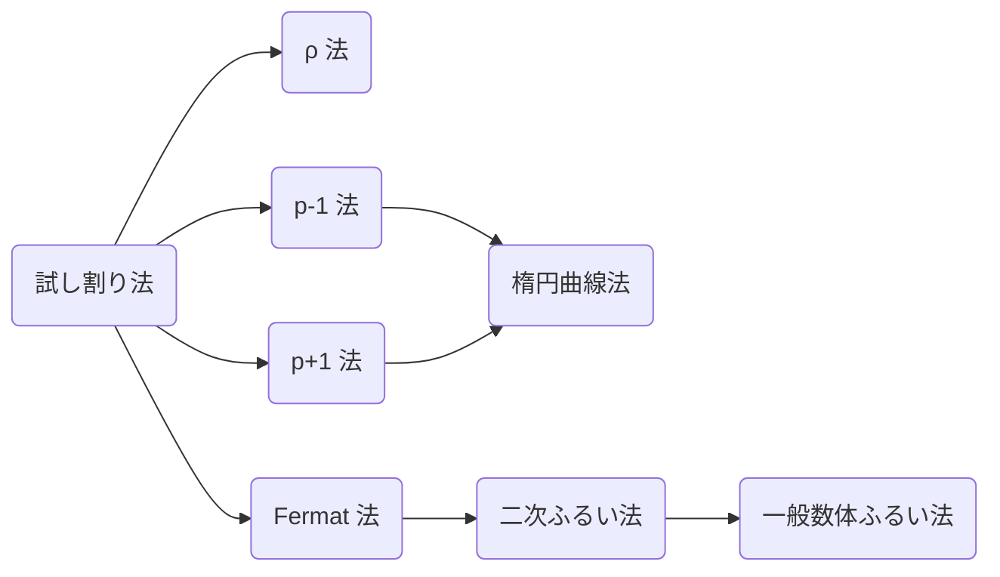

暗号では楕円曲線上の点や格子上の点などを考えたりしますが、それらには足し算や引き算ができたりして、数ではないが「数っぽいもの」がちらほら出てきます。それぞれの数っぽいものを研究してみると似たような性質がちらほらでてきます。これらに共通する性質を研究するのが代数学のモチベーションです。

その基礎となるものを次の節で学んでいきましょう。
環論や体論

- 群論
- 剰余環
- 楕円曲線
- 多項式
- 格子

について解説します。

数学科2年前半までの数学を使います。曖昧な解説はしないつもりなので覚悟のある方だけきてください。予習必要かも、楕円曲線はここでは解説しきれない。出来る限り最短経路となるのでわかりにくいという部分が出てくると思います。質問が飛んできたら

## 群論

> **Def. 群**
> 空集合でない集合 $G$ と $G$ 上の演算が定義されていて次を満たすとき $G$ は群であるという。
> 1. 単位元と呼ばれる元 $e\in G$ があり、任意の元 $a\in G$ に対し $ae = ea = a$ となる。この $e$ は $e$ や $1$ のように書く。$G$ の群であることを強調して $1_G$ と書くこともある。
> 2. 任意の元 $a\in G$ に対し逆元と呼ばれる元 $b\in G$ があり、$ab = ba = e$ となる. この $b$ を $a^{-1}$ と書く。
> 3. 結合法則 $a(bc) = (ab)c$

具体例

1. $\mathbb{N}$ 上の加法について単位元は $0$ で結合法則は成り立ちますが、一般に逆元が存在しないので群とはなりません。$\mathbb{Z}$, $\mathbb{Q}$, $\mathbb{R}$, $\mathbb{C}$ は加法について可換群となります。
2. $\mathbb{Z}\setminus\lbrace 0\rbrace$ 上の乗法について単位元は $1$ で結合法則は成り立ちますが、一般に逆元が存在しないので群とはなりません。$\mathbb{Q}\setminus\lbrace 0\rbrace$, $\mathbb{R}\setminus\lbrace 0\rbrace$, $\mathbb{C}\setminus\lbrace 0\rbrace$ は乗法について可換群となります。これらの集合を $\mathbb{Q}^\times$, $\mathbb{R}^\times$, $\mathbb{C}^\times$ と書きます。
3. 平行移動・回転対称性

群 $G$ と $a\in G$, $n\in\mathbb{N}$ として

$$
\begin{aligned}
  a^0 &:= 1_G \\
  a^n &:= \overbrace{a\cdots a}^{n} \\
  a^{-n} &:= (a^n)^{-1}
\end{aligned}
$$

そして結合法則より指数法則 $a^m \cdot a^n = \overbrace{a\cdots a}^{m}\cdot \overbrace{a\cdots a}^{n} = a^{m + n}$

$(xy)z$ の $z$ を前に持ってきて $z(xy)$ などとすることは一般にはできません。

> **Def. 部分群**
> ある群 $G$ の部分集合 $G'$ が同じ演算において群を成すとき $G'$ は $G$ の部分群であるという。

> **Prop. 部分群の条件**
> 単位元逆元

> **Def. 巡回群**
> 群 $G$ についてある元 $g\in G$ を用いて $G = \lbrace g^n\mid n\in\mathbb{Z}\rbrace$ となるとき、$G$ を巡回群と呼ぶ。

> **Prop.**
> 巡回群 $G$ において任意の元 $g\in G$ で $g^{|G|} = 1$ が成り立つ。

フェルマーの小定理やオイラーの定理やカーマイケルの定理は上記の命題により成り立つ(後ほど証明する)。またねじれ群

> **繰り返し二乗法**
> 巡回群 $G$ において元 $g\in G$ を用いて $g^n$ を $\mathcal{O}(k\log{n})$ で求められる。ただし 1 回の演算に $\mathcal{O}(k)$ 掛かるとする。

**Proof.**

> **Thm. ラグランジュの定理**
>
> $$
|G| = |G:H||H|
$$

> **Def.**
> 準同型とは取れる
> 同型とは

> **Thm. 準同型定理**
> 群 $G_1, G_2$ とその間に準同型 $\phi: G_1 \to G_2$ があるとするとき次が成り立つ。
>
> $$
G_1/\mathrm{Ker}(\phi) \cong \mathrm{Im}(\phi)
$$

> **Prop.**
> $p$ を素数とおくと
>
> $$
(\mathbb{Z}/p\mathbb{Z})^\times \cong \mathbb{Z}/(p−1)\mathbb{Z}
$$

**Proof.**
$(\mathbb{Z}/p\mathbb{Z})^\times$ において位数 $p - 1$ の元 (原始根) が存在することを示す。
まず $n$ が $p - 1$ の約数であるとき $x^n = 1$ は $n$ 個の解を持つことを示す。仮定より $p - 1 = nk$ とおけ、次のそれぞれの式について解の個数について考える。

$$
x^{p-1} - 1 = (x^n - 1)((x^n)^{k-1} + \ldots + x^n + 1)
$$

$x^{p-1} - 1 = 0$ はフェルマーの小定理より $p - 1$ 個
$(x^n)^{k-1} + \ldots + x^n + 1 = 0$ は代数学の基本定理より $n(k-1)$ 個以下
よって $x^{n} - 1 = 0$ は解の個数を比較して $n$ 個存在する。

これより $p-1$ と互いに素な数の個数だけ原始根が存在する。

原始根 $a$ を1つ選び、写像 $\phi: \mathbb{Z}\to(\mathbb{Z}/p\mathbb{Z})^\times$ を $\phi(k) = a^k$ とすると、これは準同型である。全射である。$\mathrm{Ker}(\phi) = (p-1)\mathbb{Z}$。よって $(\mathbb{Z}/p\mathbb{Z})^\times \cong \mathbb{Z}/(p−1)\mathbb{Z}$ である。$\Box$

> **Thm. 中国剰余定理 (CRT; Chinese Remainder Theorem)**
> $m, n \neq 0$ が互いに素な整数なら、$\mathbb{Z}/mn\mathbb{Z} \cong \mathbb{Z}/m\mathbb{Z}\times\mathbb{Z}/n\mathbb{Z}$

**Proof.**
写像 $\phi: \mathbb{Z}/mn\mathbb{Z} \to \mathbb{Z}/m\mathbb{Z}\times\mathbb{Z}/n\mathbb{Z}$ を次のように定義する。

$$
\phi(x + mn\mathbb{Z}) = (x + m\mathbb{Z}, x + n\mathbb{Z})
$$

これは準同型となる。また $m, n$ が互いに素であるから $ma + nb = 1$ となる $a, b$ が存在する。ここで任意の $x, y$ に対し $z = may + nbx$ とおくと

$$
\begin{aligned}
  z & = may + (1 - ma)x = x + ma(y - x) &&\in x + m\mathbb{Z} \\
    & = (1 - nb)y + nbx = y + nb(x - y) &&\in y + n\mathbb{Z}
\end{aligned}
$$

となる。これを元に写像 $\psi(x + m\mathbb{Z}, y + n\mathbb{Z}) = z + mn\mathbb{Z}$ を構成すると $\psi$ は $\phi$ の逆写像であり、$\phi$ は全単射となる。よって $\phi$ は同型写像であり、$\mathbb{Z}/mn\mathbb{Z}$ と $\mathbb{Z}/m\mathbb{Z}\times\mathbb{Z}/n\mathbb{Z}$ は同型である。 $\Box$

これより次のことが言えます。

> **Prop.**
> $n = p_1^{e_1}\cdots p_k^{e_k}$ と素因数分解出来るとき、次が成り立つ。
>
> $$
\mathbb{Z}/n\mathbb{Z} \cong \mathbb{Z}/p_1^{e_1}\mathbb{Z}\times\cdots\times\mathbb{Z}/p_k^{e_k}\mathbb{Z}
$$

例えば $\mathbb{Z}/15\mathbb{Z} \cong \mathbb{Z}/3\mathbb{Z}\times\mathbb{Z}/5\mathbb{Z}$ となるので法が15の数と法が3, 5の数のペアは1対1に対応させることができます。

| $\times$ |  0  |  1  |  2  |  3  |  4  |
|:--------:|:---:|:---:|:---:|:---:|:---:|
|    0     |  0  |  6  | 12  |  3  |  9  |
|    1     | 10  |  1  |  7  | 13  |  4  |
|    2     |  5  | 11  |  2  |  8  | 14  |

数自体だけではなく加法、乗法についても対応します。

$$
\begin{aligned}
8 &+ 9 = 2 & \pmod{15} \\
&\downarrow \\
(2, 3) &+ (0, 4) = (2, 2) & \pmod{(3, 5)} \\
\end{aligned}
$$

$$
\begin{aligned}
8 &\times 9 = 12 & \pmod{15} \\
&\downarrow \\
(2, 3) &+ (0, 4) = (0, 2) & \pmod{(3, 5)} \\
\end{aligned}
$$


// TODO 3 5 でやると分かりやすい

大きな剰余ではなく複数の小さな剰余に分割して考えた方が探索すべき数は圧倒的に減ります。このような考え方を Crypto ではよく行います。
その為には相互に剰余を変換できなければ話になりません。

大きな剰余 $n$ と複数の小さな剰余 $m_i (i=1,\ldots,k)$ について $m_i|n$ が成り立つとします。

まず小さくするときは $(x \bmod n)\bmod m_i$ とすればよいです。

$$
\begin{aligned}
a \bmod{pq} \bmod{p} &= (a - k_1pq) - k_2p \\
&= a - (k_1q + k_2)p \\
&= a \bmod{p} \\
\end{aligned}
$$

となるからです。注意すべきなのは2つが約数の関係となる剰余でしかこのような式は有効ではないです。例えば有効ではない式として $20 \bmod 15 \bmod 9 \neq 20 \bmod 9$ があります。

逆に $\bmod p, \bmod q \to \bmod pq$ はどうやって計算するのでしょうか。この操作は持ち上げ(lift)とよばれていて、Garnerのアルゴリズムを用いて持ち上げます。
持ち上げ(lift) 大きくするには複数の小さな情報を用いて構成する次の多項式時間のアルゴリズムが知られています。

> **Garner のアルゴリズム**
> 整数 $m_1,\ldots,m_k$ に対し、ある整数 $x\in [0, \mathop{\mathrm{lcm}} m_i)$ の $m_i$ に関する剰余 $r_i = x \bmod m_i$ が与えられれば $x$ を $\mathcal{O}(k\log(\max m_i) + k^2)$ で求められる。

基本的なアイデアとしては互いに素な剰余 $m_1, m_2$ に対して

$$
\begin{aligned}
x & = q_1m_1 + r_1 \\
r_2 & = q_1m_1 + r_1 & \pmod{m_2} \\
q_1 & = (r_2 - r_1)m_1^{-1} & \pmod{m_2} \\
x & = (r_2 - r_1)(m_1^{-1} \bmod{m_2})m_1 + r_1 & \pmod{m_1m_2} \\
\end{aligned}
$$

例えば「3 で割ったあまりが 2」かつ「5 で割ったあまりが 3」であるようなものは $2 + (3 - 2)2\times3 = 8 \pmod{15}$ となります。

```cpp
template <typename T>
T CRT(std::vector<T> r, std::vector<T> m) {
  ll n = r.size();
  ll m_prod = 1;
  ll x = r[0] % m[0];
  for (ll i = 1; i < n; i++) {
    m_prod *= m[i - 1];
    ll t = ((r[i] - x) * invmod(m_prod, m[i])) % m[i];
    if (t < 0)
      t += m[i];
    x += t * m_prod;
  }
  return x;
}
```

これについては良記事があります。
https://qiita.com/drken/items/ae02240cd1f8edfc86fd

**練習問題**
$(ap)^e \pmod{pq}$ はpで割り切れる。

知っておくと便利な定理があります。

> **Thm. Carmichael の定理**
>
> $$
\begin{aligned}
(\mathbb{Z}/p_1^{e_1}\ldots p_n^{e_n}\mathbb{Z})^\times &\cong (\mathbb{Z}/p_1^{e_1}\mathbb{Z})^\times \times \ldots \times (\mathbb{Z}/p_n^{e_n}\mathbb{Z})^\times\\
(\mathbb{Z}/p^e\mathbb{Z})^× &\cong \begin{cases}
\lbrace 1\rbrace & (p = 2, e = 1) \\
\mathbb{Z}/2\mathbb{Z} \times \mathbb{Z}/2^{e-2}\mathbb{Z} & (p = 2, e \geq 2) \\
\mathbb{Z}/p^{e-1}(p−1)\mathbb{Z} & (p > 2) \\
\end{cases}
\end{aligned}
$$

これについても良記事があります。
https://integers.hatenablog.com/entry/2016/07/24/163831
https://integers.hatenablog.com/entry/2017/06/08/191649


> 平方剰余

> **Tonelli Shanks のアルゴリズム**
> 平方根

$$
n^{\frac{p-1}{2}}
$$

例えば Tonelli Shanks のアルゴリズムは平方剰余を使っています。

剰余上の平方根を計算することについてじっくり考えてみます。定義より $x^2 = a \pmod p$ となる $x$ を求めればよいです。
まずは具体的に $\bmod 13$ の場合について平方根を全て求めてみます。

| $n$ | $2^0$ | $2^1$ | $2^2$ | $2^3$ | $2^4$ | $2^5$ | $2^6$ | $2^7$ | $2^8$ | $2^9$ | $2^{10}$ | $2^{11}$ |
|:--------:|:-:|:-:|:--:|:--:|:-:|:-:|:-:|:-:|:-:|:-:|:-:|:-:|
| $\sqrt{n}$ | $2^0, 2^6$ | なし | $2^1, 2^7$ | なし | $2^2, 2^8$ | なし | $2^3, 2^9$ | なし | $2^4, 2^{10}$ | なし | $2^5, 2^{11}$ | なし |

とこのようになります。

例えば $\sqrt{10} \pmod{13}$ については $\sqrt{10} = \sqrt{2^{10}} = 2^5, 2^{11} = 6, 7 \pmod{13}$ となります。このように DLP が解けるとき、つまり肩の数がわかるなら、それを半分にするだけで平方根となります。

では DLP が解けないときはどうすればよいのでしょうか。

最初に思いつくのは $2^{-1} \bmod p-1$ 乗すれば平方根になるということです。しかし $2$ と $p-1$ は互いに素ではないので $2$ の逆数を定義できません。なので一旦逆数を定義できるところだけやって、後で定義できない部分を考えることにします。

$$
(\mathbb{Z}/13\mathbb{Z})^×≅\mathbb{Z}/12\mathbb{Z}≅\mathbb{Z}/3\mathbb{Z}\times\mathbb{Z}/2^2\mathbb{Z}
$$

中国剰余定理から上のように分解でき、$\bmod 3$ なら $2$ の逆数が定義できるので $2^{-1} \bmod 3  = 2$ 乗します。すると $10^2 = 9 \pmod{13}$ となり、これは $9 = 2^8 \pmod{13}$ で下の表をみるとしっかり $8$ は $5, 11$ のある $2 \bmod 3$ の行にあります。ここから上下に動かさずに左右だけを動かして本当の平方根を求めます。

| $\times$ | 0 | 1 |  2 |  3 |
|:--------:|:-:|:-:|:--:|:--:|
|     0    | 0 | 9 |  6 |  3 |
|     1    | 4 | 1 | 10 |  7 |
|     2    | 8 | 5 |  2 | 11 |

本当の平方根を求める為に誤差を取り除くことが必要です。誤差とは $x$ が平方根であれば $a^{-1}x^2 = 1 \pmod p$ となるのに対し、現在仮に求まっている平方根が $x=9$ であるから $a^{-1}x^2 = 10^{-1}9^2 = 2 \pmod{13}$ と異なっているこの誤差です。

この誤差をより詳しく調べる為に累乗して情報、肩の数の trailing zero ( $\bmod 2^n$ 上)を求めます。trailing zero とは2進数で考えたときに末尾に0が何個あるのかというものです。例えば 8 であれば 1000 より 3 となり、10 であれば 1010 で 1 となります。

例えば $s = a^{-1}x^2$ についてこんなことが成り立つとします。

$$
s \neq 1, s^2 \neq 1, s^4 \neq 1, s^8 = 1
$$

この場合、肩の数は1,2,4倍しても0にはならず、ちょうど8倍して0になる数であることがわかります。つまり $\underbrace{bb1000\ldots}_n$ というようになっているはずです(分からないビットは $b$ としています)。これより trailing zero は $n - 3$ と分かります。

これに加えて平方剰余ではない数 $u$ をランダムに取ってきて $q$ 乗します。平方剰余ではないので肩の数は奇数、つまり一番下のビットが $1$ であることが分かってます。するとこの肩の数を $n - 4$ だけ左シフトすればその2乗は $\underbrace{bb1000\ldots}_n$ となり、それと $x$ を掛け合わせることで$bb1000\ldots + bb1000\ldots = bb0000\ldots$ と最下位ビットを 0 にできて誤差の対数の trailing zero を増やしていくことができます。そして最終的に全て 0 になったとき、誤差はなくなります。

つまり $\sqrt{a} \pmod{p}$ を計算するには次を行えばよいです。

1. $p - 1 = q \times 2^e$ から $2^{-1} \pmod q = (q + 1)/2$ 乗する。
2. $a^{-1}x^2$ の対数の trailing zero $t$ を求め、非平方剰余 $u$ を用いて $\mathrm{pow}(u^q, 2^{e - t - 1})$ を $x$ に掛けることを繰り返す。

これを Tonelli Shanks のアルゴリズムと呼びます。


## 概説
$p$ を素数として任意の $a\in\mathbb{Z}/p\mathbb{Z}$ に対し $x^2 = a$ となる $x$ を求めることができるアルゴリズムである。

まずアイデアを一通り説明しておくと、フェルマーの小定理から $x^2 = a = a^p$ であり、やりたいことは $x = a^{p/2}$ である。しかし $p$ は奇数なので整数累乗ではなく不可能。そこでまずは次のように分解することで整数累乗ができる代数 $\mathbb{Z}/q\mathbb{Z}$ から $x' = a^{(q+1)/2}$ を計算する。

$$
(\mathbb{Z}/p\mathbb{Z})^\times \cong \mathbb{Z}/(p-1)\mathbb{Z} \cong \mathbb{Z}/q\mathbb{Z} \times \mathbb{Z}/2^Q\mathbb{Z}
$$

そうすると $x$ と $x'$ について $\mathbb{Z}/q\mathbb{Z}$ で合うので $\mathbb{Z}/2^Q\mathbb{Z}$ も合わせれば完璧である。こちらは $\mathbb{Z}/2^Q\mathbb{Z}$ での差分を $Q$ 桁の2進数と見なして、下から順に $1$ を $0$ に変換することで誤差を無くし $x$ が求まるといった感じである。

## 詳説
### $\mathbb{Z}/q\mathbb{Z}$ を合わせる
まずは $\mathbb{Z}/q\mathbb{Z}$ から $\mathbb{Z}/q\mathbb{Z} \times \mathbb{Z}/2^Q\mathbb{Z}$ への写像 $\mathrm{ind}$ を導入する。

**Definition**
$\mathrm{ind}: (\mathbb{Z}/p\mathbb{Z})^\times\to \mathbb{Z}/q\mathbb{Z} \times \mathbb{Z}/2^Q\mathbb{Z}$
$\mathop{\mathrm{ind}}a = (a_1, a_2)$

$p = 13$ のとき $\mathbb{Z}/12\mathbb{Z} = \mathbb{Z}/3\mathbb{Z}\times\mathbb{Z}/2^2\mathbb{Z}$ となるので次のような表となる。
|  $2^Q\backslash q$  | 0   | 1   | 2   |
| --- | --- | --- | --- |
| 0   | 0   | 4   | 8   |
| 1   | 9   | 1   | 5   |
| 2   | 6   | 10  | 2   |
| 3   | 3   | 7   | 11  |

ここで原始根 $2$ を選ぶと $(\mathbb{Z}/13\mathbb{Z})^\times$ と $\mathbb{Z}/3\mathbb{Z}\times\mathbb{Z}/2^2\mathbb{Z}$ の対応表が完成する。

| $2^Q\backslash q$ | 0         | 1           | 2          |
| ----------------- | --------- | ----------- | ---------- |
| 0                 | $2^0=1$   | $2^4=3$     | $2^8 = 9$  |
| 1                 | $2^9=5$   | $2^1=2$     | $2^5=6$    |
| 2                 | $2^6=12$  | $2^{10}=10$ | $2^2=4$    |
| 3                 | $2^3 = 8$ | $2^7=11$    | $2^{11}=7$ |

**Proposition**
1. $\mathop{\mathrm{ind}}1 = (0,0)$
2. $\mathop{\mathrm{ind}}ab = \mathop{\mathrm{ind}}a + \mathop{\mathrm{ind}}b = (a_1, a_2) + (b_1, b_2) = (a_1 + b_1, a_2 + b_2)$
3. $\mathop{\mathrm{ind}}a^e = e(a_1,a_2) = (ea_1, ea_2)$

**Proposition**
1. $\mathop{\mathrm{ind}}a^{q} = (0, qa_2)$
2. $\mathop{\mathrm{ind}}a^{2^Q} = (2^Qa_1, 0)$
3. $\mathop{\mathrm{ind}}a^{q2^Q} = \mathop{\mathrm{ind}}a^{p} = \mathop{\mathrm{ind}}1 = (0, 0)$

目標は $x^2 = a$ となる $x$ から $\mathop{\mathrm{ind}}x^2 = (a_1, a_2)$ となる $x$ を見つけることに変化した。
ここで $x' = a^{(q+1)/2}$ とおくと

$$
\begin{aligned}
\mathop{\mathrm{ind}}x' &= \frac{q+1}{2}(a_1, a_2) \\
\mathop{\mathrm{ind}}x'^2 &= (a_1, (q+1)a_2)
\end{aligned}
$$

となり第一要素は一致するようになった。

### $\mathbb{Z}/2^Q\mathbb{Z}$ を合わせる
次は第一要素を一致させたまま第二要素を動かす。
ここからは $\mathbb{Z}/2^Q\mathbb{Z}$ の元を $Q$ 桁の2進数と考える。

第二要素の誤差 $E = x'^2a^{-1}$ について $\mathop{\mathrm{ind}}E = (0, w)$ とおく。

全体の流れとしてはまず $w$ の $S$ 桁目が $1$ であるか判定し、そうであれば $x'$ に $S-1$ 桁目が $1$ である数を足して $S$ 桁目を $0$ にする操作を繰り返せば次第に誤差が無くなり解に辿り着くというアルゴリズムである。

#### $w$ の $S$ 桁目が $1$ である判定
$(\mathbb{Z}/p\mathbb{Z})^\times$ での2乗と $\mathbb{Z}/2^Q\mathbb{Z}$ での左シフトを対応させられることが分かる。
$w$ を $Q - S - 1$ 回左シフトした数が $0$ だったら $S$ 桁目は $0$ であり、そうでなければ $1$ である。
これを $(\mathbb{Z}/p\mathbb{Z})^\times$ の視点から考えると $E^{2^{Q-S-1}} = 1$ のとき $S$ 桁目が $0$ であることがわかる。

#### $S-1$ 桁目が $1$ である数の生成
まず最下位ビットが $1$ である数は作ることができる。
ある非平方剰余な数 $b$ ($b^{(p-1)/2} = 1$ を満たす $b$ ) を選ぶと、$b^q$ は $\mathop{\mathrm{ind}}b^q = (0, b')$ と表せば $b'$ は奇数となる。$b'$ を $S-1$ 回左シフトすれば $S-1$ 桁目が $1$ である数が作れる。
よって $(b^q)^{2^{S-1}}$ が $S-1$ 桁目が $1$ である数となる。

```
w        = 1010110
w << Q-2 = 1000000 or 0000000
b'       = ??????1
b' << 1  = ?????10
```

以上のことから $E^{2^{Q-S-1}} \neq 1$ ならば新しい $x'$ を $x'' = x'(b^q)^{2^{S-1}}$ と更新すればよい。

[Tonelli-Shanks のアルゴリズム - 37zigenのHP](https://37zigen.com/tonelli-shanks-algorithm/)


## 素数生成

暗号として機能する素数の大きさは $2^{512}$ や $2^{1024}$ 程度のオーダーとなっています。素数定理より、ある数 $n$ が素数である確率は約 $1/\log n$ です。例えば $n=2^{512}$ で2.8%、 $n=2^{1024}$ で1.4%となります。つまり、500回乱数を生成すれば99.65%で素数を見つけられるということです。
素数判定のアルゴリズムは多くありますが、ここではMiller-Rabin素数判定法を紹介します。

### Miller–Rabin 素数判定法

素数判定法とはその名の通り、数を与えるとそれが素数かどうかが分かる判定法です。その中で Miller-Rabin 素数判定法は与えられた数 $n$ が素数かどうかを計算時間 $O(k\log^3 n)$ で誤り率 $4^{-k}$ 以下で判定する確率的素数判定アルゴリズムです。

$n$ が素数のとき、$n-1$ はそれを $2$ で割れるだけ割った数を $d$ として $n-1 = 2^sd$ と書けます。フェルマーの小定理より $a≠0 \pmod n$ のとき

$$
\begin{aligned}
a^{n-1} &= a^{2^sd} ≡ 1 \quad \pmod n \\
a^{2^sd}-1 &= (a^d-1)(a^d+1)(a^{2d}+1)(a^{4d}+1)\cdots(a^{2^{s-1}d}+1)\\
&≡ 0 \\
\end{aligned}
$$

これより次の2式のどちらかが成り立ちます。

$$
\begin{cases}
a^d ≡ 1 & \pmod n \\
a^{2^rd} ≡ -1 & \pmod n \qquad (\exists r \in \mathbb{Z}, 0\leq r\leq s-1)
\end{cases}
$$

この対偶をとると、「ある $a$ をとってきて次の2式をどちらも満たすとき

$$
\begin{cases}
a^d \neq 1 & \pmod n\\
a^{2^rd} \neq -1 & \pmod n \qquad (\forall r \in \mathbb{Z}, 0\leq r\leq s-1)
\end{cases}
$$

$n$ は合成数である」と言えます。

これを用い、次のステップを実行することで確率的な素数判定ができます。
1. $1\leq a \leq n-1$ でaの値をランダムにとってくる。
2. 上の条件を満たしたらcompositeと返す。
3. 満たさなければprobably primeと返す。

これを繰り返すことで判定の精度が高まります。この処理をMiller–Rabin素数判定法といって、実行時間は $O(k\log^3 n)$ 、FFTベースの乗算で $Õ(k\log^2 n)$ となります。

具体例を考えてみましょう。
判定時にprobably primeを返す時 p、compositeを返す時 c として具体値を入れると次のようになります。
$n = 25$ (合成数)のとき
$n-1 = 24 = 2^3 \times 3$ より $s = 3, d = 3$

| a | 1 | 2 | 3 | 4 | 5 | 6 | 7 | 8 | 9 | 10 | 11 | 12 | 13 | 14 | 15 | 16 | 17 | 18 | 19 | 20 | 21 | 22 | 23 | 24 |
|:-:|:-:|:-:|:-:|:-:|:-:|:-:|:-:|:-:|:-:|:-:|:-:|:-:|:-:|:-:|:-:|:-:|:-:|:-:|:-:|:-:|:-:|:-:|:-:|:-:|
| $a^3 \bmod 25$ | 1 | 8 | 2 | 14 | 0 | 16 | 18 | 12 | 4 | 0 | 6 | 3 | 22 | 19 | 0 | 21 | 13 | 7 | 9 | 0 | 11 | 23 | 17 | 24 |
| $a^6 \bmod 25$ | 1 | 14 | 4 | 21 | 0 | 6 | 24 | 19 | 16 | 0 | 11 | 9 | 9 | 11 | 0 | 16 | 19 | 24 | 6 | 0 | 21 | 4 | 14 | 1 |
| $a^{12} \bmod 25$ | 1 | 21 | 16 | 16 | 0 | 11 | 1 | 11 | 6 | 0 | 21 | 6 | 6 | 21 | 0 | 6 | 11 | 1 | 11 | 0 | 16 | 16 | 21 | 1 |
| 判定 | p | c | c | c | c | c | p | c | c | c | c | c | c | c | c | c | c | p | c | c | c | c | c | p |

$n = 17$ (素数)のとき
$n-1 = 16 = 2^4 \times 1$ より $s = 4, d = 1$

| a | 1 | 2 | 3 | 4 | 5 | 6 | 7 | 8 | 9 | 10 | 11 | 12 | 13 | 14 | 15 | 16 |
|:-:|:-:|:-:|:-:|:-:|:-:|:-:|:-:|:-:|:-:|:-:|:-:|:-:|:-:|:-:|:-:|:-:|
| $a \bmod 17$ | 1 | 2 | 3 | 4 | 5 | 6 | 7 | 8 | 9 | 10 | 11 | 12 | 13 | 14 | 15 | 16 |
| $a^2 \bmod 17$ | 1 | 4 | 9 | 16 | 8 | 2 | 15 | 13 | 13 | 15 | 2 | 8 | 16 | 9 | 4 | 1 |
| $a^4 \bmod 17$ | 1 | 16 | 13 | 1 | 13 | 4 | 4 | 16 | 16 | 4 | 4 | 13 | 1 | 13 | 16 | 1 |
| $a^8 \bmod 17$ | 1 | 1 | 16 | 1 | 16 | 16 | 16 | 1 | 1 | 16 | 16 | 16 | 1 | 16 | 1 | 1 |
| 判定 | p | p | p | p | p | p | p | p | p | p | p | p | p | p | p | p |

かなり正確に判定できていることがわかるでしょう。

素数については必ず成功し、合成数のときは誤る可能性が $1/4$ 以下ということが示せるので、 $k$ 回試行すれば誤り率は $4^{-k}$ 以下となります。つまり、ある値に対して10回素数判定法を回せば99.9999046%成功するということです。

## 素因数分解
試し割り法を基本にして



### 試し割り法

愚直に素数を小さい順に割っていく方法です。大体の場合これで十分速いです。

1. $N$ を $2$ 以上 $\sqrt{N}$ 以下の整数で下から順に割れるだけ割り続け、割った数 $p$ とその回数 $e$ を記録する。
2. 最後に残った $N$ が $1$ ではないならば記録する。

この計算量は $\mathcal{O}(\sqrt{N})$ となります。また $\sqrt{N}$ までの素数リストが既にあるならば素数定理によって計算量は $\mathcal{O}(\sqrt{N}/\log{\sqrt{N}})$ に落ちる。

https://gist.github.com/anko9801/9a717f4737104a81b5cf90dd50b94dfd

### Pollard の $p-1$ 法
$p-1$ が Smooth number のとき有効な素因数分解法です。

> **Prop.**
> $N$ がある素因数 $p$ をもつとき $k$ が $p-1$ の倍数であれば $a^k - 1 \pmod N$ は $p$ の倍数となる。

**Proof.**
フェルマーの小定理より $a^k = 1 \pmod p$ であるから $a^k - 1 \pmod N$ は $p$ の倍数である。よって $\gcd(a^k - 1, N)$ は $p$ の倍数となる。$\Box$

もちろん $p$ の値は分からないので約数をたくさん持つような $M$ を用意して、$N$ のどれかの大きな素因数 $p$ に対して $p-1$ の倍数となったとき $\gcd(a^k - 1, N)$ を計算することで $p$ を取り出せる。

果たしてそんなうまくいくのだろうか？これを初めて聞いたとき大きな数は大体大きな素因数持ってるだろうからほとんど上手くいかなそうと感じました。

考えてみればすぐわかります。

適当に数を取ってきてある素数 $p$ が含まれている確率というのは $1/p$ 、つまり素数が大きければ大きいほど含まれにくいです。

https://gist.github.com/anko9801/8f53ff0e4af8d866d3fc93b4fbfefb68

### Hugh Williams の $p+1$ 法
$p + 1$ が Smooth number のとき有効な素因数分解法です。

> **Prop.**
> $k$ が $p+1$ の倍数であれば Lucas 数列 $u_i, v_i$ に対し、 $u_k$ は $p$ の倍数となる。ただし Lucas 数列は次のように定義される。
>
> $$
\begin{aligned}
  u_0 & = 0, u_1 = 1, u_{n+1} = au_n - bu_{n-1} \\
  v_0 & = 2, v_1 = a, v_{n+1} = av_n - bv_{n-1}
\end{aligned}
$$

**Proof.**
Lucas 数列について

$$
\begin{aligned}
\end{aligned}
$$


$$
\begin{aligned}
  \alpha,\beta & = \frac{a \pm \sqrt{a^2 - 4b}}{2} \\
  y_n & = \frac{\alpha^n - \beta^n}{\alpha - \beta}
\end{aligned}
$$

約数の多い $k$ を用意して $\gcd(y_k, N)$ が出てくる。確率は？

### 楕円曲線法
一般に有効な素因数分解法です。

> **Prop.**
> $k$ が $\#E/(\mathbb{Z}/N\mathbb{Z})$ の倍数であれば $kP = \mathcal{O}$ となる。このとき内部計算時に $x_1 - x_2$ が $p$ の倍数となる。

$N$ が 2, 3 の倍数でないとき、楕円曲線 $y^2 = x^3 + ax + b \pmod N$ について $a, b$ を様々な値を与えて $kP$ を計算する。

### 二次ふるい法 (QS; Quadratic Sieve)
$x^2 = y^2 \pmod N$ となる $x, y$ が見つけられたとすると $x^2 - y^2 = (x + y)(x - y)$ が $N$ の倍数つまり $\gcd(x + y, N)$

### 一般数体ふるい法 (GNFS; General Number Field Sieve)


### Shor のアルゴリズム

## 離散対数問題
離散対数問題 (DLP: Discrete Logarithm Problem) とは巡回群 $G$ について $a, b\in G$ が与えられるので $a^n = b$ となる最小の $n\in \mathbb{N}$ を求める問題である。

例えば、有限体 $\mathbb{F}_q$ のDLP

楕円曲線 $E$ 上でのDLP

### Baby-step Giant-step

半分全列挙を用いて $O(\sqrt{N}\log{N})$ でDLPが解ける。

位数 $N$ の巡回群 $G$ について $a, b\in G$ が与えられるので $a^n = b$ となる最小の $n\in \mathbb{N}$ を求める問題を考える。このとき $m = \lceil\sqrt{N}\rceil$ とおき、$n$ を $m$ で割ると $n = qm + r \ (q, r\in[0, \lceil\sqrt{N}\rceil)\ )$ と表せられる。すると $r$ に対して $ba^{-r}$ を全列挙し、そのリストに対して $a^{qm}$ が含まれているような $q$ を探索すると高速に解が求まる。

例えば、有限体 $\mathbb{F}_p$ 上なら乗法群の位数 $p-1$ から

楕円曲線 $E$ 上であれば加法群の位数 $\#E$ から

$O(\sqrt{N}\log N)$

### Pollard's rho 法

初期点 $x_0$ と適当な副作用のない疑似乱数関数 $f(x)$ を決めて $x_{i+1} = f(x_i)$ となるように数列 $(x_0, x_1, \ldots)$ を生成する。このとき $0 \leq \exists i < \exists j < N$, $x_i = x_j$ となる $i,j$ を見つけられたらDLPが解けるという仕組みです。

よく用いられる関数 $f(x)$ は次のようなものがあります。ただし、$G_1, G_2, G_3$ は巡回群 $G$ の集合をランダムに振り分けられるように3つに区別したものです。

$$
f(x)=
\begin{cases}
bx & (x \in G_1 \mathrm{のとき}) \\
x^2 & (x \in G_2 \mathrm{のとき}) \\
ax & (x \in G_3 \mathrm{のとき}) \\
\end{cases}
$$

このとき $x_0 = a$ とすると $x_i$ は $x_i = a^{s_i}b^{t_i}$, $s_i, t_i \in \mathbb{N}$ と表せられる。すると $x_i = x_j$ において $n$ は巡回群の位数 $N$ を用いて次のように表せられる。

$$
\begin{aligned}
x_i &= a^{s_i}b^{t_i} = a^{s_i + nt_i} \\
x_j &= a^{s_j + nt_j} \\
a^{s_i - s_j} &= a^{n(t_j - t_i)} \\
n &= \frac{s_i - s_j}{t_j - t_i} \pmod N
\end{aligned}
$$

これよりDLPが解ける。
Pollard-$\rho$ 法の $\rho$ は文字 $\rho$ の形が由来となっている。

### Pollard's Kangaroo 法 (Lambda 法)
$\rho$ 法は動く点が1つの値だったのに対し、 $\lambda$ 法は2つの値がランダムに動いていき、一方がもう一方の点に衝突したときDLPが解ける。

$$
\begin{aligned}
x_0 &= g^{a_0} & y_0 &= g^{b_0} \\
x_{i+1} &= x_ig^{r(x_i)} & y_{i+1} &= y_i g^{r(y_i)} \\
\end{aligned}
$$

$x_i = y_j$ となるとき

$O(\sqrt{N})$

計算量の期待値集合 $S$ に対してそれぞれ相違な $x_0, x_1, \ldots, x_{k-1}$ を選ぶ事象 $A$ と

$$
\begin{aligned}
P(A) &= \prod_{i = 0}^{k-1}\left(1-\frac{i}{N}\right) \approx \prod_{i = 0}^{k-1}e^{-i/N} \approx e^{-k^2/2N} \\
P(B) &= \frac{k}{N}e^{-k^2/2N} \\
E(B) &= \sum_{k=1}^N k\cdot\frac{k}{N}e^{-k^2/2N} \\
&\approx \sqrt{N}\int_0^\infty t^2e^{-t^2/2} dt \\
&= \sqrt{\frac{\pi N}{2}}
\end{aligned}
$$

- The Arithmetic of Elliptic Curves. p.383


### Pohlig-Hellman

中国剰余定理を用いて大きな群を複数の小さな群の直積に分割する。

```python
fact = factor(G.order())
ord = int(G.order())
dlogs = []
for p, e in fact:
    t = ord // p ^ e
    dlog = discrete_log(t * Q, t * G, operation="+")
    dlogs += [dlog]

print(crt(dlogs, primes))
```

### 指数計算法 (Index Calculus Algorithm)

### 数体ふるい法
- [General purpose integer factoring](https://eprint.iacr.org/2017/1087)

# 格子

図でイメージ掴むのが速い

線形独立な $n$ 個のベクトル $\mathbf{b}_1, \mathbf{b}_2, \ldots , \mathbf{b}_n \in \mathbb{R}^m$ について整数係数の線形結合によって生成されるベクトルの集合を格子 $L$ と定義します。

$$
L = \left\{ \sum_{i=1}^{n} a_i\mathbf{b}_i \ \middle| \ a_i \in \mathbb{Z} \right\}
$$

化学の格子っぽいもの

格子 $L$ に囲まれた空間を1つ
具体例

- SVP
- near SVP
- CVP
- near CVP

### Gram-Schmidt の直交化 (GSO: Gram-Schmidt Orthonormalization)

Gram-Schmidt 直交化 (GSO; Gram-Schmidt Orthonormalization) とは実 $m$ 次元ベクトル空間 $\mathbb{R}^m$ の任意の $\mathbb{R}$ ベクトル空間としての基底を直交基底に変換する方法です. $\mathbf{b} _ n$ の直交化は $\mathbf{b} _ {1},\ldots, \mathbf{b} _ {n-1}$ すべてと直交するように元の高さのまま移動させます. GSOのWikipedia のgifがわかりやすいです.

> **Def. GSOベクトル**
> $n$ 次元格子 $L\subseteq \mathbb{R}^m$ の順序付き基底 $\{\mathbf{b} _ {1},\ldots, \mathbf{b} _ {n}\}$ に対するGSOベクトル $\mathbf{b} _ {1}^* ,\ldots, \mathbf{b} _ {n}^ *\in\mathbb{R}^m$ をGSO係数 $\mu _ {i,j}$ を用いて次のように定義する.
>
> $$
\begin{aligned}
&\begin{dcases}
\mathbf{b} _ 1^* := \mathbf{b} _ 1 \\
\mathbf{b} _ i^ * := \mathbf{b} _ i - \sum _ {j=1}^{i-1} \mu _ {i, j} \mathbf{b} _ j^ * & (2\leq i\leq n) \\
\end{dcases} \\
&\quad\mu _ {i, j} := \frac{\langle \mathbf{b} _ i, \mathbf{b}_j^ * \rangle}{\| \mathbf{b} _ j^ * \|^2} \qquad (1\leq j<i\leq n)
\end{aligned}
$$

行列で書くと次のようになる.

$$
\begin{aligned}
\begin{pmatrix}
\mathbf{b} _ 1 \\
\vdots \\
\mathbf{b} _ n \\
\end{pmatrix}
& =
\begin{pmatrix}
1 & 0 & 0 & \cdots & 0 \\
\mu _ {2,1} & 1 & 0 & \cdots & 0 \\
\mu _ {3,1} & \mu_{3,2} & 1 & \cdots & 0 \\
\vdots & \vdots & \vdots & \ddots & \vdots \\
\mu _ {n,1} & \mu _ {n,2} & \mu _ {n,3} & \cdots & 1 \\
\end{pmatrix}
\begin{pmatrix}
\mathbf{b} _ 1^ * \\
\vdots \\
\mathbf{b} _ n^ * \\
\end{pmatrix}
\end{aligned}
$$

> **Thm. GSOベクトルの基本性質**
> 1. 任意の $1\leq i<j\leq n$ に対して $\langle\mathbf{b}_ i^* , \mathbf{b} _j^ *\rangle = 0$ が成り立つ.
> 2. 任意の $1\leq i\leq n$ に対して $\|\mathbf{b}_ i^ * \|\leq\|\mathbf{b} _i\|$ が成り立つ.
> 3. 任意の $1\leq i\leq n$ に対して $\langle\mathbf{b} _ 1^* ,\ldots,\mathbf{b} _ i^ *\rangle_{\mathbb{R}} = \langle\mathbf{b} _ 1,\ldots,\mathbf{b} _ i\rangle _ {\mathbb{R}}$ が成り立つ.
> 4. $\mathrm{vol}(L) = \prod _ {i=1}^n\|\mathbf{b} _ i^*\|$ が成り立つ.

**Proof.**
1. $j$ に関する数学的帰納法により示す. $j=1$ のときは証明すべきことはない. $1,\ldots,j$ について成立していると仮定する. $j+1$ のとき任意の $1\leq i<j+1$ に対して

$$
\begin{aligned}
\langle\mathbf{b} _ i^ * , \mathbf{b} _ {j+1}^ * \rangle &= \left\langle\mathbf{b} _ i^ * , \mathbf{b} _ {j+1} - \sum _ {k=1}^j\mu _ {j+1, k}\mathbf{b} _ {k}^ * \right\rangle \\
&= \langle\mathbf{b} _ i^ * , \mathbf{b} _ {j+1}\rangle - \mu _ {j+1,i}\langle\mathbf{b} _ i^ * , \mathbf{b} _ {i}^ * \rangle \\
&= \langle\mathbf{b} _ i^ * , \mathbf{b} _ {j+1}\rangle - \frac{\langle \mathbf{b} _ {j+1}, \mathbf{b} _ i^ * \rangle}{\| \mathbf{b} _ i^ * \|^2}\|\mathbf{b} _ i^ * \|^2 \\
&= 0
\end{aligned}
$$

が成り立つ. よって, 数学的帰納法より任意の $1\leq i<j\leq n$ に対して $\langle\mathbf{b} _ i^ * , \mathbf{b} _ j^ * \rangle = 0$ が成り立つ.

2. $i=1$ のとき $\mathbf{b} _ 1^* = \mathbf{b} _ 1$ より明らか. $i\geq 2$ のとき

$$
\|\mathbf{b}_ i\|^2 = \|\mathbf{b} _ i^ * \|^2 + \sum_{j=1}^{i-1}\mu _ {i,j}^2\|\mathbf{b}_j^ * \|^2\geq\|\mathbf{b} _ i^ * \|^2
$$

より成り立つ.

3. 任意の $1\leq k\leq i$ に対し, $\mathbf{b} _ k = \mathbf{b} _ k^* + \sum _ {j=1}^{k-1} \mu _ {k, j}\mathbf{b} _ j^ *$ より, $\mathbf{b} _ k\in\langle\mathbf{b} _ 1^ * ,\ldots,\mathbf{b} _ i^ * \rangle _ {\mathbb{R}}$ がわかる. よって $\langle\mathbf{b} _ 1,\ldots,\mathbf{b} _ i\rangle _ {\mathbb{R}}\subseteq\langle\mathbf{b} _ 1^ * ,\ldots,\mathbf{b} _ i^ * \rangle _ {\mathbb{R}}$ が成り立つ. 逆向きの包含関係は $i$ に関する数学的帰納法で示す. $i = 1$ のとき $\mathbf{b} _ 1^ * = \mathbf{b} _ 1$ より明らか. $i=k-1$ のとき成り立つと仮定すると $i=k$ のとき $\mathbf{b} _ k^ * = \mathbf{b} _ k - \sum _ {j=1}^{k-1} \mu _ {k, j}\mathbf{b} _ j^ *$ より $\mathbf{b} _ k^ * \in\langle\mathbf{b} _ 1,\ldots,\mathbf{b} _ i\rangle _ {\mathbb{R}}$ , よって任意の $i$ について示された. よって $\langle\mathbf{b} _ 1^ * ,\ldots,\mathbf{b} _ i^ * \rangle _ {\mathbb{R}}=\langle\mathbf{b} _ 1,\ldots,\mathbf{b} _ i\rangle _ {\mathbb{R}}$ である.

4. $B=UB^*$ と $\det(U) = 1$, GSOベクトルの直交性より

$$
\begin{aligned}
\mathrm{vol}(L)^2 &= \det(BB^\top) \\
&= \det(UB^ * (B^ * )^\top U^\top) \\
&= \det(B^ * (B^ * )^\top) \\
&= \prod _ {i=1}^n\|\mathbf{b} _ i^ * \|^2
\end{aligned}
$$

> **Thm. Hadamardの不等式**
> GSOベクトルの基本性質 2, 4 より次のことが分かる.
>
> $$
\mathrm{vol}(L)\leq\prod _ {i=1}^n\|\mathbf{b} _ i\|
$$
>
> 特に $\{\mathbf{b} _ {1},\ldots, \mathbf{b} _ {n}\}$ が直交基底$\iff\mathrm{vol}(L)=\prod _ {i=1}^n\|\mathbf{b} _ i\|$ である.

> **Def. 射影格子**
> $n$ 次元格子 $L\subseteq\mathbb{R}^m$ の基底 $\{\mathbf{b} _ {1},\ldots, \mathbf{b} _ {n}\}$ に対し, 各 $1\leq l\leq n$ に対して $\langle\mathbf{b} _ {1},\ldots, \mathbf{b} _ {l-1}\rangle _ \mathbb{R}$ の直交補空間への直交射影を $\pi _ l:\mathbb{R}^m\to\langle\mathbf{b} _ {1},\ldots, \mathbf{b} _ {l-1}\rangle _ \mathbb{R}^\bot$ とする. 定理 2 の 1,3 より
>
> $$
\begin{aligned}
\langle\mathbf{b} _ {1},\ldots, \mathbf{b} _ {l-1}\rangle _ \mathbb{R}^\bot &= \langle\mathbf{b} _ {1}^ * ,\ldots, \mathbf{b} _ {l-1}^ * \rangle _ \mathbb{R}^\bot = \langle\mathbf{b} _ {l}^ * ,\ldots, \mathbf{b} _ {n}^ * \rangle _ \mathbb{R} \\
\pi _ l(\mathbf{b}_i) &= \sum _ {j=l}^i\mu _ {i,j}\mathbf{b} _ j^ * \\
\end{aligned}
$$
>
> となる. すると集合 $\pi _ l(L)$ は $\{\pi _ l(\mathbf{b} _ {l}),\ldots,\pi _ l(\mathbf{b} _ {n})\}$ を基底に持つ $n-l+1$ 次元の格子であり, $\pi _ l(L)$ を射影格子 (projected lattice) と呼ぶ.

$O(N^3)$

```python
def gram_schmidt():
```

## Shortest Vector Problem(SVP)

格子上の非零なベクトルの中で最もノルムが小さなベクトルを見つけ出す問題です。
そのベクトルを $\mathbf{v}$ とおくと次のように表せられます。

$$
\mathbf{v} = v_1\mathbf{b}_1 + \ldots + v_n\mathbf{b}_n \qquad (\exists v_1, \ldots , v_n \in \mathbb{Z}) \\
$$

この問題はNP困難

### 最短ベクトルの数え上げ

まずは全探索してみます。
考えてみると帰納的に求めるのでは正確な最短ベクトルは求められないでしょう。
考えてみるとある基底 $\mathbf{b}_i$ に対し、それ以下の基底 $\mathbf{b}_1, \ldots \mathbf{b}_{i-1}$ で組み立てられたベクトル $\mathbf{v}$ に対し、$\mathbf{b}_i$ を用いて短くする

効率的に数え上げる為には基底簡約すると良いということが知られています。

### サイズ基底簡約
GSO ベクトルを簡約 -> 基底ベクトルを簡約
GSO 係数 $μ_{i,j}$ について

Euclid の互除法を用いて基底の簡約化をする。
具体例
$n$ 次元格子 $L$ の基底 $\\{\mathbf{b_1},\ldots,\mathbf{b_n}\\}$ を GSO 係数 $\mu_{i,j}$ が

$$
|\mu_{i,j}| \leq \frac{1}{2} \quad (1 \leq \forall j < \forall i \leq n)
$$

を満たすとき、基底 $\\{\mathbf{b_1},\ldots,\mathbf{b_n}\\}$ はサイズ簡約されているという。

```python
def size_reduction(B):
    n = len(B)
    B = matrix(B)
    G, mu = B.gram_schmidt()
    for i in range(n):
        for j in range(i - 1, -1, -1):
            if mu[i][j].abs() > 1 / 2:
                q = mu[i][j].round()
                B[i] -= q * B[j]
                mu[i] -= q * mu[j]
    return B
```

```python
B = [vector([5, -3, -7]), vector([2, -7, -7]), vector([3, -10, 0])]
print(size_reduction(B))
```

### Lagrange 基底簡約 (Gaussian Reduction)

### LLL(Lenstra-Lenstra-Lovasz) 基底簡約

Lagrange 基底簡約に Lovasz 条件を追加した基底簡約を LLL 基底簡約と呼びます。
Lovasz条件 $\frac{1}{4} < \delta < 1$ として

$$
\delta \|b_{k-1}^*\|^2 \leq \|\pi_{k-1}(b_k)\|^2
$$

1. サイズ基底簡約
2. 条件に合うように基底ベクトルの交換

具体的な応用方法は良記事があります。

https://qiita.com/kusano_k/items/5509bff6e426e5043591

### BKZ(Block Korkine-Zolotareff) 基底簡約

### HKZ(Hermite-Korkine-Zolotareff) 基底簡約

1. サイズ基底簡約
2. 条件に合うように基底ベクトルの交換

## Closest Vector Problem(CVP)

### Babai’s Algorithm

### Kannan’s embedding method


## 方程式
$n$ 次方程式について $m$ 個だけ連立されてあるとき

一次連立方程式について行列の次元 rank と連立させた式の数と一致すれば逆行列が存在します。
係数行列

$$
\begin{aligned}
A\mathbf{x} &= \mathbf{b} \\
\mathbf{x} &= A^{-1}\mathbf{b}
\end{aligned}
$$

$1$ 次方程式

$$
\begin{cases}
2x + 3y = 2 & \pmod{13} \\
3x + 5y = 1 & \pmod{13} \\
\end{cases}
$$

より一般の連立方程式を解く為に行列を用いて解いてみます。拡大係数行列にしてガウスの消去法を行います。
では与えられる1次方程式が1つのみであればどうでしょうか。複数の解が出てきますが、その中で具体的な解を1つ返したいと思います。

$$
a_1x_1 + a_2x_2 + \ldots + a_nx_n = b \pmod N
$$

1変数方程式であれば逆元を掛けて解けますが、2変数、3変数、n変数の場合だと難しそうです。

これに対抗し得るCrypto界最強の道具があります。LLL 基底簡約アルゴリズムです。詳しいことは格子暗号の回で紹介しますが、行列の値が全体的に小さくなるように変形してくれます。

それだけ？と言われそうですがこれがとても強くてRSA暗号以外にもナップサック暗号、格子暗号、楕円曲線暗号に使えたりします。

これをどうやって方程式に適用するかというと次のような行列を考えます。

$$
\begin{pmatrix}
1 & 0 & 0 & \ldots & ? & ? \\
0 & 1 & 0 & \ldots & ? & ? \\
0 & 0 & 1 & \ldots & ? & ? \\
\vdots & \vdots & \vdots & & \vdots & \vdots \\
0 & 0 & 0 & \ldots & N & N \\
\end{pmatrix}
$$

例えば、

$$
8053x+343y+1362z
$$

の絶対値を小さくするような、全てが0ではない $x, y, z$ の値を求めたいときは、

$$
\begin{pmatrix}
1 & 0 & 0 & 8053 \\
0 & 1 & 0 & 343 \\
0 & 0 & 1 & 1362 \\
\end{pmatrix}
$$

をLLLに投げれば良いです。実際に投げたら、次の答えが返ってきました。

$$
\begin{pmatrix}
0 & -4 & 1 & -10 \\
-3 & -5 & 19 & 4 \\
-2 & 35 & 3 & -15 \\
\end{pmatrix}
$$

例えば2行目は、$x=−3, y=−5, z=19$ という解に対応しています。

$$
8053 \times (−3) + 343 \times (−5) + 1362 \times 19 = 4
$$

応用すると解がある程度小さなことが分かっていると次のようにできます。

$$
a_1x_1 + a_2x_2 + a_3x_3 + b = 0 \pmod N \\
x_1 < 2^{32}, x_2 < 2^{16}, x_3 < 2^{8}
$$

定数は1回しか使ってはいけないという気持ちを込めて大きな数を設定して、他は解の制約に合わせて設定します。最下段は法の数を入れておくことで剰余上で計算してくれます。

$$
\begin{pmatrix}
1 & 0 & 0 & 0 & a_1 \\
0 & 2^{16} & 0 & 0 & a_2 \\
0 & 0 & 2^{24} & 0 & a_3 \\
0 & 0 & 0 & 2^{32} & b \\
0 & 0 & 0 & 0 & N \\
\end{pmatrix}
$$

詳しくは次の記事で紹介されています。

https://qiita.com/kusano_k/items/5509bff6e426e5043591

一般の線形方程式は解けるようになりました！
やったね！

こうなってくると1次方程式だけではなく2次、3次、n次方程式も解いてみたいですね。
まずは次のような方程式を考えてみます。

$$
a_nx^n + \ldots + a_1x + a_0 = 0 \pmod N
$$

$x, y = x^2, z = x^3, \ldots$ というように変数を設定してLLLで乗り切るという方法が1つあります。しかし $x, y, z$ には関係性という情報を失っています。それをうまく使ってあげたいですね。

## Coppersmith の定理

> **Thm. Howgrave-Grahamの補題**
> $N$ を法、 $g(x) \in \mathbb{Z}[x]$ を整数多項式とし、含まれる単項式の数を $\omega$ とする。$g(x)$ に対してある $X$ が存在し、$g(x_0) = 0 \pmod{N}$ なる $x_0 \in \mathbb{Z}$ について $|x_0| \leq X$ であると仮定する。このとき
>
> $$
\|g(xX)\| < \frac{N}{\sqrt{\omega}}
$$
>
> が成立するならば $g(x_0) = 0$ が整数方程式として成立する。ただし
>
> $$
\|g(x)\| = \left\|\sum_{i=0}^{\deg g(x)}g_i\right\| = \sqrt{\sum_{i=0}^{\deg g(x)}g_i^2}
$$
>
> であり、 $\deg g(x)$ は $g(x)$ の次数である。

**Proof.**

$$
\begin{aligned}
|g(x_0)| &= \left|\sum_{i=0}^{\deg g(x_0)}g_ix_0^i\right| \\
&\leq \sum_{i}|g_ix_0^i| \\
&\leq \sum_{i}|g_i|X^i \\
&= \sum_{i}(1\cdot|g_i|X^i) \\
&\leq \sqrt{\sum_{i, g_i \neq 0}1} \sqrt{\sum_{i}(|g_i|X^i)^2} && \left(\because \text{コーシー＝シュワルツの不等式}\right) \\
&= \sqrt{\omega}\|g(xX)\| < N && \left(\because \|g(xX)\| < \frac{N}{\sqrt{\omega}}\right)
\end{aligned}
$$

$g(x_0) = 0 \pmod N$ より $g(x_0) = 0$ となる。 $\Box$

つまり、「剰余の方程式は係数がある程度小さければそのまま整数方程式となるよ」と言っています。ここで勘のいい人はLLLを用いて係数を小さくすれば整数方程式に変換できて解けるのでは...！？と気付くでしょう。実際に考えてみましょう。

とりあえず状況を整理すると、LLLに入れる値は各係数として、LLLを使う為には複数の方程式が必要になってきます。そしてそれらの方程式は同じ解を持つ必要があります。現在、その解が分からないのですが、どうしたらそんな方程式が作れるでしょうか。

実は $\bmod {N}$ では難しいので、$\bmod {N^m}$ に持ち上げることで同じ解の方程式を増やすことができます。

> **Lemma.**
> $N$ を法、$f(x)$ を多項式とする。自然数 $m, l$ について
>
> $$
g_{i,j}(x) := N^{m−i}x^j f^i(x) \ (0 \leq i \leq m, 0 \leq j\leq l)
$$
>
> とおく。このとき、 $f(x_0) = 0 \pmod N$ をみたす $x_0 \in \mathbb{Z}$ について、 $g_{i,j}(x_0) = 0 \pmod{N^m}$ となる。

**Proof.**

$f(x_0) = 0 \pmod N$ なので $f(x_0) = kN$ とおける。

$$
\begin{aligned}
g_{i,j}(x_0) &= N^{m−i}x_0^j f^i(x_0) \\
&= N^{m−i}x_0^j (kN)^i \\
&= k^ix_0^j N^m \\
g_{i,j}(x_0) &= 0 \pmod{N^m} \\
\end{aligned}
$$

$\Box$

これで方程式を増やすことができました！ちゃんとLLLで動くかちょっと不安ですがとりあえずやってみます。

小さくしたい方程式は $g_{i,j}(xX)$ であることに注意して。
$g_{i,j}(x)$ の $k$ 次の係数のことを $g_{i,j}^{(k)}$ と表すことにします。

$$
\begin{pmatrix}
g_{0,0}^{(0)} & g_{0,0}^{(1)}X & g_{0,0}^{(2)}X^2 & g_{0,0}^{(3)}X^3 & g_{0,0}^{(4)}X^4 & g_{0,0}^{(5)}X^5 \\
g_{0,1}^{(0)} & g_{0,1}^{(1)}X & g_{0,1}^{(2)}X^2 & g_{0,1}^{(3)}X^3 & g_{0,1}^{(4)}X^4 & g_{0,1}^{(5)}X^5 \\
g_{1,0}^{(0)} & g_{1,0}^{(1)}X & g_{1,0}^{(2)}X^2 & g_{1,0}^{(3)}X^3 & g_{1,0}^{(4)}X^4 & g_{1,0}^{(5)}X^5 \\
g_{1,1}^{(0)} & g_{1,1}^{(1)}X & g_{1,1}^{(2)}X^2 & g_{1,1}^{(3)}X^3 & g_{1,1}^{(4)}X^4 & g_{1,1}^{(5)}X^5 \\
g_{2,0}^{(0)} & g_{2,0}^{(1)}X & g_{2,0}^{(2)}X^2 & g_{2,0}^{(3)}X^3 & g_{2,0}^{(4)}X^4 & g_{2,0}^{(5)}X^5 \\
g_{2,1}^{(0)} & g_{2,1}^{(1)}X & g_{2,1}^{(2)}X^2 & g_{2,1}^{(3)}X^3 & g_{2,1}^{(4)}X^4 & g_{2,1}^{(5)}X^5 \\
\end{pmatrix}
$$

これをLLLに通してあげると無事小さな値の方程式が返ってきます。これがHowgrave-Grahamの補題を満たしていれば整数方程式となります。後は増減表書いたりして探索すれば解けます。

これらの操作はCoppersmithの定理と呼ばれています。

> **Thm. Coppersmithの定理**
> $N$ を法とし $f(x)$ をモニックな 1変数 $\delta$ 多項式とする。このとき $f(x_0) = 0 \pmod{N}$ と次の条件を満たすような $x_0$ を効率よく求めることができる
>
> $$
|x_0| \leq N^{\frac{1}{\delta}}
$$

さらにCoppersmithの定理には拡張できることが2つあります。

- 未知の法について解ける。素因数分解が出来ないほど大きな数を法としたときに既知の法の約数を法とする式の解を求められます。法が小さいほど方程式に対する制約がゆるくなります。
- 多変数の方程式も解ける。これは変数が1つだけでしたが、複数の変数でもできます。変数の数が多いほど方程式に対する制約がキツくなります。

これらは Howgrave-Grahamの補題 などを見直すことで簡単に拡張できます。興味ある方は考えてみてください。

これらをまとめてCoppersmith Methodと呼びます。

Berlekamp-Zassenhause法

これを使って様々な攻撃ができます。
Coppersmith Method はRSAをそのまま与えても解けませんが何かしらの値が一部分だけ分かっていると解けるというものです。

解きたい方程式の法の数の下限 $\beta$ と解が存在しうる上限 $X$ を決めて関数を与えると解が返ってきます。

## 環論
ユークリッドの互除法

## 多項式環

さて多変数連立n次方程式の場合はどうでしょう。Coppersmithも使うこともできますが、精度は出にくいです。これに対して使われる道具は多項式GCD, 終結式, Gröbner基底があります。

### 多項式GCD

まずは多項式GCDです。
例えば $x$ について同じ解を持つ次のような方程式を考えてみましょう。

$$
\begin{cases}
f_1 = x^e - c_1 & \pmod{N} \\
f_2 = (x + y)^e - c_2 & \pmod{N} \\
\end{cases} \\
$$

これは多項式GCDを取ると解けます。その名の通り、ある2つの方程式に公約式があったとき、最も次数が大きい公約式を返します。Half-GCDというアルゴリズムを用いると $O(N(\log{N})^2)$ でGCDが取れます。(N is 何)

$$
\begin{aligned}
&\begin{cases}
f_1 = x^e - c_1 & \pmod{N} \\
f_2 = (x + y)^e - c_2 & \pmod{N} \\
\end{cases} \\
\iff
&\begin{cases}
f_1 = (x - m)g_1 & \pmod{N} \\
f_2 = (x - m)g_2 & \pmod{N} \\
\end{cases} \\
&\gcd(f_1, f_2) = x - m
\end{aligned}
$$

### 終結式
式増やしてgcd

### Gröbner 基底

Gröbner 基底のお気持ちは多項式を基底簡約するものです。
Buchberger's Algorithm
Buchberger の業績を Gröbner 教授が奪って発表した

$$
T = \lbrace x_1^{e_1}x_2^{e_2}\cdots x_l^{e_l}\mid e_1,e_2,\cdots,e_l\in\mathbb{Z}_{\geq 0}\rbrace
$$

- $\mathrm{lt}(f)$: 先頭項 (leading term)
- $\mathrm{lc}(f)$: 先頭係数 (leading coefficient)
- $\mathrm{lm}(f)$: 先頭単項式 (leading monomial)

$f = 5x_1^2x_3 - 2x_1x_3 + 3x_2x_3 \in \mathbb{Q}[x_1, x_2, x_3]$ のとき $\mathrm{lt}(f) = x_1^2x_3$, $\mathrm{lc}(f) = 5$, $\mathrm{lm}(f) = 5x_1^2x_3$ となる。

と呼ばれています。

表に解き方をまとめるとこんな感じです。

|            |           1変数          |               多変数              |
|:----------:|:------------------------:|:---------------------------------:|
| 線型方程式 | 拡張ユークリッドの互除法 |                LLL                |
|  n次方程式 |    Coppersmith Method    | 多項式GCD, 終結式, Gröbner基底 |


## 楕円曲線

> **Thm. Hasse の定理**
> $p$ を素数, $E/\mathbb{F}_p$ を楕円曲線とする。
>
> $$
|\#E/\mathbb{F}_p - (p+1)|\leq 2\sqrt{p}
$$
> ただし、$\#E/\mathbb{F}_p$ で群位数を表す。


## 参考文献
- [元論文](https://static.aminer.org/pdf/PDF/000/192/854/finding_a_small_root_of_a_univariate_modular_equation.pdf)
- [katagaitai workshop 2018 winter](http://elliptic-shiho.github.io/slide/katagaitai_winter_2018.pdf)
- [Factoring Integers with Elliptic Curves - HW Lenstra, Jr.](https://wstein.org/edu/Fall2001/124/lenstra/lenstra.pdf)
- Polynomial-Time Algorithms for Prime Factorization and Discrete Logarithms on a Quantum Computer https://arxiv.org/abs/quant-ph/9508027


## 記号
$\mathbb{N}$: 自然数の集合
$\mathbb{Z}$: 整数の集合
$\mathbb{Q}$: 有理数の集合
$\mathbb{R}$: 実数の集合
$\mathbb{C}$: 複素数の集合