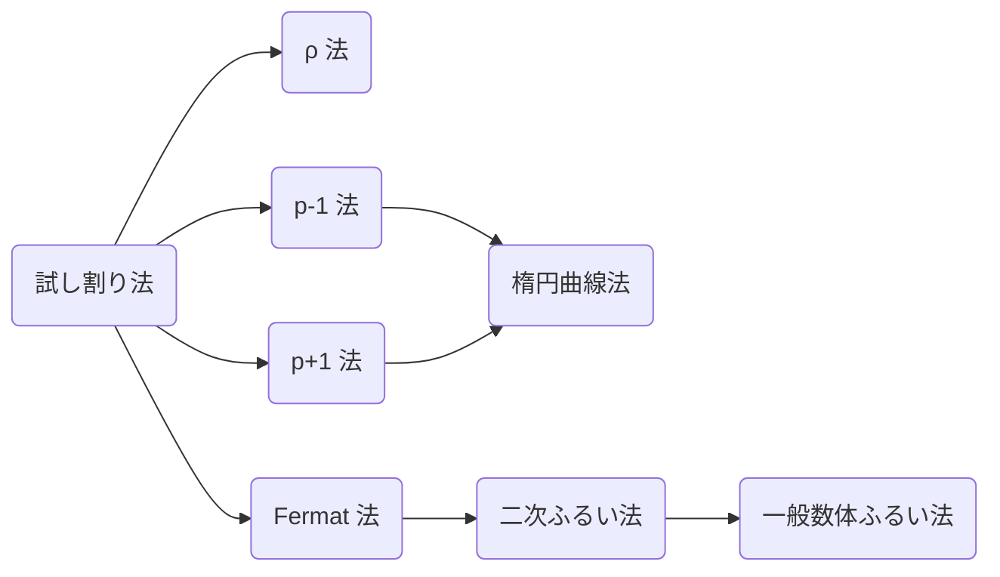

暗号では楕円曲線上の点や格子上の点などを考えたりしますが、それらには足し算や引き算ができたりして、数ではないが「数っぽいもの」がちらほら出てきます。それぞれの数っぽいものを研究してみると似たような性質がちらほらでてきます。これらに共通する性質を研究するのが代数学のモチベーションです。

その基礎となるものを次の節で学んでいきましょう。

- 群論
- 格子
- 多項式
- 楕円曲線

について解説します。楕円曲線は Fermat の最終定理を解く道具でもあったりする現代数学の要でもあるので暗号の解説ならまだしも攻撃となると流石に可換環論や代数幾何学を学んでいない読者は置いていくと思います。

基本的なアイデアだけを示すので実装の効率化が気になる人はそれぞれで書いたソースコードを読んだり原論文などを読むと良いと思います。

数学科2年前半までの数学を使います。曖昧な解説はしないつもりなので覚悟のある方だけきてください。予習必要かも、楕円曲線はここでは解説しきれない。出来る限り最短経路となるのでわかりにくいという部分が出てくると思います。質問が飛んできたら

## 記号
$\mathbb{N}$: 自然数の集合
$\mathbb{Z}$: 整数の集合
$\mathbb{Q}$: 有理数の集合
$\mathbb{R}$: 実数の集合
$\mathbb{C}$: 複素数の集合

## 群論の基礎

> **Def. 群**
> 空集合でない集合 $G$ と $G$ 上の演算が定義されていて次を満たすとき $G$ は群であるという。
> 1. 単位元と呼ばれる元 $e\in G$ があり、任意の元 $a\in G$ に対し $ae = ea = a$ となる。この $e$ は $e$ や $1$ のように書く。$G$ の群であることを強調して $1_G$ と書くこともある。
> 2. 任意の元 $a\in G$ に対し逆元と呼ばれる元 $b\in G$ があり、$ab = ba = e$ となる. この $b$ を $a^{-1}$ と書く。
> 3. 結合法則 $a(bc) = (ab)c$

具体例

1. $\mathbb{N}$ 上の加法について単位元は $0$ で結合法則は成り立ちますが、一般に逆元が存在しないので群とはなりません。$\mathbb{Z}$, $\mathbb{Q}$, $\mathbb{R}$, $\mathbb{C}$ は加法について可換群となります。
2. $\mathbb{Z}\setminus\lbrace 0\rbrace$ 上の乗法について単位元は $1$ で結合法則は成り立ちますが、一般に逆元が存在しないので群とはなりません。$\mathbb{Q}\setminus\lbrace 0\rbrace$, $\mathbb{R}\setminus\lbrace 0\rbrace$, $\mathbb{C}\setminus\lbrace 0\rbrace$ は乗法について可換群となります。これらの集合を $\mathbb{Q}^\times$, $\mathbb{R}^\times$, $\mathbb{C}^\times$ と書きます。
3. 平行移動・回転対称性

群 $G$ と $a\in G$, $n\in\mathbb{N}$ として

$$
\begin{aligned}
  a^0 &:= 1_G \\
  a^n &:= \overbrace{a\cdots a}^{n} \\
  a^{-n} &:= (a^n)^{-1}
\end{aligned}
$$

そして結合法則より指数法則 $a^m \cdot a^n = \overbrace{a\cdots a}^{m}\cdot \overbrace{a\cdots a}^{n} = a^{m + n}$

$(xy)z$ の $z$ を前に持ってきて $z(xy)$ などとすることは一般にはできません。

> **Def. 部分群**
> ある群 $G$ の部分集合 $G'$ が同じ演算において群を成すとき $G'$ は $G$ の部分群であるという。

> **Prop. 部分群の条件**
> 単位元逆元

> **Def. 巡回群**
> 群 $G$ についてある元 $g\in G$ を用いて $G = \lbrace g^n\mid n\in\mathbb{Z}\rbrace$ となるとき、$G$ を巡回群と呼ぶ。

> **Prop.**
> 巡回群 $G$ において任意の元 $g\in G$ で $g^{|G|} = 1$ が成り立つ。

フェルマーの小定理やオイラーの定理やカーマイケルの定理は上記の命題により成り立つ(後ほど証明する)。またねじれ群

> **繰り返し二乗法**
> 巡回群 $G$ において元 $g\in G$ を用いて $g^n$ を $\mathcal{O}(k\log{n})$ で求められる。ただし 1 回の演算に $\mathcal{O}(k)$ 掛かるとする。

**Proof.**

> **Thm. ラグランジュの定理**
>
> $$
|G| = |G:H||H|
$$

> **Def.**
> 準同型とは取れる
> 同型とは

> **Thm. 準同型定理**
> 群 $G_1, G_2$ とその間に準同型 $\phi: G_1 \to G_2$ があるとするとき次が成り立つ。
>
> $$
G_1/\mathrm{Ker}(\phi) \cong \mathrm{Im}(\phi)
$$

### 中国剰余定理

> **Thm. 中国剰余定理 (CRT; Chinese Remainder Theorem)**
> $m, n \neq 0$ が互いに素な整数なら、$\mathbb{Z}/mn\mathbb{Z} \cong \mathbb{Z}/m\mathbb{Z}\times\mathbb{Z}/n\mathbb{Z}$

**Proof.**
写像 $\phi: \mathbb{Z}/mn\mathbb{Z} \to \mathbb{Z}/m\mathbb{Z}\times\mathbb{Z}/n\mathbb{Z}$ を次のように定義する。

$$
\phi(x + mn\mathbb{Z}) = (x + m\mathbb{Z}, x + n\mathbb{Z})
$$

これは準同型となる。また $m, n$ が互いに素であるから $ma + nb = 1$ となる $a, b$ が存在する。ここで任意の $x, y$ に対し $z = may + nbx$ とおくと

$$
\begin{aligned}
  z & = may + (1 - ma)x = x + ma(y - x) &&\in x + m\mathbb{Z} \\
    & = (1 - nb)y + nbx = y + nb(x - y) &&\in y + n\mathbb{Z}
\end{aligned}
$$

となる。これを元に写像 $\psi(x + m\mathbb{Z}, y + n\mathbb{Z}) = z + mn\mathbb{Z}$ を構成すると $\psi$ は $\phi$ の逆写像であり、$\phi$ は全単射となる。よって $\phi$ は同型写像であり、$\mathbb{Z}/mn\mathbb{Z}$ と $\mathbb{Z}/m\mathbb{Z}\times\mathbb{Z}/n\mathbb{Z}$ は同型である。 $\Box$

これより次のことが言えます。

> **Prop.**
> $n = p_1^{e_1}\cdots p_k^{e_k}$ と素因数分解出来るとき、次が成り立つ。
>
> $$
\mathbb{Z}/n\mathbb{Z} \cong \mathbb{Z}/p_1^{e_1}\mathbb{Z}\times\cdots\times\mathbb{Z}/p_k^{e_k}\mathbb{Z}
$$

例えば $\mathbb{Z}/15\mathbb{Z} \cong \mathbb{Z}/3\mathbb{Z}\times\mathbb{Z}/5\mathbb{Z}$ となるので法が15の数と法が3, 5の数のペアは1対1に対応させることができます。

| $\times$ |  0  |  1  |  2  |  3  |  4  |
|:--------:|:---:|:---:|:---:|:---:|:---:|
|    0     |  0  |  6  | 12  |  3  |  9  |
|    1     | 10  |  1  |  7  | 13  |  4  |
|    2     |  5  | 11  |  2  |  8  | 14  |

数自体だけではなく加法、乗法についても対応します。

$$
\begin{aligned}
8 &+ 9 = 2 & \pmod{15} \\
&\downarrow \\
(2, 3) &+ (0, 4) = (2, 2) & \pmod{(3, 5)} \\
\end{aligned}
$$

$$
\begin{aligned}
8 &\times 9 = 12 & \pmod{15} \\
&\downarrow \\
(2, 3) &+ (0, 4) = (0, 2) & \pmod{(3, 5)} \\
\end{aligned}
$$


// TODO 3 5 でやると分かりやすい

大きな剰余ではなく複数の小さな剰余に分割して考えた方が探索すべき数は圧倒的に減ります。このような考え方を Crypto ではよく行います。
その為には相互に剰余を変換できなければ話になりません。

大きな剰余 $n$ と複数の小さな剰余 $m_i (i=1,\ldots,k)$ について $m_i|n$ が成り立つとします。

まず小さくするときは $(x \bmod n)\bmod m_i$ とすればよいです。

$$
\begin{aligned}
a \bmod{pq} \bmod{p} &= (a - k_1pq) - k_2p \\
&= a - (k_1q + k_2)p \\
&= a \bmod{p} \\
\end{aligned}
$$

となるからです。注意すべきなのは2つが約数の関係となる剰余でしかこのような式は有効ではないです。例えば有効ではない式として $20 \bmod 15 \bmod 9 \neq 20 \bmod 9$ があります。

逆に小さな剰余から大きな剰余にするにはどうやって計算すればいいでしょうか。このように小さな群から大きな群へ移す操作は持ち上げ (lift) とよばれていて、この群を持ち上げるには次の多項式時間のアルゴリズムが知られています。

> **Garner のアルゴリズム**
> 整数 $m_1,\ldots,m_k$ に対し、ある整数 $x\in [0, \mathop{\mathrm{lcm}} m_i)$ の $m_i$ に関する剰余 $r_i = x \bmod m_i$ が与えられれば $x$ を $\mathcal{O}(k\log(\max m_i) + k^2)$ で求められる。

基本的なアイデアとしては互いに素な剰余 $m_1, m_2$ に対して

$$
\begin{aligned}
x & = q_1m_1 + r_1 \\
r_2 & = q_1m_1 + r_1 & \pmod{m_2} \\
q_1 & = (r_2 - r_1)m_1^{-1} & \pmod{m_2} \\
x & = (r_2 - r_1)(m_1^{-1} \bmod{m_2})m_1 + r_1 & \pmod{m_1m_2} \\
\end{aligned}
$$

例えば「3 で割ったあまりが 2」かつ「5 で割ったあまりが 3」であるようなものは $2 + (3 - 2)2\times3 = 8 \pmod{15}$ となります。

これについては良記事があります。
https://qiita.com/drken/items/ae02240cd1f8edfc86fd

:::message
**練習問題**
- $(ap)^e \pmod{pq}$ は $p$ で割り切れることを中国剰余定理によって証明せよ。
- 剰余 $m_i$ が互いに素ではないときの Garner のアルゴリズムを実装せよ。
:::

### 乗法群

> **Prop.**
> $p$ を素数とおくと
>
> $$
(\mathbb{Z}/p\mathbb{Z})^\times \cong \mathbb{Z}/(p−1)\mathbb{Z}
$$

**Proof.**
$(\mathbb{Z}/p\mathbb{Z})^\times$ において位数 $p - 1$ の元 (原始根) が存在することを示す。
まず $n$ が $p - 1$ の約数であるとき $x^n = 1$ は $n$ 個の解を持つことを示す。仮定より $p - 1 = nk$ とおけ、次のそれぞれの式について解の個数について考える。

$$
x^{p-1} - 1 = (x^n - 1)((x^n)^{k-1} + \ldots + x^n + 1)
$$

$x^{p-1} - 1 = 0$ はフェルマーの小定理より $p - 1$ 個
$(x^n)^{k-1} + \ldots + x^n + 1 = 0$ は代数学の基本定理より $n(k-1)$ 個以下
よって $x^{n} - 1 = 0$ は解の個数を比較して $n$ 個存在する。

これより $p-1$ と互いに素な数の個数だけ原始根が存在する。

原始根 $a$ を1つ選び、写像 $\phi: \mathbb{Z}\to(\mathbb{Z}/p\mathbb{Z})^\times$ を $\phi(k) = a^k$ とすると、これは準同型である。全射である。$\mathrm{Ker}(\phi) = (p-1)\mathbb{Z}$。よって $(\mathbb{Z}/p\mathbb{Z})^\times \cong \mathbb{Z}/(p−1)\mathbb{Z}$ である。$\Box$

知っておくと便利な定理があります。

> **Thm. Carmichael の定理**
>
> $$
\begin{aligned}
(\mathbb{Z}/p_1^{e_1}\ldots p_n^{e_n}\mathbb{Z})^\times &\cong (\mathbb{Z}/p_1^{e_1}\mathbb{Z})^\times \times \ldots \times (\mathbb{Z}/p_n^{e_n}\mathbb{Z})^\times\\
(\mathbb{Z}/p^e\mathbb{Z})^× &\cong \begin{cases}
\lbrace 1\rbrace & (p = 2, e = 1) \\
\mathbb{Z}/2\mathbb{Z} \times \mathbb{Z}/2^{e-2}\mathbb{Z} & (p = 2, e \geq 2) \\
\mathbb{Z}/p^{e-1}(p−1)\mathbb{Z} & (p > 2) \\
\end{cases}
\end{aligned}
$$

これについても良記事があります。
https://integers.hatenablog.com/entry/2016/07/24/163831
https://integers.hatenablog.com/entry/2017/06/08/191649
### Tonelli Shanks のアルゴリズム

> **Def. 平方剰余**
> $\mathbb{Z}/(p-1)\mathbb{Z}$ が偶数か奇数かを判別する方法

$$
n^{\frac{p-1}{2}}
$$

| $n$ | $2^0$ | $2^1$ | $2^2$ | $2^3$ | $2^4$ | $2^5$ | $2^6$ | $2^7$ | $2^8$ | $2^9$ | $2^{10}$ | $2^{11}$ |
|:--------:|:-:|:-:|:--:|:--:|:-:|:-:|:-:|:-:|:-:|:-:|:-:|:-:|
| $\sqrt{n}$ | $2^0, 2^6$ | なし | $2^1, 2^7$ | なし | $2^2, 2^8$ | なし | $2^3, 2^9$ | なし | $2^4, 2^{10}$ | なし | $2^5, 2^{11}$ | なし |

中国剰余定理から上のように分解でき、$\bmod 3$ なら $2$ の逆数が定義できるので $2^{-1} \bmod 3  = 2$ 乗します。すると $10^2 = 9 \pmod{13}$ となり、これは $9 = 2^8 \pmod{13}$ で下の表をみるとしっかり $8$ は $5, 11$ のある $2 \bmod 3$ の行にあります。ここから上下に動かさずに左右だけを動かして本当の平方根を求めます。

| $\times$ | 0 | 1 |  2 |  3 |
|:--------:|:-:|:-:|:--:|:--:|
|     0    | 0 | 9 |  6 |  3 |
|     1    | 4 | 1 | 10 |  7 |
|     2    | 8 | 5 |  2 | 11 |

例えば $\sqrt{10} \pmod{13}$ については $\sqrt{10} = \sqrt{2^{10}} = 2^5, 2^{11} = 6, 7 \pmod{13}$ となります。このように DLP を解いて半分にしたものを累乗させれば平方根が求まります。この計算量は $\mathcal{O}(\sqrt{N})$ であり、$N$ のビット数に対して指数時間掛かる。これに対し、多項式時間のアルゴリズムが見つかっている。

> **Tonelli Shanks のアルゴリズム**
> $\mathbb{F}_p$ において平方根を $\mathcal{O}((\log p)^2)$ で求められる。また $k$ 乗根は $\mathcal{O}(\min(p^{1/4}, \sqrt{k})\log k(\log p)^2 + \min(p^{1/4}, \sqrt{k}))$ で求められる。

ここでは平方根のみを考えます。

平方根について定式化すると $x^2 = a \pmod p$ となる $x$ を求める問題です。まず $2$ と $p-1$ は互いに素ではない為、$2^{-1}\pmod{p - 1}$ は計算できません。代わりに中国剰余定理で $2$ の累乗部分だけ分解して

$$
(\mathbb{Z}/p\mathbb{Z})^\times \cong \mathbb{Z}/(p-1)\mathbb{Z} \cong \mathbb{Z}/q\mathbb{Z} \times \mathbb{Z}/2^Q\mathbb{Z}
$$

$x = a^{(q + 1)/2}\pmod{p}$ を計算します。$\mathbb{Z}/q\mathbb{Z} \times \mathbb{Z}/2^Q\mathbb{Z}$ において $a = (a_1, a_2)$ とおくと、$a, x, x^2, a^{-1}x^2$ はそれぞれ次のようにかけます。

$$
\begin{aligned}
  a & = (a_1, a_2) \\
  x & = \frac{q + 1}{2}(a_1, a_2) \\
  x^2 & = (q + 1)(a_1, a_2) = ((q + 1)a_1, (q + 1)a_2) \\
  & = (a_1, (q + 1)a_2) \\
  a^{-1}x^2 & = (0, qa_2)
\end{aligned}
$$

(本当は同型関数 $\phi: \mathbb{Z}/(p-1)\mathbb{Z} \to \mathbb{Z}/q\mathbb{Z} \times \mathbb{Z}/2^Q\mathbb{Z}$ を用いて $\phi(a) = (a_1, a_2)$ と書きますが、分かりやすさの為に省略します。)

これより $\mathbb{Z}/q\mathbb{Z}$ は解と同じとなります。

次に $\mathbb{Z}/2^Q\mathbb{Z}$ を合わせます。

まず誤差を $e = a^{-1}x^2$ とおき、$e, e^{2}, e^{4}, e^{8}, e^{16}, \ldots, e^{2^Q}$ を計算していくといつかは $1$ となります。ちょうどそのとき $\mathbb{Z}/2^Q\mathbb{Z}$ が $0$ となります。

$$
\begin{aligned}
  e & = (0, e_2) \\
  e^{2^s} & = (0, 2^se_2)
\end{aligned}
$$

このときの $s$ を用いると誤差 $e$ について $1$ となっている一番下のビットは $Q - s$ ビット目とわかります。

ここで平方剰余でない数 $u$ を取ると $u, u^q, u^{2^tq}$ はそれぞれ次のようになります。ただし平方剰余ではないことから $u_2$ は奇数です。

$$
\begin{aligned}
  u & = (u_1, u_2) \\
  u^q & = (0, qu_2) \\
  u^{2^tq} & = (0, 2^tqu_2) \\
\end{aligned}
$$

これより $1$ となっている一番下のビットが $t$ の数を作ることができます。$1$ となっている一番下のビットが $Q-s-1$ の数を作って $x$ に掛けます。

$$
x \leftarrow xu^{2^{Q-s-1}q}
$$

すると

$$
\begin{aligned}
  e & = (0, 2^{Q-s}qu_2e_2) \\
  e^{2^s} & = (0, 2^Qqu_2e_2) = (0, 0)
\end{aligned}
$$

となり、$e$ の $1$ となっている一番下のビットが大きくなっています。これを繰り返すことで誤差が次第に無くなっていき、最後には $x$ が $a$ の平方根となります。 $\Box$

最終的には次のアルゴリズムとなります。

1. $x = a^{(q + 1)/2}$ を計算する。
2. 誤差 $e = a^{-1}x^2$ で $1$ となっている一番下のビット $s$ を調べる。
3. 非平方剰余 $u$ を用いて $x \leftarrow x\cdot \mathrm{pow}(u^q, 2^{Q - s - 1})$ とする。
4. $e = 1$ となるまで 2, 3 を繰り返す。

たぶんこの説明だと分かりづらいと思うので具体例を考えます。

$p = 13$ のとき $\mathbb{Z}/12\mathbb{Z} = \mathbb{Z}/3\mathbb{Z}\times\mathbb{Z}/2^2\mathbb{Z}$ となるので次のような表となる。
|  $2^Q\backslash q$  | 0   | 1   | 2   |
| --- | --- | --- | --- |
| 0   | 0   | 4   | 8   |
| 1   | 9   | 1   | 5   |
| 2   | 6   | 10  | 2   |
| 3   | 3   | 7   | 11  |

ここで原始根 $2$ を選ぶと $(\mathbb{Z}/13\mathbb{Z})^\times$ と $\mathbb{Z}/3\mathbb{Z}\times\mathbb{Z}/2^2\mathbb{Z}$ の対応表が完成する。

| $2^Q\backslash q$ | 0         | 1           | 2          |
| ----------------- | --------- | ----------- | ---------- |
| 0                 | $2^0=1$   | $2^4=3$     | $2^8 = 9$  |
| 1                 | $2^9=5$   | $2^1=2$     | $2^5=6$    |
| 2                 | $2^6=12$  | $2^{10}=10$ | $2^2=4$    |
| 3                 | $2^3 = 8$ | $2^7=11$    | $2^{11}=7$ |

[Tonelli-Shanks のアルゴリズム - 37zigenのHP](https://37zigen.com/tonelli-shanks-algorithm/)

## 素数生成

暗号として機能する素数の大きさは $2^{512}$ や $2^{1024}$ 程度のオーダーとなっています。素数定理より、ある数 $n$ が素数である確率は約 $1/\log n$ です。例えば $n=2^{512}$ で2.8%、 $n=2^{1024}$ で1.4%となります。つまり、500回乱数を生成すれば99.65%で素数を見つけられるということです。
素数判定のアルゴリズムは多くありますが、ここではMiller-Rabin素数判定法を紹介します。

### Miller–Rabin 素数判定法

素数判定法とはその名の通り、数を与えるとそれが素数かどうかが分かる判定法です。

> **Miller-Rabin 素数判定法**
> 与えられた数 $n$ が素数かどうかを計算時間 $O(k\log^3 n)$ で誤り率 $4^{-k}$ 以下で判定する確率的素数判定アルゴリズムです。


$n$ が素数のとき、$n-1$ はそれを $2$ で割れるだけ割った数を $d$ として $n-1 = 2^sd$ と書けます。フェルマーの小定理より $a≠0 \pmod n$ のとき

$$
\begin{aligned}
a^{n-1} &= a^{2^sd} ≡ 1 \quad \pmod n \\
a^{2^sd}-1 &= (a^d-1)(a^d+1)(a^{2d}+1)(a^{4d}+1)\cdots(a^{2^{s-1}d}+1)\\
&≡ 0 \\
\end{aligned}
$$

これより次の2式のどちらかが成り立ちます。

$$
\begin{cases}
a^d ≡ 1 & \pmod n \\
a^{2^rd} ≡ -1 & \pmod n \qquad (\exists r \in \mathbb{Z}, 0\leq r\leq s-1)
\end{cases}
$$

この対偶をとると、「ある $a$ をとってきて次の2式をどちらも満たすとき

$$
\begin{cases}
a^d \neq 1 & \pmod n\\
a^{2^rd} \neq -1 & \pmod n \qquad (\forall r \in \mathbb{Z}, 0\leq r\leq s-1)
\end{cases}
$$

$n$ は合成数である」と言えます。

これを用い、次のステップを実行することで確率的な素数判定ができます。
1. $1\leq a \leq n-1$ でaの値をランダムにとってくる。
2. 上の条件を満たしたらcompositeと返す。
3. 満たさなければprobably primeと返す。

これを繰り返すことで判定の精度が高まります。この処理をMiller–Rabin素数判定法といって、実行時間は $O(k\log^3 n)$ 、FFTベースの乗算で $Õ(k\log^2 n)$ となります。

具体例を考えてみましょう。
判定時にprobably primeを返す時 p、compositeを返す時 c として具体値を入れると次のようになります。
$n = 25$ (合成数)のとき
$n-1 = 24 = 2^3 \times 3$ より $s = 3, d = 3$

| a | 1 | 2 | 3 | 4 | 5 | 6 | 7 | 8 | 9 | 10 | 11 | 12 | 13 | 14 | 15 | 16 | 17 | 18 | 19 | 20 | 21 | 22 | 23 | 24 |
|:-:|:-:|:-:|:-:|:-:|:-:|:-:|:-:|:-:|:-:|:-:|:-:|:-:|:-:|:-:|:-:|:-:|:-:|:-:|:-:|:-:|:-:|:-:|:-:|:-:|
| $a^3 \bmod 25$ | 1 | 8 | 2 | 14 | 0 | 16 | 18 | 12 | 4 | 0 | 6 | 3 | 22 | 19 | 0 | 21 | 13 | 7 | 9 | 0 | 11 | 23 | 17 | 24 |
| $a^6 \bmod 25$ | 1 | 14 | 4 | 21 | 0 | 6 | 24 | 19 | 16 | 0 | 11 | 9 | 9 | 11 | 0 | 16 | 19 | 24 | 6 | 0 | 21 | 4 | 14 | 1 |
| $a^{12} \bmod 25$ | 1 | 21 | 16 | 16 | 0 | 11 | 1 | 11 | 6 | 0 | 21 | 6 | 6 | 21 | 0 | 6 | 11 | 1 | 11 | 0 | 16 | 16 | 21 | 1 |
| 判定 | p | c | c | c | c | c | p | c | c | c | c | c | c | c | c | c | c | p | c | c | c | c | c | p |

$n = 17$ (素数)のとき
$n-1 = 16 = 2^4 \times 1$ より $s = 4, d = 1$

| a | 1 | 2 | 3 | 4 | 5 | 6 | 7 | 8 | 9 | 10 | 11 | 12 | 13 | 14 | 15 | 16 |
|:-:|:-:|:-:|:-:|:-:|:-:|:-:|:-:|:-:|:-:|:-:|:-:|:-:|:-:|:-:|:-:|:-:|
| $a \bmod 17$ | 1 | 2 | 3 | 4 | 5 | 6 | 7 | 8 | 9 | 10 | 11 | 12 | 13 | 14 | 15 | 16 |
| $a^2 \bmod 17$ | 1 | 4 | 9 | 16 | 8 | 2 | 15 | 13 | 13 | 15 | 2 | 8 | 16 | 9 | 4 | 1 |
| $a^4 \bmod 17$ | 1 | 16 | 13 | 1 | 13 | 4 | 4 | 16 | 16 | 4 | 4 | 13 | 1 | 13 | 16 | 1 |
| $a^8 \bmod 17$ | 1 | 1 | 16 | 1 | 16 | 16 | 16 | 1 | 1 | 16 | 16 | 16 | 1 | 16 | 1 | 1 |
| 判定 | p | p | p | p | p | p | p | p | p | p | p | p | p | p | p | p |

かなり正確に判定できていることがわかるでしょう。

素数については必ず成功し、合成数のときは誤る可能性が $1/4$ 以下ということが示せるので、 $k$ 回試行すれば誤り率は $4^{-k}$ 以下となります。つまり、ある値に対して10回素数判定法を回せば99.9999046%成功するということです。

## 素因数分解
試し割り法を基本にして $\rho$ 法や楕円曲線法、数体ふるい法などがあります。まず試し割り法で小さな倍数は除いてから他の方法を選択すると速いです。



計算量はよく $L$ 記法を用いて表現されます。なぜかはわかりません。計算量解析苦手なので。

$$
L_n[\alpha, c] = \exp(c(\log n)^\alpha(\log\log n)^{1-\alpha})
$$

### 試し割り法

愚直に素数を小さい順に割っていく方法です。大体の場合これで十分速いです。

1. $N$ を $2$ 以上 $\sqrt{N}$ 以下の整数で下から順に割れるだけ割り続け、割った数 $p$ とその回数 $e$ を記録する。
2. 最後に残った $N$ が $1$ ではないならば記録する。

この計算量は $\mathcal{O}(\sqrt{N})$ となります。また $\sqrt{N}$ までの素数リストが既にあるならば素数定理によって計算量は $\mathcal{O}(\sqrt{N}/\log{\sqrt{N}})$ に落ちる。

https://gist.github.com/anko9801/9a717f4737104a81b5cf90dd50b94dfd

### Pollard の $p-1$ 法
$p-1$ が Smooth number のとき有効な素因数分解法です。

> **Prop.**
> $N$ がある素因数 $p$ をもつとき $k$ が $p-1$ の倍数であれば $a^k - 1 \pmod N$ は $p$ の倍数となる。

**Proof.**
フェルマーの小定理より $a^k = 1 \pmod p$ であるから $a^k - 1 \pmod N$ は $p$ の倍数である。$\Box$

もちろん $p$ の値は分からないので約数をたくさん持つような $M$ を用意します。$M$ を $B$-Smooth number として次のように構成します。

$$
\begin{aligned}
  M = \prod_{\mathrm{primes}\ q\leq B} q^{\lfloor\log_q B\rfloor}
\end{aligned}
$$

この $M$ が $N$ のどれかの大きな素因数 $p$ に対して $p-1$ の倍数となったとき $\gcd(a^k - 1, N)$ を計算することで $p$ を取り出せます。計算量は $\mathcal{O}(B\log B\log\log n)$ らしいです。

果たしてそんなうまくいくのだろうか？これを初めて聞いたとき大きな数は大体大きな素因数持ってるだろうからほとんど上手くいかなそうと感じました。

考えてみればすぐわかります。

適当に数を取ってきてある素数 $p$ が含まれている確率というのは $1/p$ 、つまり素数が大きければ大きいほど含まれにくいです。

https://gist.github.com/anko9801/8f53ff0e4af8d866d3fc93b4fbfefb68

### Hugh Williams の $p+1$ 法
$p + 1$ が Smooth number のとき有効な素因数分解法です。

> **Prop.**
> $k$ が $p+1$ の倍数であれば Lucas 数列 $u_i, v_i$ に対し、 $u_k$ は $p$ の倍数となる。ただし Lucas 数列は次のように定義される。
>
> $$
\begin{aligned}
  u_0 & = 0, u_1 = 1, u_{n+1} = au_n - bu_{n-1} \\
  v_0 & = 2, v_1 = a, v_{n+1} = av_n - bv_{n-1}
\end{aligned}
$$

**Proof.**
Lucas 数列について

$$
\begin{aligned}
  \alpha,\beta & = \frac{a \pm \sqrt{a^2 - 4b}}{2} \\
  y_n & = \frac{\alpha^n - \beta^n}{\alpha - \beta}
\end{aligned}
$$

$$
\begin{aligned}
  2^{n-1}x_n & = \sum_k^n {}_nC_{2k}a^{n-2k}d^k \\
  2^{n-1}y_n & = \sum_k^n {}_nC_{2k+1}a^{n-2k-1}d^k
\end{aligned}
$$

$n = p$ と素数となるとき

$$
\begin{aligned}
  x_p & = \sum_{k=0}^{(p-1)/2} {}_pC_{2k}a^{p-2k}d^k = a & \pmod p \\
  y_p & = \sum_{k=0}^{(p-1)/2} {}_pC_{2k+1}a^{p-2k-1}d^k = d^{(p-1)/2} & \pmod p
\end{aligned}
$$

$$
\begin{aligned}
  y_{p+1} & = ay_p + by_{p-1} = -a + (x_p - y_{p+1}) = -y_{p+1} & \implies y_{p+1} & = 0 & (d^{(p-1)/2} = -1) \pmod p \\
  by_{p-1} & = y_{p+1} - ay_p = (x_p - by_{p-1}) - ay_p = -by_{p-1} & \implies y_{p-1} & = 0 & (d^{(p-1)/2} = 1) \pmod p
\end{aligned}
$$

繰り返し二乗法っぽく $y_k$ を $\mathcal{O}(\log k)$ で計算できる。

$$
\begin{aligned}
  y_{2n} & = 2y_ny_{n+1} - ay_n^2 \\
  y_{2n+1} & = y_{n+1}^2 + by_n^2 \\
  y_{2n+2} & = ay_{n+1}^2 + 2by_ny_{n+1}
\end{aligned}
$$

約数の多い $k$ を用意して $\gcd(y_k, N)$ が出てくる。確率はどれくらい？

### 楕円曲線法
一般に有効な素因数分解法です。

> **Prop.**
> $k$ が $\#E/(\mathbb{Z}/N\mathbb{Z})$ の倍数であれば $kP = \mathcal{O}$ となる。このとき内部計算時に $x_1 - x_2$ が $p$ の倍数となる。

$N$ が 2, 3 の倍数でないとします。楕円曲線 $y^2 = x^3 + ax + b \pmod N$ について $a, b$ に様々な値を与えて $kP$ を計算します。

計算量は準指数時間 $\mathcal{O}(\exp((1 + c)(\log p)^{1/2}(\log\log p)^{1/2}))$ らしい。

### 二次ふるい法 (QS; Quadratic Sieve)
ある範囲 $\sqrt{N} - \epsilon < x < \sqrt{N} + \epsilon$ の中で $x^2 - N$ が $B$-smooth となるような数をいくつか取ってくる。それらを素因数分解し、いくつかの数の積がちょうど平方数となるように選択する。その平方数を $y^2$ とすると $x^2 = y^2 \pmod N$ となり $x\pm y$ のどちらかは $p$ の倍数となる。

$\gcd(x \pm y, N)$

なんかしらんけど計算量は $\mathcal{O}(\exp((1 + c)(\log n)^{1/2}(\log\log n)^{1/2}))$ らしいです。

### 一般数体ふるい法 (GNFS; General Number Field Sieve)
計算量は $\mathcal{O}(\exp((1 + c)(\log n)^{1/3}(\log\log n)^{2/3}))$ になったらいいなと思っています。

### Shor のアルゴリズム
流石に量子計算について基礎から理解するのは難しいので

## 離散対数問題
離散対数問題 (DLP: Discrete Logarithm Problem) とは位数 $N$ の巡回群 $G$ について $g, y\in G$ が与えられるので $g^x = y$ となる最小の $x\in \mathbb{N}$ を求める問題です。

- 有限体 $\mathbb{F}_p$ の DLP は FFDLP; Finite Field DLP と呼ばれる。巡回群 $\mathbb{F}_p$ の位数は $p-1$ となる。
- 楕円曲線 $E$ 上での DLP は ECDLP; Elliptic Curve DLP と呼ばれる。巡回群 $E/\mathbb{F}_p$ の位数は Hasse の定理より $|\#E/\mathbb{F}_p - (p+1)|\leq 2\sqrt{p}$ に制限される。

### Baby-step Giant-step

半分全列挙を用いる方法。

$m = \lceil\sqrt{N}\rceil$ とおく。DLP の解 $n$ を $m$ で割って $n = qm + r$ とおく。

$$
\begin{aligned}
y & = g^{qm + r} & (q, r\in[0, m-1])
\end{aligned}
$$

このとき $yg^{-r}$, $g^{qm}$ を全列挙し、どちらかのリストの要素をもう1つのリストで検索して $yg^{-r} = g^{qm}$ となる組を探索し、解を得る。この計算量は $O(\sqrt{N}\log N)$ となる。

### Pollard's $\rho$ 法

誕生日のパラドックスを用いる方法。

> **Prop. 誕生日のパラドックス**
> 誕生日が同じ 2 人を見つけたいときに確率 $P$ を超えるには人を何人集めればよいのかという問題です。鳩ノ巣原理から $366$ 人いれば必ず同じ誕生日の人が出てきます。$50\%$ を超えるには $23$ 人で十分です。

**Proof.**
$N$ 種類の元から $k$ 個の元を取ってきたとき $k-1$ 個までそれぞれ相違なり, $k$ 個目で同じとなる確率は $t \ll 1$ のときの近似 $1 - t\approx e^{-t}$ を行うことで次のようになる。

$$
P(A) = \frac{k}{N}\prod_{i = 0}^{k-1}\left(1-\frac{i}{N}\right) \leq \frac{k}{N}\prod_{i = 0}^{k-1}e^{-i/N} = \frac{k}{N}e^{-k(k-1)/2N} \leq \frac{k}{N}e^{-k^2/2N}
$$

試行回数 $k$ に対する期待値は $t = k/\sqrt{N}$ と変数変換し、ガウス積分することで求まる。

$$
E(A) \leq \sum_{k=1}^N k\cdot\frac{k}{N}e^{-k^2/2N} = \sum_{k=1}^N t^2e^{-t^2/2} \leq \sqrt{N}\int_0^\infty t^2e^{-t^2/2}dt = \sqrt{\frac{\pi N}{2}}
$$

よって期待値は大体 $\sqrt{\frac{\pi N}{2}}$ となる為、$N = 365$ を代入すると 50\% を超えるには 23.95 人が必要となる。$\Box$

このように $N$ 種類のボールが入った袋から無作為に取ってきたら同じ種類のボールが 2 つ取れるような個数が $\mathcal{O}(\sqrt{N})$ であることを利用して計算量を落とすことを考えます。まず大枠としては次のようなアルゴリズムです。

1. 疑似乱数関数 $f(a)$ を決めて数列 $a_0, a_{i+1} = f(a_i)$ を生成する。
2. $a_i = a_j$ となる $i, j\ (0\leq i<j<N)$ を発見したとき以下の方法で DLP が求まる。

まず、このアルゴリズムで使われる代表的な疑似乱数関数 $f(x)$ について紹介します。まず巡回群 $G$ を $G_1, G_2, G_3$ に振り分けて、次のように定義します。

$$
f(a)=
\begin{cases}
ya & (a \in G_1) \\
a^2 & (a \in G_2) \\
ga & (a \in G_3)
\end{cases}
$$

このとき $a_0 = g$ とすると $a_i = g^{s_i}y^{t_i} = g^{s_i + xt_i}\ (s_i, t_i \in \mathbb{N})$ と書ける。$a_i = a_j$ のとき

$$
\begin{aligned}
a_ia_j^{-1} & = g^{(s_i + xt_i) - (s_j + xt_j)} = 1 \\
x &= \frac{s_i - s_j}{t_j - t_i} & \pmod N
\end{aligned}
$$

となり $x$ が分かる。期待計算量は $\mathcal{O}(\sqrt{N})$ です。

Pollard-$\rho$ 法の $\rho$ は文字 $\rho$ の形が $a_i$ の由来となっています。

### Pollard's Kangaroo 法 ($\lambda$ 法)
$\rho$ 法は動く点が1つの値だったのに対し、 $\lambda$ 法は2つの値がランダムに動いていき、一方がもう一方の点に衝突したとき DLP が解ける。

$$
\begin{aligned}
x_0 & = g^\alpha & y_0 & = y \\
x_{i+1} & = x_ig^{f(x_i)} & y_{i+1} & = y_ia^{f(y_i)} \\
\end{aligned}
$$

$x_i = y_j$ となるとき $x = \alpha + \sum_{k=1}^{i} f(x_k) - \sum_{k=1}^{j} f(y_k)$ となる。
見つからなければ $N$ や $f$ を取り替えて繰り返す。

同じく期待計算量は $\mathcal{O}(\sqrt{N})$ です。

### Pohlig-Hellman

> **Prop.**
> 巡回群の位数が $|G| = \prod_{i = 1}^n p_i^{e_{i}}$ と素因数分解できるとき $G \cong \prod_{i = 1}^n \mathbb{Z}/p_i^{e_{i}}\mathbb{Z}$ となる。

アーベルの構造定理により証明できる。詳細は群論を学んでほしい。
これより中国剰余定理から $\mathcal{O}(\max{p_i^{e_i}})$ に落ちる。

### 指数計算法 (Index Calculus Algorithm)
有限体上の DLP でのみ有効な方法。

1. 小さな素因数 $p_j$ を用いて $yg^k = \prod_{j = 1}^m p_j^{e_{j}} \pmod p$ と書けるような $k$ を見つける。
2. $g^{k_i} = \prod_{j = 1}^m p_j^{e_{ij}} \pmod{p}$ と素因数分解できるような $k_i$ を $m$ 個以上見つける。

$$
\begin{aligned}
  g^{k_i} & = \prod_{j = 1}^m p_j^{e_{ij}} & \pmod p \\
  k_i & = \sum_{j = 1}^m e_{ij}\log_g{p_j} & \pmod{p-1} \\
\begin{pmatrix}
  k_1 \\
  \vdots \\
  k_n \\
\end{pmatrix} & =
\begin{pmatrix}
  e_{11} & \cdots & e_{m1} \\
  \vdots & \ddots & \vdots \\
  e_{1n} & \cdots & e_{mn}\\
\end{pmatrix}
\begin{pmatrix}
  \log_g p_1 \\
  \vdots \\
  \log_g p_m \\
\end{pmatrix} & \pmod{p-1}
\end{aligned}
$$

これよりガウスの消去法から $\log_g p_1, \ldots, \log_g p_n$ が求まる。よって次の式より $x$ が求まる。

$$
x = \sum_{j = 1}^me_j\log_g{p_j} - k \pmod {p-1}
$$

計算量は $\exp((\sqrt{2}+c)(\log n)^{1/2}(\log\log n)^{1/2})$ となる。

### 数体ふるい法
- [General purpose integer factoring](https://eprint.iacr.org/2017/1087)

## 格子

図でイメージ掴むのが速い

線形独立な $n$ 個のベクトル $\mathbf{b}_1, \mathbf{b}_2, \ldots , \mathbf{b}_n \in \mathbb{R}^m$ について整数係数の線形結合によって生成されるベクトルの集合を格子 $L$ と定義します。

$$
L = \left\{ \sum_{i=1}^{n} a_i\mathbf{b}_i \ \middle| \ a_i \in \mathbb{Z} \right\}
$$

化学の格子っぽいもの

格子 $L$ に囲まれた空間を1つ
具体例

- SVP
- near SVP
- CVP
- near CVP

### Gram-Schmidt の直交化 (GSO; Gram-Schmidt Orthonormalization)

Gram-Schmidt 直交化 (GSO; Gram-Schmidt Orthonormalization) とは実 $m$ 次元ベクトル空間 $\mathbb{R}^m$ の任意の $\mathbb{R}$ ベクトル空間としての基底を直交基底に変換する方法です. $\mathbf{b} _ n$ の直交化は $\mathbf{b} _ {1},\ldots, \mathbf{b} _ {n-1}$ すべてと直交するように元の高さのまま移動させます. GSOのWikipedia のgifがわかりやすいです.

> **Def. GSOベクトル**
> $n$ 次元格子 $L\subseteq \mathbb{R}^m$ の順序付き基底 $\{\mathbf{b} _ {1},\ldots, \mathbf{b} _ {n}\}$ に対するGSOベクトル $\mathbf{b} _ {1}^* ,\ldots, \mathbf{b} _ {n}^ *\in\mathbb{R}^m$ をGSO係数 $\mu _ {i,j}$ を用いて次のように定義する.
>
> $$
\begin{aligned}
&\begin{dcases}
\mathbf{b} _ 1^* := \mathbf{b} _ 1 \\
\mathbf{b} _ i^ * := \mathbf{b} _ i - \sum _ {j=1}^{i-1} \mu _ {i, j} \mathbf{b} _ j^ * & (2\leq i\leq n) \\
\end{dcases} \\
&\quad\mu _ {i, j} := \frac{\langle \mathbf{b} _ i, \mathbf{b}_j^ * \rangle}{\| \mathbf{b} _ j^ * \|^2} \qquad (1\leq j<i\leq n)
\end{aligned}
$$

行列で書くと次のようになる.

$$
\begin{aligned}
\begin{pmatrix}
\mathbf{b} _ 1 \\
\vdots \\
\mathbf{b} _ n \\
\end{pmatrix}
& =
\begin{pmatrix}
1 & 0 & 0 & \cdots & 0 \\
\mu _ {2,1} & 1 & 0 & \cdots & 0 \\
\mu _ {3,1} & \mu_{3,2} & 1 & \cdots & 0 \\
\vdots & \vdots & \vdots & \ddots & \vdots \\
\mu _ {n,1} & \mu _ {n,2} & \mu _ {n,3} & \cdots & 1 \\
\end{pmatrix}
\begin{pmatrix}
\mathbf{b} _ 1^ * \\
\vdots \\
\mathbf{b} _ n^ * \\
\end{pmatrix}
\end{aligned}
$$

> **Thm. GSOベクトルの基本性質**
> 1. 任意の $1\leq i<j\leq n$ に対して $\langle\mathbf{b}_ i^* , \mathbf{b} _j^ *\rangle = 0$ が成り立つ.
> 2. 任意の $1\leq i\leq n$ に対して $\|\mathbf{b}_ i^ * \|\leq\|\mathbf{b} _i\|$ が成り立つ.
> 3. 任意の $1\leq i\leq n$ に対して $\langle\mathbf{b} _ 1^* ,\ldots,\mathbf{b} _ i^ *\rangle_{\mathbb{R}} = \langle\mathbf{b} _ 1,\ldots,\mathbf{b} _ i\rangle _ {\mathbb{R}}$ が成り立つ.
> 4. $\mathrm{vol}(L) = \prod _ {i=1}^n\|\mathbf{b} _ i^*\|$ が成り立つ.

**Proof.**
1. $j$ に関する数学的帰納法により示す. $j=1$ のときは証明すべきことはない. $1,\ldots,j$ について成立していると仮定する. $j+1$ のとき任意の $1\leq i<j+1$ に対して

$$
\begin{aligned}
\langle\mathbf{b} _ i^ * , \mathbf{b} _ {j+1}^ * \rangle &= \left\langle\mathbf{b} _ i^ * , \mathbf{b} _ {j+1} - \sum _ {k=1}^j\mu _ {j+1, k}\mathbf{b} _ {k}^ * \right\rangle \\
&= \langle\mathbf{b} _ i^ * , \mathbf{b} _ {j+1}\rangle - \mu _ {j+1,i}\langle\mathbf{b} _ i^ * , \mathbf{b} _ {i}^ * \rangle \\
&= \langle\mathbf{b} _ i^ * , \mathbf{b} _ {j+1}\rangle - \frac{\langle \mathbf{b} _ {j+1}, \mathbf{b} _ i^ * \rangle}{\| \mathbf{b} _ i^ * \|^2}\|\mathbf{b} _ i^ * \|^2 \\
&= 0
\end{aligned}
$$

が成り立つ. よって, 数学的帰納法より任意の $1\leq i<j\leq n$ に対して $\langle\mathbf{b} _ i^ * , \mathbf{b} _ j^ * \rangle = 0$ が成り立つ.

2. $i=1$ のとき $\mathbf{b} _ 1^* = \mathbf{b} _ 1$ より明らか. $i\geq 2$ のとき

$$
\|\mathbf{b}_ i\|^2 = \|\mathbf{b} _ i^ * \|^2 + \sum_{j=1}^{i-1}\mu _ {i,j}^2\|\mathbf{b}_j^ * \|^2\geq\|\mathbf{b} _ i^ * \|^2
$$

より成り立つ.

3. 任意の $1\leq k\leq i$ に対し, $\mathbf{b} _ k = \mathbf{b} _ k^* + \sum _ {j=1}^{k-1} \mu _ {k, j}\mathbf{b} _ j^ *$ より, $\mathbf{b} _ k\in\langle\mathbf{b} _ 1^ * ,\ldots,\mathbf{b} _ i^ * \rangle _ {\mathbb{R}}$ がわかる. よって $\langle\mathbf{b} _ 1,\ldots,\mathbf{b} _ i\rangle _ {\mathbb{R}}\subseteq\langle\mathbf{b} _ 1^ * ,\ldots,\mathbf{b} _ i^ * \rangle _ {\mathbb{R}}$ が成り立つ. 逆向きの包含関係は $i$ に関する数学的帰納法で示す. $i = 1$ のとき $\mathbf{b} _ 1^ * = \mathbf{b} _ 1$ より明らか. $i=k-1$ のとき成り立つと仮定すると $i=k$ のとき $\mathbf{b} _ k^ * = \mathbf{b} _ k - \sum _ {j=1}^{k-1} \mu _ {k, j}\mathbf{b} _ j^ *$ より $\mathbf{b} _ k^ * \in\langle\mathbf{b} _ 1,\ldots,\mathbf{b} _ i\rangle _ {\mathbb{R}}$ , よって任意の $i$ について示された. よって $\langle\mathbf{b} _ 1^ * ,\ldots,\mathbf{b} _ i^ * \rangle _ {\mathbb{R}}=\langle\mathbf{b} _ 1,\ldots,\mathbf{b} _ i\rangle _ {\mathbb{R}}$ である.

4. $B=UB^*$ と $\det(U) = 1$, GSOベクトルの直交性より

$$
\begin{aligned}
\mathrm{vol}(L)^2 &= \det(BB^\top) \\
&= \det(UB^ * (B^ * )^\top U^\top) \\
&= \det(B^ * (B^ * )^\top) \\
&= \prod _ {i=1}^n\|\mathbf{b} _ i^ * \|^2
\end{aligned}
$$

> **Thm. Hadamardの不等式**
> GSOベクトルの基本性質 2, 4 より次のことが分かる.
>
> $$
\mathrm{vol}(L)\leq\prod _ {i=1}^n\|\mathbf{b} _ i\|
$$
>
> 特に $\{\mathbf{b} _ {1},\ldots, \mathbf{b} _ {n}\}$ が直交基底$\iff\mathrm{vol}(L)=\prod _ {i=1}^n\|\mathbf{b} _ i\|$ である.

> **Def. 射影格子**
> $n$ 次元格子 $L\subseteq\mathbb{R}^m$ の基底 $\{\mathbf{b} _ {1},\ldots, \mathbf{b} _ {n}\}$ に対し, 各 $1\leq l\leq n$ に対して $\langle\mathbf{b} _ {1},\ldots, \mathbf{b} _ {l-1}\rangle _ \mathbb{R}$ の直交補空間への直交射影を $\pi _ l:\mathbb{R}^m\to\langle\mathbf{b} _ {1},\ldots, \mathbf{b} _ {l-1}\rangle _ \mathbb{R}^\bot$ とする. 定理 2 の 1,3 より
>
> $$
\begin{aligned}
\langle\mathbf{b} _ {1},\ldots, \mathbf{b} _ {l-1}\rangle _ \mathbb{R}^\bot &= \langle\mathbf{b} _ {1}^ * ,\ldots, \mathbf{b} _ {l-1}^ * \rangle _ \mathbb{R}^\bot = \langle\mathbf{b} _ {l}^ * ,\ldots, \mathbf{b} _ {n}^ * \rangle _ \mathbb{R} \\
\pi _ l(\mathbf{b}_i) &= \sum _ {j=l}^i\mu _ {i,j}\mathbf{b} _ j^ * \\
\end{aligned}
$$
>
> となる. すると集合 $\pi _ l(L)$ は $\{\pi _ l(\mathbf{b} _ {l}),\ldots,\pi _ l(\mathbf{b} _ {n})\}$ を基底に持つ $n-l+1$ 次元の格子であり, $\pi _ l(L)$ を射影格子 (projected lattice) と呼ぶ.

$O(N^3)$

```python
def gram_schmidt():
```

### SVP; Shortest Vector Problem

格子上の非零なベクトルの中で最もノルムが小さなベクトルを見つけ出す問題です。
そのベクトルを $\mathbf{v}$ とおくと次のように表せられます。

$$
\mathbf{v} = v_1\mathbf{b}_1 + \ldots + v_n\mathbf{b}_n \qquad (\exists v_1, \ldots , v_n \in \mathbb{Z}) \\
$$

この問題はNP困難

### 最短ベクトルの数え上げ

まずは全探索してみます。
考えてみると帰納的に求めるのでは正確な最短ベクトルは求められないでしょう。
考えてみるとある基底 $\mathbf{b}_i$ に対し、それ以下の基底 $\mathbf{b}_1, \ldots \mathbf{b}_{i-1}$ で組み立てられたベクトル $\mathbf{v}$ に対し、$\mathbf{b}_i$ を用いて短くする

効率的に数え上げる為には基底簡約すると良いということが知られています。

### サイズ基底簡約
GSO ベクトルを簡約 -> 基底ベクトルを簡約
GSO 係数 $μ_{i,j}$ について

Euclid の互除法を用いて基底の簡約化をする。
具体例
$n$ 次元格子 $L$ の基底 $\\{\mathbf{b_1},\ldots,\mathbf{b_n}\\}$ を GSO 係数 $\mu_{i,j}$ が

$$
|\mu_{i,j}| \leq \frac{1}{2} \quad (1 \leq \forall j < \forall i \leq n)
$$

を満たすとき、基底 $\\{\mathbf{b_1},\ldots,\mathbf{b_n}\\}$ はサイズ簡約されているという。

```python
def size_reduction(B):
    n = len(B)
    B = matrix(B)
    G, mu = B.gram_schmidt()
    for i in range(n):
        for j in range(i - 1, -1, -1):
            if mu[i][j].abs() > 1 / 2:
                q = mu[i][j].round()
                B[i] -= q * B[j]
                mu[i] -= q * mu[j]
    return B


B = [vector([5, -3, -7]), vector([2, -7, -7]), vector([3, -10, 0])]
print(size_reduction(B))
```

### Lagrange 基底簡約 (Gaussian Reduction)

### LLL (Lenstra-Lenstra-Lovasz) 基底簡約

Lagrange 基底簡約に Lovasz 条件を追加した基底簡約を LLL 基底簡約と呼びます。
Lovasz条件 $\frac{1}{4} < \delta < 1$ として

$$
\delta \|b_{k-1}^*\|^2 \leq \|\pi_{k-1}(b_k)\|^2
$$

1. サイズ基底簡約
2. 条件に合うように基底ベクトルの交換

具体的な応用方法は良記事があります。

https://qiita.com/kusano_k/items/5509bff6e426e5043591

### BKZ (Block Korkine-Zolotareff) 基底簡約

### HKZ (Hermite-Korkine-Zolotareff) 基底簡約

1. サイズ基底簡約
2. 条件に合うように基底ベクトルの交換

### CVP; Closest Vector Problem


### Kannan’s embedding method

> **Kannan's embedding method**
> CVP の目標ベクトル $w$ と解ベクトル $v$ の差 $e = w - v$ のノルムについて $\|e\| < \lambda_1/2$ が成り立つとき SVP を解くことで求まる。

$$
\begin{pmatrix}
  B & \mathbf{0} \\
  w & M
\end{pmatrix}
$$

### Babai’s Algorithm

$$
\begin{aligned}
  w = \sum a_ib_i
\end{aligned}
$$

## 多項式
ここでは剰余上の方程式 $\mathbb{Z}/N\mathbb{Z}[x]$ の解を求める方法について解説します。

まず多変数連立 $1$ 次方程式のときは行列の $\mathrm{rank}$ と変数の数が一致するときガウスの消去法を用いて逆行列を計算できます。

$$
\begin{aligned}
A\mathbf{x} &= \mathbf{b} & \pmod N \\
\mathbf{x} &= A^{-1}\mathbf{b} & \pmod N
\end{aligned}
$$

次に与えられる多変数 1 次方程式が変数の数より少ないときについて考えます。まずある式に他の式を代入することで 1 つの式に帰着できます。

$$
a_1x_1 + a_2x_2 + \ldots + a_nx_n = b \pmod N
$$

まずは 2 変数のとき一次不定方程式 $ax + by = c$ は $\gcd(a, b)\mid c$ のとき $(x, y) = (bm + x_0, -am + y_0)$ $m\in\mathbb{Z}$ である。グラフ上で考えると

つまり、方程式の代表解を格子問題に帰着させることができます。

$$
\begin{pmatrix}
  1 & 0 & 0 & a \\
  0 & 1 & 0 & b \\
  0 & 0 & X & c \\
\end{pmatrix}
$$

少ない次数の方程式を LLL で解く方法については良記事があります。

https://qiita.com/kusano_k/items/5509bff6e426e5043591

:::message
**練習問題**

:::

更に $n$ 次方程式を格子問題に帰着する方法を考えます。

$$
a_nx^n + \ldots + a_1x + a_0 = 0 \pmod N
$$

まず考えるのはそれぞれの次数について $x_i = x^i$ とそれぞれ変数で置いて LLL に通す方法です。精度は落ちますが次数が少ないときには有効です。

これを改良する方法を考えます。まず次の補題を示します。

> **Thm. Howgrave-Graham の補題**
> $N$ を法、 $g(x) \in \mathbb{Z}[x]$ を整数多項式とし、含まれる単項式の数を $\omega$ とする。$g(x)$ に対してある $X$ が存在し、$g(x_0) = 0 \pmod{N}$ なる $x_0 \in \mathbb{Z}$ について $|x_0| \leq X$ であると仮定する。このとき
>
> $$
\|g(xX)\| < \frac{N}{\sqrt{\omega}}
$$
>
> が成立するならば $g(x_0) = 0$ が整数方程式として成立する。ただし
>
> $$
\|g(x)\| = \left\|\sum_{i=0}^{\deg g(x)}g_i\right\| = \sqrt{\sum_{i=0}^{\deg g(x)}g_i^2}
$$
>
> であり、 $\deg g(x)$ は $g(x)$ の次数である。

**Proof.**

$$
\begin{aligned}
|g(x_0)| &= \left|\sum_{i=0}^{\deg g(x_0)}g_ix_0^i\right| \\
&\leq \sum_{i}|g_ix_0^i| \\
&\leq \sum_{i}|g_i|X^i \\
&= \sum_{i}(1\cdot|g_i|X^i) \\
&\leq \sqrt{\sum_{i, g_i \neq 0}1} \sqrt{\sum_{i}(|g_i|X^i)^2} && \left(\because \text{Cauchy–Schwarz の不等式}\right) \\
&= \sqrt{\omega}\|g(xX)\| < N && \left(\because \|g(xX)\| < \frac{N}{\sqrt{\omega}}\right)
\end{aligned}
$$

$g(x_0) = 0 \pmod N$ より $g(x_0) = 0$ となる。 $\Box$

「剰余の方程式は係数がある程度小さければそのまま整数方程式となるよ」という主張をしています。ここで勘のいい人は LLL を用いて係数を小さくすれば整数方程式に変換できて解けるのでは...！？と気付くでしょう。実際に考えてみましょう。

とりあえず状況を整理すると、 LLL に入れる値は各係数として、 LLL を使う為には複数の方程式が必要になってきます。そしてそれらの方程式は同じ解を持つ必要があります。現在、その解が分からないのですが、どうしたらそんな方程式が作れるでしょうか。

実は $\bmod {N}$ では難しいので、$\bmod {N^m}$ に持ち上げることで同じ解の方程式を増やすことができます。

> **Lemma.**
> $N$ を法、$f(x)$ を多項式とする。自然数 $m, l$ について
>
> $$
g_{i,j}(x) := N^{m−i}x^j f^i(x) \ (0 \leq i \leq m, 0 \leq j\leq l)
$$
>
> とおく。このとき、 $f(x_0) = 0 \pmod N$ をみたす $x_0 \in \mathbb{Z}$ について、 $g_{i,j}(x_0) = 0 \pmod{N^m}$ となる。

**Proof.**
$f(x_0) = 0 \pmod N$ なので $f(x_0) = kN$ とおける。

$$
\begin{aligned}
g_{i,j}(x_0) &= N^{m−i}x_0^j f^i(x_0) \\
&= N^{m−i}x_0^j (kN)^i \\
&= k^ix_0^j N^m \\
g_{i,j}(x_0) &= 0 \pmod{N^m} \\
\end{aligned}
$$

$\Box$

これで方程式を増やすことができました！ちゃんと LLL で動くかちょっと不安ですがとりあえずやってみます。

小さくしたい方程式は $g_{i,j}(xX)$ であることに注意して。
$g_{i,j}(x)$ の $k$ 次の係数のことを $g_{i,j}^{(k)}$ と表すことにします。

$$
\begin{pmatrix}
g_{0,0}^{(0)} & g_{0,0}^{(1)}X & g_{0,0}^{(2)}X^2 & \cdots & g_{0,0}^{(n)}X^n \\
&& \vdots \\
g_{0,l}^{(0)} & g_{0,l}^{(1)}X & g_{0,l}^{(2)}X^2 & \cdots & g_{0,l}^{(n)}X^n \\ \\
g_{1,0}^{(0)} & g_{1,0}^{(1)}X & g_{1,0}^{(2)}X^2 & \cdots & g_{1,0}^{(n)}X^n \\
&& \vdots \\
g_{1,l}^{(0)} & g_{1,l}^{(1)}X & g_{1,l}^{(2)}X^2 & \cdots & g_{1,l}^{(n)}X^n \\ \\
&& \vdots \\
g_{m,l}^{(0)} & g_{m,l}^{(1)}X & g_{m,l}^{(2)}X^2 & \cdots & g_{m,l}^{(n)}X^n \\
\end{pmatrix}
$$

これを LLL に通してあげると無事小さな値の方程式が返ってきます。これが Howgrave-Graham の補題を満たしていれば整数方程式となります。後は増減表書いたりして探索すれば解けます。

これらの操作は Coppersmith の定理と呼ばれています。

> **Thm. Coppersmith の定理**
> $N$ を法とし $f(x)$ をモニックな 1変数 $\delta$ 多項式とする。このとき $f(x_0) = 0 \pmod{N}$ と次の条件を満たすような $x_0$ を効率よく求めることができる
>
> $$
|x_0| \leq N^{\frac{1}{\delta}}
$$

さらに Coppersmith の定理には拡張できることが2つあります。

- 未知の法について解ける
  - 既知の法の約数を法とする式の解を求められます。約数の法が小さいほど方程式に対する制約がゆるくなります。
- 多変数の方程式も解ける
  - 変数の数が多いほど方程式に対する制約がキツくなります。

これらは Howgrave-Graham の補題 などを見直すことで簡単に拡張できます。興味ある方は考えてみてください。

これらをまとめて Coppersmith Method と呼びます。

Berlekamp-Zassenhause 法

これを使って様々な攻撃ができます。
Coppersmith Method は RSA をそのまま与えても解けませんが何かしらの値が一部分だけ分かっていると解けるというものです。

解きたい方程式の法の数の下限 $\beta$ と解が存在しうる上限 $X$ を決めて関数を与えると解が返ってきます。

:::message
**練習問題**

:::

さて多変数連立n次方程式の場合はどうでしょう。Coppersmithも使うこともできますが、精度は出にくいです。これに対して使われる道具は多項式 GCD, 終結式, Gröbner 基底があります。

### 多項式 GCD

まずは多項式 GCD です。
例えば $x$ について同じ解を持つ次のような方程式を考えてみましょう。

$$
\begin{cases}
f_1 = x^e - c_1 & \pmod{N} \\
f_2 = (x + y)^e - c_2 & \pmod{N} \\
\end{cases} \\
$$

これは多項式 GCD を取ると解けます。その名の通り、ある 2 つの方程式に公約式があったとき、最も次数が大きい公約式を返します。 Half-GCD というアルゴリズムを用いると $O(N(\log{N})^2)$ で GCD が取れます。(N is 何)

$$
\begin{aligned}
&\begin{cases}
f_1 = x^e - c_1 & \pmod{N} \\
f_2 = (x + y)^e - c_2 & \pmod{N} \\
\end{cases} \\
\iff
&\begin{cases}
f_1 = (x - m)g_1 & \pmod{N} \\
f_2 = (x - m)g_2 & \pmod{N} \\
\end{cases} \\
&\gcd(f_1, f_2) = x - m
\end{aligned}
$$

### 終結式
式増やしてgcd

### Gröbner 基底

Gröbner 基底のお気持ちは多項式を基底簡約するものです。
Buchberger's Algorithm
Buchberger の業績を Gröbner 教授が奪って発表した

$$
T = \lbrace x_1^{e_1}x_2^{e_2}\cdots x_l^{e_l}\mid e_1,e_2,\cdots,e_l\in\mathbb{Z}_{\geq 0}\rbrace
$$

- $\mathrm{lt}(f)$: 先頭項 (leading term)
- $\mathrm{lc}(f)$: 先頭係数 (leading coefficient)
- $\mathrm{lm}(f)$: 先頭単項式 (leading monomial)

$f = 5x_1^2x_3 - 2x_1x_3 + 3x_2x_3 \in \mathbb{Q}[x_1, x_2, x_3]$ のとき $\mathrm{lt}(f) = x_1^2x_3$, $\mathrm{lc}(f) = 5$, $\mathrm{lm}(f) = 5x_1^2x_3$ となる。

と呼ばれています。

表に解き方をまとめるとこんな感じです。

|            |           1変数          |               多変数              |
|:----------:|:------------------------:|:---------------------------------:|
| 線型方程式 | 拡張ユークリッドの互除法 |                LLL                |
|  n次方程式 |    Coppersmith Method    | 多項式GCD, 終結式, Gröbner基底 |

:::message
**練習問題**

:::

## 楕円曲線の基礎

$K$ を任意の体、 $f(x) \in K[x]$ を3次方程式とする。ただし $f(x)$ の3解は相異なる。ここで次の方程式を考える。

$$
y^2 = f(x)
$$

$x, y$ 線形変換によって2次の項は消すことができ、

$$
y^2 = x^3 + ax + b
$$


$C: F(x, y) = 0$ について
$C$ が点 $(x_0, y_0)$ で非特異であるとは2つの偏微分 $\partial F/\partial x, \partial F/\partial y$ のうちの1つが $(x_0, y_0)$ で $0$ でないということである。$K'$ が実数体 $\mathbb{R}$ であるとき $C$ がその点で接線を持つための条件と一致する。 $F(x, y) = y^2 - f(x)$ の場合、偏微分は $- f'(x_0)$ と $2y_0$ である。2つの微分が同時に $0$ であるためには、 $y_0 = 0$ かつ $x_0$ は $f(x)$ の重解であることが必要十分である。この理由の為に楕円曲線の定義において、$f(x)$ が相違なる根を持つということを仮定したのである。つまり楕円曲線はすべての点において非特異である。

楕円曲線上の点全体に加えてその曲線上に存在すると考えたいきわめて重要な無限遠点と呼ばれるものがある。これは複素関数論において、複素平面に無限遠点を添加してリーマン球面を形成することと同じようなものである。このことを正確に扱う為に今、射影座標を導入する。

単項式 $x^iy^j$ の全次数(total degree) とは $i + j$ を意味する。多項式 $F(x,y)$ の全次数とは、 $0$ でない係数を持って出てくる単項式の全次数の最大値を意味する。$F(x,y)$ の全次数が $n$ のとき、対応する $3$ 変数の同次多項式 $\widetilde{F}(x,y,z)$ を $F(x,y)$ における各多項式 $x^iy^j$ に、 $x, y, z$ に関する全次数が $n$ になるように $z^{n-i-j}$ を掛けて得られる多項式と定義する。言い換えると

$$
\widetilde{F}(x,y,z) = z^nF\left(\frac{x}{z}, \frac{y}{z}\right)
$$

となる。例えば楕円曲線の1つ $F(x, y) = y^2 - (x^3 + ax + b)$

$$
\begin{aligned}
\widetilde{F}(x,y,z) &= y^2z - x^3 - axz^2 - bz^3 \\
\end{aligned}
$$

$\widetilde{F}(x, y, 1) = F(x, y)$ とか $\widetilde{F}(\lambda x,\lambda y,\lambda z) = \lambda^n\widetilde{F}(x, y, z)$ みたいな性質がある。

無限遠点の解説
自明な3つ組 $(0,0,0)$ を除いた射影平面 $\mathbb{P}_K^2$ を非自明な3つ組の同値類を体のなす集合として定義する。
射影平面を同値類で考えることが好きな正常な人間などいるわけないが、ありがたいことにこれを幾何学的に考えることができる。
$(x,y,z)$ の同値類
$\{(x,1,0)\ |\ x \in K\}$ は $y = 1$ の直線と無限遠点 $(1,0,0)$ の和として視覚化できる。

和の定義
群構造をなす証明

和の定義
楕円曲線上の点 $P, Q$ に対し、直線 $PQ$ と曲線との交点の $y$ 座標を符号反転した点を $P + Q$ とします。

![[Pasted image 20220907220413.png]]

この定義を踏まえて、具体的に式を立てて計算すると $P(x_1, y_1), Q(x_2, y_2)$ として $R(x_3, y_3) = P + Q$ は次のように計算できます。ただし、$P = Q$ のときの直線 $PQ$ は曲線に対する点 $P$ の接線と考えます。

$$
\begin{aligned}
x_3 &= \lambda^2 - x_1 - x_2 \\
y_3 &= \lambda(x_1 - x_3) - y_1 \\
\lambda &=
\begin{dcases}
\frac{y_2 - y_1}{x_2 - x_1} \quad (P \neq Q) \\
\frac{3x_1^2 + a}{2y_1} \quad (P = Q)
\end{dcases}
\end{aligned}
$$

> **Thm. Hasse の定理**
> $p$ を素数, $E/\mathbb{F}_p$ を楕円曲線とする。
>
> $$
|\#E/\mathbb{F}_p - (p+1)|\leq 2\sqrt{p}
$$
> ただし、$\#E/\mathbb{F}_p$ で群位数を表す。

> **Schoof のアルゴリズム**
> 位数を計算できる。
### 2重周期関数
複素平面内の格子 $L$ とは、与えられた2つの複素数 $\omega_1, \omega_2$ の整数係数の1次結合全体のなす集合を意味する。ただし、$\omega_1$ と $\omega_2$ は原点を通る同一の直線状に無いものとする。
例えば $\omega_1 = 1, \omega_2 = i$ の場合、ガウス整数全体のなす格子 $\{m + ni\ |\ m, n \in \mathbb{Z}\}$ を得る。
基本平行四辺形

$$
\begin{aligned}
L &= \{m\omega_1 + n\omega_2\ |\ m, n \in \mathbb{Z}\} \\
\Pi &= \{a\omega_1 + b\omega_2\ |\ 0 \leq a \leq 1, 0 \leq b \leq 1\} \\
\end{aligned}
$$

与えられた格子 $L$ に対し、 $\mathbb{C}$ 上の有理型関数 $f$ はすべての $\lambda \in L$ について $f(z + \lambda) = f(z)$ になるとき、 $L$ に関する楕円関数と言われる。 $\lambda = \omega_1$ と $\lambda = \omega_2$ についてこの性質を確認すれば十分であることを注意しておく。

2重周期関数
複素多様体 トーラス
実多様体 円

楕円関数の重要な例となるものを定義する。この関数はワイエルシュトラスの $\wp$ -関数(ペー関数)と呼ばれる。

$$
\wp(z) = \wp(z; L) = \frac{1}{z^2} + \sum_{\lambda \in L, \lambda \neq 0} \left(\frac{1}{(z-\lambda)^2} - \frac{1}{\lambda^2} \right)
$$


$$
\begin{aligned}
\wp(z) &= \frac{1}{z^2} + \sum_{\lambda \in L, \lambda \neq 0} \left(\frac{1}{(z-\lambda)^2} - \frac{1}{\lambda^2} \right) \\
&= \frac{1}{z^2} + \sum_{\lambda \in L, \lambda \neq 0} \frac{1}{\lambda^2}\left(\frac{1}{(1-z/\lambda)^2} - 1\right) \\
&= \frac{1}{z^2} + \sum_{\lambda \in L, \lambda \neq 0} \frac{1}{\lambda^2}\sum_{k=1}^{\infty}(k+1)\left(-\frac{z}{\lambda}\right)^k \\
&= \frac{1}{z^2} + \sum_{k=1}^{\infty}(k+1)(-1)^k\sum_{\lambda \in L, \lambda \neq 0} \frac{1}{\lambda^{k+2}}z^k \\
&= \frac{1}{z^2} + \frac{g_2}{20}z^2 + \frac{g_3}{28}z^4 + \mathcal{O}(z^6) \\
g_2 &:= 60\sum_{\lambda \in L}\frac{1}{\lambda^4}, \quad
g_3 := 140\sum_{\lambda \in L}\frac{1}{\lambda^6} \\
\end{aligned}
$$

$$
\begin{aligned}
\wp'(z) &= -2\sum_{\lambda \in L} \frac{1}{(z-\lambda)^3} \\
&= - \frac{2}{z^3} + 2\sum_{\lambda \in L,\lambda\neq0} \frac{1}{\lambda^3}\sum_{k=0}^{\infty}(2k+1)\left(\frac{z}{\lambda}\right)^k \\
&= 2\sum_{k=0}^{\infty} (2k+1)\sum_{\lambda \in L,\lambda\neq0}\frac{1}{\lambda^{k+3}}z^k
\end{aligned}
$$

$$
\begin{aligned}
\wp(z) &= \frac{1}{z^2} + \frac{g_2}{20}z^2 + \frac{g_3}{28}z^4 + \mathcal{O}(z^6) \\
\wp'(z) &= -\frac{2}{z^3} + \frac{g_2}{10}z + \frac{g_3}{7}z^3 + \mathcal{O}(z^5) \\
\wp^3(z) &= \frac{1}{z^6} + \frac{3g_2}{20}\frac{1}{z^2} + \frac{3g_3}{28} + \mathcal{O}(z^2) \\
\wp'^2(z) &= \frac{4}{z^6} - \frac{2g_2}{5}\frac{1}{z^2} - \frac{4g_3}{7} + \mathcal{O}(z^2) \\
\end{aligned}
$$

![[Pasted image 20220907220319.png]]


![[Pasted image 20220907220303.png]]
楕円関数体
楕円曲線

### 超楕円曲線
超楕円曲線
ヤコビ多様体

### 保型形式
上半平面 $\mathbb{H}$

$$
\gamma(x) = \frac{ax + b}{cx + d}
$$

の変換について不変

## 参考文献
- [Finding a Small Root of a Univariate Modular Equation](https://static.aminer.org/pdf/PDF/000/192/854/finding_a_small_root_of_a_univariate_modular_equation.pdf)
- [katagaitai workshop 2018 winter](http://elliptic-shiho.github.io/slide/katagaitai_winter_2018.pdf)
- [Factoring Integers with Elliptic Curves - HW Lenstra, Jr.](https://wstein.org/edu/Fall2001/124/lenstra/lenstra.pdf)
- Polynomial-Time Algorithms for Prime Factorization and Discrete Logarithms on a Quantum Computer https://arxiv.org/abs/quant-ph/9508027
- The Arithmetic of Elliptic Curves
- Introduction to Cryptography Buchmann
- クラウドを支えるこれからの暗号技術
