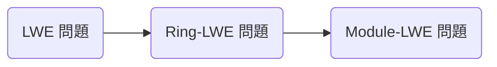

量子コンピュータにより DLP や素因数分解問題は Shor のアルゴリズムを用いて多項式時間で計算出来ることがわかりました。これにより従来多く用いられてきた公開鍵暗号である RSA 暗号や楕円曲線暗号は量子コンピュータによって解かれてしまいます。その為量子コンピュータに解かれないような暗号: 耐量子暗号を開発する必要が出てきました。

耐量子暗号の仕組みや攻撃について紹介します。ただなぜ量子コンピュータで解かれないのかについてはよく分かっていないのでお答え出来ません。ここらへんについて詳しい方がいたらご教授頂きたいです。

## Post-Quantum Cryptography Standardization
耐量子暗号は英語で Post-Quantum Cryptography 略して PQC といいます。

NIST は全世界から PQC 標準化候補の方式を募集し、選考、標準規格の作成を行っています。

https://csrc.nist.gov/Projects/post-quantum-cryptography/post-quantum-cryptography-standardization

応募された方式は大きく 5 種類の暗号に分類できます。

- 格子暗号 (Lattice-based cryptography)
- 符号暗号 (Code-based cryptography)
- 同種写像暗号 (Isogeny-based cryptography)
- 多変数多項式暗号 (Multivariate polynomial cryptography)
  - 鍵自体やアルゴリズムはとても短いですが安全性は格子暗号に比べて低いらしく選考に外されたようです。これを紹介するか迷ってます。
- ハッシュ関数署名 (Hash-based signature)

現在 (2023/3/8) は NIST PQC Standarization の第 3 ラウンドが終了し、最終第 4 ラウンドの候補として次が挙げられています。

| 公開鍵暗号/鍵共有 | 署名 |
| :---- | :--- |
| CRYSTALS-KYBER (格子暗号) <br> BIKE (符号暗号) <br> Classic McElience (符号暗号) <br> HQC (符号暗号) <br> SIKE (同種写像暗号) | CRYSTALS-Dilithium (格子暗号) <br> FALCON (格子暗号) <br> SPHINCS+ (ハッシュ関数署名) |

今回はこれらの紹介をしていきたいと思います。

## 格子暗号

耐量子暗号の中では有力ですが耐量子性は明解ではないです。

SVP, CVP, SIS 問題, LWE 問題, LWR 問題など実にさまざまな計算困難な問題があり、それに対応する暗号がありますが、今回は耐量子暗号や完全準同型暗号でよく使われる LWE 問題に絞って紹介します。

### LLL 基底簡約のその先へ

第三章で基底簡約することにより SVP が解き易くなるということで LLL 基底簡約アルゴリズムまでやりましたが、LWE 問題の基礎である CVP を解く為にはより強い基底簡約が必要です。まずはそれらを紹介し CVP の解き方、LWE 格子暗号とその派生について学びます。

LLL 基底簡約は

> **HKZ (Hermite-Korkine-Zolotareff) 基底簡約**
> 1. サイズ基底簡約
> 2. すべての $1\leq i\leq n$ に対して $\|\boldsymbol{b}_i^*\| = \lambda_1(\pi_i(L))$ を満たすように基底ベクトルの交換

> **BKZ (Block Korkine-Zolotareff) 基底簡約**
> 1. サイズ基底簡約
> 2. すべての $1\leq k\leq n-\beta+1$ に対して $\beta$ 次元の格子 $L_{[k,k+\beta-1]} = \lbrace\pi_k(\boldsymbol{b}_k), \pi_k(\boldsymbol{b}_{k+1}), \ldots, \pi_k(\boldsymbol{b}_{k+\beta-1})\rbrace$ の基底が HKZ 基底簡約

BKZ を応用したさらなる基底簡約アルゴリズムは BKZ2.0, RSR, G6K などがあります。参考に元論文を置いておきます。

### 最近ベクトル問題 (Closest Vector Problem)
SVP は原点に最も近い格子点を求める問題でしたが CVP はある点に最も近い格子点を求める問題です。

> **CVP; Closest Vector Problem**
> CVP とは目標ベクトル $\boldsymbol{w}$ (格子点である必要はない) に対して格子上の最近ベクトル $\boldsymbol{v}$ を求める問題である。

厳密解を求めるのは難しいので近似解を求めて偶然厳密解となることを祈ります。

この近似解を解く代表的な方法に Babai’s nearest plane algorithm と Kannan's embedding method があります。

> **Babai’s nearest plane algorithm**
> 最も近い平面を 1 つ選ぶ

$$
\begin{aligned}
  \boldsymbol{w} = \sum a_i\boldsymbol{b}_i \\
  U + \boldsymbol{y} = \lbrace \boldsymbol{u} + \boldsymbol{y}\mid \boldsymbol{u}\in U\rbrace
\end{aligned}
$$

> **Kannan’s embedding method**
> CVP の目標ベクトル $w$ と解ベクトル $v$ の差 $e = w - v$ のノルムについて $\|e\| < \lambda_1/2$ が成り立つとき SVP を解くことで求まる。

$$
\begin{pmatrix}
  B & \boldsymbol{0} \\
  w & M
\end{pmatrix}
$$

このような格子の分野において求解困難な問題はたくさんあり、これを用いた暗号はたくさんあります。その中で CVP を用いる暗号を LWE (Learning With Error) 暗号と言ったりします。

### LWE格子暗号

機械学習理論から派生した求解困難な問題で

> **LWE (Learning With Error) 問題**
> 環 $\mathbb{Z}/q\mathbb{Z}$ 上において行列 $A$ とベクトル $\boldsymbol{s}$ を掛けて誤差ベクトル $\boldsymbol{e}$ を与えた $\boldsymbol{b}$ に対し $(A, \boldsymbol{b})$ が与えられたときに $\boldsymbol{s}$ を求める問題を LWE 問題と呼ぶ。
>
> $$
A\boldsymbol{s} + \boldsymbol{e} = \boldsymbol{b}
$$

LWE 問題にはさまざまな派生があります。その中で最も有名な3つが次です。



多項式環の剰余環 $\mathbb{Z}/q\mathbb{Z}[x]/(x^n+1)$ とベクトル空間 $(\mathbb{Z}/q\mathbb{Z})^n$ は全単射 $\phi: a_0 + a_1x + \cdots + a_{n-1}x^{n-1} \to (a_0, a_1, \ldots, a_{n-1})$ を用いて同一視できる。これを用いて LWE 問題を構成したものが Ring-LWE 問題という。

> **Ring-LWE 問題**
> 環 $\mathbb{Z}/q\mathbb{Z}[x]/(x^n+1)$ 上において、元 $s$ とベクトル $\boldsymbol{a}, \boldsymbol{e}$ を用いて次のように計算した $(\boldsymbol{a}, \boldsymbol{b})$ が与えられたときに $s$ を求める問題を Ring-LWE 問題と呼ぶ。
>
> $$
\boldsymbol{a}s + \boldsymbol{e} = \boldsymbol{b}
$$

Ring-LWE 問題の一般化として Module-LWE 問題があります。

> **Module-LWE 問題**
> 環 $\mathbb{Z}/q\mathbb{Z}[x]/(x^n+1)$ 上において、行列 $A$ とベクトル $\boldsymbol{s}$ を掛けて誤差ベクトル $\boldsymbol{e}$ を与えたベクトル $\boldsymbol{b}$ に対し $(A, \boldsymbol{b})$ が与えられたときに $\boldsymbol{s}$ を求める問題を Module-LWE 問題と呼ぶ。
>
> $$
A\boldsymbol{s} + \boldsymbol{e} = \boldsymbol{b}
$$

簡単の為に多項式環の剰余環 $R_q = \mathbb{Z}/q\mathbb{Z}[x]/(x^n+1)$ とおきます。

使われる乱数に用いる分布について秘密情報については二項分布であることなど細かいところは元論文を当たって欲しい。

円分体の整数環
これが $B \geq 2\sqrt{n}$ のとき計算困難な問題であることが知られている

多項式同士の積で畳み込みを計算するので数論変換 NTT; Number Theoretic Transform を用いると $\mathcal{O}(n\log n)$ と高速に計算できる。

また LWE ではデータ圧縮をよく行う。$d < \lceil\log_2(q)\rceil$ として $\mathbb{Z}/q\mathbb{Z}\to\lbrace 0,\ldots,2^d-1\rbrace$ と圧縮し、次のような性質を満たす。

$$
\begin{aligned}
& x' = \mathrm{Decompress}_q(\mathrm{Compress}_q(x, d), d) \\
& |x' - x\bmod q|\leq\lceil q/2^{d+1}\rfloor
\end{aligned}
$$

つまり圧縮解凍をしたときの誤差が小さければ LWE の誤差に乗せることができるという意味です。
次のように定義すると上記性質を満たす。

$$
\begin{aligned}
\mathrm{Compress}_q(x, d) & = \lceil(2^d/q)x\rfloor \bmod q \\
\mathrm{Decompress}_q(x, d) & = \lceil(q/2^d)x\rfloor
\end{aligned}
$$

また $R_q$ であれば各要素に対して圧縮を行う。

### CRYSTALS-KYBER

鍵生成
1. 256 ビットの乱数を用いて $\boldsymbol{A}, \boldsymbol{s}, \boldsymbol{e}$ を生成し、$\boldsymbol{t} = \mathrm{Compress}_q(\boldsymbol{A}\boldsymbol{s} + \boldsymbol{e}, d_t)$ を計算する
2. $(\boldsymbol{t}, \boldsymbol{A})$ を公開鍵、$\boldsymbol{s}$ を秘密鍵とする

暗号化
平文 $m$ を用いて
1. $\boldsymbol{A}, \boldsymbol{r}, \boldsymbol{e}_1, e_2$ を生成する
2. $\boldsymbol{t} = \mathrm{Decompress}_q(\boldsymbol{t}, d_t)$
3. $\boldsymbol{u} = \mathrm{Compress}_q(\boldsymbol{A}^T\boldsymbol{r} + \boldsymbol{e}_1, d_u)$
4. $v = \mathrm{Compress}_q(\boldsymbol{t}^T\boldsymbol{r} + e_2 + \lceil\frac{q}{2}\rfloor \cdot m, d_v)$
5. $c = (\boldsymbol{u}, v)$ を暗号文として返す

復号
1. $\boldsymbol{u} = \mathrm{Decompress}_q(\boldsymbol{u}, d_u)$
2. $v = \mathrm{Decompress}_q(v, d_v)$
3. $\mathrm{Compress}_q(v - \boldsymbol{s}^T\boldsymbol{u}, 1)$ を平文として返す

### NTRU
CRYSTALS と引き合いとして出されるのが NTT が開発した NTRU 暗号です。
簡略化の為、$R = \mathbb{Z}[x]/(x^n+1)$

> **Def. Ternary Polynomials**
> 係数が $\pm 1$ の多項式の集合である。具体的には $\mathcal{T}(d_{+1}, d_{-1})$ を $d_{+1}$ 個の $+1$ 係数と $d_{-1}$ 個の $-1$ 係数のある多項式の集合とする。

$$
\begin{aligned}
f & = 1+3x+4x^2+5x^3+2x^5 \in R_p \\
\phi(f) & = 1+3x−3x^2−2x^3+2x^5 \in R
\end{aligned}
$$

鍵生成
1. $f\in\mathcal{T}(d+1, d)$, $g\in\mathcal{T}(d, d)$
2. $h = (f^{-1} \bmod q)g$

暗号化
1. $m \in R_p$ を Center lift する
2. $r\in\mathcal{T}(d, d)$
3. $e = prh + m \pmod q$ を返す

復号
1. $a = fe\pmod q$ の Center lift をする
2. $m = a(f^{-1}\bmod p)\pmod p$

環とイデアルで割った部分環について何らかの方法で持ち上げることができるとき暗号を構成できる

## 符号暗号
符号理論にも様々な計算困難な問題がありますが、候補は誤り訂正符号の復号問題の計算困難性を利用した暗号が主要です。計算問題として SDP や DSDP の困難性を仮定しています。

> **SDP; Syndrome Decoding Problem**
> SDP とは符号長 $n$ として次元 $k$ をパリティ検査行列 $\boldsymbol{H}\in\mathbb{F}_2^{(n-k)\times n}$ とシンドローム $\boldsymbol{s}\in\mathbb{F}_2^{n-k}$ に対して $\boldsymbol{eH}^T = \boldsymbol{s}$ となるハミング重みが $w$ の $\boldsymbol{e}\in\mathbb{F}_2^n$ を求める問題である。

つまり $1$ が $w$ 個、$0$ が $n-w$ 個ある符号でパリティチェックすると $\boldsymbol{s}$ となるような $\boldsymbol{e}$ を求める問題です。

TODO:
これがなぜ暗号となるのか？

それぞれの暗号は使う符号が異なります。逆に言えばそれぞれの暗号の違いはほぼそれくらいです。

| 暗号 | 符号 | 安全性 | 開発組織 |
| :-- | :-- | :-- | :-- |
| BIKE | QC-MDPC 符号 | IND-CPA | Intel |
| Classic McElience | Goppa 符号 | IND-CCA | TU Eindhoven |
| HQC | Quasi-Cyclic 符号 | IND-CCA | University of Limoges |

## 同種写像暗号
超特異同種写像ディフィー・ヘルマン鍵共有 (SIDH / SIKE)
CSIDH
現在 SIKE しかありませんが攻撃が見つかっている為選考に残るのは難しいです。

### SIKE
$p = w_A^{e_A}w_b^{e_B}f \pm 1$
$\mathbb{F}_{p^2}$ 上の超特異楕円曲線 $E$
位数 $w_A^{e_A}$ である点 $P_A, Q_A$ と位数 $w_B^{e_B}$ である点 $P_B, Q_B$

$p = 2^{e_2}3^{e_3} - 1$ $2^{e_2}\approx 3^{e_3}$ $\#E = (p + 1)^2$
$2^{e_2}$-ねじれ群 $E_0[2^{e_2}]$ $E_0[3^{e_3}]$

$$
\begin{aligned}
y^2 & = x^3 + x & y^2 & = x^3 + 6x^2 + x
\end{aligned}
$$

```python
# SIKEp377
p = 2^191 * 3^117 - 1
# SIKEp546
p = 2^273 * 3^172 - 1
# SIKEp697
p = 2^356 * 3^215 - 1

Fp2<I> = GF(p, 2)
assert I^2 == -1
R<x> = PolynomialRing(Fp2)
E = EllipticCurve(x^3 + 6*x^2 + x)
```

### SIKE への攻撃

https://eprint.iacr.org/2022/975


## ハッシュ関数署名 (Hash-based signature)
ハッシュ値を用いるだけの退屈な署名です。1979 年の Lamport 署名について

### Lamport 署名
Constructing Digital Signatures from a One Way Function
1 ビットごとに署名します。

1. 秘密鍵 $s_0, s_1$ を生成し、公開鍵 $p_i = H(s_i)$ を計算します
2. 1 ビットのメッセージ $m$ を用いて $s_m$ を署名として公開します
3. $p_m = H(s_m)$ となることを確認して検証します

非常にシンプルな署名です。ただ公開鍵に大量のメモリを割いているので、これを短い公開鍵で大量のメッセージを署名できるように改良したいです。それには Merkle が提案した二分木の一種 Merkle 木を使います。

$$
h_{i+1,j/2} = H(h_{i,j}\|h_{i,j+1})
$$

### SPHINCS+
鍵生成コストを下げた
randomized tree-based stateless signature


## 参考文献
- Post-Quantum Cryptography
- 耐量子計算機暗号
- [量子コンピュータに耐性のある暗号技術の
標準化動向：米国政府標準暗号について](https://www.imes.boj.or.jp/research/papers/japanese/19-J-04.pdf)
- [An efficient key recovery attack on SIDH](https://eprint.iacr.org/2022/975)
