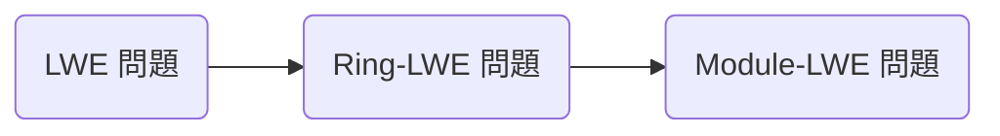

NIST による選考

https://csrc.nist.gov/Projects/post-quantum-cryptography/post-quantum-cryptography-standardization

- 格子暗号 (Lattice-based cryptography)
- 符号暗号 (Code-based cryptography)
- 同種写像暗号 (Isogeny-based cryptography)
- 多変数多項式暗号 (Multivariate polynomial cryptography)
- ハッシュ関数署名 (Hash-based signature)

現在 (2023/3/5) は NIST PQC 第 3 ラウンドが終了し、最終第 4 ラウンドの候補として次が挙げられています。

| 公開鍵暗号/鍵共有 | 署名 |
| :---- | :--- |
| CRYSTALS-KYBER (格子暗号) <br> BIKE (符号暗号) <br> Classic McElience (符号暗号) <br> HQC (符号暗号) <br> SIKE (同種写像暗号) | CRYSTALS-Dilithium (格子暗号) <br> FALCON (格子暗号) <br> SPHINCS+ (ハッシュ関数署名) |

私もすべて理解している訳ではないので知っていることだけを紹介します。

> なんでもは知らないわよ。知っていることだけ。

## 格子暗号

第三章で基底簡約することにより SVP が解き易くなるということで LLL 基底簡約アルゴリズムまでやりましたが、暗号で使われる問題である CVP を解く為にはより強い基底簡約が必要です。まずはそれらを紹介し CVP の解き方、LWE 格子暗号とその派生について学びます。

### LLL 基底簡約のその先へ

LLL 基底簡約は

> **HKZ (Hermite-Korkine-Zolotareff) 基底簡約**
> 1. サイズ基底簡約
> 2. すべての $1\leq i\leq n$ に対して $\|\boldsymbol{b}_i^*\| = \lambda_1(\pi_i(L))$ を満たすように基底ベクトルの交換

> **BKZ (Block Korkine-Zolotareff) 基底簡約**
> 1. サイズ基底簡約
> 2. すべての $1\leq k\leq n-\beta+1$ に対して $\beta$ 次元の格子 $L_{[k,k+\beta-1]} = \lbrace\pi_k(\boldsymbol{b}_k), \pi_k(\boldsymbol{b}_{k+1}), \ldots, \pi_k(\boldsymbol{b}_{k+\beta-1})\rbrace$ の基底が HKZ 基底簡約

BKZ を応用したさらなる基底簡約アルゴリズムは BKZ2.0, RSR, G6K などがあります。参考に元論文を置いておきます。

### 最近ベクトル問題 (Closest Vector Problem)
SVP は原点に最も近い格子点を求める問題でしたが CVP はある点に最も近い格子点を求める問題です。

> **CVP; Closest Vector Problem**
> CVP とは目標ベクトル $\boldsymbol{w}$ (格子点である必要はない) に対して格子上の最近ベクトル $\boldsymbol{v}$ を求める問題である。

厳密解を求めるのは難しいので近似解を求めて偶然厳密解となることを祈ります。

この近似解を解く代表的な方法に Babai’s nearest plane algorithm と Kannan's embedding method があります。

> **Babai’s nearest plane algorithm**
> 最も近い平面を 1 つ選ぶ

$$
\begin{aligned}
  \boldsymbol{w} = \sum a_i\boldsymbol{b}_i \\
  U + \boldsymbol{y} = \lbrace \boldsymbol{u} + \boldsymbol{y}\mid \boldsymbol{u}\in U\rbrace
\end{aligned}
$$

> **Kannan’s embedding method**
> CVP の目標ベクトル $w$ と解ベクトル $v$ の差 $e = w - v$ のノルムについて $\|e\| < \lambda_1/2$ が成り立つとき SVP を解くことで求まる。

$$
\begin{pmatrix}
  B & \boldsymbol{0} \\
  w & M
\end{pmatrix}
$$

このような格子の分野において求解困難な問題はたくさんあり、これを用いた暗号はたくさんあります。その中で CVP を用いる暗号を LWE (Learning With Error) 暗号と言ったりします。

### LWE格子暗号

機械学習理論から派生した求解困難な問題で

> **LWE (Learning With Error) 問題**
> 環 $\mathbb{Z}/q\mathbb{Z}$ 上において行列 $A$ とベクトル $\boldsymbol{s}$ を掛けて誤差ベクトル $\boldsymbol{e}$ を与えた $\boldsymbol{b}$ に対し $(A, \boldsymbol{b})$ が与えられたときに $\boldsymbol{s}$ を求める問題を LWE 問題と呼ぶ。
>
> $$
A\boldsymbol{s} + \boldsymbol{e} = \boldsymbol{b}
$$



多項式環の剰余環 $\mathbb{Z}/q\mathbb{Z}[x]/(x^n+1)$ とベクトル空間 $(\mathbb{Z}/q\mathbb{Z})^n$ は全単射 $\phi: a_0 + a_1x + \cdots + a_{n-1}x^{n-1} \to (a_0, a_1, \ldots, a_{n-1})$ を用いて同一視できる。これを用いて LWE 問題を構成したものが Ring-LWE 問題という。

> **Ring-LWE 問題**
> 環 $\mathbb{Z}/q\mathbb{Z}[x]/(x^n+1)$ 上において、元 $s$ とベクトル $\boldsymbol{a}, \boldsymbol{e}$ を用いて次のように計算した $(\boldsymbol{a}, \boldsymbol{b})$ が与えられたときに $s$ を求める問題を Ring-LWE 問題と呼ぶ。
>
> $$
\boldsymbol{a}s + \boldsymbol{e} = \boldsymbol{b}
$$

Ring-LWE 問題の一般化として Module-LWE 問題があります。

> **Module-LWE 問題**
> 環 $\mathbb{Z}/q\mathbb{Z}[x]/(x^n+1)$ 上において、行列 $A$ とベクトル $\boldsymbol{s}$ を掛けて誤差ベクトル $\boldsymbol{e}$ を与えたベクトル $\boldsymbol{b}$ に対し $(A, \boldsymbol{b})$ が与えられたときに $\boldsymbol{s}$ を求める問題を Module-LWE 問題と呼ぶ。
>
> $$
A\boldsymbol{s} + \boldsymbol{e} = \boldsymbol{b}
$$

簡単の為に多項式環の剰余環 $R_q = \mathbb{Z}/q\mathbb{Z}[x]/(x^n+1)$ とおきます。

使われる乱数に用いる分布について秘密情報については二項分布であることなど細かいところは元論文を当たって欲しい。

円分体の整数環
これが $B \geq 2\sqrt{n}$ のとき計算困難な問題であることが知られている

多項式同士の積で畳み込みを計算するので数論変換 NTT; Number Theoretic Transform を用いると $\mathcal{O}(n\log n)$ と高速に計算できる。

### CRYSTALS-KYBER


鍵生成
1. 256 ビットの乱数を用いて $\boldsymbol{A}, \boldsymbol{s}, \boldsymbol{e}$ を生成し、$\boldsymbol{t} = \mathrm{Compress}_q(\boldsymbol{A}\boldsymbol{s} + \boldsymbol{e}, d_t)$ を計算する
2. $(\boldsymbol{t}, \boldsymbol{A})$ を公開鍵、$\boldsymbol{s}$ を秘密鍵とする

暗号化
平文 $m$ を用いて
1. $\boldsymbol{t} = \mathrm{Decompress}_q(\boldsymbol{t}, d_t), \boldsymbol{A}, \boldsymbol{r}, \boldsymbol{e}_1, e_2$ を生成する
2. $\boldsymbol{u} = \mathrm{Compress}_q(\boldsymbol{A}^T\boldsymbol{r} + \boldsymbol{e}_1, d_u)$
3. $v = \mathrm{Compress}_q(\boldsymbol{t}^T\boldsymbol{r} + e_2 + \lceil\frac{q}{2}\rfloor \cdot m, d_v)$
4. $c = (\boldsymbol{u}, v)$ を暗号文として返す

復号
1. $\boldsymbol{u} = \mathrm{Decompress}_q(\boldsymbol{u}, d_u)$
2. $v = \mathrm{Decompress}_q(v, d_u)$
3. $\mathrm{Compress}_q(v - \boldsymbol{s}^T\boldsymbol{u}, 1)$ を平文として返す


### NTRU
CRYSTALS と引き合いとして出されるのが NTT が開発した NTRU 暗号です。
簡略化の為、$R = \mathbb{Z}[x]/(x^n+1)$

> **Def. Ternary Polynomials**
> 係数が $\pm 1$ の多項式の集合である。具体的には $\mathcal{T}(d_{+1}, d_{-1})$ を $d_{+1}$ 個の $+1$ 係数と $d_{-1}$ 個の $-1$ 係数のある多項式の集合とする。

$$
\begin{aligned}
f(x) & = 1+3x+4x^2+5x^3+2x^5 \in R_p \\
Lift(f) & = 1+3x−3x^2−2x^3+2x^5 \in R
\end{aligned}
$$


鍵生成
1. $f\in\mathcal{T}(d+1, d)$, $g\in\mathcal{T}(d, d)$
2. $F_p = f^{-1}\in R_p, F_q = f^{-1}\in R_q$
3. $h = F_q\circ g$

暗号化
1. $m \in R_p$ を Center lift する
2. 乱数 $r\in\mathcal{T}(d, d)$
3. $e = pr\circ h + m \pmod q$
4. $e$ を送る

復号
1. $a = f\circ e\pmod q$ の Center lift をする
2. $m = F_p\circ a\pmod p$

環とイデアルで割った部分環について何らかの方法で持ち上げることができるとき暗号を構成できる

## 符号暗号
### BIKE

## 同種写像暗号
超特異同種写像ディフィー・ヘルマン鍵共有 (SIDH / SIKE)
CSIDH

### SIKE
$p = w_A^{e_A}w_b^{e_B}f \pm 1$
$\mathbb{F}_{p^2}$ 上の超特異楕円曲線 $E$
位数 $w_A^{e_A}$ である点 $P_A, Q_A$ と位数 $w_B^{e_B}$ である点 $P_B, Q_B$

```python
a = 110
b = 67
p = 2^a*3^b - 1
Fp2<I> = GF(p, 2)
assert I^2 eq -1
R<x> = PolynomialRing(Fp2)
E = EllipticCurve(x^3 + 6*x^2 + x)
```

## 多変数多項式暗号 (Multivariate polynomial cryptography)


## ハッシュ関数署名 (Hash-based signature)
SPHINCS+

## 参考文献
- Post-Quantum Cryptography
- 耐量子計算機暗号