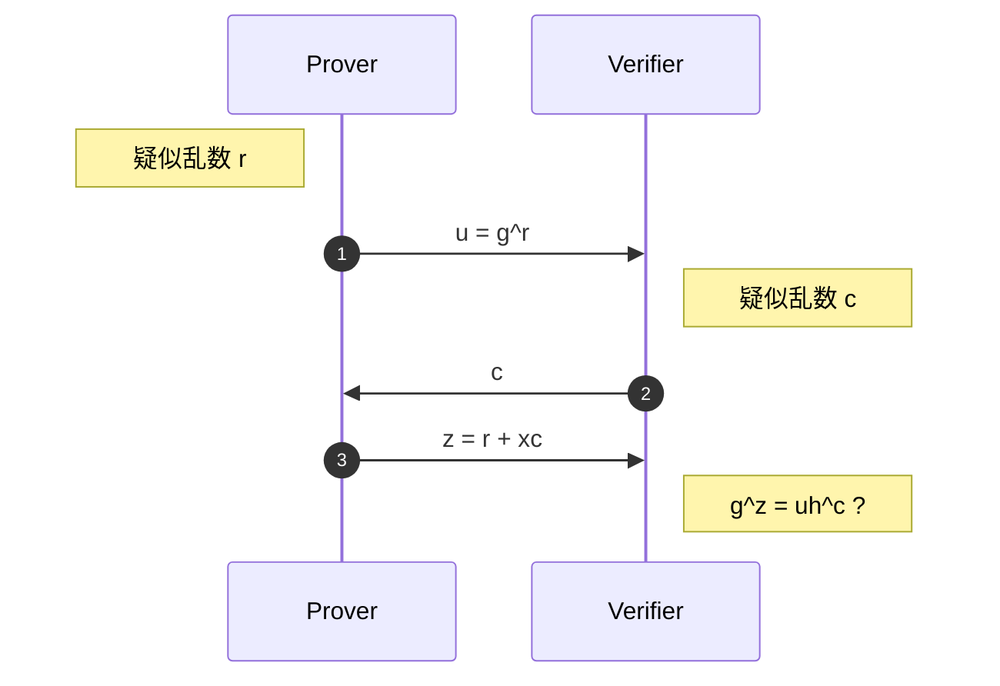
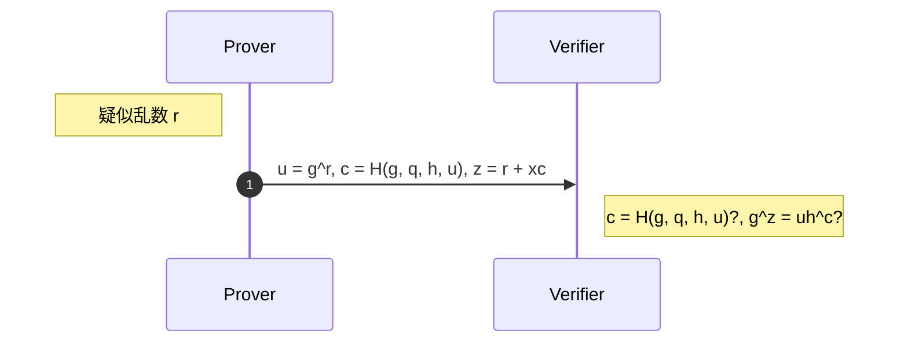

今まで数学と暗号だけをやってきましたが、ようやく暗号をベースにした様々な仕組みを理解していきます。レイヤーが上がるので、出来るだけ数学は排除します。

開発中に〇〇させたくないなと思ったときにどんな技術を使えばよいのかを参照してもらえたらなと思います。その為にもライブラリ情報なども集めたいので詳しい方いたら教えていただきたいです。

## TL; DR

| したいこと | 技術 | ライブラリ |
| :-: | :-- | :-: |
| 秘匿性 | 暗号化通信, 権限管理 | |
| 改ざん防止 | MAC, AEAD | TLS/SSL で実装済み |
| なりすまし防止 | 認証, 電子署名 | |
| サイバー攻撃の耐性強化 | 秘密分散 | |
| 重要機密情報の交換 | 紛失通信 | |
| 情報を渡さずに処理 データ資産の安全な活用 | 準同型暗号 + ゼロ知識証明 | concrete |
| データベース暗号化 | | |
| 匿名化 |  | |
| | ブロックチェーン + ゼロ知識証明 | |
| 利用者情報を用いる | 関数型暗号 | |
| 通信盗聴防止 | 量子暗号 | |

## ゼロ知識証明
ゼロ知識証明の性質
- 完全性 (Completeness)
    - 証明者の主張が真であるならば、検証者は真であることが必ずわかること。
- 健全性 (Soundness)
    - 証明者の主張が偽であれば、検証者はかなり高い確率でそれが偽であること見抜けること。
- ゼロ知識性 (Zero Knowledge)
	- あらゆる場合において、検証者が証明者から何らかの知識（情報）を盗もうとしても、証明者の主張が真であること以上の知識は得られない

名前の通り対話型は有名な洞窟の例のように証明者と検証者がやりとりを繰り返し、証明者が本当に正しい情報を持っているかを確率的に検証する方です。

一方、非対話型のゼロ知識証明は証明者と検証者はやりとりをせずに証明することが可能です。対話を行う代わりに証明者と検証者の間に第三者を置き、CRSと呼ばれる事前に公開される情報を証明者と検証者に送ります。証明者はそのCRSを用いて正しい情報を持っているという証明を生成し、それを検証者に一回だけ送ります。受け取った検証者はそれを検証するだけで非対話なゼロ知識証明が実現できます。事前にCRSを生成することを一般的に信頼されたセットアップといい、第三者は証明者、検証者にとって信頼される存在となります。

zk-SNARKs
- Succinct（簡潔）
    - 証明のサイズがステートメントのサイズと比べて非常に小さい
- Non-interactive（非対話型）
    - 証明者と検証者の間で何度も対話をする必要がない
- ARgument
    - 証明者の計算能力には限りがある
- Knowledge
    - 証明者は、知識なしでは証明を生成することは不可能である。

[ZenGo-X/zk-paillier: A collection of Paillier cryptosystem zero knowledge proofs (github.com)](https://github.com/ZenGo-X/zk-paillier)

[zk-SNARKsの理論 (zenn.dev)](https://zenn.dev/kyosuke/articles/a1854b9be26c01df13eb)

インタラクティブなゼロ知識証明

1. 証明者はコミットメントという疑似乱数を生成し、検証者に送る
2. 検証者はチャレンジという擬似乱数で応答する
3. 証明者はコミットメントとチャレンジで証明する

$h = g^x$

非インタラクティブなゼロ知識証明

## 関数型暗号
> **ID ベース暗号**

> **属性ベース暗号**

> **関数型暗号**

## 秘密計算
秘密情報を暗号を用いて何かしら安全に取り扱えるようにするのが秘密計算です。

> **秘密分散 (Secret Sharing)**
> 秘密情報を $n$ 個に分割して $t$ 個以上わかれば情報を復元でき、$t$ 個未満であれば全く復元出来ないように分散できるもの。

Wikipedia には「極めてセンシティブかつ重要な機密情報を保存するときに攻撃者にいくつか攻撃されても取れないようにする為」に使うらしいです。他の使い道も知りたいな。

> **Shamir's secret sharing**
> 定数項 $a_0$ が秘密情報である $t-1$ 次多項式 $f(x) = \sum_i a_ix^i \in \mathbb{F}_p[x]$ とその $n$ 個の点 $\lbrace(x_i, f(x_i))\mid i = 1,\ldots,n\rbrace$ を生成する。
>
> これは $n$ 個の点の中で $t$ 個以上が分かればラグランジュの補間公式を用いて係数が分かり、$t$ 個未満であれば分からないので秘密分散の性質を満たす。

> **Blakley's secret sharing**
> $t$ 次元空間上で秘密情報を含む点を通る $n$ 枚の平行でない $t-1$ 次元超平面を生成する。
>
> これは $n$ 枚中 $t$ 枚以上分かると $1$ つの点で交わり、$t$ 枚未満だと分からないので秘密分散の性質を満たす。

詳しくはググったりしてください。

:::message
**練習問題**
zer0pts CTF 2020 より dirty laundry
:::

> **紛失通信 (Oblivious Transfer)**
> 第三者なしで秘密情報を正しく共有する方法

> **Exchange Of Secret**
> 送信者は送った情報のうち、どれが届いたのか分からない
> 受信者は送られてきた情報のうち、一つの情報以外は得られない

> **Goldwasser–Micali cryptosystem**

> **秘匿共通集合演算 (Private Set Intersection)**

秘密計算といえば TEE
Intel SGX
Controlled-Channel Attacks、Sealing Replay Attack、Foreshadow、Plundervolt、LVI、ÆPIC Leakなど

> **準同型暗号**

まで企業に眠っていたデータ資産を、安全に活用することができたり
企業データについてクラウドなどの外部インフラを使うことへのハードルが下がったり、
企業間、部署間のデータ連携を、お互いのデータを秘匿したまま可能にしたり、
といったことが可能になります。

今まで分断されていたサプライチェーン間のデータに対し、
秘密計算技術を用いてそれぞれのデータを連携させ、
今まで存在していた煩雑なオペレーションを簡潔にしたり、
今まで結合できなかったデータが結合できることにより可能になった、
部門を横断したデータに対してより質の高いデータ分析をすることが可能になったり
するでしょう。

> **検索可能暗号**

正規表現いけそう

## SSH

OpenSSH 9.0 ポスト量子暗号化時代への対応として、格子暗号系の「Streamlined NTRU Prime」と、楕円曲線暗号系の「x25519」からなるハイブリッド手法がデフォルトとなっている。

ed448
ed25519

Gnu Privacy Guard: GPG
master key
sub key
Pritty Good Privacy: PGP鍵
[GPGで自分用の秘密鍵を1つに統一する · JoeMPhilips](http://joemphilips.com/post/gpg_memo/)

## SSL/TLS
HTTPS や SMTPS などで使用されている暗号プロトコル
OCSP Stapling 証明書をハンドシェイク時にやる

1995年 SSL 3.0 が公開
- Netscape Communications 社が開発
1999年 TLS 1.0 の制定
- 国際標準化の為に SSL から名称変更
- 既に SSL という名称が定着していた為、SSL という名前も残る
SSL は TLS の前身で現在は使用されていない。

**暗号スイート**
通信に使われるプロトコル/暗号の組み合わせのことです。
スイートはお菓子 Sweet ではなくて装備一式 Suite です。

公開鍵暗号を用いて共通鍵暗号を渡すプロトコル

## 参考文献

- [Schnorr署名 ―― 30年の時を超えて注目を集める電子署名](https://blog.visvirial.com/articles/721)
- [RFC8235](https://datatracker.ietf.org/doc/html/rfc8235)

この資料は CC0 ライセンスです。