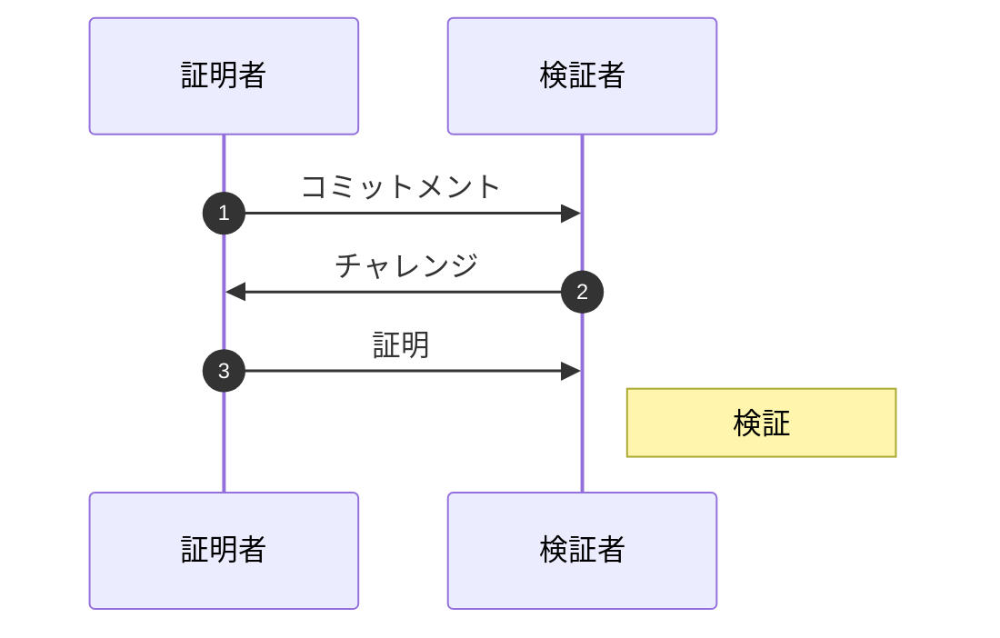
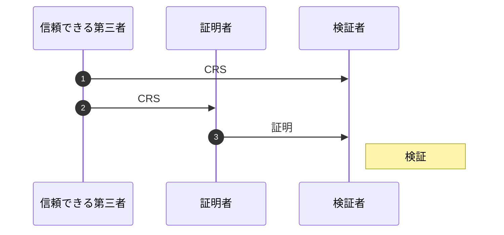

ここでは公開鍵暗号やその周辺を理解するだけで攻撃はしないので攻撃したい人はさらっと読み飛ばすといいかも。

## 公開鍵暗号
公開鍵暗号は次のようなものでした。

> **公開鍵暗号**
> 暗号化と復号で **別の鍵** を使い、暗号化で使う鍵を **公開** する方式
> ex.) RSA暗号, 楕円曲線暗号 など

暗号化と復号が別の鍵？そんなこと言われてもよくわからないよ！ボケ！となると思うので、最も有名な公開鍵暗号である RSA 暗号を紹介しましょう。

RSA 暗号とは $N$ で割った余りの世界において $e$ 乗で暗号化、 $e^{-1}$ 乗で復号する暗号です。

$$
\begin{aligned}
c &= m^e & \pmod N \\
m &= c^{e^{-1}} & \pmod N
\end{aligned}
$$

例えば平文 $m = 5$ として $(e, N) = (3, 11)$ とすると $5^3 = 125$ は 11 で割ると 4 余ります。これより暗号化すると

$$
m^e = 5^3 = 125 = 4 \pmod{11}
$$

となります。逆に復号は $e^{-1} = 7$ なので

$$
c^{e^{-1}} = 4^7 = 16384 = 5 \pmod{11}
$$

とこのように平文と一致するので暗号として成り立っていそうです。(暗号文も単なる数字で暗号っぽくないのは小さい数で)

これを元に手順と Python での実装をサラっと書くと次のようになります。

> **RSA 暗号 (Rivest-Shamir-Adleman encryption)**
> - 鍵生成
>   1. 大きな素数 $p, q$ を生成して $N = pq$ と $\phi(N) = (p - 1)(q - 1)$ を計算する。
>   2. 整数 $e$ を決めて $d = e^{-1} \pmod{\phi(N)}$ を計算する。
>   3. $N, e$ を公開鍵として相手に渡し、$p, q, \phi(N), d$ を秘密鍵とする。
> - 暗号化
>   渡された公開鍵を用いて平文 $m$ に対して $c = m^e \bmod N$ と暗号化し、相手に送る。
> - 復号
>   持っている秘密鍵を用いて暗号文 $c$ に対して $m = c^d \bmod N$ と復号する。

```python
from Crypto.Util.number import getPrime, long_to_bytes, bytes_to_long

p = getPrime(512)
q = getPrime(512)
N = p * q
phi = (p - 1) * (q - 1)
e = 0x10001
d = pow(e, -1, phi)

def encrypt(plaintext):
    m = bytes_to_long(plaintext)
    c = pow(m, e, N)
    cipher = long_to_bytes(c)
    return cipher

def decrypt(cipher):
    c = bytes_to_long(cipher)
    m = pow(c, d, phi)
    plaintext = long_to_bytes(m)
    return plaintext

cipher = encrypt(b"This is RSA")
print(cipher)
plaintext = decrypt(cipher)
print(plaintext)
# This is RSA
```

お、出てきましたよ鍵が！(倒置法) この公開鍵と秘密鍵がそれぞれ暗号化する鍵と復号する鍵に対応します。
本当でしょうか？確かめてみましょう！

**公開鍵で暗号化**
まず公開鍵 $e, N$ で暗号化することはできるでしょうか。

$$
c = m^e \pmod N
$$

これはちゃんと秘密鍵を使わずにできますね。

**秘密鍵で復号**
それじゃ秘密鍵で復号することができるでしょうか。

$$
m = c^d \pmod N
$$

秘密鍵 $d$ を使って復号していますね。ただ $N$ も使っているので公開鍵も必要そうです。これは秘密鍵から公開鍵は $N = pq, e = d^{-1}\bmod \phi$ と計算できるので大丈夫です。

**公開鍵で復号**
それでは逆に公開鍵で復号できるでしょうか。これが出来てしまうと暗号として機能していないと言えます。復号する為には公開鍵から秘密鍵 $d$ を求められればよいです。$d$ を求める為には $p, q$ が必要なので $N$ の素因数分解できると復号できてしまいます！このことを踏まえて RSA 暗号は素因数分解が出来ないくらい大きな数 $N$ を使います。実際によく使われる $N$ はだいたい $2^{1024} \approx 10^{400}$ でとっても大きな数です。

**秘密鍵で暗号化**
最後に秘密鍵で暗号化できるでしょうか。前と同様に秘密鍵から公開鍵を計算できるので暗号化できます。

これらを表にまとめるとこんな感じです。

| | 自分 (公開鍵 + 秘密鍵) | 全員 (公開鍵) |
|:-:|:-:|:-:|
| 暗号化 | 可能 | 可能 |
| 復号 | 可能 | 不可能 |

このように公開鍵だけを公開することで自分以外の人は復号ができないので暗号化された通信が出来るわけです。

ここに図

さらに共通鍵暗号では復号できる鍵を渡す必要がありましたが、公開鍵暗号では一切他人に **復号する権限を渡しません**。これが公開鍵暗号の真髄です。これによりどこにも脆弱性のない原理的に **完全に安全な暗号** と言えます。

ただし、ここでは攻撃者の計算能力を考慮に入れずに素因数分解が解けないものとして扱いました。計算能力込みで暗号の安全性を考えるには情報理論が必要となるので詳細には話せませんが最後に解説したいと思います。

そして素因数分解問題の他にも離散対数問題という計算困難な問題が知られています。

> **素因数分解問題**
> ある桁数の大きい 2 つの素数の積である合成数 $N = pq$ が与えられたときに素数 $p, q$ を見つける問題。
> ex.) RSA 暗号, Paillier 暗号, Rabin 暗号

> **離散対数問題**
> 位数 $N$ が大きい巡回群 $G$ について $g, y\in G$ が与えられたときに $g^x = y$ となる最小の $x\in \mathbb{N}$ を求める問題。
> ex.) DH 鍵共有, DSA, ElGamal 暗号, 楕円曲線暗号

基本的にこれらの問題を安全性の根拠として公開鍵暗号が作られます。もちろん他にも公開鍵暗号で使われる問題はありますが、この 2 つだけでも現実で数え切れないほどたくさんの暗号があります。このシリーズで紹介するすべての公開鍵暗号のベースとなる問題はこれらのみなので名前だけでも覚えておきましょう！

## 公開鍵暗号の応用

公開鍵暗号の重要な役割の 1 つが共通鍵暗号で用いる鍵を誰にも知られずに共有することです。共通鍵暗号の一番のネックはそのまま鍵を共有すると盗聴されてしまうことでした。Diffie と Hellman が考えた画期的な鍵の共有方法を紹介します。

> **Diffie Hellman 鍵共有**
> 1. アリスとボブは巡回群 $G$ とその生成元 $g$ を共有する。
> 2. アリスとボブはそれぞれ秘密鍵 $x_a, x_b$ を生成し、公開鍵 $y_a = g^{x_a}, y_b = g^{x_b}$ を公開する。
> 3. 相手の公開鍵に自分の秘密鍵を掛けた $s$ はアリスとボブだけが知る共有鍵となる。
>
> $$
s = g^{x_ax_b} = y_b^{x_a} = y_a^{x_b}
$$

さらにハッシュ関数を噛ますこともある。

### ゼロ知識証明と電子署名
ゼロ知識証明はシミュレーションパラダイムの話で公開鍵とは関係ないとかは知らねぇ！面白そうだからしゃべるんだよ！

対話型ゼロ知識証明は証明者と検証者がやりとりを繰り返し、証明者が本当に正しい情報を持っているかを確率的に検証する方式です。

> **ゼロ知識証明**
> 秘密を知っていることは分かるが秘密自体を知ることができない。
> 1. 証明者は乱数や公開鍵などのコミットメントを送る。
> 2. 検証者はチャレンジを送る。
> 3. 証明者はチャレンジとコミットメント、秘密を用いて証明を作成して送る。
> 4. 検証者は証明を検証する。



> **ゼロ知識証明の例 1**
> $y$ に対して $y = x^2 \pmod n$ となる秘密 $x$ があることをゼロ知識証明する。
> 1. コミットメント: 乱数 $r\in\mathbb{Z}/n\mathbb{Z}$ と $u = r^2 \bmod n$
> 2. チャレンジ: $c\in\lbrace 0, 1\rbrace$
> 3. 証明: $z = rx^c\bmod n$
> 4. 検証: $z^2 \equiv uy^c\bmod n$

> **ゼロ知識証明の例 2**
> 生成元 $g$ に対して DLP $g^x$ を用いて秘密 $x$ をゼロ知識証明する。
> 1. コミットメント: 乱数 $r\in\mathbb{F}_p$ と $u = g^r \bmod p$
> 2. チャレンジ: 乱数 $c\in\mathbb{F}_p$
> 3. 証明: $z = r + xc\bmod q$
> 4. 検証: $g^z \equiv uy^c\bmod p$

これだけだと証明者と検証者はやりとりをしないといけません。
非対話型ゼロ知識証明は証明者と検証者はやりとりをせずに証明することが可能です。対話を行う代わりに証明者と検証者の間に信頼された第三者を置き、CRS; Common Reference String と呼ばれる事前に公開される情報を証明者と検証者に送ります。証明者はその CRS をコミットメントとし、証明を生成し、検証者に送ります。受け取った検証者はそれを検証するだけで非対話なゼロ知識証明が実現できます。

> **非対話型ゼロ知識証明**
> 秘密を知っていることは分かるが秘密自体を知ることができない。
> 1. 信頼できる第三者 (鍵生成者) は証明者と検証者にコミットメントを送る。
> 2. 証明者はコミットメントからチャレンジを生成し、それに秘密を用いて作った証明を送る。
> 3. 検証者は証明を検証する。



> **非対話型ゼロ知識証明の例**
> 1. 信頼できる第三者から証明者と検証者に CRS (コミットメント) $r$ $q$? を送られる。
> 2. 証明者は $u = g^r$、チャレンジ $c = H(g, q, h, u)$、証明 $z = r + xc$ を作成して送る。
> 3. 検証者は $c \equiv H(g, q, h, u)$、$g^z \equiv uh^c$ を検証する。

対話型のゼロ知識証明を非対話化させる為にはコミットメントをハッシュ関数に通したものをチャレンジとすることで非対話型となります。これはチャレンジが乱数であること、つまりハッシュ関数がランダムオラクルモデル (決定論的な乱数生成) であることを仮定しています。

非対話化する方法としては [Fiat-Shamir 変換](https://link.springer.com/content/pdf/10.1007/3-540-47721-7_12.pdf) や [Gennaro らによる zk-SNARK](https://eprint.iacr.org/2012/215.pdf) などがあります。私は Fiat-Shamir 変換しか知らないのでそれだけ載せます。

> **Fiat-Shamir 変換**
> 1. 証明者は乱数や公開鍵などの公開情報をハッシュ化した $e = H(x)$ と $s = r - xe$ を送る。
> 2. 証明者はチャレンジと秘密を用いて一方向性の生成して送る。
> 3. 検証者は $x' = g^yp^{H(x)}$ $b := H(com)$

ただしチャレンジにすべての公開値を含めないと脆弱性 (Frozen Heart) となります。[Coordinated disclosure of vulnerabilities affecting Girault, Bulletproofs, and PlonK | Trail of Bits Blog](https://blog.trailofbits.com/2022/04/13/part-1-coordinated-disclosure-of-vulnerabilities-affecting-girault-bulletproofs-and-plonk/)


> **Def. 電子署名**
> 本人が署名していること、内容が改ざんされていないことを証明する

> **署名の例 1 (DSA; Digital Signature Algorithm)**
> DLP ベースの署名
> - 鍵生成
>   1. 素数 $q$ を用いて $p = 2q + 1$ と表される素数 $p$ を生成する。
>   2. $g\in\mathbb{F}_p$ と $x\in\mathbb{F}_q$ を生成して $y = g^x \bmod p$ を計算する。
> - 署名
>   乱数 $k$ を生成し、署名したいメッセージ $m$ を用いて $r = (g^k\bmod p)\bmod q$ と $s = k^{-1}(H(m) + xr) \bmod q$ を署名として公開する。
> - 検証
>   $v = (g^{s^{-1}H(m)}y^{s^{-1}r} \bmod p)\bmod q$ を計算して $r = v$ なら正当な署名となる。

> **署名の例 2 (Schnorr Signature)**
> 非対話型ゼロ知識証明な署名の一種。一般に非対話型ゼロ知識証明を用いて電子署名を作り出すことができます。
> - 鍵生成
>   巡回群 $G$ 上で生成元 $g\in G$ と秘密鍵 $x\in\mathbb{N}$ を用いて公開鍵 $y = g^x$ を生成する。
> - 署名
>   乱数 $k$ を生成し、署名したいメッセージ $m$ を用いて $e = H(g^k \| m), s = k - xe$ を計算して $(s, e)$ を署名値として公開する。
> - 検証
>   $e' = H(g^sy^e \| M)$ を計算し、 $e = e'$ となれば署名が有効であると検証されたことになる。

> **署名の例 3 (BLS 署名)**
> - 鍵生成
>   乱数 $s\in\mathbb{Z}/r\mathbb{Z}$ を秘密鍵、$sQ$ を公開鍵とする。
> - 署名
>   メッセージ $m$ に対してそのハッシュ値 $H(m)$ をとり、秘密鍵 $s$ 倍して署名 $sH(m)$ を作る。
> - 検証
>   メッセージ $m$ と署名 $σ$ をもらった人は自分でハッシュ値 $H(m)$ を計算し公開鍵 $sQ$ を使って

ゼロ知識証明について詳しくは次の資料を読むといいかも。

https://zenn.dev/kyosuke/articles/a1854b9be26c01df13eb

:::message
**練習問題**
$k$ がランダムであるかはかなり重要です。
Easy: $k = m$ かつ $p, q$ 固定のとき $m$ を取り出すことができる。どうやって？ (WaniCTF DSA?)
Hard: IP 偽装を署名を用いて防ぐことはできるでしょうか？
:::

## 安全性

理想的に安全な暗号というのは無限の計算能力をもってしても破れないような暗号です。これを情報理論的に安全な暗号といいます。

エントロピーとは乱雑さ

> **Def. 情報理論的安全性**
> 任意の入力に対して暗号文の長さと暗号文のエントロピーが一致するとき情報理論的に安全な暗号であるという。

ただ RSA 暗号などの公開鍵暗号は攻撃者に無限の計算能力があれば総当りで公開鍵から秘密鍵を計算することができてしまいます。なので情報理論的に安全ではありません。しかし攻撃者はそこまでの計算能力はないので事実上不可能です。これを性質よく定義するにはどうしたらいいでしょうか。

情報量と計算量という概念を使うことでよりよい安全性を定義できます。
これは暗号を解くには情報理論的に計算効率が最悪な時間、つまり指数時間 $\mathcal{O}(2^N)$ が必要であるということを指しています。

> **Def. 確率的多項式時間チューリングマシン**
> 計算量が多項式で表される確率的なアルゴリズムを確率的多項式時間アルゴリズム (PPT; Probabilistic Polynomial Time) といい、

> **Def. 識別不可能性 (Indistinguishability)**
> 与えられた 2 つの確率分布 $A$ と $B$ がどのような確率的多項式時間アルゴリズムの識別器でも十分に近ければ (確率の対数の差が極限で 0 となるならば) 計算量的識別不可能であるという。

> **Def. 計算量的エントロピー**
> ある確率分布 $G$ の計算量的エントロピーを $G$ と識別不可能な確率分布のエントロピーとする。

> **Def. 疑似乱数性**
> ある確率分布 $G$ と一様分布が計算量的識別不可能なら $G$ は疑似乱数性を持つという。

> **Def. 計算量的安全性**
> 任意の入力に対して暗号文の長さと暗号文の計算量的エントロピーが一致するとき計算量的に安全な暗号であるという。

解決がとても難しい $P = NP$ 問題が
多くの計算量理論の研究者は $P \neq NP$ と予想している
$P = NP$ のときすべての暗号が多項式時間で解けるようになってしまう世界線を考えるのが話題になりますが、そうだとしても多項式の次数がめちゃくちゃ大きくなるだろうという予想をされています。暗号理論は指数時間と多項式時間が敗れる破れないに直結するので定義的にはかなり見直しが必要になりますが、本質的には

これらを元にした暗号

このように疑似乱数や公開鍵暗号などは無限の計算能力を持つ攻撃者の前では SMT を用いて内部情報を取り出したり、公開鍵から秘密鍵を求めたりと攻撃できてしまうので、現代暗号の標準モデルでは限られた計算能力を持つ攻撃者 (確率的多項式時間チューリングマシン) を仮定します。

そして限られた計算能力しか持たない攻撃者にとって疑似乱数と本物の乱数を区別することができないなら、その疑似乱数は安全であるとします。これをより厳密に言うと次のようになります。

疑似乱数性を満たすなら安全な疑似乱数であるとすればよさそうです。

## まとめ
公開鍵暗号の基礎と応用の部分をやりました。暗号の中でもかなり不思議なものだったと思います。私も経験的に納得してるだけで直観的には納得しきれてません。なのでここで納得できてなくても大丈夫です。ここら辺は CTF をすれば咀嚼できるようになれると思います。

次はお待ちかね、CTF の中で最も出題されていると言っても過言ではない RSA 暗号への攻撃です！数学をかなり使うのでそれを補う「計算機代数」の章も参照しながらやっていくといいと思います。

## 参考文献
- https://www.zkdocs.com/
- [ZenGo-X/zk-paillier: A collection of Paillier cryptosystem zero knowledge proofs (github.com)](https://github.com/ZenGo-X/zk-paillier)
