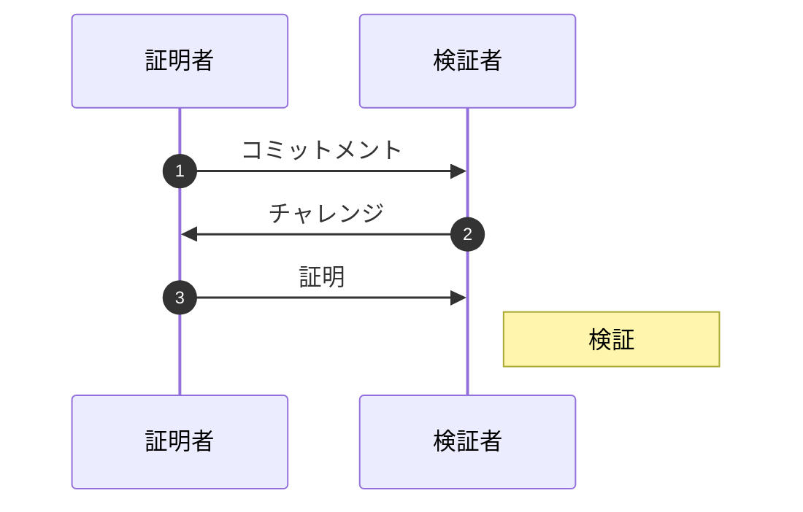
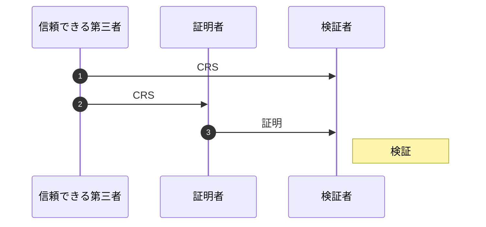

> **公開鍵暗号**
> 暗号化と復号で **別の鍵** を使い、暗号化で使う鍵を **公開** する方式
> ex.) RSA暗号, 楕円曲線暗号 など

## 公開鍵暗号とは
暗号化と復号が別の鍵？そんなこと言われてもよくわからない！となると思うので、ここでまず最も有名な公開鍵暗号である RSA 暗号を紹介しましょう。

RSA 暗号とは $N$ で割った余りの世界において $e$ 乗で暗号化、 $e^{-1}$ 乗で復号する暗号です。

$$
\begin{aligned}
c &= m^e & \pmod N \\
m &= c^{e^{-1}} & \pmod N
\end{aligned}
$$

例えば $5^2 = 25$ は 7 で割ると 4 余るので $5^2 = 25 = 4 \pmod 7$ と計算します。

これを元に手順を書くと次のようになります。

> **RSA 暗号 (Rivest-Shamir-Adleman encryption)**
> - 鍵生成
>   1. 大きな素数 $p, q$ を生成して $N = pq$ と $\phi(N) = (p - 1)(q - 1)$ を計算する。
>   2. 整数 $e$ を決めて $d = e^{-1} \pmod{\phi(N)}$ を計算する。
>   3. $N, e$ を公開鍵として公開し、$p, q, \phi(N), d$ を秘密鍵とする。
> - 暗号化
>   1. 平文 $m$ に対して $c = m^e \bmod N$ と暗号化する。
> - 復号
>   1. 暗号文 $c$ に対して $m = c^d \bmod N$ と復号する。

公開鍵と秘密鍵という言葉が出ました！この公開鍵と秘密鍵がそれぞれ暗号化鍵と復号鍵に対応します。

本当に？確かめてみましょう。

まず公開鍵 $e, N$ で暗号化することはできるでしょうか。

$$
c = m^e \pmod N
$$

これはちゃんと秘密鍵を使わずにできますね。

それじゃ秘密鍵で復号することができるでしょうか。

$$
m = c^d \pmod N
$$

秘密鍵 $d$ を使って復号していますね。ただ $N$ も使っているので公開鍵も必要そうです。これは実は秘密鍵 $p, q$ から $N = pq$ と計算できるので大丈夫です。さらに言えば自分だけが知っている秘密鍵とは違って公開鍵は全員に公開しているのでそれを使っても問題はないです。

それでは逆に公開鍵で復号できるでしょうか。これが出来てしまうと暗号として機能していないと言えます。復号する為には公開鍵から秘密鍵 $d$ を求められればよいです。$d$ を求める為には $p, q$ が必要なので $N$ の素因数分解できると復号できてしまいます！

このことを踏まえて RSA 暗号は素因数分解が出来ないくらい大きな数 $N$ を使います。実際によく使われる $N$ はだいたい $2^{1024} \approx 10^{400}$ くらいのとっても大きな数です。

それでは最後に秘密鍵で暗号化できるでしょうか。
まぁ公開鍵で暗号化してもいいですが、秘密鍵から公開鍵も逆算することで求められるので暗号化できます。

これらを表にまとめるとこんな感じです。

| | 全員 (公開鍵) | 自分 (公開鍵 + 秘密鍵) |
|:-:|:-:|:-:|
| 暗号化 | 可能 | 可能 |
| 復号 | 不可能 | 可能 |

このように自分以外の人は復号ができないような暗号となっています！

ここに図

桁数の大きい 2 つの素数から構成される合成数の素因数分解問題や位数の大きい離散対数問題は困難であることが知られています。

> **素因数分解問題**
> ある合成数 $N$ が与えられたときに素数 $p_i$ と整数 $e_i$ を用いて $N = p_1^{e_1}\cdots p_n^{e_n}$ と素因数分解する問題。
> ex.) RSA 暗号

> **離散対数問題**
> 位数 $N$ の巡回群 $G$ について $g, y\in G$ が与えられたときに $g^x = y$ となる最小の $x\in \mathbb{N}$ を求める問題。
> ex.) DH 鍵共有, DSA, ElGamal 暗号, 楕円曲線暗号

## 公開鍵暗号の応用

公開鍵暗号の重要な役割の 1 つが共通鍵暗号で用いる鍵を誰にも知られずに共有することです。

### Diffie Hellman 鍵共有
共通鍵暗号の一番のネックはそのまま鍵を共有すると盗聴されてしまうことでした。Diffie と Hellman が考えた鍵の共有方法を紹介します。

> **Diffie Hellman 鍵共有**
> 1. アリスとボブは巡回群 $G$ とその生成元 $g$ を共有する。
> 2. アリスとボブはそれぞれ秘密鍵 $x_a, x_b$ を生成し、公開鍵 $y_a = g^{x_a}, y_b = g^{x_b}$ を公開する。
> 3. 相手の公開鍵に自分の秘密鍵を掛けた $s$ はアリスとボブだけが知る共有鍵となる。
>
> $$
s = g^{x_ax_b} = y_b^{x_a} = y_a^{x_b}
$$

ECDH だと $s$ の $x$ 座標をハッシュ化したものを共有鍵として使う。

### ゼロ知識証明と電子署名
ゼロ知識という言葉はシミュレーションパラダイムにおいて出てくる言葉です。対話型ゼロ知識証明は証明者と検証者がやりとりを繰り返し、証明者が本当に正しい情報を持っているかを確率的に検証する方式です。

> **ゼロ知識証明**
> 秘密を知っていることは分かるが秘密自体を知ることができない。
> 1. 証明者は乱数や公開鍵などのコミットメントを送る。
> 2. 検証者はチャレンジを送る。
> 3. 証明者はチャレンジとコミットメント、秘密を用いて証明を作成して送る。
> 4. 検証者は証明を検証する。

> **ゼロ知識証明の例 1**
> $y$ に対して $y = x^2 \pmod n$ となる秘密 $x$ があることをゼロ知識証明する。
> 1. コミットメント: 乱数 $r\in\mathbb{Z}/n\mathbb{Z}$ と $u = r^2 \bmod n$
> 2. チャレンジ: $c\in\lbrace 0, 1\rbrace$
> 3. 証明: $z = rx^c\bmod n$
> 4. 検証: $z^2 \equiv uy^c\bmod n$

> **ゼロ知識証明の例 2**
> 生成元 $g$ に対して DLP $g^x$ を用いて秘密 $x$ をゼロ知識証明する。
> 1. コミットメント: 乱数 $r\in\mathbb{F}_p$ と $u = g^r \bmod p$
> 2. チャレンジ: 乱数 $c\in\mathbb{F}_p$
> 3. 証明: $z = r + xc\bmod q$
> 4. 検証: $g^z \equiv uy^c\bmod p$

これだけだと証明者と検証者はやりとりをしないといけません。
非対話型ゼロ知識証明は証明者と検証者はやりとりをせずに証明することが可能です。対話を行う代わりに証明者と検証者の間に信頼された第三者を置き、CRS; Common Reference String と呼ばれる事前に公開される情報を証明者と検証者に送ります。証明者はその CRS をコミットメントとし、証明を生成し、検証者に送ります。受け取った検証者はそれを検証するだけで非対話なゼロ知識証明が実現できます。

> **非対話型ゼロ知識証明**
> 秘密を知っていることは分かるが秘密自体を知ることができない。
> 1. 信頼できる第三者 (鍵生成者) は証明者と検証者にコミットメントを送る。
> 2. 証明者はコミットメントからチャレンジを生成し、それに秘密を用いて作った証明を送る。
> 3. 検証者は証明を検証する。

> **非対話型ゼロ知識証明の例**
> 1. 信頼できる第三者から証明者と検証者に CRS (コミットメント) $r$ $q$? を送られる。
> 2. 証明者は $u = g^r$、チャレンジ $c = H(g, q, h, u)$、証明 $z = r + xc$ を作成して送る。
> 3. 検証者は $c \equiv H(g, q, h, u)$、$g^z \equiv uh^c$ を検証する。

対話型のゼロ知識証明を非対話化させる為にはコミットメントをハッシュ関数に通したものをチャレンジとすることで非対話型となります。これはチャレンジが乱数であること、つまりハッシュ関数がランダムオラクルモデル (決定論的な乱数生成) であることを仮定しています。

非対話化する方法としては [Fiat-Shamir 変換](https://link.springer.com/content/pdf/10.1007/3-540-47721-7_12.pdf) や [Gennaro らが編み出した効率的な非対話化方式](https://eprint.iacr.org/2012/215.pdf) などがあります。私は Fiat-Shamir 変換しか知らないのでそれだけ載せます。

> **Fiat-Shamir 変換**
> 1. 証明者は乱数や公開鍵などの公開情報をハッシュ化した $e = H(x)$ と $s = r - xe$ を送る。
> 2. 証明者はチャレンジと秘密を用いて一方向性の生成して送る。
> 3. 検証者は $x' = g^yp^{H(x)}$ $b := H(com)$

ただしチャレンジにすべての公開値を含めないと脆弱性 (Frozen Heart) となります。[Coordinated disclosure of vulnerabilities affecting Girault, Bulletproofs, and PlonK | Trail of Bits Blog](https://blog.trailofbits.com/2022/04/13/part-1-coordinated-disclosure-of-vulnerabilities-affecting-girault-bulletproofs-and-plonk/)

非対話型ゼロ知識証明を用いて電子署名を作り出すことができます。

> **電子署名**
>

> **Schnorr Signature**
> 非対話型ゼロ知識証明な署名の一種。
>
> 1. 鍵生成 : 巡回群 $G$ 上で生成元 $g\in G$ と秘密鍵 $x\in\mathbb{N}$ を用いて公開鍵 $y = g^x$ を生成する。
> 2. 署名 : 疑似乱数 $k$ を生成し、署名したいメッセージ $M$ を用いて $e = H(g^k \| M), s = k - xe$ を計算して $(s, e)$ を署名値として公開する。
> 3. 検証 : $e' = H(g^sy^e \| M)$ を計算し、 $e = e'$ となれば署名が有効であると検証されたことになる。

> **BLS 署名**
> 1. 鍵生成 : $0$ 以上 $r$ 未満の乱数 $s$ を一つ取り秘密鍵とします。公開鍵は $sQ$ です。
> 2. 署名 : メッセージ $m$ に対してそのハッシュ値 $H(m)$ をとり、秘密鍵 $s$ 倍して署名 $sH(m)$ を作ります。
> 3. 検証 : メッセージ $m$ と署名 $σ$ をもらった人は自分でハッシュ値 $H(m)$ を計算し公開鍵 $sQ$ を使って

> **DSA; Digital Signature Algorithm**
> - 鍵生成
>   1. $p = 2q + 1$ となる素数 $p, q$ を生成すると $\mathbb{F}_p^\times \cong \mathbb{F}_q\times\mathbb{F}_2$ となる。
>   2. $g\in\mathbb{F}_p$ と $x\in\mathbb{F}_q$ を生成して $y = g^x \bmod p$ を計算する。
> - 署名
>   1. ランダムに $k$ を生成する。
>   2. $r = (g^k\bmod p)\bmod q$ と $s = k^{-1}(H(m) + xr) \bmod q$ を署名として公開する。
> - 検証
>   1. $v = (g^{s^{-1}H(m)}y^{s^{-1}r} \bmod p)\bmod q$ を計算して $r = v$ なら正当な署名となる。

ゼロ知識証明について詳しくは次の資料を読むといいかも。

https://zenn.dev/kyosuke/articles/a1854b9be26c01df13eb

:::message
**練習問題**
$k$ がランダムであるかはかなり重要です。
Easy: $k = m$ かつ $p, q$ 固定のとき $m$ を取り出すことができる。どうやって？ (WaniCTF DSA?)
Hard: IP 偽装を署名を用いて防ぐことはできるでしょうか？
:::

## まとめ
公開鍵暗号の基礎と応用の部分をやりました。暗号の中でもかなり不思議なものだったと思います。私も経験的に納得してるだけで直観的には納得しきれてません。なのでここで納得できてなくても大丈夫です。ここら辺は CTF をすれば咀嚼できるようになれると思います。

次はお待ちかね、CTF の中で最も出題されていると言っても過言ではない RSA 暗号への攻撃です！数学をかなり使うのでそれを補う「計算機代数」の章も参照しながらやっていくといいと思います。

## 参考文献
- https://www.zkdocs.com/
- [ZenGo-X/zk-paillier: A collection of Paillier cryptosystem zero knowledge proofs (github.com)](https://github.com/ZenGo-X/zk-paillier)