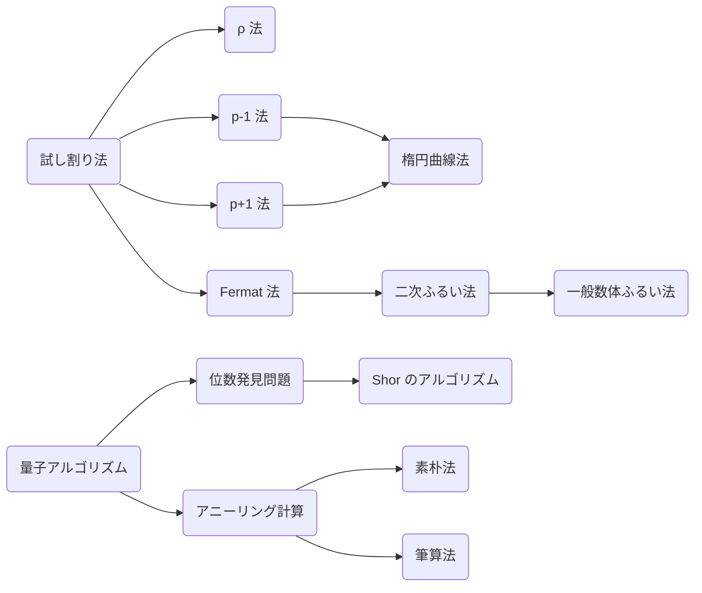

すぐそこに秘密の世界があります。この記事を読んでいるなら、あなたは暗号化された通信を通してサーバーから電気線を通り、遥々その端末に届いている文字を読んでいます。

こんなことを考えてみてほしい。機器から暗号を使って通信をしていますが、私達が触れていないだけで暗号は誰でも解けるものであり、近くを通った人が自分の通信を盗聴しているかもしれない。ゾクッとしませんか。

そんなことが2017年に起こりました。ROCA攻撃と呼ばれるものです。暗号の中でも最も世界で活躍していると言われる「RSA暗号」が簡単に解けてしまうというものです。

その「RSA暗号」の本当の世界を覗いてみましょう。

前提知識は出来る限り高校数学に絞っていますが、それでも少し大学での数学が出てきますので適宜補ってほしいです。

ここでは実際にスクリプトを書いて攻撃していきます！攻撃したことない人はコードを書きながら勉強でき、CTFerにはライブラリ保管庫として使ってほしいと思って書いてます。


それと剰余と合わせて、普段よく使っている整数 $\mathbb{Z}$ 上での演算は $\bmod N$ と対比して $\mathrm{over}\ \mathbb{Z}$ と書くことにします。

## RSA暗号

RSA暗号とは剰余上での累乗は簡単でも累乗根は難しいという非対称性を使った暗号です。

事前に大きな素数 $p, q$ と自然数 $e$ を生成し、$N = pq$ を公開します。(素数生成の方法はコラムへ)
そして平文 $m$ に対して暗号文を $m^e \bmod N$ とします。そして復号化については逆に $e^{-1}$ 乗します。具体的にはカーマイケルの定理から $(\mathbb{Z}/pq\mathbb{Z})^×≅\mathbb{Z}/\mathrm{lcm}(p−1, q-1)\mathbb{Z}$ より $\phi(N) = (p - 1)(q - 1)$ として $d = e^{-1} \pmod{\phi(N)}$ 乗すれば $m$ を復号できます。

$$
\begin{aligned}
c &= m^e &\pmod N \\
m &= c^{d} &\pmod N
\end{aligned}
$$

ここで $N, e$ を知っていても $p, q, d$ いずれも知らないとき、素因数分解の計算困難性を仮定すると復号化は難しいと証明されています。これを用いた暗号をRSA暗号 (Rivest-Shamir-Adleman encryption) と呼びます。

具体的には次の手順で暗号化された通信します。

1. Alice が Bob に公開鍵 $N, e$ を渡す
2. Bob は公開鍵を用いて平文を暗号化
3. Bob から Alice へ暗号文を送る
4. Alice は秘密鍵 $p, q$ を用いて復号化し、平文を得る

ここに図

このようにして送っている最中に盗聴されても秘密鍵がなければ解読できず、安全な通信ができます。またこれ自体は一方向通信ですが、逆も同様に行えば双方向通信もできます。

実装するにはそれぞれの具体的なパラメータについて知っておきましょう。
$e$ は慣例的に `0x10001 = 65537` が使われています。攻撃されないような丁度よい大きさの数であり、かつ暗号化する際にバイナリ法を用いると素早く計算できる数であるという理由が挙げられます。ちなみに 65537 は現在見つかっているフェルマー素数の中で最も大きな数ですね。

```python
from Crypto.Util.number import getPrime, long_to_bytes, bytes_to_long

p = getPrime(512)
q = getPrime(512)
N = p * q
phi = (p - 1) * (q - 1)
e = 0x10001
d = pow(e, -1, phi)

def encrypt(plaintext):
    m = bytes_to_long(plaintext)
    c = pow(m, e, N)
    cipher = long_to_bytes(c)
    return cipher

def decrypt(cipher):
    c = bytes_to_long(cipher)
    m = pow(c, d, phi)
    plaintext = long_to_bytes(m)
    return plaintext

cipher = encrypt(b"This is RSA")
print(cipher)
#
plaintext = decrypt(cipher)
print(plaintext)
# This is RSA
```

:::details ライブラリの説明
| pycryptodomeライブラリの関数 | 説明                                          |
| :--                          | :--                                           |
| `getPrime(n)`                  | n bit長のランダムな素数を生成                 |
| `bytes_to_long(bytes)`         | バイト文字列をASCIIとしてデコードし数に変換   |
| `long_to_bytes(n)`             | 数をASCIIとしてエンコードしバイト文字列に変換 |
:::

### RSA-CRT

RSA の復号をする際に $c^d$ を計算しますが、 $d = e^{-1} \pmod {\phi (N)}$ は比較的大きいので処理が重くなります。これに対して RSA-CRT は中国剰余定理 (CRT) を利用して高速化を図っています。

$$
\begin{aligned}
m_p &= c^{d \ \bmod \ p−1} & \pmod p \\
m_q &= c^{d \ \bmod \ q−1} & \pmod q \\
m &= \mathrm{CRT}(m_p, m_q) & \pmod {N} \\
&= m_q + (m_p - m_q) (q^{-1} \bmod p) q & \pmod {N} \\
\end{aligned}
$$

計算量としては同じですが、小さな値で計算して最後に CRT で戻すようになるので多倍長整数の処理分だけ高速化が図れます。

そして通常、$d, p, q$ に加えて次の値を秘密鍵として持ちます。

$$
\begin{aligned}
d_p &= d \bmod p−1 \\
d_q &= d \bmod q−1 \\
q_{inv} &= q^{-1} \bmod p \\
\end{aligned}
$$

### パディング
メッセージが改ざんされずに届けられていることを確認するのにパディングは用いられます。RSAでは主に次の3つのパディングが使われます。

RFC 8017: PKCS #1 V2.2 (RSA Cryptography Specifications Version 2.2)

- PKCS#1 v1.5; Public-Key Cryptography Standards#1 v1.5
  - `0002<random>00<hashprefix><message>`
- OAEP; Optimal Asymmetric Encryption Padding
  - Padding Oracle Attack で破られないようなパディング形式 InD-CCA2
  - https://inaz2.hatenablog.com/entry/2016/01/26/222303
- PSS; Probabilistic Signature Scheme
  - 署名でよく使われる

このようなパディングを用いたRSAをRSA-[パディング名]などと呼んだりします。

### 安全性
> **Prop.**
> 素因数分解が解けるならば RSA 暗号が解ける。

**Proof.**
素因数分解が解けるから $N = pq$ となる $p, q$ がわかる。これより $\phi(N) = (p-1)(q-1)$, $d = e^{-1} \pmod{\phi(N)}$, $m = c^d \pmod{N}$ は計算可能である。 $\Box$

それとわかりやすいように暗号化, 復号化関数 $\mathcal{E}_{pk}, \mathcal{D}_{sk}$ を定義しておきます。

$$
\begin{aligned}
\mathcal{E}_{pk}(m) &= m^e & \mathcal{D}_{sk}(c) &= c^d &\pmod N \\
\end{aligned}
$$


## 素因数分解
:::
CTF では本質的ではないので読み飛ばすことをおすすめします。
:::

計算機で解くことの難しい部類 NP 完全の問題です。素因数分解したい数 $N$ **のビット数** に対して多項式時間 $\mathcal{O}((\log N)^k)$ で解くアルゴリズムは量子アルゴリズムを除いて見つかっていません。

> **RSA 仮定**

試し割り法を基本にして $\rho$ 法や楕円曲線法、数体ふるい法などがあります。まず試し割り法で小さな倍数は除いてから他の方法を選択すると速いです。

上の方法だと完全指数時間掛かりますがそれより速い準指数時間のアルゴリズム、Index calculus や数体ふるい法などがあります。
整数をランダムに選んできたとき、それは小さい素数、たとえば 2, 3, 5, 7 などのべき乗を掛け合わせたもの、言い換えると、これらの小さい素数だけで生成されるものになる確率は高いことが知られています。これらの小さな素数を「ファクターベース」これらの数が暗号に使われている数に比べて大変小さく、たとえばその準指数関数のサイズ

計算量はよく $L$ 記法を用いて表現されます。なぜかはわかりません。計算量解析苦手なので。

$$
L_n[\alpha, c] = \exp(c(\log n)^\alpha(\log\log n)^{1-\alpha})
$$



### 試し割り法

愚直に素数を小さい順に割っていく方法です。大体の場合これで十分速いです。

1. $N$ を $2$ 以上 $\sqrt{N}$ 以下の整数で下から順に割れるだけ割り続け、割った数 $p$ とその回数 $e$ を記録する
2. 最後に残った $N$ が $1$ ではないならば記録する

この計算量は $\mathcal{O}(\sqrt{N})$ となります。また $\sqrt{N}$ までの素数リストが既にあるならば素数定理によって計算量は $\mathcal{O}(\sqrt{N}/\log{\sqrt{N}})$ に落ちます。

```python
def trial_division(N: int) -> list[tuple[int, int]]:
    res: list[tuple[int, int]] = []
    for p in range(2, N):
        if p * p > N:
            break
        if N % p != 0:
            continue
        e = 0
        while N % p == 0:
            e += 1
            N //= p
        res.append((p, e))
    res.append((N, 1))
    return res
```

### Pollard-$ρ$ 法

> **Prop. 誕生日のパラドックス**
> 誕生日が同じ 2 人を見つけたいときに必要な人数の期待値は約 $\sqrt{365\pi/2}$ である。

$\mathbb{Z}/N\mathbb{Z}$ の数をその素因数 $p$ を用いて同値類 $\mathbb{Z}/p\mathbb{Z}$ で種類分けして同じ種類の数を見つける期待値は誕生日のパラドックスから約 $\sqrt{\pi p/2} = 1.18\sqrt{p}$ です。そうして見つけた数の差は $p$ の倍数となっているため、これと $N$ で最大公約数を取って $p$ を求めることができます。

コンピュータ上ではランダムな数を集める為に擬似的な乱数を生成する関数 $f$ を用いて最大公約数が $p$ になるまで回し続けます。

$$
\begin{aligned}
f(x) & = x^2 + c \pmod N \\
x_{i+1} & = f(x_i) \\
y_{i+1} & = f(f(y_i)) \\
p & = \gcd(|x_i - y_i|, N) \\
\end{aligned}
$$

計算量は $O(\sqrt{p})$ で $N \approx 10^{20}$ くらいまでなら現実的な時間で素因数分解できます。$c = 1$ とし、初期値は $x_0 = 2$ を用いることが多いらしいです。

```python
from collections.abc import Callable
from math import gcd

def pollard_rho(N: int) -> int:
    f: Callable[[int], int] = lambda x: (x * x + 1) % N
    x = y = 2
    d = 1
    while d == 1 or d == N:
        x = f(x)
        y = f(f(y))
        d = gcd(abs(x - y), N)
    return d
```

### Pollard の $p-1$ 法
$p-1$ が Smooth number のとき有効な素因数分解法です。

> **Prop.**
> $N$ がある素因数 $p$ をもつとき $k$ が $p-1$ の倍数であれば $a^k - 1 \pmod N$ は $p$ の倍数となる。

**Proof.**
フェルマーの小定理より $a^k = 1 \pmod p$ であるから $a^k - 1 \pmod N$ は $p$ の倍数である。$\Box$

もちろん $p$ の値は分からないので約数をたくさん持つような $M$ を用意します。$M$ を $B$-Smooth number として次のように構成します。

$$
\begin{aligned}
  M = \prod_{\mathrm{primes}\ q\leq B} q^{\lfloor\log_q B\rfloor}
\end{aligned}
$$

この $M$ が $N$ のどれかの大きな素因数 $p$ に対して $p-1$ の倍数となったとき $\gcd(a^k - 1, N)$ を計算することで $p$ を取り出せます。計算量は $\mathcal{O}(B\log B\log\log n)$ らしいです。

果たしてそんなうまくいくのだろうか？これを初めて聞いたとき大きな数は大体大きな素因数持ってるだろうからほとんど上手くいかなそうと感じました。

考えてみればすぐわかります。

適当に数を取ってきてある素数 $p$ が含まれている確率というのは $1/p$ 、つまり素数が大きければ大きいほど入ってるのは稀です。

```python
from math import gcd, log

def p_1(N: int) -> int:
    B = 1000000
    primes = eratosthenes(B)
    M = 3
    for p in primes:
        M *= pow(M, p ** int(log(B, p)), N)
    return gcd(M - 1, N)
```

### Hugh Williams の $p+1$ 法
$p + 1$ が Smooth number のとき有効な素因数分解法です。

> **Prop.**
> $k$ が $p+1$ の倍数であれば Lucas 数列 $u_i, v_i$ に対し、 $u_k$ は $p$ の倍数となる。ただし Lucas 数列は次のように定義される。
>

$$
\begin{aligned}
  u_0 & = 0, u_1 = 1, u_{n+1} = au_n - bu_{n-1} \\
  v_0 & = 2, v_1 = a, v_{n+1} = av_n - bv_{n-1}
\end{aligned}
$$

**Proof.**
Lucas 数列について

$$
\begin{aligned}
  \alpha,\beta & = \frac{a \pm \sqrt{a^2 - 4b}}{2} \\
  y_n & = \frac{\alpha^n - \beta^n}{\alpha - \beta}
\end{aligned}
$$

$$
\begin{aligned}
  2^{n-1}x_n & = \sum_k^n {}_nC_{2k}a^{n-2k}d^k \\
  2^{n-1}y_n & = \sum_k^n {}_nC_{2k+1}a^{n-2k-1}d^k
\end{aligned}
$$

$n = p$ と素数となるとき

$$
\begin{aligned}
  x_p & = \sum_{k=0}^{(p-1)/2} {}_pC_{2k}a^{p-2k}d^k = a & \pmod p \\
  y_p & = \sum_{k=0}^{(p-1)/2} {}_pC_{2k+1}a^{p-2k-1}d^k = d^{(p-1)/2} & \pmod p
\end{aligned}
$$

$$
\begin{aligned}
  y_{p+1} & = ay_p + by_{p-1} = -a + (x_p - y_{p+1}) = -y_{p+1} & \implies y_{p+1} & = 0 & (d^{(p-1)/2} = -1) \pmod p \\
  by_{p-1} & = y_{p+1} - ay_p = (x_p - by_{p-1}) - ay_p = -by_{p-1} & \implies y_{p-1} & = 0 & (d^{(p-1)/2} = 1) \pmod p
\end{aligned}
$$

繰り返し二乗法っぽく $y_k$ を $\mathcal{O}(\log k)$ で計算できる。

$$
\begin{aligned}
  y_{2n} & = 2y_ny_{n+1} - ay_n^2 \\
  y_{2n+1} & = y_{n+1}^2 + by_n^2 \\
  y_{2n+2} & = ay_{n+1}^2 + 2by_ny_{n+1}
\end{aligned}
$$

約数の多い $k$ を用意して $\gcd(y_k, N)$ が出てくる。確率はどれくらい？

### 楕円曲線法
一般に有効な素因数分解法です。

> **Prop.**
> $k$ が $\#E/(\mathbb{Z}/N\mathbb{Z})$ の倍数であれば $kP = \mathcal{O}$ となる。このとき内部計算時に $x_1 - x_2$ が $p$ の倍数となる。

$N$ が 2, 3 の倍数でないとします。楕円曲線 $y^2 = x^3 + ax + b \pmod N$ について $a, b$ に様々な値を与えて $kP$ を計算します。

計算量は準指数時間 $\mathcal{O}(\exp((1 + c)(\log p)^{1/2}(\log\log p)^{1/2}))$ らしい。

### Fermat 法
$p, q$ の比率が大体わかっているとその周辺を調べることで素数の組を見つけられます。まず $p \approx q$ のとき

$$
\begin{aligned}
N & = p \times q \\
  & = (x + y)(x - y) \\
  & = x^2 - y^2 \\
\end{aligned}
$$

初期値を $x = \lceil\sqrt{N}\rceil, y = 0$ として $x$ の値を1ずつ上げながら $y$ の値も上げていき、右辺と左辺の計算結果が一致したとき $p, q$ が求まるという仕掛けです。

他の比率のときは $p:q \approx a:b$ より $aq \approx bp$ となるから $abN$ に対して同様に行えばよい。

```python
from math import floor, sqrt

def fermat(N: int, a: int = 1, b: int = 1) -> tuple[int, int]:
    abN = a * b * N
    x = floor(sqrt(abN - 1)) + 1
    y = floor(sqrt(x * x - abN))
    while True:
        w = x * x - abN - y * y
        if w == 0:
            break
        elif w > 0:
            y += 1
        else:
            x += 1

    if (x + y) % a == 0:
        assert (x + y) % a == 0
        assert (x - y) % b == 0
        return ((x - y) // b, (x + y) // a)
    else:
        assert (x + y) % b == 0
        assert (x - y) % a == 0
        return ((x - y) // a, (x + y) // b)
```

また、$p, q$ についてより複雑な関係がある場合には Coppersmith method も有効です。

### 二次ふるい法 (QS; Quadratic Sieve)
1. ある範囲 $\sqrt{N} - \epsilon < x_i < \sqrt{N} + \epsilon$ の中で $x_i^2 - N$ が $B$-smooth となるような数をいくつか取ってくる
2. $x_i^2 - N$ を素因数分解し、いくつかの積 $(x_i^2 - N)\cdots(x_j^2 - N)$ がちょうど平方数となるように選択する
3. その平方数を $y^2$ とすると $x^2 = y^2 \pmod N$ となり $x\pm y$ のどちらかは $p$ の倍数となる

なんかしらんけど計算量は $\mathcal{O}(\exp((1 + c)(\log n)^{1/2}(\log\log n)^{1/2}))$ らしいです。

### 一般数体ふるい法 (GNFS; General Number Field Sieve)
計算量は $\mathcal{O}(\exp((1 + c)(\log n)^{1/3}(\log\log n)^{2/3}))$ になったらいいなと思っています。

### Shor のアルゴリズム
量子アルゴリズムについてはちょっとだけ齧っているだけなので詳しい解説は他の良い資料に任せます。
本質的には群の位数を見つけることで素因数分解します。

> **位数発見問題**
> $a$ の位数 $n$ つまり $a^n = 1 \pmod N$ となる最小の $n$ を見つける問題。

$n$ が偶数のとき $a^{n/2}+1$ が未知の素因数の倍数となることがあります。

$O((\log⁡N)^2\log\log N\log\log\log N)$

### アニーリング計算
アニーリング計算は多変数多項式を最小にするような解を与えるような量子アルゴリズムです。素因数分解するアニーリング計算は素朴法と筆算法などがあり、それを紹介します。

#### 素朴法
多変数関数 $f(x, y) = (N - xy)^2$ の最小化を計算させます。これは次のように 2 進展開できます。

$$
\begin{aligned}
xy & = \left(\sum_{i=0}^n 2^ix_i\right)\left(\sum_{i=0}^n 2^iy_i\right) = \sum_{i,j} 2^{i+j}x_iy_j \\
(N - xy)^2 & = \sum_{i,j}2^{i+j}N_iN_j + \sum_{i,j,k} 2^{i+j+k}N_kx_iy_j + \sum_{i,j,k,l} 2^{i+j+k+l}x_iy_jx_ky_l
\end{aligned}
$$

項数は比較的少ないが係数が大きくなりがちな方法です。

#### 筆算法
筆算法は $x, y$ を 2 進展開して筆算した形から方程式を組み立てる方法です。$i$ 桁目での $j$ 桁目への繰り上がり $z_{i,j}$ として $k$ 桁目における方程式は次のように書けます。(繰り上がりの項数は雑な評価です。)

$$
\begin{aligned}
\sum_{i+j=k}x_iy_j + \sum_{n=1}^{\lceil\log\log N\rceil}z_{k+n,k} = N_k + \sum_{n=1}^{\lceil\log\log N\rceil}2^nz_{k,k+n}
\end{aligned}
$$

素朴法に比べ、変数は多くなりますが係数を小さくすることができます。また素数が奇数であることや 2 進数による条件などから変数を減らすことができます。

### 素因数分解データベース
素因数分解の結果をデータベースとして保管しているサイトがあります。実戦ではこれが便利です。
http://www.factordb.com/

### 共通の素因数を持つ数と $\gcd$
何かしらの情報から脆弱性を突き、共通の素因数を取得できたら $\gcd$ すれば求まる。

ここまで話したけれども実践的に CTF で使われるのは「素因数分解 DB」か「共通の素因数を持つ数と $\gcd$」くらいしかない。他の人が素因数分解すればいいし、そうでなければ脆弱な部分を突いてあげればいいからね。でもたまに他のアイデアを元に解けることもあるので網羅的に紹介しました。

:::message
**練習問題**
- [zer0pts CTF 2022/Anti-Fermat](https://github.com/zer0pts/zer0pts-CTF-2022-Public/tree/master/crypto/anti_fermat) を解こう
:::

## 攻撃
RSA 暗号は素因数分解の困難性が安全性の根拠ですが、うまく実装しないと素因数分解を解かなくても攻撃が出来てしまいます。
RSA 暗号ではこのような攻撃が発見されてきました。

| アンチケース                                                              | 攻撃名                                 | 方法                                                   |
| ------------------------------------------------------------------------- | -------------------------------------- | ------------------------------------------------------ |
| 公開鍵 $e$ が小さすぎてはいけない                                         | Low Public Exponent Attack             | 整数上の $e$ 乗根に落とし込む                          |
| 秘密鍵 $d$ が小さすぎてはいけない                                         | Wiener's Attack / Boneh-Durfee Attack   | 近似分数から見積もる, Coppersmith Method               |
| 同一の平文を同一の $N$ 異なる $e$ で暗号化した暗号文を与えてはいけない    | Common Modulus Attack                  | $e$ について拡張ユークリッドの互除法                   |
| 同一の平文を異なる $N$ で暗号化した暗号文を与えてはいけない               | Håstad's Broadcast Attack              | 中国剰余定理                                           |
| 同一の平文を同一の $d$ 異なる $e, N$ で暗号化した暗号文を与えてはいけない | Small Common Private Exponent Attack   | Coppersmith Method                                     |
| RSA-CRT にメモリ書き換えのバグがあってはならない                          | RSA-CRT Fault Attack                   | 秘密鍵が書き換えれると平文の差分が $p, q$ の倍数となる |
| 特定の暗号以外の暗号文を復号した結果を知られてはならない                  | 適応的選択暗号文攻撃                   | $a^ec$ を復号すると $am$ となる                        |
| エラーの内容を知られてはならない                                          | Bleichenbacher's Attack                | 二分探索など                                           |
| 平文を部分的にでも知られてはならない                                      | LSB Decryption Oracle Attack など      | 二分探索                                               |
| 秘密鍵を部分的にでも知られてはならない                                    | Partial Key Exposure Attack            | Coppersmith Method                                     |
| 上位ビットが共通する二つの平文に対する暗号文を知られてはいけない          | Franklin-Reiter Related Message Attack / Coppersmith's Short pad Attack | 最大公約式                                             |

### $e$ が小さすぎてはいけない (Low Public Exponent Attack)

$e$ が小さいとき、$m^e < N$ となって、累乗根を取ればそのまま平文になることがあります。

$$
\begin{aligned}
c &≡ m^e \pmod N \\
c &= m^e \\
m &= \sqrt[e] c
\end{aligned}
$$

累乗根はニュートン法と呼ばれる近似法を用いると高速に求められます。これはPythonパッケージのgmpy2で実装されているのでそれを使います。

> **ニュートン法**
> 関数 $f(x)$ に対して $f(x) = 0$ となる解 $x$ をテイラー展開の 1 次項までを用いて近似する。
>
> $$
x_{n+1} = x_n - \frac{f(x_n)}{f'(x_n)}
$$

**Proof.**
$x = x_0$ でのテイラー展開をすると

$$
f(x) = f(x_0) + f'(x_0)(x - x_0) + \mathcal{O}((x - x_0)^2) \\
$$

となり、$f(x) = 0$ を代入すると

$$
x \approx x_0 - \frac{f(x_0)}{f'(x_0)}
$$

となる。 $\Box$

これに $f(x) = x^e - c$ を代入すると

$$
x_{n+1} = \left(1-\frac{1}{e}\right)x_n + \frac{c}{e}\frac{1}{x_n^{e-1}}
$$

が近似する漸化式となる。


```python
import gmpy2

m = gmpy2.iroot(c, e)[0]
```

### $d$ が小さすぎてはいけない (Wiener's Attack)

秘密鍵 $d = e^{-1}$ が小さいとそれを利用して $d$ を求められます。

ある分数についてユークリッドの互除法を用いて連分数展開し、適当な場所で打ち切って再構成することで近似分数を作ることが出来ます。

> **連分数による近似分数の生成**
>
> $$
\frac{a}{b} \approx q_0 + \cfrac{1}{q_1 + \cfrac{1}{q_2 + \cfrac{1}{\ddots \cfrac{}{q_{m-1} + \cfrac{1}{q_m}}}}} = \frac{\alpha_m}{\beta_m} \\
$$
>
> $q_i, \alpha_i, \beta_i$ については次の漸化式を用いて計算できます。形式的に数列の $-1, -2$ 番目も定義することで分かりやすく計算できます。
>
> $$
\begin{aligned}
r_{-2} &= a & \alpha_{-2} &= 0 &\beta_{-2} &= 1 \\
r_{-1} &= b & \alpha_{-1} &= 1 &\beta_{-1} &= 0 \\
r_{i-2} \div r_{i-1} &= q_{i} \cdots r_{i} & \alpha_i &= q_i \alpha_{i−1} + \alpha_{i−2} &\beta_i &= q_i \beta_{i−1}+\beta_{i−2} \\
\end{aligned}
$$

> **Wiener's Attack**
> $d < N^{\frac{1}{4}}/3$ のとき連分数を用いて近似分数を用いて解ける。

まず次のように変形します。

$$
\begin{aligned}
ed & = 1 \qquad \pmod{\phi(N)} \\
ed & = k\phi(N) + 1 \\
& = k(N - p - q + 1) + 1 \\
\frac{e}{N} & = \frac{k}{d}(1-\delta) \approx \frac{k}{d} & \left(\delta = \frac{p + q - 1 - \frac{1}{k}}{N} \approx \frac{1}{\sqrt{N}}\right)
\end{aligned}
$$

そして $e/N$ の近似分数が $k/d$ と一致するとき秘密鍵 $d$ が求まります。

$q_i, k_i, d_i$ の計算をどこで打ち切るかは2次方程式 $x^2 - (p + q)x + pq = 0$ の判別式を用いて判定します。判別式が正となるとき解 $p, q$ のが存在し、 $p+q$ が整数ならば $p, q$ も整数となるという方法です。

$$
\begin{aligned}
p + q &= N - \frac{ed_i - 1}{k_i} + 1 \in \mathbb{N} \\
pq &= N \\
D &= (p + q)^2 - 4N \geq 0 \\
\end{aligned}
$$

この攻撃は以下のように $d$ が十分小さいときしか成立しません。 $e$ が大きいと $d$ が小さくなりやすいという性質がある為、公開鍵 $e$ が大きいときと表現しますが、$d$ がこれ以上であれば攻撃は成立しません。

```python
import gmpy2

def WienersAttack(n, e):
    r0, r1 = e, n
    k0, k1 = 0, 1
    d0, d1 = 1, 0

    i = 0
    while r1 != 0:
        q = r0 // r1
        r0, r1 = r1, r0 % r1
        k0, k1 = k1, q*k1 + k0
        d0, d1 = d1, q*d1 + d0

        if i % 2 == 0:
            k = k1 + k0
            d = d1 + d0
        else:
            k = k1
            d = d1

        i += 1
        if k == 0 or (e * d - 1) % k != 0:
            continue
        s = n - (e * d - 1) // k + 1
        D = s*s - 4*n
        sD = gmpy2.isqrt(D)
        if D > 0 and sD * sD == D:
            return d
    return -1
```

さらに Wiener's Attack より強い攻撃として Boneh-Durfee Attack があります。

> **Boneh-Durfee Attack**
>
> $d < N^{0.292}$ のとき Coppersmith Method を用いて解ける。

まず以下のように変形します。

$$
\begin{aligned}
ed &= 1 & \pmod{\phi} \\
ed &= k \phi + 1 & (over \ \mathbb{Z}) \\
0 &= k \phi + 1 & \pmod e \\
&= k (N + 1 - p - q) + 1 & \pmod e \\
&= 2k \left(\frac{N + 1}{2} + \frac{-p -q}{2}\right) + 1 & \pmod e \\
\end{aligned}
$$

この方程式について $f(x,y) = 2x (A + y) + 1$ とおき、関数 $f(x,y)$ に対して Coppersmith Method を用いることで $p + q$ が求まり、解くことができます。

SageMath は標準に多変数の Coppersmith Method を使うことができません。 [defund/coppersmith](https://github.com/defund/coppersmith) というリポジトリにそれが実装されているので、それを用いて攻撃することが多いです。

```python
load('coppersmith.sage')

def boneh_durfee(N, e):
    bounds = (floor(N^.25), 2^1024)
    P.<k, s> = PolynomialRing(Zmod(e))
    f = 2*k*((N+1)//2 - s) + 1
    print(small_roots(f, bounds, m=3, d=4))
```

### 同一の平文を異なるnで暗号化した暗号文を与えてはいけない (Håstad's Broadcast Attack)

同一の平文を異なる $e$ 個の $N_i$ で暗号化した暗号文を与えられたとします。

$$
c_i = m^e \pmod{N_i}
$$

これらの暗号文を中国剰余定理によって持ち上げます。

$$
m^e = \mathrm{CRT}(c_1, c_2, \ldots, c_e) \pmod{N_1N_2\cdots N_e}
$$

持ち上げた先で $m^e < N_1\cdots N_e$ となるので $e$ 乗根して平文 $m$ を得られます。

:::message
**練習問題 (Smooth な ElGamal暗号)**

$$
c = g^{m} \pmod{p_1p_2\ldots p_n}
$$
:::

### 同一の平文を異なるeで暗号化した暗号文を与えてはいけない (Common Modulus Attack)

異なる $e$ で暗号化するとユークリッドの互除法を用いてより小さな $e$ の暗号文を作れて、解読できてしまいます。

$$
\begin{aligned}
c_1 &≡ m^{e_1} \pmod N \\
c_2 &≡ m^{e_2} \pmod N \\
\end{aligned}
$$

$e_1, e_2$ について拡張ユークリッドの互除法を用いて $g = \gcd(e_1, e_2)$ となる。

$$
\begin{aligned}
g & = \gcd(e_1, e_2) = s_1e_1 + s_2e_2 \\
m^g & = m^{s_1e_1 + s_2e_2} = c_1^{s_1} c_2^{s_2} \pmod N \\
\end{aligned}
$$

これによって $e_1, e_2$ が互いに素のとき、または $g$ が小さいならば Low Public Exponent Attack を用いて $m$ を求められます。


### 任意の暗号文を復号した結果を知られてはいけない (適応的選択暗号文攻撃)

任意の暗号を復号した結果を知っているとき、ある暗号文の復号結果を防がれていたとしても他の暗号を送ることで解読できます。

> **Prop.**
> $k^ec$ を復号した結果は $km$ となる。また上位ビットが固定されたパディングは不等式で表現できる。

$$
\mathcal{D}(k^ec) = km \pmod N
$$

これに対する防御方法として平文にパディングを施し、復号化した際にパディング形式が違うときは相手に渡さないようにするという方法があります。これによって正当な暗号文しか受け入れず、適応的選択暗号文攻撃を防げます。

### パディングによるエラー内容を知られてはいけない (Bleichenbacher's Attack)

これについてパディングが合っているかどうかを相手に送ってしまうと Padding Oracle Attack で攻撃でき、PKCS #1 v1.5では200万程度送ると平文が読めてしまいます。

:::message
**練習問題**
(SECCON CTF 2022 this_is_not_lsb より)
:::

### 暗号文を復号した結果の偶奇を知られてはいけない (LSB Decryption Oracle Attack)

全てが分かっていなくとも偶奇さえ分かれば任意の暗号文を復号できるという攻撃です。

まず平文 $m$ に関して整数 $0\leq k < 2^s$ を用いてある範囲 $kN/2^s\leq m<(k+1)N/2^s$ にあると書けるとき

$$
\begin{aligned}
\mathcal{D}(2^{(s+1)e}c) & = 2^{s+1}m \bmod N \\
& = \begin{dcases}
2^{s+1}m - 2kN & \left(\frac{2k}{2^{s+1}}N\leq m < \frac{2k+1}{2^{s+1}}N\right) \\
2^{s+1}m - (2k+1)N & \left(\frac{2k+1}{2^{s+1}}N\leq m < \frac{2k+2}{2^{s+1}}N\right)
\end{dcases}
\end{aligned}
$$

となります。この上下を判別出来れば平文となり得る範囲を半分にすることができます。ここで最下位ビットについてよく見ると値の偶奇を考えることで上のとき $0$、下のとき $1$ となることがわかります。

この判別を $s = 0$ から始めることで平文を探し出すことができます。

より一般化して考えると平文に関する情報を一部でも与える仕組みがあれば、ガチャガチャすることで全ての内容が分かってしまうという訳です。
- Padding Oracle Attack ... パディングによる数値の範囲の情報
- LSB Decryption Oracle Attack ... $m\bmod 2$ の情報

:::message
**練習問題**
1. 異なる $N$ について平文の最下位ビットがわかるときはどうすればよいか (InCTF waRSAw より)
https://github.com/ashutosh1206/Crypton/tree/master/RSA-encryption/Attack-LSBit-Oracle-variant
2. $m\bmod 3$ がわかるときはどうすればよいか (BambooFox 2019 Oracle より)
:::

### RSA-CRT にバグがあってはならない (RSA-CRT Fault Attack)

RSAの復号をする際に $c^d$ を計算しますが、 $d = e^{-1} \pmod {\phi (N)}$ は比較的大きいので処理が重くなります。これに対してRSA-CRTは中国剰余定理(CRT)を利用して高速化を図っています。

$$
\begin{aligned}
m_p &= c^{d \ \bmod \ p−1} & \pmod p \\
m_q &= c^{d \ \bmod \ q−1} & \pmod q \\
m &= \mathrm{CRT}(m_p, m_q) & \pmod {N} \\
&= m_q + (m_p - m_q) (q^{-1} \bmod p) q & \pmod {N} \\
\end{aligned}
$$

これより下の値を秘密鍵として持つことになります。

$$
\begin{aligned}
d_p &= d \bmod p−1 \\
d_q &= d \bmod q−1 \\
q_{inv} &= q^{-1} \bmod p \\
\end{aligned}
$$

しかし $d_p, d_q$ のどちらかが何らかの方法で書き換えられてしまったときについて考えます。 $d_q$ を $d_q'$ と書き換えられたとき次のように書けます。

$$
\begin{aligned}
m_p &= c^{d_p} \pmod p \\
m_q' &= c^{d_q'} \pmod q \\
m &= \mathrm{CRT}(m_p, m_q) = kp + m_p \\
m' &= \mathrm{CRT}(m_p, m_q') = k'p + m_p \\
|m - m'| &= |k - k'|p \\
p &= \gcd(|m - m'|, N) \\
\end{aligned}
$$

これより平文 $m, m'$ を知ることができれば解くことができます。
これより元々の平文と書き換えられた平文の差が素数の倍数となり、解くことができます。


### 秘密鍵は部分的にでも知られてはいけない (Partial Key Exposure Attack)

秘密鍵を部分的に知っていさえいれば、Coppersmith Method を用いて解けてしまう。
$n$ を $N$ のビット数とする。

```
small_roots(X, beta)
X: 解の最大値
beta: factor >= n^beta
```

#### $p, q$ のどちらかを $n/4$ ビット程度知っているとき

例えば $p$ を部分的に知っているときこのような関数を作ります。

$$
\begin{aligned}
f(x) &= p_{upper} + x & \pmod N \\
f(x) &= 2^{k}x + p_{lower} & \pmod N \\
f(x,y) &= 2^kx + p_{mid} + y & \pmod N \\
\end{aligned}
$$

これに対して法の数を $p$ としたいので $\beta \approx 0.3$ として、実行すると出てきます。

```python
def partial_p_lower(p_lower: int, k: int, N: int) -> int:
    PR.<x> = PolynomialRing(Zmod(N))
    f = 2^k*x + p_lower
    f = f.monic()
    roots = f.small_roots(X=2^(N.nbits()//2-k), beta=0.3)
    for x0 in roots:
        return gcd(2^k*x0 + p_lower, N)
    return 1

def partial_p_upper(p_upper: int, k: int, N: int) -> int:
    PR.<x> = PolynomialRing(Zmod(N))
    f = x + p_upper
    roots = f.small_roots(X=2^(floor((n.nbits() / 4) * 6/7)), beta=0.3)
    for x0 in roots:
        return x0 + p_upper
    return 1
```

#### $d$ を $n/4$ ビット程度知っているとき

$e$ が総当り出来るくらい小さいときに $d$ を $n/4$ ビットだけ知っていれば元の $d$ を構成できる。大体の場合は $e = 65537$ であるから十分可能である。$d < \phi(N)$ より $0 < k \leq e$ となり、この $k$ に対して総当たりする。

##### 上位ビットの場合
$d$ と $p, q$ の関係式を立てる。

$$
\begin{aligned}
ed &= 1 & \pmod{\phi(N)} \\
ed &= 1 + k(N - p - q + 1) \\
d &= \frac{kN}{e} - \frac{k(p+q-1) -1}{e} \\
e(d_{upper} + x) &= - k (y - 1) + 1 & \pmod N \\
\end{aligned}
$$

第三式について $p + q \approx \sqrt{N}$ より第二項は上位ビットに関連する情報を持たない。これより第一項の $k$ について総当りして上位ビットと一致する $k$ を見つければよい。すると第4式に対し Coppersmith Method を用いて、$d$ がわかる。

##### 下位ビットの場合
まずは $d$ の下位ビットから $p$ の下位ビットを求める。

$$
\begin{aligned}
ed &= 1 + k\left(N - p - \frac{N}{p} + 1\right) \\
edp &= p + kp(N - p + 1) - kN & \pmod {2^{n/4}} \\
\end{aligned}
$$

$k$ について総当りして $p$ の最下位ビットを求める。すると先程の問題に帰着できて $p$ がわかり $d$ がわかる。

#### RSA-CRT の秘密鍵 $d$ を $n/4$ ビット程度知っているとき

$$
\begin{aligned}
ed_p &= 1 & \pmod{p-1} \\
ed_p &= 1 + k_p(p − 1) \\
\end{aligned}
$$

上と同様です。

#### 平文 $m$ を $(1-1/e)n$ ビット程度知っているとき

次数が大きいのである程度知っていないと解けません。

$$
\begin{aligned}
f(x) &= (m_{upper} + x)^e - c & \pmod N \\
f(x) &= (2^kx + m_{lower})^e - c & \pmod N \\
f(x,y) &= (2^kx + m_{mid} + y)^e - c & \pmod N \\
\end{aligned}
$$

このようにある程度知っているとCoppersmith Methodで解けるものが多いです。

Coppersmith method を使ったより様々な攻撃を知りたければ次の資料を読むことををおすすめします。

https://eprint.iacr.org/2020/1506.pdf

### 上位ビットが共通する二つの平文に対する暗号文を知られてはいけない (Franklin-Reiter Related Message Attack)

> **Franklin-Reiter Related Message Attack**
> 2 つの平文 $m_1, m_2$ について代数的な関係 $m_2 = f(m_1)$ があるとき、それらの暗号文 $c_1, c_2$ から平文を求められる。

次のように方程式 $f_1, f_2$ を立てて最大公約元を計算することで $\gcd(f_1, f_2) = x - m_1$ と平文が求まる。

$$
\begin{aligned}
f_1(x) & = x^e - c_1 & \pmod{N} \\
f_2(x) & = f(x)^e - c_2 & \pmod{N}
\end{aligned}
$$

このように同じ解を持つ方程式は $\gcd$ を取ることで平文が求まる。ただし SageMath で実装されている $\gcd$ は遅いので次数 $n$ に対して $O(n\log^2n)$ で動く Half GCD というアルゴリズムを用いて解きがちです。

> **Coppersmith's Short Pad Attack**
> 特に $m_1, m_2 \approx N$ に対して小さな値 $r \approx O(N^{1/e^2})$ を用いて $m_2 = m_1 + r$ という関係があるとき、 $r$ が小さければ全探索して最大公約元を取ればいいが $r$ が全探索できないほど大きいときにも実は解けるというのが Coppersmith's Short Pad Attack である。

まず次のように方程式 $f_1, f_2$ を立てる。

$$
\begin{aligned}
f_1(x, y) & = x^e - c_1 & (\mathrm{over}\ \mathbb{Z}) \\
f_2(x, y) & = (x + y)^e - c_2 & (\mathrm{over}\ \mathbb{Z})
\end{aligned}
$$

$x$ に関して $f_1$ と $f_2$ に同一の解があるとき、それらの終結式 $\mathrm{Res}(f_1, f_2)$ は $\mathrm{Res}(f_1, f_2) = 0$ を満たす。このとき $\mathrm{Res}(f_1, f_2) = 0 \pmod{N}$ は $y$ の方程式であり、 Coppersmith Method を用いて $y = r$ が求まる。

Approximate GCD Problem

```python
def short_pad_attack(c1, c2, e, n):
    PRxy.<x,y> = PolynomialRing(Zmod(n))
    PRx.<xn> = PolynomialRing(Zmod(n))
    g1 = x^e - c1
    g2 = (x+y)^e - c2
    h = q2.resultant(q1)
    h = h.univariate_polynomial()
    h = h.change_ring(PRx).subs(y=xn)
    h = h.monic()
    kbits = n.nbits()//(2*e*e)
    diff = h.small_roots(X=2^kbits, beta=0.5)[0]
```

### The Return of Coppersmith's Attack
鍵生成アルゴリズムが仕様に沿わないと暗号学的に脆弱となる可能性がある。
主要な暗号ハードウェアメーカで使われているライブラリ RSALib では Smooth number $M$ を用いて次のように素数を生成していました。

$$
\begin{aligned}
p &= kM + (e^a \bmod M) \\
q &= lM + (e^b \bmod M) \\
pq &= e^{a + b} \bmod M
\end{aligned}
$$

これは $M$ の素因数分解をして中国剰余定理から DLP を適用することで RSA が解けてしまう。$P_n$ を小さい順に $n$ 個目までの素数の積として $M$ は次のような値です。

| RSA | $M$ |
| :-: | :-: |
| 512bit RSA | $M = P_{39}$ , $k$ 37bit, $a$ 62bit |
| 1024bit RSA | $M = P_{71}$ |
| 2048bit RSA | $M = P_{126}$ |

https://news.err.ee/616732/potential-security-risk-could-affect-750-000-estonian-id-cards

### 乗法群の位数が $\phi(N) = se^n$ と表されるとき $e$ の逆元が取れない

このとき位数 $se^n$ から $e^n$ 乗することで位数 $s$ の乗法群に落とし, そこでなら逆元を取れるので, 位数 $se^n$ の元を $e^n$ 回掛けて全探索すると平文が見つかる.

$O(e^n)$

## 素因数分解ベースの暗号
### Paillier 暗号
$r$ の位数の倍数 $\lambda$ を秘密鍵

$$
\begin{aligned}
c & = (1 + kn)^mr^n & \pmod{n^2} \\
c^\lambda & = ((1 + kn)^mr^n)^\lambda = (1 + kn)^{m\lambda} = 1 + knm\lambda & \pmod{n^2}
\end{aligned}
$$

### Rabin 暗号

$$
\begin{aligned}
& c = m(m + B) & \pmod{n} \\
& x^2 + Bx - c = 0 & \pmod{n}
\end{aligned}
$$

## まとめ

今回はRSA暗号に絞りましたが実際のCTFはもっと広くて自由です！RSAに似てるけど解法が違う暗号やぱっと見RSAではなさそうな暗号もRSAに帰着させることが出来たりする暗号など様々あります。それでもここで扱った概念はそれらの基礎になります。

あなたもCTFに出て暗号の世界を堪能してみませんか。

## 参考文献
- [RSA暗号運用でやってはいけない n のこと](https://www.slideshare.net/sonickun/rsa-n-ssmjp)
- [RSA暗号攻撃で他でも使える n のこと](https://project-euphoria.dev/blog/27-rsa-attacks/)
- [CTF crypto 逆引き](https://furutsuki.hatenablog.com/entry/2021/03/16/095021)
- [Recovering cryptographic keys from partial information, by example](https://eprint.iacr.org/2020/1506.pdf)
- [Twenty Years of Attacks on the RSA Cryptosystem](https://crypto.stanford.edu/~dabo/pubs/papers/RSA-survey.pdf)
- [p - 1 ≡ 0 (mod e) のときの RSA 復号方法](https://blog.y011d4.com/20201026-not-coprime-e-phi)
- [SageMathを使ってCoppersmith's Attackをやってみる](https://inaz2.hatenablog.com/entry/2016/01/20/022936)
- [RTACTF](https://xagawa.hatenablog.com/entry/2021/12/20/232133)
- [Crypto Challenge](https://mystiz.hk)

この資料は CC0 ライセンスです。