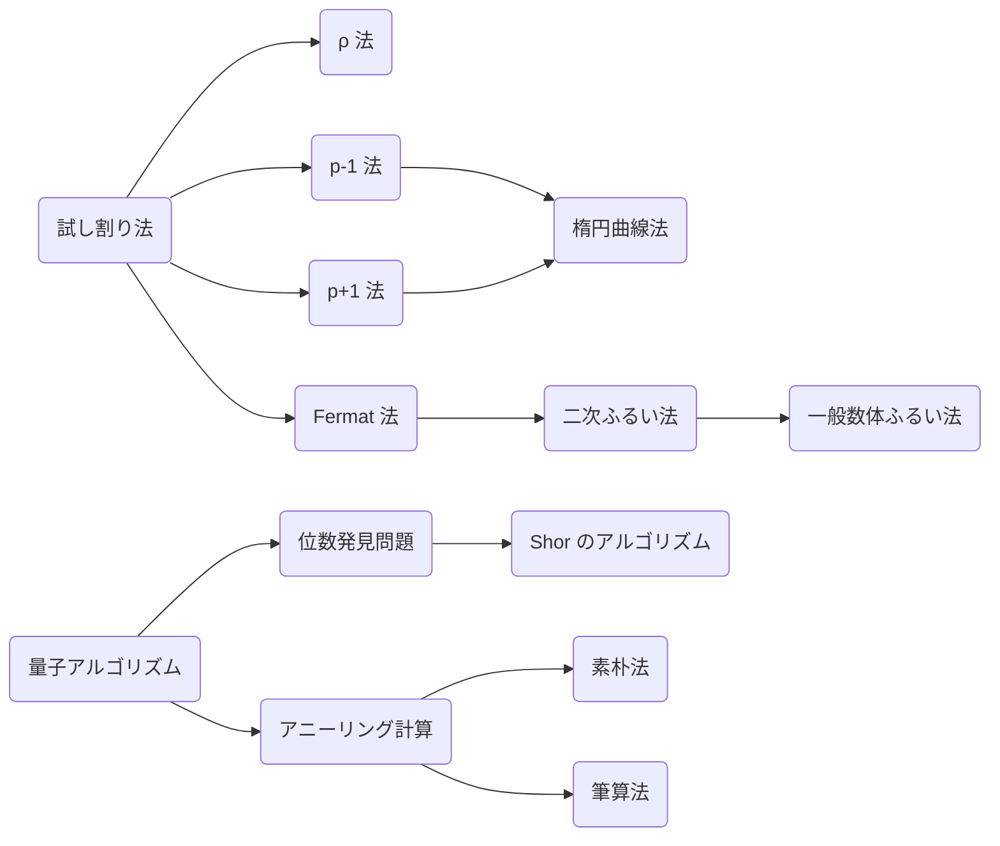

すぐそこに秘密の世界があります。この記事を読んでいるなら、あなたは暗号化された通信を通してサーバーから電気線を通り、遥々その端末に届いている文字を読んでいます。

こんなことを考えてみてほしい。機器から暗号を使って通信をしていますが、私達が触れていないだけで暗号は誰でも解けるものであり、近くを通った人が自分の通信を盗聴しているかもしれない。ゾクッとしませんか。

そんなことが2017年に起こりました。ROCA攻撃と呼ばれるものです。暗号の中でも最も世界で活躍していると言われる「RSA暗号」が簡単に解けてしまうというものです。

その「RSA暗号」の本当の世界を覗いてみましょう。

前提知識は出来る限り高校数学に絞っていますが、それでも少し大学での数学が出てきますので適宜補ってほしいです。

ここでは実際にスクリプトを書いて攻撃していきます！攻撃したことない人はコードを書きながら勉強でき、CTFerにはライブラリ保管庫として使ってほしいと思って書いてます。

これで剰余上の演算は一通りできるようになりました。さてコンピューターはこれらをどのようにして計算するのでしょうか。代表的なアルゴリズムで組んだ場合だと以下の表のようになります。(簡単の為、基本的な演算の計算量はビット数に依らないとする)

| 演算                   | 方法                          | 計算量                      |
| :--------------------  | :---------------------------- | :-------------------------: |
| 足し算   $a + b$       | 足してN以上になったらN引く    | $O(1)$            |
| 引き算   $a - b$       | 引いて0未満になったらN足す    | $O(1)$            |
| 掛け算   $a \times b$  | 掛けてNで割った余り           | $O(1)$            |
| 割り算   $a \div b$    | 拡張ユークリッドの互除法      | $O(\log^2 N)$   |
| 累乗     $a ^ e$       | 繰り返し二乗法                | $O(\log N)$       |
| 平方根   $\sqrt{a}$    | Tonelli Shanksのアルゴリズム  | $O(\log^2 N)$   |
| 累乗根   $\sqrt[e]{a}$ | Tonelli Shanksのアルゴリズム     | $O(\min(N^{1/4},\sqrt{e})\log{e}\log^2{N})$     |
| 対数     $\log_e{a}$   | 離散対数問題            | $O(\sqrt{N})$     |

(参考: [整数論テクニック集のpdf](https://kirika-comp.hatenablog.com/entry/2018/03/12/210446) など)

それぞれのアルゴリズムは参考などの資料を見てください。累乗は多項式時間しか掛かりませんが、累乗根や対数は指数時間掛かるということを頭の隅に置いておいてください。

それと剰余と合わせて、普段よく使っている整数 $\mathbb{Z}$ 上での演算は $\bmod N$ と対比して $\mathrm{over}\ \mathbb{Z}$ と書くことにします。

## RSA暗号

RSA暗号とは剰余上での累乗は簡単でも累乗根は難しいという非対称性を使った暗号です。

事前に大きな素数 $p, q$ と自然数 $e$ を生成し、$N = pq$ を公開します。(素数生成の方法はコラムへ)
そして平文 $m$ に対して暗号文を $m^e \bmod N$ とします。そして復号化については逆に $e^{-1}$ 乗します。具体的にはカーマイケルの定理から $(\mathbb{Z}/pq\mathbb{Z})^×≅\mathbb{Z}/\mathrm{lcm}((p−1), (q-1))\mathbb{Z}$ より $\phi(N) = (p - 1)(q - 1)$ として $d = e^{-1} \pmod{\phi(N)}$ 乗すれば $m$ を復号できます。

$$
\begin{aligned}
c &= m^e &\pmod N \\
m &= c^{d} &\pmod N
\end{aligned}
$$

ここで $N, e$ を知っていても $p, q, d$ いずれも知らないとき、素因数分解の計算困難性から復号化は難しいとされています。これを用いた暗号をRSA暗号 (Rivest-Shamir-Adleman encryption) と呼びます。

具体的には次の手順で暗号化された通信します。

1. AliceがBobに公開鍵 $N, e$ を渡す
2. Bobは公開鍵を用いて平文を暗号化
3. BobからAliceへ暗号文を送る
4. Aliceは秘密鍵 $p, q$ を用いて復号化し、平文を得る

ここに図

このようにして送っている最中に盗聴されても秘密鍵がなければ解読できず、安全な通信ができます。またこれ自体は一方向通信ですが、逆も同様に行えば双方向通信もできます。

実装するにはそれぞれの具体的なパラメータについて知っておきましょう。
$e$ は慣例的に `0x10001 = 65537` が使われています。攻撃されないような丁度よい大きさの数であり、かつ暗号化する際にバイナリ法を用いると素早く計算できる数であるという理由が挙げられます。

```python
from Crypto.Util.number import getPrime, long_to_bytes, bytes_to_long

p = getPrime(512)
q = getPrime(512)
N = p * q
phi = (p - 1) * (q - 1)
e = 0x10001
d = pow(e, -1, phi)

def encrypt(plaintext):
    m = bytes_to_long(plaintext)
    c = pow(m, e, N)
    cipher = long_to_bytes(c)
    return cipher

def decrypt(cipher):
    c = bytes_to_long(cipher)
    m = pow(c, d, phi)
    plaintext = long_to_bytes(m)
    return plaintext

cipher = encrypt(b"This is RSA")
print(cipher)
#
plaintext = decrypt(cipher)
print(plaintext)
# This is RSA
```

:::details ライブラリの説明
| pycryptodomeライブラリの関数 | 説明                                          |
| :--                          | :--                                           |
| `getPrime(n)`                  | n bit長のランダムな素数を生成                 |
| `bytes_to_long(bytes)`         | バイト文字列をASCIIとしてデコードし数に変換   |
| `long_to_bytes(n)`             | 数をASCIIとしてエンコードしバイト文字列に変換 |
:::

RSA暗号はこれを使えば簡単に解けます。
RSAは $c = m^e \pmod {N}$ という式について $e, c$ が分かっているので累乗根を求める問題なのですが、原始根 $a$ で対数を取るとカーマイケルの定理より

$$
\begin{aligned}
c &= m^e & \pmod {N} \\
m &= c^{1/e} & \pmod {N} \\
\end{aligned}
$$

と累乗根を計算できます。

ここまでは数学の話でしたが、ここから計算機科学に移ります。

確かに、掛け算を足し算に変換することで簡単な問題になります。しかし、それ以前にコンピュータが剰余上の対数を計算する事は結構難しく、離散対数問題 (DLP: Discrete Logarithm Problem) と呼ばれ、現在見つかっている最も速いアルゴリズムでも完全指数時間も掛かります。

では諦めて掛け算だけで解く、というだけではなく他に1つ方法があります。直接数に対応させなくても、ある数だけ累乗すると $1$ や $-1$ になるという情報を使うことである程度情報を引き出すことができます。いわゆる平方剰余と呼ばれるものなどです。

それとわかりやすいように暗号化, 復号化関数 $Enc, Dec$ を定義しておきます。

$$
\begin{aligned}
\mathcal{E}(m) &= m^e & \mathcal{D}_{sk}(c) &= c^d &\pmod N \\
\end{aligned}
$$

### RSA-CRT

RSAの復号をする際に $c^d$ を計算しますが、 $d = e^{-1} \pmod {\phi (N)}$ は比較的大きいので処理が重くなります。これに対してRSA-CRTは中国剰余定理(CRT)を利用して高速化を図っています。

$$
\begin{aligned}
m_p &= c^{d \ \bmod \ p−1} & \pmod p \\
m_q &= c^{d \ \bmod \ q−1} & \pmod q \\
m &= \mathrm{CRT}(m_p, m_q) & \pmod {N} \\
&= m_q + (m_p - m_q) (q^{-1} \bmod p) q & \pmod {N} \\
\end{aligned}
$$

これより下の値を秘密鍵として持つことになります。

$$
\begin{aligned}
d_p &= d \bmod p−1 \\
d_q &= d \bmod q−1 \\
q_{inv} &= q^{-1} \bmod p \\
\end{aligned}
$$

### padding
メッセージが改ざんされずに届けられていることを確認するのにパディングは用いられます。RSAでは主に次の3つのパディングが使われます。

RFC 8017: PKCS #1 V2.2(RSA Cryptography Specifications Version 2.2)

- PKCS#1 v1.5; Public-Key Cryptography Standards#1 v1.5
- OAEP; Optimal Asymmetric Encryption Padding
- PSS; Probabilistic Signature Scheme

このようなパディングを用いたRSAをRSA-[パディング名]などと呼んだりします。

## 素因数分解
計算機で解くことの難しい部類 NP 完全の問題です。素因数分解したい数 $N$ **のビット数** に対して多項式時間 $\mathcal{O}((\log N)^k)$ で解くアルゴリズムは量子計算機を除いて見つかっていません。

> **RSA 仮定**

試し割り法を基本にして $\rho$ 法や楕円曲線法、数体ふるい法などがあります。まず試し割り法で小さな倍数は除いてから他の方法を選択すると速いです。

上の方法だと完全指数時間掛かりますがそれより速い準指数時間のアルゴリズム、Index calculus や数体ふるい法などがあります。
整数をランダムに選んできたとき、それは小さい素数、たとえば 2, 3, 5, 7 などのべき乗を掛け合わせたもの、言い換えると、これらの小さい素数だけで生成されるものになる確率は高いことが知られています。これらの小さな素数を「ファクターベース」これらの数が暗号に使われている数に比べて大変小さく、たとえばその準指数関数のサイズ

計算量はよく $L$ 記法を用いて表現されます。なぜかはわかりません。計算量解析苦手なので。

$$
L_n[\alpha, c] = \exp(c(\log n)^\alpha(\log\log n)^{1-\alpha})
$$



### 試し割り法

愚直に素数を小さい順に割っていく方法です。大体の場合これで十分速いです。

1. $N$ を $2$ 以上 $\sqrt{N}$ 以下の整数で下から順に割れるだけ割り続け、割った数 $p$ とその回数 $e$ を記録する
2. 最後に残った $N$ が $1$ ではないならば記録する

この計算量は $\mathcal{O}(\sqrt{N})$ となります。また $\sqrt{N}$ までの素数リストが既にあるならば素数定理によって計算量は $\mathcal{O}(\sqrt{N}/\log{\sqrt{N}})$ に落ちます。

https://gist.github.com/anko9801/9a717f4737104a81b5cf90dd50b94dfd

### Pollard-$\rho$ 法
誕生日のパラドックスを聞いたことありますか？ 誕生日が同じな2人を見つけたいときに人を何人集めればそうなる確率が50%を超えるのかという問題です。鳩ノ巣原理から366人いれば必ず同じ誕生日の人が出てきます。さて、同じ誕生日の組が 50% の確率でいる場合、何人いればよいでしょうか。

答えは 23 人いれば十分です。

これを使って素因数分解する方法があります。

$\bmod p$ 上で同じ2つの数を見つけたいときに $\sqrt{p\ln 4} \fallingdotseq 1.18\sqrt{p}$ だけ集めれば 50% の確率で見つかります。そしてその差は $p$ の倍数となっているため、これと $N$ で最大公約数を取って素因数 $p$ を求めることができます。

コンピュータ上ではランダムな数を集める為に擬似的な乱数を生成する関数 $f$ を用いて最大公約数が $p$ になるまで回し続けます。

$$
\begin{aligned}
f(x) &= x^2 + c \pmod N \\
x_{i+1} &= f(x_i) \\
y_{i+1} &= f(f(y_i)) \\
p &= \gcd(N, |x_i - y_i|) \\
\end{aligned}
$$

計算量は $O(\sqrt{p})$ で $N \approx 10^{20}$ くらいまでなら現実的な時間で素因数分解できます。

$$
\begin{aligned}
f(x) &= x^2 + c \pmod N \\
x_{i+1} &= f(x_i) \\
y_{i+1} &= f(f(y_i)) \\
\end{aligned}
$$

$c$ は $1$ とし、初期値は $2$ を用いることが多いらしいです。
```python
def gcd(m, n):
    while n:
        m, n = n, m % n
    return m

def pollard_rho(N):
    f = lambda x: (x*x + 1) % N
    x = y = 2
    d = 1
    while d == 1:
        x = f(x)
        y = f(f(y))
        d = gcd(abs(x - y), N)
    return d if d < N else -1
```

### Pollard の $p-1$ 法
$p-1$ が Smooth number のとき有効な素因数分解法です。

> **Prop.**
> $N$ がある素因数 $p$ をもつとき $k$ が $p-1$ の倍数であれば $a^k - 1 \pmod N$ は $p$ の倍数となる。

**Proof.**
フェルマーの小定理より $a^k = 1 \pmod p$ であるから $a^k - 1 \pmod N$ は $p$ の倍数である。$\Box$

もちろん $p$ の値は分からないので約数をたくさん持つような $M$ を用意します。$M$ を $B$-Smooth number として次のように構成します。

$$
\begin{aligned}
  M = \prod_{\mathrm{primes}\ q\leq B} q^{\lfloor\log_q B\rfloor}
\end{aligned}
$$

この $M$ が $N$ のどれかの大きな素因数 $p$ に対して $p-1$ の倍数となったとき $\gcd(a^k - 1, N)$ を計算することで $p$ を取り出せます。計算量は $\mathcal{O}(B\log B\log\log n)$ らしいです。

果たしてそんなうまくいくのだろうか？これを初めて聞いたとき大きな数は大体大きな素因数持ってるだろうからほとんど上手くいかなそうと感じました。

考えてみればすぐわかります。

適当に数を取ってきてある素数 $p$ が含まれている確率というのは $1/p$ 、つまり素数が大きければ大きいほど入ってるのは稀です。

https://gist.github.com/anko9801/8f53ff0e4af8d866d3fc93b4fbfefb68

### Hugh Williams の $p+1$ 法
$p + 1$ が Smooth number のとき有効な素因数分解法です。

> **Prop.**
> $k$ が $p+1$ の倍数であれば Lucas 数列 $u_i, v_i$ に対し、 $u_k$ は $p$ の倍数となる。ただし Lucas 数列は次のように定義される。
>
> $$
\begin{aligned}
  u_0 & = 0, u_1 = 1, u_{n+1} = au_n - bu_{n-1} \\
  v_0 & = 2, v_1 = a, v_{n+1} = av_n - bv_{n-1}
\end{aligned}
$$

**Proof.**
Lucas 数列について

$$
\begin{aligned}
  \alpha,\beta & = \frac{a \pm \sqrt{a^2 - 4b}}{2} \\
  y_n & = \frac{\alpha^n - \beta^n}{\alpha - \beta}
\end{aligned}
$$

$$
\begin{aligned}
  2^{n-1}x_n & = \sum_k^n {}_nC_{2k}a^{n-2k}d^k \\
  2^{n-1}y_n & = \sum_k^n {}_nC_{2k+1}a^{n-2k-1}d^k
\end{aligned}
$$

$n = p$ と素数となるとき

$$
\begin{aligned}
  x_p & = \sum_{k=0}^{(p-1)/2} {}_pC_{2k}a^{p-2k}d^k = a & \pmod p \\
  y_p & = \sum_{k=0}^{(p-1)/2} {}_pC_{2k+1}a^{p-2k-1}d^k = d^{(p-1)/2} & \pmod p
\end{aligned}
$$

$$
\begin{aligned}
  y_{p+1} & = ay_p + by_{p-1} = -a + (x_p - y_{p+1}) = -y_{p+1} & \implies y_{p+1} & = 0 & (d^{(p-1)/2} = -1) \pmod p \\
  by_{p-1} & = y_{p+1} - ay_p = (x_p - by_{p-1}) - ay_p = -by_{p-1} & \implies y_{p-1} & = 0 & (d^{(p-1)/2} = 1) \pmod p
\end{aligned}
$$

繰り返し二乗法っぽく $y_k$ を $\mathcal{O}(\log k)$ で計算できる。

$$
\begin{aligned}
  y_{2n} & = 2y_ny_{n+1} - ay_n^2 \\
  y_{2n+1} & = y_{n+1}^2 + by_n^2 \\
  y_{2n+2} & = ay_{n+1}^2 + 2by_ny_{n+1}
\end{aligned}
$$

約数の多い $k$ を用意して $\gcd(y_k, N)$ が出てくる。確率はどれくらい？

### 楕円曲線法
一般に有効な素因数分解法です。

> **Prop.**
> $k$ が $\#E/(\mathbb{Z}/N\mathbb{Z})$ の倍数であれば $kP = \mathcal{O}$ となる。このとき内部計算時に $x_1 - x_2$ が $p$ の倍数となる。

$N$ が 2, 3 の倍数でないとします。楕円曲線 $y^2 = x^3 + ax + b \pmod N$ について $a, b$ に様々な値を与えて $kP$ を計算します。

計算量は準指数時間 $\mathcal{O}(\exp((1 + c)(\log p)^{1/2}(\log\log p)^{1/2}))$ らしい。

### Fermat 法
$p, q$ が近いと中心から順に調べることで素数の組を見つけられます。様々な探索の方法がありますが、以下のような方法がよく用いられています。

$$
\begin{aligned}
N &= pq \\
  &= (x + y)(x - y) \\
  &= x^2 - y^2 \\
y^2 &= x^2 - N \\
\end{aligned}
$$

より初期値を $x = \lceil\sqrt N\rceil, y = 0$ として $x$ の値を1ずつ上げながら $y$ の値も上げていき、右辺と左辺の計算結果が一致したとき $p, q$ が求まるという仕掛けです。

さらに、このままだと素数 $p, q$ が近い値のときしか対応できませんが、素数同士の近似比を与えればその付近で探索することが出来ます。素数 $p, q$ の近似比が $a : b$ と与えられれば次のように計算できます。

$$
\begin{aligned}
\frac{a}{b} &\approx \frac{p}{q} \\
aq &\approx bp \\
aq \times bp &= abN
\end{aligned}
$$

これより $abN$ に対し Fermat's method を適用することで $p, q$ が求まります。

また、$p, q$ についてより複雑な関係がある場合には Coppersmith method が適用できます。

```python
def fermat(N):
    x = floor(sqrt(N)) + 1
    y = floor(sqrt(x * x - N))
    while True:
        w = x * x - N - y * y
        if w == 0:
            break
        elif w > 0:
            y += 1
        else:
            x += 1
    return (x - y, x + y)
```

前の問題だと素数 $p, q$ が近い値のときしか対応できませんが、素数同士の近似比 $p:q \approx a:b$ が与えられる場合だったらどうでしょうか。([RSA暗号攻撃で他でも使える n のこと](https://project-euphoria.dev/blog/27-rsa-attacks/) より)

$$
\begin{aligned}
\frac{a}{b} &\approx \frac{p}{q} \\
aq &\approx bp \\
aq \times bp &= abN
\end{aligned}
$$

これより $abN$ に対し Fermat's method を適用することで $p, q$ が求まります。

### 二次ふるい法 (QS; Quadratic Sieve)
1. ある範囲 $\sqrt{N} - \epsilon < x_i < \sqrt{N} + \epsilon$ の中で $x_i^2 - N$ が $B$-smooth となるような数をいくつか取ってくる
2. $x_i^2 - N$ を素因数分解し、いくつかの積 $(x_i^2 - N)\cdots(x_j^2 - N)$ がちょうど平方数となるように選択する
3. その平方数を $y^2$ とすると $x^2 = y^2 \pmod N$ となり $x\pm y$ のどちらかは $p$ の倍数となる

なんかしらんけど計算量は $\mathcal{O}(\exp((1 + c)(\log n)^{1/2}(\log\log n)^{1/2}))$ らしいです。

### 一般数体ふるい法 (GNFS; General Number Field Sieve)
計算量は $\mathcal{O}(\exp((1 + c)(\log n)^{1/3}(\log\log n)^{2/3}))$ になったらいいなと思っています。

### Shor のアルゴリズム
本質的には群の位数を見つけることで素因数分解します。

> **位数発見問題**
> $a$ の位数 $n$ つまり $a^n = 1 \pmod N$ となる最小の $n$ を見つける問題。

$n$ が偶数のとき $a^{n/2}+1$ が未知の素因数の倍数となることがあります。

$O((\log⁡N)^2)$

### アニーリング計算
アニーリング計算は多変数多項式の HUBO QUBO

素朴法 $f(x, y) = (N - xy)^2$ の最小化を目指す。

$$
\begin{aligned}
xy & = \left(\sum_{i=0}^n 2^ix_i\right)\left(\sum_{i=0}^n 2^iy_i\right) = \sum_{i,j} 2^{i+j}x_iy_j
\end{aligned}
$$

筆算法は $x, y$ を 2 進展開して筆算した形から方程式を組み立てる方法です。$i$ 桁目での $j$ 桁目への繰り上がり $z_{i,j}$ として次のように書けます。(繰り上がりの項数は雑な評価です)

$$
\begin{aligned}
\sum_{i+j=k}x_iy_j + \sum_{n=1}^{\lceil\log\log N\rceil}z_{k+n,k} = N_k + \sum_{n=1}^{\lceil\log\log N\rceil}2^nz_{k,k+n}
\end{aligned}
$$

### 素因数分解データベース
素因数分解の結果をデータベースとして保管しているサイトがあります。実戦ではこれが便利です。
http://www.factordb.com/

## 攻撃

実際のRSAではこのような攻撃が発見されてきました。

| アンチケース                                                              | 攻撃名                                                           | 方法                                                   |
| --------------------------------------                                    | ---------------------------------------------------------------- | -------------------------------------------------      |
| 公開鍵 $e$ が小さすぎてはいけない                                            | Low Public Exponent Attack                                       | 整数上の $e$ 乗根に落とし込む                        |
| 秘密鍵 $d$ が小さくてはいけない            | Wiener's Attack, Boneh-Durfee Attack                             | 近似分数から見積もる, Coppersmith Method               |
| 同一の平文を同一の $N$ 異なる $e$ で暗号化した暗号文を与えてはいけない               | Common Modulus Attack                                            | $e$ について拡張ユークリッドの互除法                   |
| 同一の平文を異なる $N$ で暗号化した暗号文を与えてはいけない               | Håstad's Broadcast Attack                                        | 中国剰余定理                                           |
| 同一の平文を同一の $d$ 異なる $e, N$ で暗号化した暗号文を与えてはいけない | Small Common Private Exponent Attack                             | Coppersmith Method                                     |
| RSA-CRT にメモリ書き換えのバグがあってはならない                                               | RSA-CRT Fault Attack                                             | 秘密鍵が書き換えれると平文の差分が $p, q$ の倍数となる |
| 特定の暗号以外の暗号文を復号した結果を知られてはならない                            | 適応的選択暗号文攻撃                                             | $a^ec$ を復号すると $am$ となる                        |
| エラーの内容を知られてはならない                            | Bleichenbacher's Attack                                     | 二分探索など                                               |
| 平文を部分的にでも知られてはならない                            | LSB Decryption Oracle Attack など                                    | 二分探索                                               |
| 秘密鍵を部分的にでも知られてはならない                                    | Partial Key Exposure Attack                                      | Coppersmith Method                                     |
| 上位ビットが共通する二つの平文に対する暗号文を知られてはいけない          | Franklin-Reiter Related Message Attack                           | 最大公約式                                             |

(参考: [RSA暗号運用でやってはいけない n のこと](https://www.slideshare.net/sonickun/rsa-n-ssmjp))

これらの攻撃手法はCrypto問を解く上で基本的なアイデアとなります。解き方やソースコードなど詳しいことは実践編で取り扱いますが、ここではそれぞれのアイデアの中で特に重要な性質をここで紹介します。

RSA暗号は素因数分解の困難性が安全性の根拠である。
うまく実装しないと素因数分解を解かなくても攻撃が出来てしまう。

### $e$ が小さすぎてはいけない (Low Public Exponent Attack)

$e$ が小さいとき、$m^e < N$ となって、累乗根を取ればそのまま平文になることがあります。

$$
\begin{aligned}
c &≡ m^e \pmod N \\
c &= m^e \\
m &= \sqrt[e] c
\end{aligned}
$$

累乗根はニュートン法と呼ばれる近似法を用いると高速に求められます。これはPythonパッケージのgmpy2で実装されているのでそれを使います。

$$
\begin{aligned}
f(x) &= x^e - c \\
0 &= f'(x_n)(x_n - x_{n+1}) + f(x_n) \\
x_{n+1} &= x_n - \frac{f(x_n)}{f'(x_n)} \\
x_{n+1} &= \left(1-\frac{1}{e}\right)x_n + \frac{c}{e}\frac{1}{x_n^{e-1}}
\end{aligned}
$$


```python
import gmpy2

m = gmpy2.iroot(c, e)[0]
```

### $d$ が小さすぎてはいけない (Wiener's Attack)

$e$ が大きいとき $(e \approx N)$ 、秘密鍵 $d = e^{-1}$ が小さくなり $d$ を求められます。

次のように $e/N$ に対してユークリッドの互除法を用いて連分数展開し、適当な場所で打ち切って再構成することで近似分数を作ることが出来ます。そしてこの近似分数が $k/d$ と一致するとき秘密鍵 $d$ が求まります。

$$
\begin{aligned}
ed &≡ 1 \pmod{\phi(N)} \\
ed &= k\phi(N) + 1 = k(N - p - q + 1) + 1 \\
\frac{e}{N} &= \frac{k}{d}(1-\delta) &\delta = \frac{p + q - 1 - \frac{1}{k}}{N} \approx \frac{1}{2^{512}} \\
\frac{e}{N} &\approx q_0 + \cfrac{1}{q_1 + \cfrac{1}{q_2 + \cfrac{1}{\ddots \cfrac{}{q_{m-1} + \cfrac{1}{q_m}}}}} = \frac{k_m}{d_m} \\
\end{aligned}
$$

$q_i, k_i, d_i$ については次の漸化式を用いて計算できます。形式的に数列の $-1, -2$ 番目も定義することで分かりやすく計算できます。

$$
\begin{aligned}
r_{-2} &= e & k_{-2} &= 0 &d_{-2} &= 1 \\
r_{-1} &= N & k_{-1} &= 1 &d_{-1} &= 0 \\
r_{i-2} \div r_{i-1} &= q_{i} \cdots r_{i} & k_i &= q_i k_{i−1} + k_{i−2} &d_i &= q_i d_{i−1}+d_{i−2} \\
\end{aligned}
$$

$q_i, k_i, d_i$ の計算をどこで打ち切るかは2次方程式 $x^2 - (p + q)x + pq = 0$ の判別式を用いて判定します。判別式が正となるとき解 $p, q$ のが存在し、 $p+q$ が整数ならば $p, q$ も整数となるという方法です。

$$
\begin{aligned}
p + q &= N - \frac{ed_i - 1}{k_i} + 1 \in \mathbb{N} \\
pq &= N \\
D &= (p + q)^2 - 4N \geq 0 \\
\end{aligned}
$$

この攻撃は以下のように $d$ が十分小さいときしか成立しません。 $e$ が大きいと $d$ が小さくなりやすいという性質がある為、公開鍵 $e$ が大きいときと表現しますが、$d$ がこれ以上であれば攻撃は成立しません。

$$
d < \frac{N^{\frac{1}{4}}}{3}
$$

```python
import gmpy2

def WienersAttack(n, e):
    r0, r1 = e, n
    k0, k1 = 0, 1
    d0, d1 = 1, 0

    i = 0
    while r1 != 0:
        q = r0 // r1
        r0, r1 = r1, r0 % r1
        k0, k1 = k1, q*k1 + k0
        d0, d1 = d1, q*d1 + d0

        if i % 2 == 0:
            k = k1 + k0
            d = d1 + d0
        else:
            k = k1
            d = d1

        i += 1
        if k == 0 or (e * d - 1) % k != 0:
            continue
        s = n - (e * d - 1) // k + 1
        D = s*s - 4*n
        sD = gmpy2.isqrt(D)
        if D > 0 and sD * sD == D:
            return d
    return -1
```

さらにWiener's Attackより強い攻撃としてBoneh-Durfee Attackがあります。まず以下のように変形します。

$$
\begin{aligned}
ed &= 1 & \pmod{\phi} \\
ed &= k \phi + 1 & (over \ \mathbb{Z}) \\
0 &= k \phi + 1 & \pmod e \\
&= k (N + 1 - p - q) + 1 & \pmod e \\
&= 2k \left(\frac{N + 1}{2} + \frac{-p -q}{2}\right) + 1 & \pmod e \\
\end{aligned}
$$

この方程式について $f(x,y) = x (A + y) + 1$ とおき、関数 $f(x,y)$ に対して Multivariate Coppersmith Method を用いることで $p + q$ が求まり、解くことができます。

SageMath は標準に Multivariate Coppersmith Method を使うことができません。 [defund/coppersmith](https://github.com/defund/coppersmith) というリポジトリにそれが実装されているので、それを用いて攻撃することが多いです。

```python
load('coppersmith.sage')

def boneh_durfee(N, e):
	bounds = (floor(N^.25), 2^1024)
	P.<k, s> = PolynomialRing(Zmod(e))
	f = 2*k*((N+1)//2 - s) + 1
	print(small_roots(f, bounds, m=3, d=4))
```

### 同一の平文を異なるnで暗号化した暗号文を与えてはいけない (Håstad's Broadcast Attack)

同一の平文を異なる $e$ 個の $N$ で暗号化した暗号文を与えられたとします。

$$
\begin{cases}
c_1 = m^e \pmod{N_1} \\
c_2 = m^e \pmod{N_2} \\
\qquad \vdots \\
c_e = m^e \pmod{N_e} \\
\end{cases}
$$

これらの暗号文を中国剰余定理によって整数上の $m^e$ を作り $e$ 乗根して平文 $m$ を得られます。

$$
\begin{aligned}
m^e &= \mathrm{CRT}(c_1, c_2, \ldots, c_e) \pmod{N_1N_2\ldots N_e} \\
&= \mathrm{CRT}(c_1, c_2, \ldots, c_e) \quad (\mathrm{over} \ \mathbb{Z}) \\
\end{aligned}
$$

```python
import gmpy2

e = 3
c = [c1, c2, c3]
N = [N1, N2, N3]
me = crt(c, N)
m = gmpy2.iroot(me, e)[0]
```

### Smooth な ElGamal暗号

累乗を求めることは簡単でもDLPが難しいという非対称性を用いた暗号が ElGamal暗号 です。通常は素数を法としますが、多くの小さな素数で割り切れるようなsmoothな数を法とした場合はどうなるのか考えてみます。

$$
c = a^{m} \pmod{p_1p_2\ldots p_n}
$$

まずは素因数分解をします。今回はそれぞれの素数が小さいので Pollard-$\rho$ 法を用いて素因数分解できます。そして暗号文をそれぞれの素因数について剰余を取ります。

$$
\begin{aligned}
c_1 &= a^{m_1} \pmod{p_1} \\
c_2 &= a^{m_2} \pmod{p_2} \\
\vdots \\
c_n &= a^{m_n} \pmod{p_n} \\
\end{aligned}
$$

それぞれの式の法の数が小さいので DLP が解けます。

$$
\begin{aligned}
m_1& \pmod{p_1 - 1} \\
m_2& \pmod{p_2 - 1} \\
\vdots \\
m_n& \pmod{p_n - 1} \\
\end{aligned}
$$

それらを持ち上げることで平文を求めることができます。

$$
m = \mathrm{CRT}(m_1, m_2, \ldots, m_n)
$$

### 同一の平文を異なるeで暗号化した暗号文を与えてはいけない (Common Modulus Attack)

異なる $e$ で暗号化するとユークリッドの互除法を用いてより小さな $e$ の暗号文を作れて、解読できてしまいます。

$$
\begin{aligned}
c_1 &≡ m^{e_1} \pmod N \\
c_2 &≡ m^{e_2} \pmod N \\
\end{aligned}
$$

$e_1, e_2$ について $\gcd(e_1, e_2) = g$ のとき、拡張ユークリッドの互除法を用いることで次を満たす $s_1, s_2$ を求められます。

$$
\begin{aligned}
s_1e_1 + s_2e_2 &= g \\
c_1^{s_1} c_2^{s_2} = m^{s_1e_1 + s_2e_2} &= m^g \pmod N \\
\end{aligned}
$$

これによって $e_1, e_2$ が互いに素のとき、または $g$ が小さいならばLow Public Exponent Attackを用いて $m$ を求められます。


### 任意の暗号文を復号した結果を知られてはいけない (適応的選択暗号文攻撃)

任意の暗号を復号した結果を知っているとき、ある暗号文の復号結果を防がれていたとしても他の暗号を送ることで解読できます。
$2^e$ を暗号文に掛けて復号した結果を $2$ で割ればその平文がわかります。

$$
\begin{aligned}
Dec(2^ec) = 2m \pmod N
\end{aligned}
$$

これに対する防御方法として平文にパディングを施し、復号化した際にパディング形式が違うときは相手に渡さないようにするという方法があります。これによって正当な暗号文しか受け入れず、適応的選択暗号文攻撃を防げます。

パディング形式の1つにPKCS #1 v1.5があります。

`0002<random>00<hashprefix><message>`

これについてパディングが合っているかどうかを相手に送ってしまうとPadding Oracle Attackで攻撃でき、PKCS #1 v1.5では200万程度送ると平文が読めてしまいます。

対してPadding Oracle Attackで破られないようなパディング形式はInD-CCA2と呼びます。

その1つであるOAEP(Optimal Asymmetric Encryption Padding)については次の記事を読むとよいです。

https://inaz2.hatenablog.com/entry/2016/01/26/222303

### パディングによるエラー内容を知られてはいけない (Bleichenbacher's Attack)
これは平文の一部がしられてはいけない

暗号文を復号した結果の偶奇を知られてはいけない (LSB Decryption Oracle Attack)

全てが分かっていなくとも偶奇さえ分かれば任意の暗号文を復号できる。
ある暗号文 $c$ に対し、$2^e$ をx回掛けた値を復号した下位1bitを得て平文を求めます。得られる下位1bitは次の関数 $f(x)$ を用いて $f(x) \bmod 2$ と表せられます。decは復号化関数です。

$$
\begin{aligned}
f(x) &= Dec(2^{ex}c \bmod N) = 2^xm \bmod N \\
\end{aligned}
$$

$x = 1$ のとき
まず $0 \leq m < N$ であるから $f(1)$ は $2m \bmod N = 2m, 2m - N$ のどちらかとなる。また $2m$ は偶数、$N$ は奇数であるから $f(1)$ が偶数か奇数かで $2m, 2m - N$ のどちらかが分かります。すると $m$ が存在する区間が分かります。

$$
\begin{aligned}
&f(1) = 2m \bmod N \\
&
\begin{cases}
    f(1) \bmod 2 = 1 \Leftrightarrow f(1) = 2m - N & \Leftrightarrow \frac{N}{2} \leq m < N \\
    f(1) \bmod 2 = 0 \Leftrightarrow f(1) = 2m & \Leftrightarrow 0 \leq m < \frac{N}{2} \\
\end{cases}
\end{aligned}
$$

つまり $m$ は $[0, N)$ の範囲に対して最下位ビットが1のとき区間の右半分、0のとき区間の左半分だと言えます。

$x = 2$ のとき
前の結果を用いて場合分けして考えると同様の考え方で次のように導けます。

$$
\begin{aligned}
f(2) &= 2(2m \bmod N) \bmod N \\
f(1) &= 2m - N \Rightarrow f(2) = 4m - 2N \bmod N \\
&
\begin{cases}
    f(2) \bmod 2 = 1 \Leftrightarrow f(2) = 4m - 3N & \Leftrightarrow \frac{3N}{4} \leq m < N \\
    f(2) \bmod 2 = 0 \Leftrightarrow f(2) = 4m - 2N & \Leftrightarrow \frac{N}{2} \leq m < \frac{3N}{4} \\
\end{cases}
\\
f(1) &= 2m \Rightarrow f(2) = 4m \bmod N \\
&
\begin{cases}
    f(2) \bmod 2 = 1 \Leftrightarrow f(2) = 4m - N & \Leftrightarrow \frac{N}{4} \leq m < \frac{N}{2} \\
    f(2) \bmod 2 = 0 \Leftrightarrow f(2) = 4m & \Leftrightarrow 0 \leq m < \frac{N}{4} \\
\end{cases}
\end{aligned}
$$

つまり $m$ は $[0, N/2)$ 、 $[N/2, N)$ のそれぞれの範囲に対して最下位ビットが1のとき区間の右半分、0のとき区間の左半分だと言えます。

$x \geq 3$ のときも同様に行って $m$ の値を求めることができます。

### RSA-CRT にバグがあってはならない (RSA-CRT Fault Attack)

RSAの復号をする際に $c^d$ を計算しますが、 $d = e^{-1} \pmod {\phi (N)}$ は比較的大きいので処理が重くなります。これに対してRSA-CRTは中国剰余定理(CRT)を利用して高速化を図っています。

$$
\begin{aligned}
m_p &= c^{d \ \bmod \ p−1} & \pmod p \\
m_q &= c^{d \ \bmod \ q−1} & \pmod q \\
m &= \mathrm{CRT}(m_p, m_q) & \pmod {N} \\
&= m_q + (m_p - m_q) (q^{-1} \bmod p) q & \pmod {N} \\
\end{aligned}
$$

これより下の値を秘密鍵として持つことになります。

$$
\begin{aligned}
d_p &= d \bmod p−1 \\
d_q &= d \bmod q−1 \\
q_{inv} &= q^{-1} \bmod p \\
\end{aligned}
$$

しかし $d_p, d_q$ のどちらかが何らかの方法で書き換えられてしまったとき次のようにできます。

$$
\begin{aligned}
m_p &= c^{d_p} \pmod p \\
m_q' &= c^{d_q'} \pmod q \\
m &= \mathrm{CRT}(m_p, m_q) = kp + m_p \\
m' &= \mathrm{CRT}(m_p, m_q') = k'p + m_p \\
|m - m'| &= |k - k'|p \\
p &= \gcd(|m - m'|, N) \\
\end{aligned}
$$

これより平文 $m, m'$ を知ることができれば解くことができます。
これより元々の平文と書き換えられた平文の差が素数の倍数となり、解くことができます。


### 秘密鍵は部分的にでも知られてはいけない (Partial Key Exposure Attack)

秘密鍵を部分的に知っていさえいれば、Coppersmith Method を用いて解けてしまう。
$n$ を $N$ のビット数とする。

#### p, q のどちらかを n/4 ビット程度知っているとき

例えば p を部分的に知っているときこのような関数を作ります。

$$
\begin{aligned}
f(x) &= p_{upper} + x & \pmod N \\
f(x) &= 2^{k}x + p_{lower} & \pmod N \\
f(x,y) &= 2^kx + p_{mid} + y & \pmod N \\
\end{aligned}
$$

これに対して法の数を $p$ としたいので $\beta \approx 0.3$ として、実行すると出てきます。

#### d を n/4 ビット程度知っているとき

$e$ が総当り出来るくらい小さいときに $d$ を $n/4$ ビットだけ知っていれば元の $d$ を構成できる。大体の場合は $e = 65537$ であるから十分可能である。$d < \phi(N)$ より $0 < k \leq e$ となり、この $k$ に対して総当たりする。

##### 上位ビットの場合
$d$ と $p, q$ の関係式を立てる。

$$
\begin{aligned}
ed &= 1 & \pmod{\phi(N)} \\
ed &= 1 + k(N - p - q + 1) \\
d &= \frac{kN}{e} - \frac{k(p+q-1) -1}{e} \\
e(d_{upper} + x) &= - k (y - 1) + 1 & \pmod N \\
\end{aligned}
$$

第三式について $p + q \approx \sqrt{N}$ より第二項は上位ビットに関連する情報を持たない。これより第一項の $k$ について総当りして上位ビットと一致する $k$ を見つければよい。すると第4式に対し Coppersmith Method を用いて、$d$ がわかる。

##### 下位ビットの場合
まずは $d$ の下位ビットから $p$ の下位ビットを求める。

$$
\begin{aligned}
ed &= 1 + k\left(N - p - \frac{N}{p} + 1\right) \\
edp &= p + kp(N - p + 1) - kN & \pmod {2^{n/4}} \\
\end{aligned}
$$

 $k$ について総当りして $p$ の最下位ビットを求める。すると先程の問題に帰着できて $p$ がわかり $d$ がわかる。


#### RSA-CRT の秘密鍵 d を n/4 ビット程度知っているとき

$$
\begin{aligned}
ed_p &= 1 & \pmod{p-1} \\
ed_p &= 1 + k_p(p − 1) \\
\end{aligned}
$$

上と同様です。

#### 平文 m を (1-1/e)n ビット程度知っているとき

次数が大きいのである程度知っていないと解けません。

$$
\begin{aligned}
f(x) &= (m_{upper} + x)^e - c & \pmod N \\
f(x) &= (2^kx + m_{lower})^e - c & \pmod N \\
f(x,y) &= (2^kx + m_{mid} + y)^e - c & \pmod N \\
\end{aligned}
$$

このようにある程度知っているとCoppersmith Methodで解けるものが多いです。

Coppersmith method を使ったより様々な攻撃を知りたければ次の資料を読むことををおすすめします。

https://eprint.iacr.org/2020/1506.pdf

```python
def partial_p(p0, kbits, n):
    PR.<x> = PolynomialRing(Zmod(n))
    nbits = n.nbits()

    f = 2^kbits*x + p0
    f = f.monic()
    roots = f.small_roots(X=2^(nbits//2-kbits), beta=0.3)  # find root < 2^(nbits//2-kbits) with factor >= n^0.3
    if roots:
        x0 = roots[0]
        p = gcd(2^kbits*x0 + p0, n)
        return ZZ(p)

def find_p(d0, kbits, e, n):
    X = var('X')

	# edx - kx(n-x+1) + kn = x mod 2^k
	# (ed - 1)x - kx(n-x+1) + kn = 0 mod 2^k
    for k in xrange(1, e+1):
        results = solve_mod([e*d0*X - k*X*(n-X+1) + k*n == X], 2^kbits)
        for x in results:
            p0 = ZZ(x[0])
            p = partial_p(p0, kbits, n)
            if p:
                return p


if __name__ == '__main__':
    n = 0x00bef498e6eb2cffe71312da47ab89d2c47db7438ea2cfa992ddddbc2a01978001fc51e286e6ebf028396cdb8b3323c60e6b9d50cd84187cf7f48e3875a2f0890f70b02333ad89db2923863ce146562286f63fb0a1d0198e3a6862ba5ac12e85a5c6d0d27cb1c81bdf69cc5bc95b8001a2f744517f9437b4ddd5a076fc0e9a5de1a7a268c40f31aa29e8dc27c0b3a182299ca7a9335b4bd4585452f6107c238e486c98dd73a5f9862e9e80b152f53381c72f897107551c281259ac3ee32c4b4f46cc03127d1bf699acd0266f3c6729253c70da0c69b1560fa172735709866b375b6eba294e1ce8b46fba798ba380080b4bf9603998cac199d9cd46e30ae8da9e7f
    e = 3
    d = 0x7f4dbb449cc8aa9a0cb73c2fc7b1372da924d7b46c8a710c93e9281c010faaabfd8bec59ef47f5702648925cccc284099d138b33ad65a8a54db425a3c1f5b0b4f5cac22273b13cc617aed340d98ec1af4ed5206be011097c459726e72b7459192f35e1a8768567ea46883d30e7aaabc1fa2d8baa62cfcde93915a4a809bc3e9547bb07e1ecca16e51078312e89f0561e31b55db8b0ea5bc87a6ca7464a3d7c28a68c60e2ba88fe6a7d2b300d723e549910a987da89fc0a1c0de197a3d62c501b1f0e819891b1c32a0d6c233f2a285df87bb9e5c6c72d983ff3e706696bba639f573f9c3646968f02f3a615a438e20bb7c38d53621079f2899547a95350f3abeb

    beta = 0.5
    epsilon = beta^2/7

    nbits = n.nbits()
    kbits = floor(nbits*(beta^2+epsilon))
    d0 = d & (2^kbits-1)
    print "lower %d bits (of %d bits) is given" % (kbits, nbits)

    p = find_p(d0, kbits, e, n)
    print "found p: %d" % p
    q = n//p
    print d
    print inverse_mod(e, (p-1)*(q-1))
```

```python
from Crypto.Util.number import *

p = getPrime(512)
q = getPrime(512)
n = p * q
e = 3

beta = 0.5
epsilon = beta^2/7

pbits = p.nbits()
kbits = floor(n.nbits() * (beta^2 - epsilon))
# p upper
pbar = p & (2^pbits - 2^kbits)

print(f"upper {pbits - kbits} bits (of {pbits} bits) is given")

PR.<x> = PolynomialRing(Zmod(n))
f = x + pbar

print(p)
x0 = f.small_roots(X=2^kbits, beta=0.3)[0]
print(x0 + pbar)
```

### 上位ビットが共通する二つの平文に対する暗号文を知られてはいけない (Franklin-Reiter Related Message Attack)

$f(m_1) = m_2$
$m_1 = pad_1 + m, m_2 = pad_2 + m, m_2 = m_1 + (pad_2 - pad_1)$

$$
\begin{aligned}
c_1 &= m_1^{e_1} & \pmod N \\
c_2 &= m_2^{e_2} = f(m_1)^{e_2} & \pmod N \\
x - m_1 &= \gcd(x^{e_1} - c_1, f(x)^{e_2} - c_2) & \pmod N \\
\end{aligned}
$$

Half GCD

### Coppersmith's Short Pad Attack

二つの暗号文について平文の上位bitがnのbit数の (1-1/e2) 程度共通する場合、これらからそれぞれの平文を求めることができる。 具体的には、次のような手順となる。

1.  `g1 = x^e - c1`と`g2 = (x+y)^e - c2`の[終結式（resultant）](https://ja.wikipedia.org/wiki/%E7%B5%82%E7%B5%90%E5%BC%8F)を求め、その根としてyの値を得る
2.  yの値を代入した上でg1(x)とg2(x)の最大公約式を求め、その根としてm1を得る
3.  `m2 = m1 + y`よりm2を得る
多項式GCD $O(n\log^2n)$ を使う
Franklin-Reiter Related Message Attack

$$
\begin{aligned}
m_1 &= pad_1 + m \\
m_2 &= pad_2 + m \\
&= m_1 + pad_2 - pad_1 \\
c_1 &= m_1^e \pmod N \\
c_2 &= m_2^e = (m_1 + pad_2 - pad_1)^e \pmod N \\
f_1(x) &= x^e - c_1 \\
&= (x - m_1)h_1(x) \\
f_2(x) &= (x + pad_2 - pad_1)^e - c_2 \\
&= (x - m_1)h_2(x) \\
x - m_1 &= \gcd(f_1, f_2) \\
\end{aligned}
$$

https://inaz2.hatenablog.com/entry/2016/01/20/022936

RTACTF
https://xagawa.hatenablog.com/entry/2021/12/20/232133
CryptoのWriteupをまとめてる人
https://mystiz.hk

### RSALib
主要な暗号ハードウェアメーカで使われているライブラリ RSALib の鍵生成アルゴリズムの欠陥。

$$
\begin{aligned}
p &= kM + (e^a \bmod M) \\
q &= lM + (e^b \bmod M) \\
N &= pq = e^{a + b} \pmod M
\end{aligned}
$$

M の素因数分解して中国剰余定理からのDLPを適用
$P_n = 2\cdot 3\cdot\ldots\cdot p_n$
512bit RSA $M = P_{39}$, $k$ 37bit, $a$ 62bit
1024bit RSA $M = P_{71}$
2048bit RSA $M = P_{126}$

### 乗法群の位数が $\phi(N) = se^n$ と表されるとき $e$ の逆元が取れない.

このとき位数 $se^n$ から $e^n$ 乗することで位数 $s$ の乗法群に落とし, そこでなら逆元を取れるので, 位数 $se^n$ の元を $e^n$ 回掛けて全探索すると平文が見つかる.

$O(e^n)$

[p - 1 ≡ 0 (mod e) のときの RSA 復号方法](https://blog.y011d4.com/20201026-not-coprime-e-phi)

## まとめ

今回はRSA暗号に絞りましたが実際のCTFはもっと広くて自由です！RSAに似てるけど解法が違う暗号やぱっと見RSAではなさそうな暗号もRSAに帰着させることが出来たりする暗号など様々あります。それでもここで扱った概念はそれらの基礎になります。

あなたもCTFに出て暗号の世界を堪能してみませんか。

## 参考文献
[RSA暗号攻撃で他でも使える n のこと](https://project-euphoria.dev/blog/27-rsa-attacks/)
[CTF crypto 逆引き](https://furutsuki.hatenablog.com/entry/2021/03/16/095021)
[Recovering cryptographic keys from partial information, by example](https://eprint.iacr.org/2020/1506.pdf)
[Twenty Years of Attacks on the RSA Cryptosystem](https://crypto.stanford.edu/~dabo/pubs/papers/RSA-survey.pdf)
